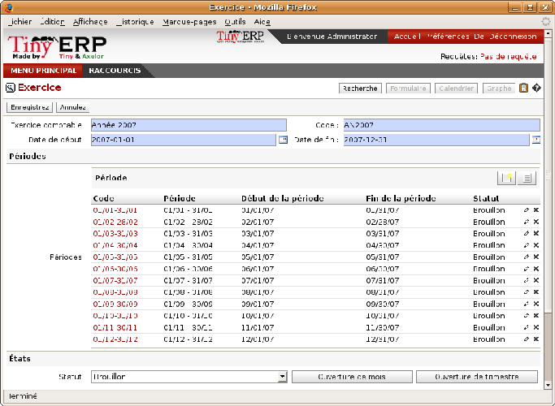

Database setup
==============

You'll create all the elements in the database that you need to carry out the use case. These are specified in the functional requirements.

Personalizing the Main Company
-------------------------------

Start to personalize your database by renaming the  *Main Company*  from its default of \ ``Tiny sprl``\   to the name of your own company or (in this case) another example company. When you print standard documents such as quotations, orders and invoices you'll find this personalization information used in the document headers and footers. 

To do this, click  *Partners > Partners*  and click the name of the only company there, which is \ ``Tiny sprl``\  . This gives you a read-only view form view of the company, so make it editable by clicking the  *Edit*  button to the upper left of the form. 

.. tip::   **Web client**  *Editable form* 

	When toggling from the list view to the form view of an item, you can generally click its name in the list view to show a non-editable view or the pencil icon along the right-hand end of the line to open it in an editable view. You can toggle between editable and non-editable once you're in form view.

Change the following:

*  *Name* : \ ``Ambitious Plumbing Enterprises``\  ,

*  *Contact Name* : \ ``George Turnbull``\  .

and any other fields you like, such as the address and phone numbers, then  *Save* . This adds one Contact to the Partner, which is sufficient for the example.

From the  *Main Menu* , click  *Administration > Configuration > Base > Define Main Company*  and edit the entry there:

*  *Company Name* : \ ``AmbiPlum``\  ,

*  *Partner* : should already show \ ``Ambitious Plumbing Enterprises``\  ,

*  *Report Header* : \ ``Ambitious Plumbing Enterprises``\  ,

*  *Report Footer 1* : \ ``Best Plumbing Services, Great Prices``\  ,

*  *Report Footer 2* : \ ``Ambitious – our Registered Company Details``\  .

You can leave the currency at its default setting of \ ``EUR``\   for this example. Or you can change it in the Main Company ( *Administration > Configuration > Base > Main Company* ) and the two default Pricelists ( *Product > Pricelists > Pricelists* ) if you feel compelled to do that. 

.. tip::   **Alternative**  *Currency* 

	The examples in this book are in USD and EUR. You would use your main currency, perhaps CAD, CNY, GBP, or IDR, in their place.

Creating partner categories, partners and their contacts
---------------------------------------------------------

You'll now create a suppliers category and a customers category. Partner categories are useful for organizing groups of partners but have no special behavior that affects partners, so you can assign them as you like. Then you'll define one supplier and one customer, with a contact for each. 

To do this use the menu  *Partners > Configuration > Categories > Edit Categories* . Click  *New*  to open a new form for defining  *Partner Categories* . Define the two categories that follow by just entering their  *Category Name*  and saving them: 

* \ ``Suppliers``\  ,

* \ ``Customers``\  .

Then create two partners from the menu  *Partners > Partners* . Click on the  *New*  button to open a blank form and then add the following data for the first partner first:

*  *Name* : \ ``Plumbing Component Suppliers``\  ,

*  *Contact Name* : \ ``Jean Poolley``\  ,

*  *Address Type* : \ ``Default``\  ,

* add \ ``Suppliers``\   to the  *Categories*  field by selecting it from the Search List,

* then save the partner by clicking the  *Save*  button. 

.. tip::   **Note**  *Contact Types* 

	If you've recorded several contacts for the same partner you can specify which contact is used for various documents by specifying the Address Type.

	For example the delivery address can differ from the invoice address for a partner. If the Address Types are correctly assigned, then Open ERP can automatically select the appropriate address during the creation of the document – an invoice is addressed to the contact that's been assigned the Address Type of Invoice, otherwise to the Default address.

For the second partner, proceed just as you did for the first, with the following data:

*  *Name* : \ ``Smith and Offspring``\  ,

*  *Contact Name* : \ ``Stephen Smith``\  ,

*  *Address Type* : \ ``Default``\  .

Then add \ ``Customers``\   in the  *Categories*  field.  *Save*  the form. To check your work you can go to the menu  *Partners > Partner Categories*  and click on each category in turn to see the companies in the category.

.. tip::   **Note**  *Multiple Partner Categories* 

	If this partner was also a supplier then you'd add Suppliers to the categories as well, but there's no need to do so in this example. You can assign a partner to multiple categories at all levels of the hierarchy.

Creating products and their categories
---------------------------------------

Unlike partner categories and their assigned partners, product categories do have an effect on the products assigned to them – and a product may belong to only one category. Select the menu  *Products > Configuration > Product Categories*  and click  *New*  to get an empty form for defining a product category. 

Enter \ ``Radiators``\   in the  *Name*  field and, watching the  *Product Categories*  form closely, click  *Save* . You'll see that other fields, specifically those in the  *Accounting Properties*  section, have been automatically filled in with values of accounts and journals. These are the values that will affect products – equivalent fields in a product will take on these values if they, too, are blank when their form is saved. 

.. tip::   **Definition**  *Properties fields* 

	Properties have a rather unusual behavior. They're defined by parameters in the menu Administration > Custom > Properties, and they update fields only when a form is saved, and only when the fields are empty at the time the form is saved. You can manually override any of these properties as you need.

	Properties fields are used all over the Open ERP system and particularly extensively in a multi-company environment. There, property fields in a partner form can be populated with different values depending on the user's company.

	For example the payment conditions for a partner could differ depending on the company from which it's addressed.

.. tip::   **Definition**  *UOM* 

	UOM is an abbreviation for Unit of Measure. Open ERP manages multiple units of measure for each product: you can buy in tons and sell in kgs, for example. The conversion between each category is made automatically (so long as you have set up the conversion rate in the product form first).

.. tip::   **Advantage**  *Managing double units of measure* 

	The whole management of stock can be carried out with double units of measure (UOM and UOS – for Unit of Sale). For example an agro-food company can stock and sell ham by piece but buy and value it by weight. There's no direct relationship between these two units so a weighing operation has to be done.

	This functionality is crucial in the agro-food industry, and can be equally important in fabrication, chemicals and many other industries.

Now create a new product:

	#. Go to the  *Products > Products* menu and click  *New* 

	#. Create a product – type \ ``Titanium Alloy Radiator``\  in the  *Name* field,

	#. Click the Search icon to the right of the  *Category* field to select the  *Radiators* category,

	#. The  *Product Type* field should stay as \ ``Stockable Product``\   its default value. The fields  *Procure Method*   *Default UOM* and  *Purchase UOM* should also stay at their default values: in fact every other field remains untouched.

                .. image::  images/product.png
                    :align: center
               	    :scale: 95
                

	#. Click on the  *Procurement* tab and enter \ ``57.50``\  into the  *Cost Price* field and \ ``132.50``\  into the  *List Price* field,

	#. Click the  *Properties* tab, then click  *Save* and observe that  *Inventory Properties* have taken on new values (just as the Accounting Properties did in the product category) but  *Accounting Properties* here remain empty. When product transactions occur, the Income and Expense accounts that you've just defined in the Product Category are used by the Product nless an account is specified here, directly in the product, to override that. 

	#. Once the product is saved it changes to a non-editable state. If you had entered data incorrectly or left a required field blank, the form would have stayed editable and you'd need to click from tab to tab to find a field colored red, with an error message below it, that would have to be correctly filled in.

.. index::
   single: Stock locations

Stock locations
-----------------

Click  *Inventory Control > Location Structure*  to see the hierarchy of stock locations. These locations have been defined by the minimal default data loaded when the database was created. You'll use this default structure in this example.

	#. From the  *Main Menu*  click on  *Inventory Control > Configuration > Locations* to reach a list view of the locations (not the tree view)

	#. Click on the name of a location, such as \ ``Company``\   to open a descriptive form view. Each location has a  *Location type*  and a  *Parent Location* that defines he hierarchical structure. An  *Inventory Account* can also be assigned to a location.

	#. From the  *Main Menu*  click  *Inventory Control > Configuration > Warehouses* to view a list of warehouses.

.. tip::   **Note**  *Valuation of stock* 

	If you want real-time stock valuation that tracks stock movements you must assign an account to each stock location. As product items are added to and taken from each location Open ERP generates an account entry for that location defined by the configuration of the product being moved – and a stock valuation based (in the current versions of Open ERP) on either Standard Cost or Average Price.

	For example, if you assign an account to the Supplier location you'll be able see the value of stock that you've taken from the supplier. Its contents should be valued in your accounts. Thus it manages inventory on consignment.

A Warehouse contains an input location, a stock location and an output location for sold products. You can associate a warehouse with a partner to give the warehouse an address. That doesn't have to be your own company (although it can be): you can easily specify another partner who may be holding stock on your behalf.

.. index::
   single: Location Structure

.. tip::   **Attention**  *Location Structure* 

	Each warehouse is composed of three locations: Input, Output and Stock. Your available stock is given by the contents of the Stock location.

	The Input location can be placed as a child of the Stock location, which means that when Stock is interrogated for product quantities, it also takes account of the contents of the Input location. The Output location must never be placed as a child of Stock, since items in Output, which are packed ready for customer shipment, should not be considered as available for sale elsewhere.

.. index::
   single: Account Chart
   
Setting up a chart of accounts
-------------------------------

You can set up a chart of accounts during the creation of a database, but for this exercise you'll start with the minimal chart that's built into the core of Tiny ERP (just a handful of required accounts without hierarchy, tax or subtotals). 

A number of account charts have been predefined for Open ERP, some of which meet the needs of national authorities (the number of those created for Open ERP is growing as various contributors create and freely publish them). You can take one of those without changing it if it's suitable, or you can take anything as your starting point and design a complete chart of accounts to meet your exact needs, including accounts for inventory, asset depreciation, equity and taxation.

You can also run multiple charts of accounts in parallel – so you can put all of your transaction accounts into several charts, with different arrangements for taxation and depreciation, aggregated differently for various needs.

Before you can use any chart of accounts for anything you need to specify a Fiscal Year. This defines the different time periods available for accounting transactions. To do so:

	#. Select  *Financial Management > Configuration > Periods > Fiscal Years* and click  *New* to open a blank  *Fiscal Year* definition form.

	#. Give a name to that  *Fiscal Year* (such as inancial Year 2008 and a  *Code* (Y2008, then select the  *Start date* and  *End date*  which should be a year apart and (for this example) straddle today's date.

	#. Then click on one of the buttons  *Create Monthly Periods* or  *Create 3 Months Periods* to create an appropriate set of periods for the fiscal year, as shown in the figure below.  *Save* this.

*Defining a fiscal year and the accounting periods within it.*

Click  *Financial Management > Charts > Charts of Accounts*  and then click  *Open Charts*  on the  *Fiscal Year*  that you've just created to see a hierarchical structure of the accounts. You can click on the expand/collapse icon of the top tree node to show the detail of this minimal chart.

.. index::
   single: Database; Backup
.. 

Make a backup of the database
-------------------------------

If you know the super-administrator password, make a backup of your database using the procedure described at the very end of Chapter 1. Then restore it to a new database: \ ``testing``\  .

This operation enables you to test the new configuration on \ ``testing``\   so that you can be sure everything works as designed. Then if the tests are successful you can make a new database from \ ``openerp_ch03``\  , perhaps called \ ``production``\  , for your real work.

From here on, connect to this new \ ``testing``\   database logged in as \ ``admin``\   if you can. If you have to make corrections, do that on \ ``openerp_ch03``\   and copy it to a new \ ``testing``\   database to continue checking it.

Or you can just continue working with the \ ``openerp_ch03``\   database to get through this chapter. You can recreate \ ``openerp_ch03``\   quite quickly if something goes wrong and you can't recover from it but, again, you'd need to know your super-administrator password for that.

.. Copyright © Open Object Press. All rights reserved.

.. You may take electronic copy of this publication and distribute it if you don't
.. change the content. You can also print a copy to be read by yourself only.

.. We have contracts with different publishers in different countries to sell and
.. distribute paper or electronic based versions of this book (translated or not)
.. in bookstores. This helps to distribute and promote the Open ERP product. It
.. also helps us to create incentives to pay contributors and authors using author
.. rights of these sales.

.. Due to this, grants to translate, modify or sell this book are strictly
.. forbidden, unless Tiny SPRL (representing Open Object Presses) gives you a
.. written authorisation for this.

.. Many of the designations used by manufacturers and suppliers to distinguish their
.. products are claimed as trademarks. Where those designations appear in this book,
.. and Open ERP Press was aware of a trademark claim, the designations have been
.. printed in initial capitals.

.. While every precaution has been taken in the preparation of this book, the publisher
.. and the authors assume no responsibility for errors or omissions, or for damages
.. resulting from the use of the information contained herein.

.. Published by Open ERP Press, Grand Rosière, Belgium

