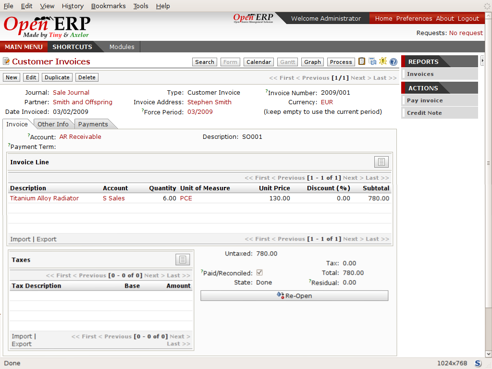

Testing a Purchase-Sale workflow
=================================

To familiarize yourself with the system workflow you'll test a purchase-sale workflow in two phases. 

The first consists of product purchase, which requires the following operations:

	#. Place a purchase order with Plumbing Component Suppliers for 10 Titanium Alloy Radiators at a unit price of 60.00.

	#. Receive these products at your Goods In.

	#. Generate a purchase invoice.

	#. Pay your supplier.

Following this, you'll sell some of these products, using this sequence:

	#. Receive a sales order for 6 Titanium Alloy Radiators from Smith and Sons, sold at a unit price of 130.00.

	#. Despatch the products.

	#. Invoice the customer.

	#. Receive the payment.

Purchase Order
---------------

To place a Purchase Order with your supplier, use the menu  *Purchase Management > Purchase Order*  for a new Purchase Order form.

Complete the following fields:

*  *Warehouse* : \ ``Warehouse``\  . Although this is not a required field, the selection here automatically fills in the required field  *Delivery Destination*  on the  *Purchase Shippings*  tab.

*  *Partner* : \ ``Plumbing Component Suppliers``\  .

As you complete the  *Partner*  field, Open ERP automatically completes the  *Address*  field and the  *Price List*  field from information it takes out of the Partner record. Then click on the  *Save Parent and Create New Record*  icon to the right of the  *Order Line*  field. This automatically saves the body of the  *Purchase Order* , and changes to a  *Create New Record*  icon. Click that to open the  *Purchase Order Line*  window.

Enter the following information

*  *Product* : \ ``Titanium Alloy Radiator``\   - type in part of this name then click the  *Search / Open a resource*  icon at the end of the line to complete it,

When you've selected a product on the product line, Open ERP automatically completes the following fields from information it finds in the Product record:

*  *Product UOM* : the unit of measure for this product,

*  *Description* : the detailed description of the product,

*  *Scheduled date* : based on the product lead time,

*  *Unit price* : the unit price of the product,

*  *Analytic account* : if any account is specified then it will appear on the order line,

*  *Taxes* : applicable taxes defined in the partner, if specified, otherwise in the product, if specified.

You can edit any of these fields to suit the requirements of the purchase order at the time of entry. Change the  *Unit Price*  to \ ``56.00``\  .

Also enter:

*  *Quantity* : \ ``10``\  .

 *Save*  the order line and close the  *Purchase Order Line*  window by clicking the  *Close*  button. You can then confirm the whole one-line order by clicking  *Save* , which makes the form non-editable. It's now in a state of \ ``Request for Quotation``\  , so click  *Confirm Purchase Order* , which corresponds to an approval from a manager or from Accounts within your own company and moves the order into \ ``Confirmed``\   state.

Finally click  *Approved by Supplier*  to indicate the supplier's acknowledgment of the order. The order becomes \ ``Approved``\  . If you click the  *Purchase Shippings*  tab you'll see the  *Picking List*  that has been created ready for your Goods In department to use.

.. tip::   **Attention**  *Visibility of a window* 

	Sometimes a child window, such as the Purchase Order Line window, loses focus and disappears behind the main window. If a window doesn't open as you expect, check that it's not hiding behind the main window: do this by minimizing the main window to your task bar.

Receiving Goods
-----------------

After confirming the order you'd wait for the delivery of the products from your supplier. Typically this would be somebody in Stores rather than Purchasing, who would:

	#. Open the menu  *Inventory Control > Packing Lists > Getting Goods > Packings to be Received*  using the expand/collapse icon rather than clicking directly on  *Packing Lists* 

	#. When the  *Packing list* window appears, select the name of the entry in the list (\ ``IN:1``\   to display the Packing List itself – you'd usually do a search for the supplier name or order number in a list that was larger than this – then click  *Validate* to load the  *Make Packing* form.

	#. Click  *Make Picking* to indicate that you're receiving the whole quantity of 10 units.

At this point you've accepted 10 units into your company, in a location defined by the Warehouse that you specified near the top of your Purchase Order.

To check actual stock levels, use the menu  *Inventory Control > Location Structure* , find \ ``Stock``\   in the hierarchy using the expand/collapse controls to make your way through the tree and click it. That will show everything in the \ ``Stock``\   location and below it – including  *Real stock*  (the actual quantity recorded in that location and below it) and  *Virtual stock*  (the quantities expected in future when all receipts and despatches have been made) – both \ ``10``\   in this case.

Alternatively you could click the top-level \ ``Locations``\   line to highlight it (not the \ ``Locations``\   text itself), and then click the  *Print*  button to the top right of the form to test the available different reports (such as  *Lots by Location* ). You'll see that you've now got \ ``10``\   pieces of \ ``Titanium Alloy Radiator``\   in the location \ ``Input``\   and \ ``-10``\   pieces in the location \ ``Suppliers``\   as shown in the next Figure.

.. image::  images/lots_by_location_pdf.png
   	:align: center

*List of products and their stock levels.*

.. tip::   **Web client**  *Returning to Open ERP after printing PDF reports* 

	When you're using the web client, documents such as this are not part of the standard web page but are generated in PDF format, which you can print or attach to email or save on disk. So you don't get the standard Open ERP navigation links on these pages.

	Open ERP is not fully consistent in the display of these pages in version 4.2.2, so the PDF page is not brought up in a new tab or window as it should be (and as it is in other areas of Open ERP), but replaces the standard Open ERP web-format pages.

	Once you've finished looking at the PDF document you'll have a strong temptation to just close the window, but that'll completely close Open ERP for you! Instead, click the Back button in your web browser to return to Open ERP.

.. tip::   **Advantage**  *Traceability in double-entry* 

	Open ERP operates a double-entry stock transfer scheme similar to double-entry accounting. Because of this you can carry out various analyses of stock levels in your warehouse, along with the corresponding levels in virtual locations at your supplier. Supplier locations show negative levels once you've received goods in your company, as you can see in the Figure.

Control of purchase invoices
-----------------------------

When you've received an invoice from your supplier (which would usually be your Accounts department) go to the menu  *Financial Management > Invoices > Supplier Invoice > Draft Supplier Invoices*  to open a list of supplier invoices waiting for receipt (you'll have to use the expand/collapse icon on  *Supplier Invoice*  rather than click the text, which would create a new Invoice). These invoices enable your Accounts Department to match the the price and quantities ordered against the price and quantities on the supplier's invoice – it's not uncommon to receive an invoice showing details more favourable to the supplier than those agreed at the time of purchase.

In this example, you created an invoice automatically when you confirmed the supplier's Purchase Order. That's because the  *Invoicing Control*  field on the order was set to \ ``On Order``\   (the default option). Other options enable you to create invoices at the time of receiving goods or manually. The initial state of an invoice is \ ``Draft``\  .

Now click the invoice for your order \ ``PO/001``\   to display its contents. You can compare the goods that you've recorded there with the invoice received from your supplier. If there's a difference it's possible to change the order lines to, for example, add a delivery charge. Click  *Validate*  to confirm the invoice and put it into the \ ``Open``\   state.

Accounting entries are generated automatically once the invoice is validated. To see the effects on your chart of accounts, use the menu  *Financial Management > Charts > Chart of Accounts* .

Paying the supplier
---------------------

Select the menu  *Financial Management > Invoices > Supplier Invoices > Open Supplier Invoices*  to obtain a list of supplier invoices that haven't yet been paid. Click the  *Edit*  (pencil) icon to the right end of the line for the invoice derived from \ ``PO/001``\   to open the invoice form in editable mode. In practice you'd search for the invoice by order number or, more generally, for invoices nearing their payment date.

Click  *Pay Invoice*  in the toolbar to the right of the form, which opens a Window with a description of the payment. Select \ ``Bank Journal``\   in the  *Journal*  field. Then click  *Pay Invoice*  to the top left of the form, which carries out the payment action within Open ERP and returns you to the main menu.

.. tip::   **Comment**  *Payment of an invoice* 

	The method described here is for companies that don't use their accounting system to pay bills – just to record them. If you're using the accounting module fully other, more efficient, methods let you manage payments, such as entering account statements, reconciling paperwork, using tools for preparing payments, interfacing with banks.

You can monitor the accounting impact of paying the invoice through the chart of accounts available from the menu  *Financial Management > Charts > Chart of Accounts* . Open ERP automatically creates accounting entries from the payment and can reconcile the payment to the invoice.

From Sales Proposal to Sales Order
-----------------------------------

In Open ERP, sales proposals and sales orders are managed using documents that are based on the same common functionality as purchase orders, so you'll recognize the following documents in general but notice changes to their detail and to their workflows. To create a new sales proposal, use the menu  *Sales Management > Sales Order*  which creates a new order in a state of \ ``Quotation``\  , then:

	#. Select \ ``Default Shop``\  in the  *Shop* field. The shop is linked to a warehouse, which defines the location that you'll use to despatch goods from.

	#. Select the  *Partner* \ ``Smith and Sons``\   This has the effect of automatically completing several other fields:  *Ordering Contact*   *Invoice Address*   *Shipping Address* and the  *Pricelist* \ ``Default Sale Pricelist``\   They're all only defaults so these fields can be modified as you need.

	        .. image::  images/order.png
        	   :align: center

	#. Click the  *Save Parent and Create new record* icon to the right of the  *Sales Order Lines* field. It saves the main order form and becomes a new  *Create new record* icon. Click that to open a  *Sales Order Lines* window.

	#. Select the product \ ``Titanium Alloy Radiator``\   Although the  *Product* field isn't itself required, it's used by Open ERP to select the specific product so that several other fields can be automatically completed on the order line of the proposal, such s:  *Description*   *Product UOM*   *Unit Price*   *Delivery Delay* and  *Taxes* 

	#. Change the  *Quantity* to \ ``6``\  and the  *Unit Price* to \ ``130.00``\   Then click  *Save* and the line appears on the quotation form. A blank order line form reappears so that you can enter another line, but it's enough now just to click  *Close* to return to the order form.

	#. On the  *Other data* tab of this Sales Order select a  *Shipping Policy* of \ ``Automatic Invoice after Delivery``\  from the dropdown menu list.

	#. Return to the first tab  *Sale Order* and validate the document by clicking  *Confirm Order*  which calculates prices and the changes the order's state from \ ``Quotation``\  to \ ``In Progress``\   If you were in negotiation with the prospective customer you'd keep clicking  *Compute* and  *Save*  keeping the document in \ ``Quotation``\  state for as long as necessary.

	#. In the last tab of the order,  *History*  you can see the  *Picking List* that's been created and you'll be able to see any invoices that relate to this order when they're generated.

From the  *Main Menu*  click  *Products > Products*  to display a list of products: just the one, \ ``Titanium Alloy Radiator``\  , currently exists in this example. Its  *Real Stock*  still shows \ ``10.00``\   but its  *Virtual Stock*  now shows \ ``4.00``\   to reflect the new future requirement of 6 units for despatch.

Preparing goods for despatch to customers
-------------------------------------------

The stores manager selects the menu  *Inventory Control > Packing Lists > Sending Goods > Confirmed Packings Awaiting Assignation*  to get a list of orders to despatch. In this example there's only one, \ ``OUT:1``\  , so click the text to open the  *Picking List* . 

.. tip::   **Advice**  *Calculating Requirements* 

	At the moment your Sales Order is waiting for products to be reserved to fulfil it. A stock reservation activity takes place periodically to calculate the needs, which also takes customer priorities into account. The calculation can be started from the menu Production > Calculate Requirements. Running this automatically reserves products. 

	If you don't want to have to work out your stock needs but have a lean workflow you can install the ``mrp_jit`` (Just In Time) module.

Although Open ERP has automatically been made aware that items on this order will need to be despatched, it has not yet assigned any specific items from any location to fulfil it. It's ready to move \ ``6.00``\  \ ``Titanium Alloy Radiators``\   from the  *Stock*  location to the  *Output*  location (which were defined by the Sale Shop in the Sales Order), so start this process by clicking  *Assign* . The  *Move*  line has now changed from the \ ``Confirmed``\   state to the \ ``Assigned``\   state.

Create a  *Packing List*  document by clicking the  *Packing List*  button in the  *Reports*  section of the toolbar to the right of the form, and also a  *Despatch Note*  by clicking the  *Delivery Report*  button there. These are both created in a new window or tab of your browser so they can be printed off and then closed.

Now click  *Validate*  on the  *Packing List*  to mark the move that you'd be making physically in your Stores. A  *Make Packing*  form appears enabling you to transfer \ ``6``\   units (or another number if you choose) between locations and pack them into a package in the process. Click  *Make Packing*  to the top left of the form to do the transfer. The  *Move*  line has now changed state to \ ``Done``\  .

The goods are now in your Output Bay, which had been defined by default in Open ERP as  *Output* , as a single package with a  *Lot Number*  of \ ``OUT:1``\  . 

To register when a carrier picks up the package, use the menu  *Inventory Control > Delivery Order > Delivery Orders to Process* . Select the appropriate line \ ``OUT:1``\   to open the  *Stock Move*  form, then click  *Move Lot* . Its state changes to \ ``Moved``\  . Packing is defined by Sales Orders so if you pack fewer packages than are on order Open ERP automatically manages the remainder for future delivery. 

To analyze stock movements that you've made during these operations use the following steps:

	#. Select menu  *Inventory Control > Locations Structure* 

	#. Select the first line by clicking somewhere along it (but don't click on the \ ``Locations``\  text itself) then click on the  *Print* icon above the list further over to the right.

	#. Select the report  *Lots by location* and click the  *OK* button to get a detailed report of Stocks for each location. You should see the following data:

	- -10 in the *Suppliers* location,

	- 6 in the *Customers* location,

	- 4 in your company's *Input* location.

.. tip::   **Note**  *Location Hierarchy* 

	The 10 Titanium Alloy Radiators can be found in the Input location after they've been received, instead of the location Stock. But they're still considered as being part of stock because Input is a child location of Stock.

	If you want to put a Quality Control station at Goods In, all you need to do is put Input up to the same level as Stock. Then you'd manually move items from Input to Stock when they pass your Goods In checks.

Invoicing Goods
-----------------

Use the menu  *Financial Management > Invoices > Customer Invoice > Draft Customer Invoices*  to open a list of invoices generated by Open ERP. These are in the \ ``Draft``\   state, which means that they don't yet have any presence in the accounting system. You'll find a draft invoice has been created for the order \ ``SO/001``\   once you have despatched the goods because you'd selected \ ``Automatic Invoice after Delivery``\  .

Once you confirm an invoice, Open ERP assigns it a unique number, and all of the corresponding accounting entries are generated. So open the invoice and click  *Create*  to do that and move the invoice into an \ ``Open``\   state.

You can send your customer the invoice for payment at this stage. Click  *Invoices*  from the  *Reports*  section of the toolbar at the right of the form to get a PDF document that can be printed or emailed to the customer.

You can also attach the PDF document to the Open ERP invoice record. Save the PDF somewhere convenient on your PC (such as on your desktop). Then click the  *Add an attachment to this resource*  button to the top right of the invoice form (it looks like a clipboard). Browse to the file you just saved (\ ``record.pdf``\   if you didn't change its name) from the  *Attachments*  dialog box that pops up, and  *Close*  the dialog box. This gives you a permanent non-editable record of your invoice on the Open ERP system.

Review your chart of accounts to check the impact of these activities on your accounting. You'll see the new revenue line from the invoice.

Customer Payment
-----------------

Registering an invoice payment by a customer is essentially the same as the process of paying a supplier. From the menu  *Financial Management > Invoices > Customer Invoice > Open Customer Invoices* , click the name of the invoice that you want to mark as paid:

	#. Use the  *Pay Invoice* button in the  *Action* section of the toolbar at the right to open a window that enables you to register the payment.

	#. Select the  *Journal* \ ``Bank Journal``\  and click  *Pay Invoice*  The invoice is then marked as paid, and you're returned to the  *Main Menu* 

*Screen showing the invoice to be paid.*

Check your Chart of Accounts as before to see that you now have a healthy bank balance in the \ ``Petty Cash``\   account.

.. Copyright © Open Object Press. All rights reserved.

.. You may take electronic copy of this publication and distribute it if you don't
.. change the content. You can also print a copy to be read by yourself only.

.. We have contracts with different publishers in different countries to sell and
.. distribute paper or electronic based versions of this book (translated or not)
.. in bookstores. This helps to distribute and promote the Open ERP product. It
.. also helps us to create incentives to pay contributors and authors using author
.. rights of these sales.

.. Due to this, grants to translate, modify or sell this book are strictly
.. forbidden, unless Tiny SPRL (representing Open Object Presses) gives you a
.. written authorisation for this.

.. Many of the designations used by manufacturers and suppliers to distinguish their
.. products are claimed as trademarks. Where those designations appear in this book,
.. and Open ERP Press was aware of a trademark claim, the designations have been
.. printed in initial capitals.

.. While every precaution has been taken in the preparation of this book, the publisher
.. and the authors assume no responsibility for errors or omissions, or for damages
.. resulting from the use of the information contained herein.

.. Published by Open ERP Press, Grand Rosière, Belgium

