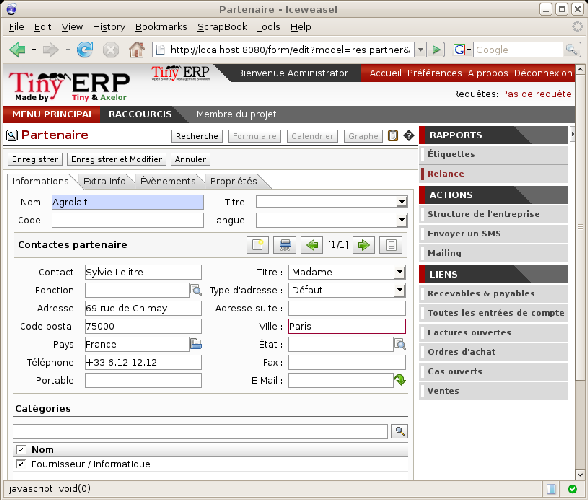
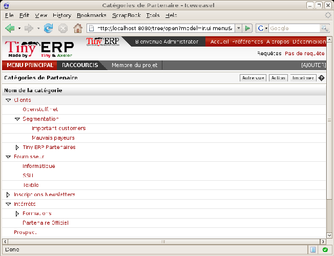

.. index::
   single: Partner
.. 

Open ERP preparation
=====================

You'll need two databases for this chapter:

* \ ``openerp_ch04X``\  , which should be a restored copy of\ `` openerp_ch02``\  , the database you created through Chapter 2. It's referenced throughout the main body of this chapter because it contains demonstration data that illustrates the points made in the chapter.

* \ ``openerp_ch04``\  , which should be a restored copy of \ ``openerp_ch03,``\   the database you created through Chapter 3. If you follow the steps in this chapter you can extend this database.

To be able to backup and restore these databases you'll need to know your super-administrator password.

You'll also need your system's \ ``addons``\   directory to be writable, since you'll load new modules into it later in the chapter – they're not all available in the core 5.0.0 release of Open ERP.

And you'll need access to a system administrator for your server system if you want to install the \ ``fetchmail``\   system software that's mentioned later in this chapter.

Once you've created \ ``openerp_ch04``\  , add a new group – \ ``support``\  , and four new users – \ ``General``\  , \ ``Sales``\  , \ ``Support``\  , and \ ``Senior Support``\   (the former two should be put in group \ ``user``\  , and the latter two in \ ``support``\  ). Then also install the \ ``crm``\   module that exists in the Open ERP core installation (but has not yet been installed into this database). You'll need only to know your database's \ ``admin``\   user details to do this.

Partners
=========

In Open ERP, a partner represents all the entities that you can do business with. Some possible different types of partners are:

* suppliers,

* manufacturers,

* customers,

* clients,

* employees,

* prospects.

The concept of a partner here is much more flexible than in many other management applications because a partner can correspond to one type or a combination of several of these types. This avoids double data-entry and provides greater flexibility in the features available.

So a partner can be both your supplier and your customer at the same time. This feature is particularly important when you have subsidiaries or franchises since transactions between the parent and its subsidiaries in these cases will generally be two-way.

To get a list of partners using demonstration data, use the menu  *Partners > Partners*  (database \ ``openerp_ch04X``\   has more data preloaded, while \ ``openerp_ch04``\   has only the data that you've put into it - both can show the principles).

*The partner form*

.. index::
   single: Send SMS

To the right of the partner form you'll find all of the actions, reports and shortcuts available to the selected partner. This enables you to quickly send an SMS message, for example, or review a partner's order history, or print a reminder letter.

.. tip::   **Note**  *Send an SMS message* 

	To send an SMS message from standard Open ERP you'll have to place an order with the bulk SMS gateway operator Clickatell™http://clickatell.com.

	You'll then receive an API number, a login and a password which you can use in Open ERP to send SMS messages to your partners.

	Or you can just develop a new module based on the inbuilt SMS functions, targeted at any of the other SMS service suppliers, and use that instead.

To send an SMS message to a partner or a selection of several partners, first select the partners then click the  *Send SMS*  Action icon.

To create a company in Open ERP (that is – a new partner) you should at a minimum enter the company's  *Name*  in the partner form.

.. index:: Contact

Contacts
---------

You can have several contacts for one partner. Contacts represent company employees that you're in contact with, along with their address details. For each address you can indicate their type (\ ``Default``\  , \ ``Invoice``\  , \ ``Delivery``\  , \ ``Contact``\   or \ ``Other``\  ). Based on this, Open ERP can supply an address that matches the contact's function when generating documents at various stages through an Order process.

Contacts can be entered into the first ( *General* ) tab of the  *Partners*  form, or you can get direct access to the list of addresses through the  *Partners > Partner Contacts* menu.

You can search for a subset of Partners and Contacts using their company  *Name*  or  *Contact*  name or part of the address, or any of the other search fields in either the  *Basic Search*  or the  *Advanced Search*  tab.

.. tip::   **Note**  *Independent partners or physical people* 

	If you want to represent a physical person rather than a company, in Open ERP, that person's name can be typed directly into the Name field on the Partner form. In this case don't put in any Contact Name.

.. index::
   single: Partner; Categories
.. 

Partner Categories
-------------------

Open ERP uses hierarchical categories to organize all of its partners. To reach the list of available partner categories, use the menu  *Partners > Partners by Category* .

*Example partner category structure*

Double-click one of the categories in the partner category structure to get a list of the partners in that category. If you click on a category that has sub-categories you'll get a list of all of the partners in the main category and in all of its subcategories.

Because categories are structured in a hierarchical manner, you can apply an action at any level of the structure: a marketing promotion activity, for example, can be applied either to all customers, or selectively only to customers in one category and its subcategories.

The tree structure is also very useful when you're running the various statistical reports. You can structure reports at any level of the hierarchy using this partner segmentation.

In the following sections you'll see how to assign partners to categories manually (perhaps for a newsletter subscription or as a hot prospect), or automatically using segmentation rules.

Use the menu  *Partners > Configuration > Categories > Edit Categories*  to define a new category.

To try Open ERP's partner capabilities described here for yourself, log into the \ ``openerp_ch04``\   database as \ ``admin/admin``\   then click  *Partners > Configuration > Categories > Edit Categories*  and create a new category of \ ``Small Suppliers``\   whose parent is \ ``Suppliers``\  . Then create a new  *Partner*  whose  *Name*  is \ ``Susan Trent ``\  and category is \ ``Small Suppliers``\  . 

Click  *Partners > Partners by Category*  and then click  *Suppliers > Small Suppliers*  to find just \ ``Susan Trent``\  . Do this again but now click the  *Suppliers*  category in  *Partners by Category*  and you'll find that both \ ``Plumbing Component Suppliers``\  and \ ``Susan Trent``\   are in the higher-level category: \ ``Susan Trent``\  is there because she's in a child category.

Add new contact \ ``Graham Strong``\   to \ ``Plumbing Component Suppliers``\  . Graham's  *Address Type*  is \ ``Invoice``\  . Click  *Partners > Partner Contacts*  and see that both Susan and Graham appear on that list.

.. Copyright © Open Object Press. All rights reserved.

.. You may take electronic copy of this publication and distribute it if you don't
.. change the content. You can also print a copy to be read by yourself only.

.. We have contracts with different publishers in different countries to sell and
.. distribute paper or electronic based versions of this book (translated or not)
.. in bookstores. This helps to distribute and promote the Open ERP product. It
.. also helps us to create incentives to pay contributors and authors using author
.. rights of these sales.

.. Due to this, grants to translate, modify or sell this book are strictly
.. forbidden, unless Tiny SPRL (representing Open Object Presses) gives you a
.. written authorisation for this.

.. Many of the designations used by manufacturers and suppliers to distinguish their
.. products are claimed as trademarks. Where those designations appear in this book,
.. and Open ERP Press was aware of a trademark claim, the designations have been
.. printed in initial capitals.

.. While every precaution has been taken in the preparation of this book, the publisher
.. and the authors assume no responsibility for errors or omissions, or for damages
.. resulting from the use of the information contained herein.

.. Published by Open ERP Press, Grand Rosière, Belgium

