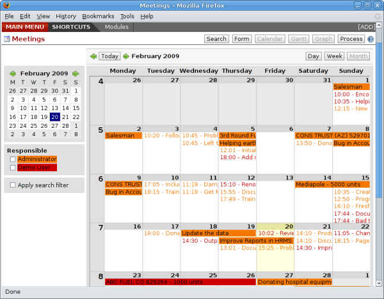
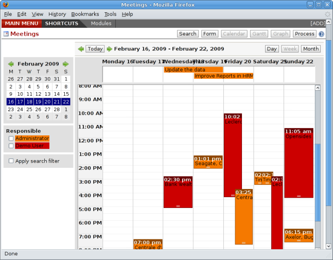

Leads, Business Opportunities and Campaigns
###########################################

*This chapter extends the discussion of customer relationships into sales activities such as the management of leads and opportunities. It introduces a more complex set of relationships between partners and contacts than offered by the base module. It shows how to use the company calendar, and discusses how a call center can use the system.*

Managing Contacts
=================

The two figures below show the UML classes with and without the ``base_contact`` module.

.. image:: images/crm_contact_with.png
    :align: center

*UML class diagram with base_contact.*

.. image:: images/crm_contact_without.png
    :align: center

*UML class diagram without base_contact.*

A concrete example will illustrate the concept of multiple relationships between contacts and partners (companies)  The figure below shows two companies each having several addresses (places of business) and several contacts attached to these addresses.

.. image:: images/crm_contact_exemple.png
    :align: center

*Example of a structure with management of partners and contacts.*

In this example you'll find the following elements:

* The ABC bank has two places of business, represented by the addresses of ABC Belgium and ABC Luxembourg,

* The addresses of Dexey France and Dexey Belgium belong to the Dexey company, 

* At the office of ABC Luxembourg, you have the contacts of the director (D Fogerty) and the accountant (A. Jacket),

* Mr Jacket holds the post of accountant for ABC Luxembourg and Dexey France,

* Mr J Smith is director of Dexey France and Dexey Belgium and we also have his private address attached to no partner.

Depending on your needs, Open ERP provides three menus to access the same information:

* List of partners: *Partners > Partners*,

* List of contacts: *Partners > Contacts*,

* List of posts held by contacts at partners: *Partners > Contact Posts*.

The three menus above are only three different views on the same data. If you correct a contact name on the contact form, this will be modified on all the posts occupied in the different companies.

The screen above represents a partner form. You can see several possible address there and a list of contacts above each address. For each contact you see a name, a function, a phone number and an email.

.. image:: images/crm_partner_contact.png
    :align: center

*A partner form with the ``base_contact`` module installed.*

If you click on the line you can get more detail about the function (such as start date, end date, and fax) or enter into the contact form (such as personal phone, different posts occupied, and personal blog).

.. image:: images/crm_partner_poste.png
    :align: center

*Detail of a post occupied by a contact at a partner.*

.. image:: images/crm_partner_contacts.png
    :align: center

*Detail of a contact form for someone occupying several posts.*

Partner management is found in the Open ERP base modules. To manager partner relations you must install the CRM modules. Then start by installing a CRM profile and configure the system to meet your needs.

For this chapter you should create a new database. After installing the database select *demonstration data* and select the *CRM profile*. Open ERP's modularity enables you to install only the CRM module if your requirements are limited to customer relationships.

.. image:: images/crm_db_init.png
    :align: center

*Creating a new database.*

Once the database is installed, Open ERP proposes that you configure it with a series of questions:

* Creating users: click *Skip*,

* Simplified or Extended mode: select simplified and click *Ok*,

* Select the CRM functionality to install.

.. image:: images/ crm_db_select.png
    :align: center

*Selecting the CRM functionality to install.*

.. tip:: *Point* The CRM configuration module

    The pre-configuration of the management of customer relations to generate prospects, opportunities, and phone calls isn't supplied by the ``crm`` module itself but by the ``crm_configuration`` module.

If you install the modules separately don't forget to install the ``crm_configuration`` module. The ``crm`` module just contains the generic case management system.

Open ERP suggests that you select from preconfigured functions for CRM:

* managing a prospects database,

* managing and tracking opportunities,

* managing meetings and the company calendar,

* managing pre-sales,

* managing phone calls and/or a call center,

* managing after-sales service,

* managing employment offers,

* managing technical service,

* tracking bugs and new functional requests.

You see that Open ERP's CRM module isn't limited just to Customer relationships but is designed to generate all types of relations with a partner: such as suppliers, employees, customers, prospects. This book will describe just customer relationships. The other CRM functions are similar in use, so you shouldn't have problems with understanding those extra functions.

The following cases will be looked at for this chapter

* Prospect management,

* Opportunity management,

* Management of the company calendar,

* Management of phone calls.

The figure below shows the CRM module configuration screen after selecting some functions to install.

.. image:: images/crm_configuration_wizard.png
    :align: center

*Selecting parameters for CRM modules for the reader of this chapter.*

Organizing Prospects
---------------------

If you have installed the management of prospects and opportunities, Open ERP implements the following workflow for the qualification of prospects and future opportunities.

.. image:: images/crm_flux.png
    :align: center

*Process of converting a prospect into a customer or opportunity.*

Leads
========

A lead represents a potential customer or a possible future business or sales opportunity. They aren't usually qualified yet and they aren't yet assigned to an individual person for following up. When a lead needs to be followed up, it's converted to a partner and/or a sales opportunity.

For example, the following events could result in the creation of one or several leads:

* A business card from a prospective customer met briefly at an exhibition: you must contact him again to qualify the lead and to know if there is any possibility of a key sales opportunity,

* A database of potential customers in a given sector and region. The potential customers must be contacted again individually or using a mass mailing to determine which contacts need to be followed up,

* A contact that you've been given by a friend. You must then qualify it before starting to assign a salesperson to the contact,

* A form completed on your website directly integrated into Open ERP. Before converting the form into a sale proposition or opportunity, you should read and handle the person's request.

    .. tip:: *Point* Separation of sales services

        In companies of a certain type, you often distinguish between the sales department and the presales department. The role of the presales department is to acquire and qualify new leads, and the role of the sales department is to crystallize the sales opportunities or work with existing customers.

In Open ERP the users in the presales department will usually work on leads. Once these are converted into customers or sales opportunities the sales department pays individual attention to each opportunity.

Entering prospects into the system
-----------------------------------

New prospects are usually entered as a lead in the system. This means that you don't create a partner form or sales opportunity until you have qualified whether the lead is interesting or not. If the new contact is indeed interesting you then enter the data on into a partner form and, eventually, a sales opportunity.

To enter a lead manually use the menu *CRM & SRM > Sales > Leads > New Lead*. A form opens to let you enter data about this new contact.

.. image:: images/crm_lead_new.png
    :align: center

*Creating a new lead.*

Leads have a status that depends on the qualification work that's been carried out:

* Draft: the lead data has been entered, any work has not yet been done and a salesperson has not yet been assigned to the request,

* Open: the lead is being handled,

* Closed: the lead has been converted into a partner and/or a sales opportunity,

* Waiting: the lead is waiting for a response from the customer,

* Cancelled: the lead has been cancelled because the salesperson has decided that it's not worth following up.

When a new lead has been created it's automatically put into the open state.

It's also possible to import a huget list of leads. That's useful if you've bought a database of potential prospects and you want to insert them all into the system to handle them all at once. 

To do that you should start with a list of leads in CSV format. If your prospects are provided in another format it's very simple to convert them to the CSV format using MS Excel or OpenOffice Calc. Open the leads list using the menu *CRM & SRM > Presales > Leads > My Leads*. At the bottom of the list click on the *Import* link. Open ERP opens a form for importing the data.

.. image:: images/crm_lead_import.png
    :align: center

*Importing leads into the system.*

You then set which columns are present in your CSV file in the correct order. Then select your file and click on *Import*. Check in the chapter about system administration for more information on import and export.

.. tip:: *Point* Various Imports

    Importing and Exporting data in Open ERP is a generic function available to all resource. So you can import and export such lists as partners, sales opportunities, accounting entries, products and pricelists.

There are other methods of importing leads automatically or semi-automatically:

* Using the Outlook or Thunderbird plugin to insert new leads directly from an email client after a salesperson sees promising emails,

* Using the email gateway for each incoming email from a certain address (such as info@mycompany.com) creating a lead automatically from the contents of the email,

* Using Open ERP's XML-RPC web-servces to connect to a form on your website.

These different methods are described in the earlier CRM chapter.

Organizing leads
-------------------

To help the users organize and handle leads efficiently, Open ERP provides several menus in the CRM system that can be used depending on the needs of each:

* *Leads > New Lead* opens an entry form directly onto a new lead. This menu can usefully be put into your shortcuts,

* *Leads > My Leads* gives a list of all the leads (both open and not) which you're linked to,

* *Leads > My Leads > My Current Leads* gives a list of all your leads that you still need to handle (your open, draft and waiting leads),

* *Leads > My Leads > My Open Leads > Leads Waiting* gives a list of all your leads that that are still waiting for a customer response. This enables you to check periodically on your work to do,

* *Leads > All Leads* is a list of all the leads assigned to different salespeople. This menu as those beneath it are used by managers to check on each person's work.

.. image:: images/crm_leads_list.png
    :align: center

*List of leads to be handled.*

Leads are prioritized. The salespeople should ideally start at the top of the list. They then open a form to describe the lead. At this stage they contact the suspect by email or phone and enter the result of the contact on the lead form.

They can then change the status of the lead to a state that depends on the response from the customer:

* Cancelled: not to be followed as a lead,

* Waiting: waiting for a response from the suspect.

Converting leads into customers or opportunities
-------------------------------------------------

If a lead is interesting you convert it into a partner in the system. To do that, push the button *Convert into a Partner*. Open ERP opens a partner form with the information from the lead entered into it. At this stage you can complete more information such as the exact partner address and the contact details.

The created partner is automatically attached to the lead, which enables you to keep the complete traceability from the lead. To do that look at the second tab in the lead, *History*.

If the salesperson thinks that there is a real opportunity with the lead, following the contact, he can convert it into a sales opportunity using the button *Convert to Opportunity*. Open ERP then opens a window asking the title of the opportunity, the estimate revenue and the percentage success of converting to a sale.

.. image:: images/crm_lead_convert.png
    :align: center

*Converting a lead into a sales opportunity.*

Some companies have more advanced processes for the qualification of a lead. They pass through several steps, auch as first call, renewing contact, waiting for a verbal agreement. You can then use the field *Step* that is found up to the right of the lead definition. To move it automatically through the next step, you can use the button that looks like a right arrow.

Business Opportunities
-----------------------

While a lead represents the first contact with a prospect yet to be qualified, a sales opportunity represents a potential contract. Each opportunity must be followed up by a salesperson spending time to make a quotation or the cancellation of the opportunity.

Leads are generally handled en masse, with the automation of certain responses or emails. The opportunities, in contrast, are usually tracked one by one by the salespeople because that involves a process of negotiation.

Ensuring that you track opportunities
--------------------------------------

Just like the leads, Open ERP provides several menus to handle sales opportunities efficiently. All the menus for opportunities are under the menu *CRM & SRM > Presales > Opportunties*.

To quickly create a new opportunity, use the menu Opportunity > New Opportunity. You usually use this menu in the case where the opportunity is direct and doesn't come first from a lead. It can also be useful to create a shortcut to this menu so that you can quickly open a new opportunity form when you need to – after a phone call, or an email, that needs followup.

The salesperson uses the menu *Opportunites > My Opportunities > My Open Opportunities* to track their opportunities. After the different customer contacts, the salesperson can enter the information into the form to describe the activity. The history tab provides a history of all the information about the activity throughout its life. The activities are automatically reported on the partner form of the associated customer. To see this, open the events tab when you open the partner form.

*History of events in a partner form.*

When the leads have been converted into opportunities, the opportunities can be assigned to any salesperson. In that case you designate a manager in the company who is responsible for assigned the new opportunities to the different salespeople, to suit their speciality, location or availability.

To do this, the manager can use the menu Opportunity > All Opportunities > Unassigned Opportunities. This gives you a list of all opportunities that haven't yet been assigned to a salesperosn. The manager can the enter the salesperson responsible for the opportunity into the field *Responsible*.

The company calendar
---------------------

There are several methods for entering a new meeting with a partner. The first method is to enter the meeting directly in the company calendar. To do that, use the menu *CRM & SRM > Calendar > All Meetings*.

You can use the monthly, weekly or daily views to plan a meeting. To move between one mode and another use the buttons above and to the right of the calendar.

*Meetings calendar in monthly view.*

*Meetings calendar in weekly view.*

In the calendar you distinguish between multi-day events and events that last only for a few hours. Multi-day events have a coloured background whereas single events have a coloured font. Each event has a colour that represent the user that created the meeting. You can filter the different users by selecting them from the list at the left of the screen. 

To enter a new meeting into the system you can click the day and the hour for a new meeting. In the weekly and daily views you can also press the mouse left button on the calendar and slide the mouse along to create an event of several hours. Open ERP then opens an entry screen for a new meeting.

.. image:: images/crm_meeting_form.png
    :align: center

*Entering a new meeting.*

.. tip:: *Point* Consolidated Calendar

    The advantage of integrated management is that the enterprise calendar will group several system events. Then in the Open ERP calendar you will automatically find the meetings but also such information as business opportunites, technical interventions, and requests for staff meetings.

Tracking phone calls
-----------------------

Open ERP has functions to manage a telephone call centre. If you selected the functions to manage calls when you installed the CRM module you will be able to manage incoming and outgoing calls.

Call management can be used for two needs:

* Entering customer calls so that you keep a record of the communication attached to a partner or a sales opportunity,

* Managing a call centre with operators that handle a list of calls to carry out one after another.

To enter details of a phone call, use one of the two following menus:

* *CRM & SRM > Sales > Phone Calls > Incoming*

* *CRM & SRM > Sales > Phone Calls > Outgoing*

The phone call will then be visible on the partner form to give you complete visibility of the events about that customer or supplier.

Managing a Call Center
-----------------------

You can manually encode calls that happen or you can pass them into Open ERP. But for mass campaigns, you can import a list of phone calls to make. To do this, click on the import link at the bottom of the list of phone calls. On the GTK client use the toolbar button *Form > Import* at the top.

Phone calls that have occurred in the open state. The different operators can be assigned calls and handle them one by one using the menu *CRM & SRM > Phone Calls > Outgoing Calls > Calls To Make*.

The operator can open the calls one by one. For each call, after having contacted the customer, the operator can click on one of the following buttons:

* Cancel: you cancel the call. For example you could cancel the call if you've tried to call them more than three times.

* Called: you've spoken to the customer by phone. In this case the operator can change the case section and send it to, for example, sales opportunities. You could alternatively leave it in this state if you don't need to carry out any more actions with this customer.

* Not called: the customer hasn't been called, you'll try to call him again later.

Advanced Customer Relations
----------------------------

Open ERP also supplies several tools to improve and automate relationships with partners. They won't be described extensively here, just introduced briefly.

The supplier/customer portal gives you the ability to provide your suppliers and customers with constrained access to Open ERP. They will then be able to view or enter sets of information directly online to Open ERP. For example they could enter their orders, reprint their invoices, or work on communal projects. To activate the portal it's necessary to install the modules that start with the string ``portal_...``.

The email gateway lets you interface the CRM with incoming and outgoing emails. The scripts used for the email gateway are available in the ``crm`` module in the ``scripts`` subdirectory.

The Outlook and Thunderbird plugins enable you to synchronize your contacts between your email client and your ERP. They both enable you to create sales opportunities based on exchanges you have with the customer.

The rules for automating actions will enable you to send emails automatically based on the event, such as assigning opportunities to the most appropriate person. To access the CRM rules, use the menu *CRM & SRM > Configuration > Cases > Rules*.

The segmentation tools will enable you to create partner groups and act on each segment differently. For example you could create pricelists for each of the segments, or start phone marketing campaigns by segment. To enable the management of segmentation you should install the module ``crm_profiling``.

The ``report_designer`` module enables you to create letter templates in OpenOffice and automate letter for different prospects. Open ERP also has plugins for MS Word to simplify the creation of mass mailing.

.. Copyright © Open Object Press. All rights reserved.

.. You may take electronic copy of this publication and distribute it if you don't
.. change the content. You can also print a copy to be read by yourself only.

.. We have contracts with different publishers in different countries to sell and
.. distribute paper or electronic based versions of this book (translated or not)
.. in bookstores. This helps to distribute and promote the Open ERP product. It
.. also helps us to create incentives to pay contributors and authors using author
.. rights of these sales.

.. Due to this, grants to translate, modify or sell this book are strictly
.. forbidden, unless Tiny SPRL (representing Open Object Presses) gives you a
.. written authorisation for this.

.. Many of the designations used by manufacturers and suppliers to distinguish their
.. products are claimed as trademarks. Where those designations appear in this book,
.. and Open ERP Press was aware of a trademark claim, the designations have been
.. printed in initial capitals.

.. While every precaution has been taken in the preparation of this book, the publisher
.. and the authors assume no responsibility for errors or omissions, or for damages
.. resulting from the use of the information contained herein.

.. Published by Open ERP Press, Grand Rosière, Belgium

