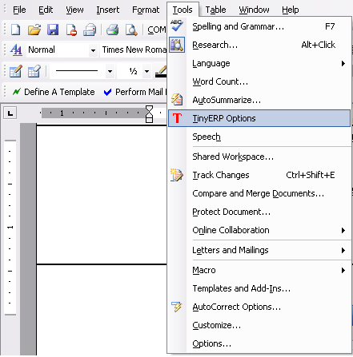
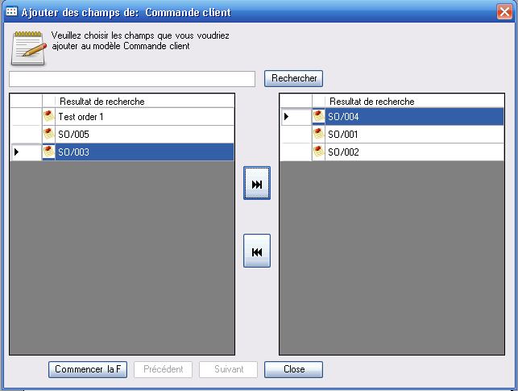

.. index::
   single: Word (Microsoft)

Microsoft Word interface
=========================

Open ERP supplies a Microsoft Word plugin that enables you to create your own document templates. What's more you can use the merge tool  *Tools > Merge documents*  to insert data from Open ERP while you generate different business documents.

So it's possible to create templates for a number of needs, such as proposals, business letters of agreement, or price requests. Each user can create his or her own document and use the plugin to obtain data from Open ERP. The plugin is very helpful for easily automating business actions.

Installing the Word plugin
---------------------------

The module for connecting Microsoft Word is also found in the list of Open ERP modules at http://openerp.com. Once it's been downloaded install the file \ ``tiny_word_plugin-X.exe``\  .

When the program is installed, you must run Microsoft Word and configure the parameters that will enable you to access the Open ERP server from Word. Click the menu  *Tools > Tiny ERP options* .

*Menu for accessing the configuration of the plugin.*

*Configuration of the Word plugin for accessing Open ERP.*

Using the Word interface
-------------------------

Start by selecting the module from which you want to make a report, for example a Sales Order. From Word you can access all the fields in an Open ERP Order, and all of the fields linked to that order such as from Order Lines, and from Products in those Order Lines.

*Select the module that will generate the report.*

Complete your document and insert Open ERP fields into the appropriate places.

*Add Open ERP fields into a Word document.*

.. tip::   **Attention**  *Fields in red* 

	When you've selected some fields and added them into your Word document, some of them appear in red. This color indicates that you can't use that particular field because it has a complex data relationships that can only be discovered when you start to use the field.

Select the merge tool from by clicking  *Perform Mail Merge*  from the toolbar. This connects Microsoft Word to Open ERP, at which point it searches for data to insert into the document. This tool enables you to select which documents must be included in the report. Make your selection and click  *Start Merge*  to run the tool that produces your different documents.

*Selecting the Open ERP documents to use in the merge.*

Word then generates the documents by inserting the Open ERP data. You get one page for each selected document.

*Result of merging a Word document with data from Open ERP.*

.. index::
   single: Word adapter

.. tip::   **Note**  *Testing the Word adapter* 

	If you install the Word adapter as described, use the openerp_ch05X database to explore its functionality as described in this section.

In Chapter 13 you'll see another, more powerful, module that enables you to create complete reports in OpenOffice.org through an interface added directly in Open ERP. So you can create your own templates, such as fax and invoice templates.

These reports can then be exported in PDF by leaving Open ERP, or can be edited before sending to a customer. So you can also personalize the details of your faxes and invoices as needed, even though they are based on your templates.

.. Copyright © Open Object Press. All rights reserved.

.. You may take electronic copy of this publication and distribute it if you don't
.. change the content. You can also print a copy to be read by yourself only.

.. We have contracts with different publishers in different countries to sell and
.. distribute paper or electronic based versions of this book (translated or not)
.. in bookstores. This helps to distribute and promote the Open ERP product. It
.. also helps us to create incentives to pay contributors and authors using author
.. rights of these sales.

.. Due to this, grants to translate, modify or sell this book are strictly
.. forbidden, unless Tiny SPRL (representing Open Object Presses) gives you a
.. written authorisation for this.

.. Many of the designations used by manufacturers and suppliers to distinguish their
.. products are claimed as trademarks. Where those designations appear in this book,
.. and Open ERP Press was aware of a trademark claim, the designations have been
.. printed in initial capitals.

.. While every precaution has been taken in the preparation of this book, the publisher
.. and the authors assume no responsibility for errors or omissions, or for damages
.. resulting from the use of the information contained herein.

.. Published by Open ERP Press, Grand Rosière, Belgium

