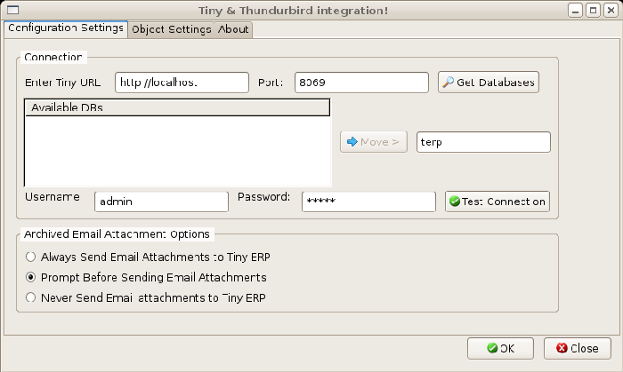
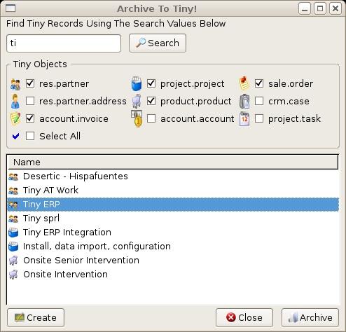
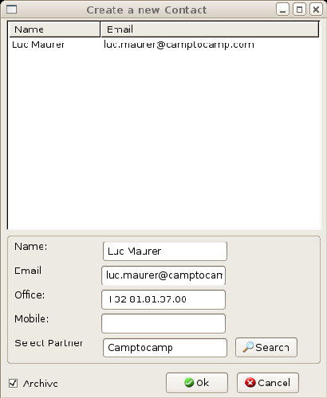

.. index::
   single: Thunderbird (Mozilla)

Mozilla Thunderbird interface
===============================

The Mozilla Thunderbird plugin enables you to carry out a series of Open ERP operations directly from the Thunderbird email client:

* create a contact or partner from an email,

* save an email and its attachments in Open ERP,

* send any file attached to an Open ERP document (such as proposals, projects, and tasks).

Installing the Thunderbird extension
-------------------------------------

To be able to use the Thunderbird plugin you first have to install the Open ERP module \ ``email_interface``\  . It may not be loaded in the core of the Open ERP Server so you might have to load it using one of the methods described at the end of Chapter 1. Once you've got it into your server's filesystem it's installed the same way as all of the other modules you've handled so far.

You'll then have to install the Thunderbird extension. To do that, use the file \ ``tiny_plugin_2.0.xpi``\   which is found in the plugins directory of the \ ``email_interface``\   module. Then take the following steps:

	#. From Thunderbird, open the menu  *Tools > Complementary Modules* 

	#. Click the  *Install* button.

	#. Select the file \ ``tiny_plugin-2.0.xpi``\  

	#. Click  *Install Now* then restart Thunderbird.

Once the extension has been installed, you have only to create a shortcut in your Thunderbird toolbar for the function  *Archive to Tiny* . Do it like this:

	#. Click the right mouse button on the toolbar and select  *Personalize* 

	#. Place the icon  *Archive to Tiny* in your toolbar in the place of your choice.

.. tip::   **Attention**  *Thunderbird version* 

	The Tiny plugin for Thunderbird only works with Thunderbird version 2.0 and above.

	So check your Thunderbird version before installing, and download the latest version that you need from the following address: http://www.mozilla.org/products/thunderbird/

Thunderbird user interface
---------------------------

When you've installed the module the first thing to do is connect it to Open ERP from Thunderbird. To do this use the menu  *Tools > Tiny Plugin* .

A configuration window appears enabling you to enter configuration data about your Open ERP server.

*Configuration for accessing Open ERP from Thunderbird.*

To archive an email in Open ERP from Thunderbird select the email and click on the icon  *Archive in Tiny* . Alternatively you could right-click the mouse: either opens a search dialog box.

This allows you to select an object that you'd like to add to your email and its attachments. You can select a partner, a task, a project, an analytical account, or any other object.

*Selecting Open ERP objects from Thunderbird.*

.. tip::   **A step further**  *Document Management* 

	The Thunderbird plugin is compatible with Open ERP's document management. So if you install the module document you could:

	* search through the content of your company's documents (those that have the type .doc, .pdf, .sxw and .odt) and also in archived emails,

	* have a shared filesystem that's connected to various Open ERP documents to share information and access it with your favorite browser,

	* organize and structure your documents (such as projects, partners and users) in Open ERP's system.

If you can't find a partner or contact to correspond with your email in Open ERP it's possible to create one on the fly simply by using the information contained in the email and clicking the  *Create*  button.

*Creating a contact on the fly from Thunderbird.*

To access archived data from different documents in Open ERP you can use the  *Email Thunderbird*  interface that appears over Open ERP documents.

.. tip::   **Note**  *Testing the Thunderbird adapter* 

	If you install the Thunderbird adapter as described, use the openerp_ch05X database to explore its functionality as described in this section

.. Copyright © Open Object Press. All rights reserved.

.. You may take electronic copy of this publication and distribute it if you don't
.. change the content. You can also print a copy to be read by yourself only.

.. We have contracts with different publishers in different countries to sell and
.. distribute paper or electronic based versions of this book (translated or not)
.. in bookstores. This helps to distribute and promote the Open ERP product. It
.. also helps us to create incentives to pay contributors and authors using author
.. rights of these sales.

.. Due to this, grants to translate, modify or sell this book are strictly
.. forbidden, unless Tiny SPRL (representing Open Object Presses) gives you a
.. written authorisation for this.

.. Many of the designations used by manufacturers and suppliers to distinguish their
.. products are claimed as trademarks. Where those designations appear in this book,
.. and Open ERP Press was aware of a trademark claim, the designations have been
.. printed in initial capitals.

.. While every precaution has been taken in the preparation of this book, the publisher
.. and the authors assume no responsibility for errors or omissions, or for damages
.. resulting from the use of the information contained herein.

.. Published by Open ERP Press, Grand Rosière, Belgium

