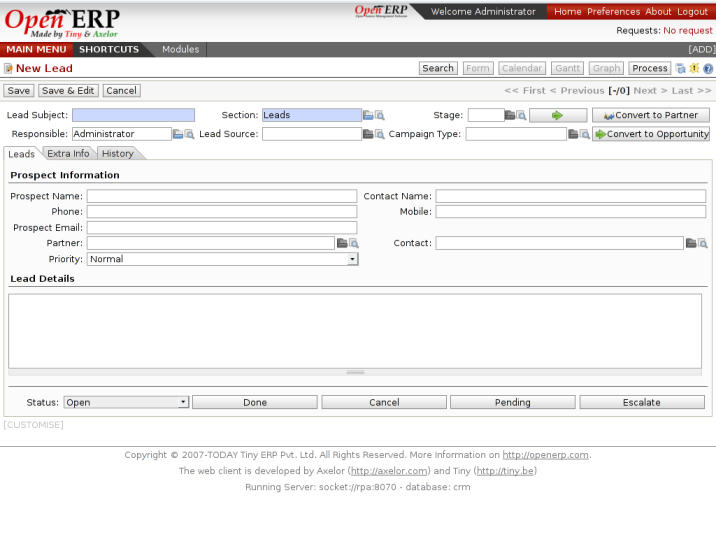
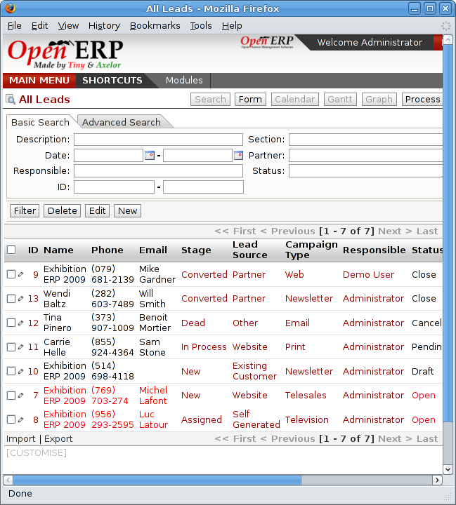

Leads
=====

A lead represents a potential customer or a possible future business or sales opportunity. They
aren't usually qualified yet and they aren't yet assigned to an individual person for following up.
When a lead needs to be followed up, it's converted to a partner and/or a sales opportunity.

For example, the following events could result in the creation of one or several leads:

* A business card from a prospective customer met briefly at an exhibition: you must contact him
  again to qualify the lead and to know if there is any possibility of a key sales opportunity,

* A database of potential customers in a given sector and region. The potential customers must be
  contacted again individually or using a mass mailing to determine which contacts need to be followed
  up,

* A contact that you've been given by a friend. You must then qualify it before starting to assign a
  salesperson to the contact,

* A form completed on your website directly integrated into Open ERP. Before converting the form
  into a sale proposition or opportunity, you should read and handle the person's request.

    .. note:: Separation of sales services

        In companies of a certain type, you often distinguish between the sales department and the
        presales department.
        The role of the presales department is to acquire and qualify new leads,
        and the role of the sales department is to crystallize the sales opportunities or work with
        existing customers.

In Open ERP the users in the presales department will usually work on leads. Once these are
converted into customers or sales opportunities the sales department pays individual attention to
each opportunity.

Entering prospects into the system
----------------------------------

New prospects are usually entered as a lead in the system. This means that you don't create a
partner form or sales opportunity until you have qualified whether the lead is interesting or not.
If the new contact is indeed interesting you then enter the data on into a partner form and,
eventually, a sales opportunity.

To enter a lead manually use the menu :menuselection:`CRM & SRM --> Sales --> Leads --> New Lead`. A
form opens to let you enter data about this new contact.

   *Creating a new lead.*

Leads have a status that depends on the qualification work that's been carried out:

* Draft: the lead data has been entered, any work has not yet been done and a salesperson has not
  yet been assigned to the request,

* Open: the lead is being handled,

* Closed: the lead has been converted into a partner and/or a sales opportunity,

* Waiting: the lead is waiting for a response from the customer,

* Cancelled: the lead has been cancelled because the salesperson has decided that it's not worth
  following up.

When a new lead has been created it's automatically put into the open state.

It's also possible to import a huget list of leads. That's useful if you've bought a database of
potential prospects and you want to insert them all into the system to handle them all at once.

To do that you should start with a list of leads in CSV format. If your prospects are provided in
another format it's very simple to convert them to the CSV format using MS Excel or OpenOffice Calc.
Open the leads list using the menu :menuselection:`CRM & SRM --> Presales -> Leads -> My Leads`. At
the bottom of the list click on the :guilabel:`Import` link. Open ERP opens a form for importing the
data.

   *Importing leads into the system.*

You then set which columns are present in your CSV file in the correct order. Then select your file
and click on :guilabel:`Import`. Check in the chapter about system administration, :ref:`ch-config`, for more
information on import and export.

.. tip:: Various Imports

    Importing and Exporting data in Open ERP is a generic function available to all resource.
    So you can import and export such lists as partners, sales opportunities, accounting entries,
    products and pricelists.

There are other methods of importing leads automatically or semi-automatically:

* Using the Outlook or Thunderbird plugin to insert new leads directly from an email client after a
  salesperson sees promising emails,

* Using the email gateway for each incoming email from a certain address (such as
  info@mycompany.com) creating a lead automatically from the contents of the email,

* Using Open ERP's XML-RPC web-servces to connect to a form on your website.

These different methods are described in the earlier CRM chapter, :ref:`ch-crm`.

Organizing leads
----------------

To help the users organize and handle leads efficiently, Open ERP provides several menus in the CRM
system that can be used depending on the needs of each:

* :menuselection:`Leads --> New Lead` opens an entry form directly onto a new lead. This menu can
  usefully be put into your shortcuts,

* :menuselection:`Leads --> My Leads` gives a list of all the leads (both open and not) which you're
  linked to,

* :menuselection:`Leads --> My Leads --> My Current Leads` gives a list of all your leads that you
  still need to handle (your open, draft and waiting leads),

* :menuselection:`Leads --> My Leads --> My Open Leads --> Leads Waiting` gives a list of all your
  leads that that are still waiting for a customer response. This enables you to check periodically on
  your work to do,

* :menuselection:`Leads --> All Leads` is a list of all the leads assigned to different salespeople.
  This menu as those beneath it are used by managers to check on each person's work.

   *List of leads to be handled.*

Leads are prioritized. The salespeople should ideally start at the top of the list. They then open a
form to describe the lead. At this stage they contact the suspect by email or phone and enter the
result of the contact on the lead form.

They can then change the status of the lead to a state that depends on the response from the
customer:

* Cancelled: not to be followed as a lead,

* Waiting: waiting for a response from the suspect.

Converting leads into customers or opportunities
------------------------------------------------

If a lead is interesting you convert it into a partner in the system. To do that, push the button
:guilabel:`Convert into a Partner`. Open ERP opens a partner form with the information from the lead entered
into it. At this stage you can complete more information such as the exact partner address and the
contact details.

The created partner is automatically attached to the lead, which enables you to keep the complete
traceability from the lead. To do that look at the second tab in the lead :guilabel:`History`.

If the salesperson thinks that there is a real opportunity with the lead, following the contact, he
can convert it into a sales opportunity using the button :guilabel:`Convert to Opportunity`. Open ERP then
opens a window asking the title of the opportunity, the estimate revenue and the percentage success
of converting to a sale.

   *Converting a lead into a sales opportunity.*

Some companies have more advanced processes for the qualification of a lead. They pass through
several steps, auch as first call, renewing contact, waiting for a verbal agreement. You can then
use the field :guilabel:`Step` that is found up to the right of the lead definition. To move it
automatically through the next step, you can use the button that looks like a right arrow.

.. Copyright © Open Object Press. All rights reserved.

.. You may take electronic copy of this publication and distribute it if you don't
.. change the content. You can also print a copy to be read by yourself only.

.. We have contracts with different publishers in different countries to sell and
.. distribute paper or electronic based versions of this book (translated or not)
.. in bookstores. This helps to distribute and promote the Open ERP product. It
.. also helps us to create incentives to pay contributors and authors using author
.. rights of these sales.

.. Due to this, grants to translate, modify or sell this book are strictly
.. forbidden, unless Tiny SPRL (representing Open Object Press) gives you a
.. written authorisation for this.

.. Many of the designations used by manufacturers and suppliers to distinguish their
.. products are claimed as trademarks. Where those designations appear in this book,
.. and Open Object Press was aware of a trademark claim, the designations have been
.. printed in initial capitals.

.. While every precaution has been taken in the preparation of this book, the publisher
.. and the authors assume no responsibility for errors or omissions, or for damages
.. resulting from the use of the information contained herein.

.. Published by Open Object Press, Grand Rosière, Belgium

