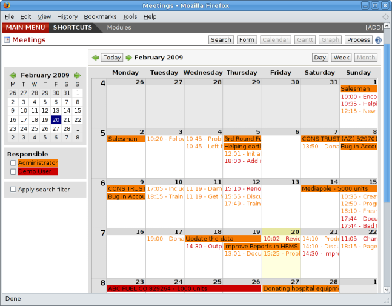
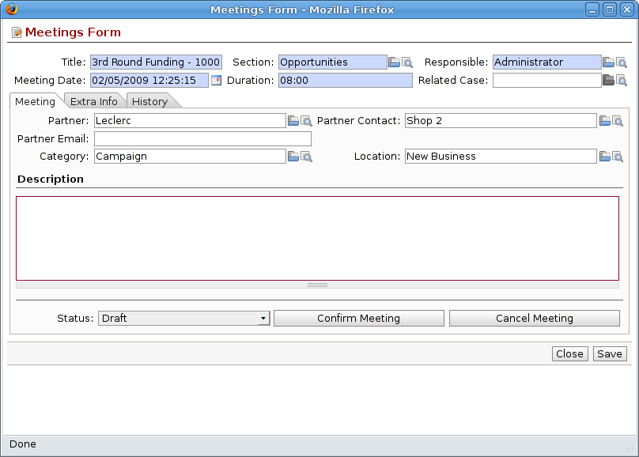

Sales Opportunities
===================

While a lead represents the first contact with a prospect yet to be qualified, a sales opportunity
represents a potential contract. Each opportunity must be followed up by a salesperson spending time
to make a quotation or the cancellation of the opportunity.

Leads are generally handled en masse, with the automation of certain responses or emails. The
opportunities, in contrast, are usually tracked one by one by the salespeople because that involves
a process of negotiation.

Ensuring that you track opportunities
-------------------------------------

Just like the leads, Open ERP provides several menus to handle sales opportunities efficiently. All
the menus for opportunities are under the menu :menuselection:`CRM & SRM --> Presales -->
Opportunities`.

To quickly create a new opportunity, use the menu :menuselection:`Opportunity --> New Opportunity`.
You usually use this menu in the case where the opportunity is direct and doesn't come first from a
lead. It can also be useful to create a shortcut to this menu so that you can quickly open a new
opportunity form when you need to – after a phone call, or an email, that needs followup.

The salesperson uses the menu :menuselection:`Opportunites --> My Opportunities --> My Open
Opportunities` to track their opportunities. After the different customer contacts, the salesperson
can enter the information into the form to describe the activity. The history tab provides a history
of all the information about the activity throughout its life. The activities are automatically
reported on the partner form of the associated customer. To see this, open the events tab when you
open the partner form.

.. figure:: images/crm_partner_event.png
   :align: center

   *History of events in a partner form.*

When the leads have been converted into opportunities, the opportunities can be assigned to any
salesperson. In that case you designate a manager in the company who is responsible for assigned the
new opportunities to the different salespeople, to suit their speciality, location or availability.

To do this, the manager can use the menu :menuselection:`Opportunity --> All Opportunities -->
Unassigned Opportunities`. This gives you a list of all opportunities that haven't yet been assigned
to a salespersson. The manager can the enter the salesperson responsible for the opportunity into the
field :guilabel:`Responsible`.

The company calendar
--------------------

There are several methods for entering a new meeting with a partner. The first method is to enter
the meeting directly in the company calendar. To do that, use the menu :menuselection:`CRM & SRM -->
Calendar --> All Meetings`.

You can use the monthly, weekly or daily views to plan a meeting. To move between one mode and
another use the buttons above and to the right of the calendar.

   *Meetings calendar in monthly view.*

.. figure:: images/crm_calendar_week.png
   :align: center

   *Meetings calendar in weekly view.*

In the calendar you distinguish between multi-day events and events that last only for a few hours.
Multi-day events have a colored background whereas single events have a colored font. Each event
has a color that represent the user that created the meeting. You can filter the different users by
selecting them from the list at the left of the screen.

To enter a new meeting into the system you can click the day and the hour for a new meeting. In the
weekly and daily views you can also press the mouse left button on the calendar and slide the mouse
along to create an event of several hours. Open ERP then opens an entry screen for a new meeting.

   *Entering a new meeting.*

.. tip:: Consolidated Calendar

    The advantage of integrated management is that the enterprise calendar will group several system
    events.
    Then in the Open ERP calendar you will automatically find the meetings but also such information
    as
    business opportunities, technical interventions, and requests for staff meetings.

Tracking phone calls
--------------------

Open ERP has functions to manage a telephone call centre. If you selected the functions to manage
calls when you installed the CRM module you will be able to manage incoming and outgoing calls.

Call management can be used for two needs:

* Entering customer calls so that you keep a record of the communication attached to a partner or a
  sales opportunity,

* Managing a call centre with operators that handle a list of calls to carry out one after another.

To enter details of a phone call, use one of the two following menus:

* :menuselection:`CRM & SRM --> Sales --> Phone Calls --> Incoming`,

* :menuselection:`CRM & SRM --> Sales --> Phone Calls --> Outgoing`.

The phone call will then be visible on the partner form to give you complete visibility of the
events about that customer or supplier.

Managing a Call Center
----------------------

You can manually encode calls that happen or you can pass them into Open ERP. But for mass
campaigns, you can import a list of phone calls to make. To do this, click on the import link at the
bottom of the list of phone calls. On the GTK client use the toolbar button :menuselection:`Form -->
Import` at the top.

Phone calls that have occurred in the open state. The different operators can be assigned calls and
handle them one by one using the menu :menuselection:`CRM & SRM --> Phone Calls --> Outgoing Calls
--> Calls To Make`.

The operator can open the calls one by one. For each call, after having contacted the customer, the
operator can click on one of the following buttons:

* Cancel: you cancel the call. For example you could cancel the call if you've tried to call them
  more than three times.

* Called: you've spoken to the customer by phone. In this case the operator can change the case
  section and send it to, for example, sales opportunities. You could alternatively leave it in this
  state if you don't need to carry out any more actions with this customer.

* Not called: the customer hasn't been called, you'll try to call him again later.

Advanced Customer Relations
---------------------------

Open ERP also supplies several tools to improve and automate relationships with partners. They won't
be described extensively here, just introduced briefly.

The supplier/customer portal gives you the ability to provide your suppliers and customers with
constrained access to Open ERP. They will then be able to view or enter sets of information directly
online to Open ERP. For example they could enter their orders, reprint their invoices, or work on
communal projects. To activate the portal it's necessary to install the modules that start with the
string ``portal_...``.

The email gateway lets you interface the CRM with incoming and outgoing emails. The scripts used for
the email gateway are available in the ``crm`` module in the ``scripts`` subdirectory.

The Outlook and Thunderbird plugins enable you to synchronize your contacts between your email
client and your ERP. They both enable you to create sales opportunities based on exchanges you have
with the customer.

The rules for automating actions will enable you to send emails automatically based on the event,
such as assigning opportunities to the most appropriate person. To access the CRM rules, use the
menu :menuselection:`CRM & SRM --> Configuration --> Cases --> Rules`.

The segmentation tools will enable you to create partner groups and act on each segment differently.
For example you could create pricelists for each of the segments, or start phone marketing campaigns
by segment. To enable the management of segmentation you should install the module
``crm_profiling``.

The ``report_designer`` module enables you to create letter templates in OpenOffice and automate
letter for different prospects. Open ERP also has plugins for MS Word to simplify the creation of
mass mailing.

.. Copyright © Open Object Press. All rights reserved.

.. You may take electronic copy of this publication and distribute it if you don't
.. change the content. You can also print a copy to be read by yourself only.

.. We have contracts with different publishers in different countries to sell and
.. distribute paper or electronic based versions of this book (translated or not)
.. in bookstores. This helps to distribute and promote the Open ERP product. It
.. also helps us to create incentives to pay contributors and authors using author
.. rights of these sales.

.. Due to this, grants to translate, modify or sell this book are strictly
.. forbidden, unless Tiny SPRL (representing Open Object Press) gives you a
.. written authorisation for this.

.. Many of the designations used by manufacturers and suppliers to distinguish their
.. products are claimed as trademarks. Where those designations appear in this book,
.. and Open Object Press was aware of a trademark claim, the designations have been
.. printed in initial capitals.

.. While every precaution has been taken in the preparation of this book, the publisher
.. and the authors assume no responsibility for errors or omissions, or for damages
.. resulting from the use of the information contained herein.

.. Published by Open Object Press, Grand Rosière, Belgium

