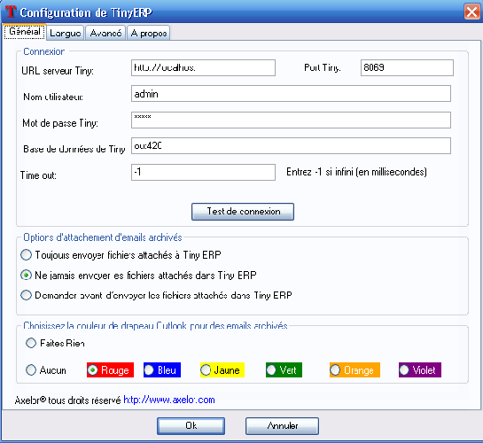

.. index::
   single: Microsoft Outlook interface
..

Open ERP preparation
====================

You'll need only one database for this chapter:

* \ ``openerp_ch05X``\  , which should be a restored copy of\ `` openerp_ch04X``\   the database you
  created at the start of :ref:`ch-crm` and then extended – you'll refer to it from time to time because
  it contains demonstration data that you can use to exercise some of the functions you encounter in
  the chapter.

To be able to backup and restore the database you'll need to know your super-administrator password.

You'll probably also need your system's \ ``addons``\   directory to be writable, since some of the
modules you'll need may have to be added separately – they aren't necessarily all available as
part of the core 5.0.0 release of Open ERP.

You will need to have administrator access to your Windows PC to install the Outlook and Word
interface adapters described in the chapter.

.. index:: Outlook (Microsoft)

Microsoft Outlook interface
===========================

The Microsoft Outlook plugin enables you to carry out a series of Open ERP operations directly
from the Outlook email client:

* create a contact or partner from an email,

* archive an email and its attachments in Open ERP,

* send any file attached to an Open ERP document (such as proposals, projects, and tasks).

.. tip:: Outlook versions

	The Microsoft Outlook plugin works with Microsoft Outlook 2003 and 2007 but not with Outlook
	Express

Installing the Outlook plugin
-----------------------------

To start, you must install the :mod:`email_interface` module in Open ERP. It's the same module as
used by the Thunderbird extension. Don't install it again if it's already there (which it might be
because you can use both Outlook and Thunderbird simultaneously to get the same Open ERP
functionality – so some of your staff may use one and other may use the other).

Once you've installed the module all you need is to run the Windows auto-installer \
``tiny_outlook_plugin-X.exe``\   where X corresponds to the version number downloaded. This file can
be found in the list of modules on the official Open ERP site.

Installation is then automatic.

Using the Outlook plugin
------------------------

Using the Microsoft Outlook plugin is quite similar to using the Thunderbird extension. In Outlook
find the menu :menuselection:`Tools --> Open ERP Options`.

.. figure::  images/outlook_menu.png
   :scale: 50
   :align: center

   *Configuration menu for the interface between Outlook and Open ERP*

In the window that you use for configuring the Outlook plugin you can enter parameters for accessing
the Open ERP server, with various options for:

* how to handle attachments,

* which color to give emails transferred to Open ERP.

Once the server data entry is completed, click :guilabel:`Test the Connection` to check that your
parameters make it function correctly.

   *Configuring access to Open ERP from Word*

When Outlook is configured, archiving an email and its attached files in Open ERP can be done in
several ways:

* directly from the toolbar,

* from the context menu by right-clicking on an email,

* from the page while looking at the email.

.. figure::  images/outlook_archive.png
   :scale: 50
   :align: center

   *Saving an Outlook email in Open ERP*

You can select an existing contact or create a new contact on the fly in the Open ERP database.
Then you can send the email and its attachments and also save it in Open ERP.

It's possible to send attachments to all types of Open ERP objects. For example this might be
useful for:

* sending documents about a customer project into the corresponding project in Open ERP,

* attaching the documents about an order (such as proof of payment and order receipts),

* attaching documents to an employee file (such as their CV or annual appraisal).

Once the email is sent into Open ERP it's marked with another color in Outlook to help remind you
not to archive it again.

.. note:: Testing the Outlook adapter

	If you install the Outlook adapter as described, use the openerp_ch05X database to explore its
	functionality as described in this section

.. Copyright © Open Object Press. All rights reserved.

.. You may take electronic copy of this publication and distribute it if you don't
.. change the content. You can also print a copy to be read by yourself only.

.. We have contracts with different publishers in different countries to sell and
.. distribute paper or electronic based versions of this book (translated or not)
.. in bookstores. This helps to distribute and promote the Open ERP product. It
.. also helps us to create incentives to pay contributors and authors using author
.. rights of these sales.

.. Due to this, grants to translate, modify or sell this book are strictly
.. forbidden, unless Tiny SPRL (representing Open Object Press) gives you a
.. written authorisation for this.

.. Many of the designations used by manufacturers and suppliers to distinguish their
.. products are claimed as trademarks. Where those designations appear in this book,
.. and Open Object Press was aware of a trademark claim, the designations have been
.. printed in initial capitals.

.. While every precaution has been taken in the preparation of this book, the publisher
.. and the authors assume no responsibility for errors or omissions, or for damages
.. resulting from the use of the information contained herein.

.. Published by Open Object Press, Grand Rosière, Belgium

