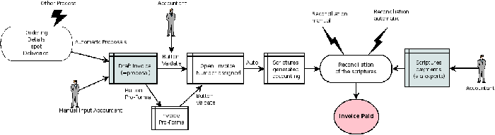

.. index::
   single: Accounting workflow
.. 

Accounting workflow and the automatic generation of invoices
============================================================

The chart below shows the financial workflow followed by each invoice.

*Accounting workflow for invoicing and payment.*

In general, when you use all of Open ERP's functionality, invoices don't need to be entered manually. Draft invoices are generated automatically from other documents such as Purchase Orders.

.. index::
   single: Invoices
.. 

Draft Invoices
--------------

The system generates invoice proposals which are initially set to the \ ``Draft``\   state. While these invoices remain unconfirmed they have no accounting impact within the system. There's nothing to stop users creating their own invoices if they want to.

The information that's needed for invoicing is automatically taken from the Partner form (such as payment conditions and the invoice address) or from the Product (such as the account to be used) or from a combination of the two (such as applicable Taxes and the Price of the product).

.. tip::   **Advantage**  *Draft invoices* 

	There are several advantages in working with Draft invoices:

	* You've got an intermediate validation state before the invoice is approved. This is very useful when your accountants aren't the people creating the initial invoice, but are still required to approve it before the invoice is entered into the accounts.

	* This enables you to create invoices in advance, without approving them at the same time. You're also able to list all of the invoices awaiting approval.

Open or Pro-Forma Invoices
--------------------------

It's possible to approve (or validate) an invoice in the \ ``Open``\   or \ ``Pro Forma``\   state. A Pro Forma invoice doesn't yet have an invoice number, but the accounting entries on the invoice that's created correspond to the amounts that Open ERP will record as the customer's payables.

.. tip::   **Comment**  *Pro Forma invoices* 

	In some countries, you're not allowed to generate accounting entries from pro forma invoices. You create instead a report from the purchase order, which prints a pro forma invoice, which has no accounting consequences within the system. 

	You can use the module described in Chapter 13 to create this report.

An open invoice has a unique invoice number. The invoice is sent to the customer and is marked on the system as awaiting payment.

.. index::
   single: Reconciliation
.. 

Reconciling invoice entries and payments
----------------------------------------

In Open ERP an invoice is considered to be paid when its accounting entries have been reconciled with the payment entries. If there hasn't been a reconciliation an invoice can remain in the open state until you have entered the payment.

.. tip::   **Attention**  *Payment and reconciliation* 

	To avoid surprises, it's important to understand the idea of reconciliation and its link with invoice payment.

	You'll find both a Reconciled field and the Paid checkbox on an invoice. They differ from each other only if an invoice has been paid (using reconciliation of records) but has subsequently been marked as unreconciled

.. tip::   **Terminology**  *Reconciliation* 

	Reconciliation links entries in a single account that cancel each other out – they're reconciled to each other (sum of credits = sum of debits).

	This is generally applied to payments against corresponding invoices.

Without the reconciliation process, Open ERP would be incapable of marking invoices that have been paid. Suppose that you've got the following situation for the Smith and Offspring customer:

* Invoice 145: 50,

* Invoice 167: 120,

* Invoice 184: 70.

If you receive a payment of 120, Open ERP will delay reconciliation because there's a choice of invoices to pay. It could either reconcile the payment against invoices 145 and 184 or against invoice 167.

You can cancel an invoice if the  *Allow Cancelling Entries*  function has been activated in the journal and the entries haven't yet been reconciled. You could then move it from \ ``Canceled``\  , through the \ ``Draft``\   state to modify it and regenerate it.

.. tip::   **Note**  *Treatment in Lots* 

	Usually, different transactions are grouped together and handled at the same time rather than invoice by invoice. This is called batch work or lot handling.

	You can select several documents in the list of invoices: check the checkboxes of the interesting lines using the web client and click the appropriate shortcut button at the right; or shift-click the lines using the mouse in the GTK client and use the action or print button at the top – these give you the option of one of a number of possible actions on the selected objects.

At regular intervals, and independently of the invoices, an automatic import procedure or a manual accounts procedure can be used to bring in bank statements. These comprise all of the payments of suppliers and customers and general transactions, such as between accounts.

When an account is validated, the corresponding accounting entries are automatically generated by Open ERP.

Invoices are marked as paid when accounting entries on the invoice have been reconciled with accounting entries about their payment.

This reconciliation transaction can be carried out at various places in the process, depending on your preference:

* at data entry for the accounting statement,

* manually from the account records,

* automatically using Open ERP's intelligent reconciliation.

You can create the accounting records directly, without using the invoice and account statements. To do this, use the rapid data entry form in a journal. Some accountants prefer this approach because they're used to thinking in terms of accounting records rather than in terms of invoices and payments.

You should really use the forms designed for invoices and bank statements rather than manual data entry records, however. These are simpler and are managed within an error-control system.

A records-based system
----------------------

All the accounting transactions in Open ERP are based on records, whether they're created by an invoice or created directly.

So partner reminders are generated simply from the list of unreconciled entries in the trade receivables account for that partner. In a single reminder you'll find the whole set of unpaid invoices as well as unreconciled payments, such as advances.

Similarly, financial statements such as the general ledger, account balance, aged balance (or chronological balance) and the various journals, are all based on accounting entries. It doesn't matter if you generated the entry from an invoice form or directly in the invoice journal. It's the same for the tax declaration and other statutory financial statements.

When using integrated accounting, you should still go through the standard billing process because some modules are directly dependent on invoice documents. For example, a customer sale order can be configured to wait for payment of the invoice before triggering a delivery. In such a case, Open ERP automatically generates a draft invoice to send to the client.

.. Copyright © Open Object Press. All rights reserved.

.. You may take electronic copy of this publication and distribute it if you don't
.. change the content. You can also print a copy to be read by yourself only.

.. We have contracts with different publishers in different countries to sell and
.. distribute paper or electronic based versions of this book (translated or not)
.. in bookstores. This helps to distribute and promote the Open ERP product. It
.. also helps us to create incentives to pay contributors and authors using author
.. rights of these sales.

.. Due to this, grants to translate, modify or sell this book are strictly
.. forbidden, unless Tiny SPRL (representing Open Object Presses) gives you a
.. written authorisation for this.

.. Many of the designations used by manufacturers and suppliers to distinguish their
.. products are claimed as trademarks. Where those designations appear in this book,
.. and Open ERP Press was aware of a trademark claim, the designations have been
.. printed in initial capitals.

.. While every precaution has been taken in the preparation of this book, the publisher
.. and the authors assume no responsibility for errors or omissions, or for damages
.. resulting from the use of the information contained herein.

.. Published by Open ERP Press, Grand Rosière, Belgium
