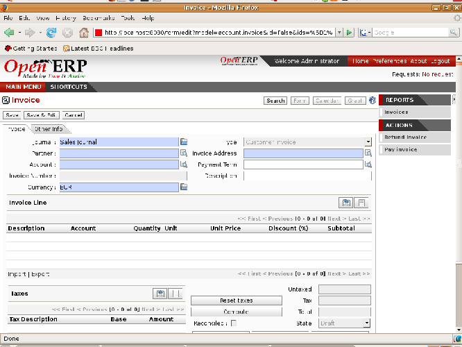
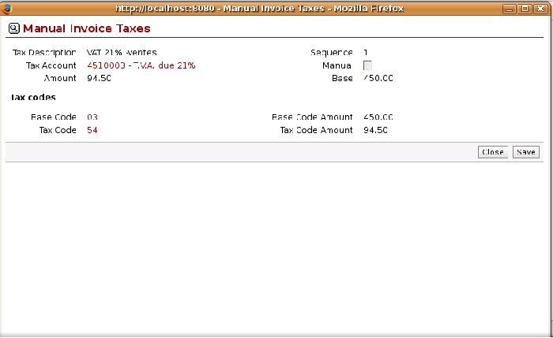

Invoicing
=========

In Open ERP, the concept of “invoice” includes the following documents:

* the customer invoice,

* the supplier invoice,

* a customer credit note,

* a supplier credit note.

Only the invoice type and the representation mode differ for each of the four documents. But they're all stored in the same object type in the system.

You get the correct form for each of the four types of invoice from the menu you use to open it. The name of the tab enables you to tell the invoice types apart when you're working on them.

.. index::
   single: Invoices; Types
.. 

.. tip::   **Technique**  *Types of invoice* 

	There are many advantages in deriving the different types of invoice from the same object. The two most important are:

	* In a multi-company environment with inter-company invoicing, a customer invoice in one company becomes a supplier invoice for the other.

	* This enables you to work and search for all invoices from the same menu. If you're looking for an invoicing history, Open ERP provides both supplier and customer invoices in the same list, as well as credit notes.

.. index::
   single: Credit Note
.. 

.. tip::   **Terminology**  *Credit Note* 

	A credit note is a document that enables you to cancel an invoice or part of an invoice.

To access invoices in Open ERP, use the submenus of  *Financial Management > Invoices* .

Most of the time, invoices are generated automatically by Open ERP as they are generated from other processes in the system. So it's not usually necessary to create them manually, but simply approve or validate them. Open ERP uses the following different ways of generating invoices: 

* from Supplier or Customer Orders,

* from reception or despatch of goods,

* from work carried out (timesheets, see chapter 10),

* from closed tasks (see chapter 12),

* from fee charges or other rechargeable expenses (see chapter 11).

The different processes generate \ ``Draft``\   invoices. These must then be approved by a suitable system user and sent to the customer. The different invoicing methods are detailed in the following sections and chapters.

To get the list of draft invoices generated by Open ERP, you can use the menu  *Financial Management > Invoices > Customer Invoices > Draft Customer Invoices* . You'll find a similar menu for Purchase Invoices that haven't yet been received or approved:  *Financial Management > Invoices > Supplier Invoices > Draft Supplier Invoices* .

It's also possible to enter invoices manually. This is usually done for invoices that aren't associated with an Order (usually purchase orders) or credit notes. Also if the system hasn't been configured correctly you might need to edit the invoice before sending it to the customer.

For example, if you haven't noted that the customer is tax-exempt, the invoice you generate from an Order will contain tax at the normal rates. It's then possible to edit this out of the invoice before validating it.

Entering a customer invoice
---------------------------

The principle of entering data for invoices in Open ERP is very simple, as it enables non-accountant users to create their own invoices. This means that your accounting information can be kept up to date all the time as orders are placed and received, and their taxes are calculated.

At the same time it allows people who have more accounting knowledge to keep full control over the accounting entries that are being generated. Each value proposed by Open ERP can be modified later if needed. 

Start by manually entering a customer invoice. Use  *Financial Management > Invoices > Customer Invoices*  for this.

A new invoice form opens for entering information.

	
*Entering a new invoice.*

The document is composed of three parts:

* the top of the invoice, with customer information,

* the main body of the invoice, with detailed invoice lines,

* the bottom of the page, with detail about the taxes, and the totals.

To enter a document in Open ERP you should always fill in fields in the order that they appear on screen. Doing it this way means that some of the later fields are filled in automatically from the selections made in earlier fields. So select the Partner, and the following fields are completed automatically:

* the invoice address corresponds to the partner contact that was given the address type of \ ``Invoice``\   in the partner form (or otherwise the address type of \ ``Default``\  ),

* the partner account corresponds to the account given in the Properties which is found in the third tab of the partner form. By default the software is configured with account \ ``Accounts Receivable``\  .,

* a payment condition can be specified for this case or, if it's been defined by default, in the  *Properties*  area of the partner form. Payment conditions are generated by rules for the payment of the invoice. For example: 50% in 21 days and 50% in 60 days from the end of the month. 

.. index::
   single: Properties fields

.. tip::   **Definition**  *Properties fields* 

	The Properties fields on the Partner form or the Product form are multi-company fields. The value that the user sees in these fields depends on the company that the user works for.

	If you work in a multi-company environment that's using one database, you have several charts of accounts. Asset and liability accounts for a partner depend on the company that the user works for.

.. tip::   **Note**  *Seeing partner relationships* 

	You can always reach more information from a relation field in Open ERP. In the web client a relation is a hyperlink if the form is read-only – it takes you to the main form for that entity, with all of the actions and links. In the web client in edit mode, and in the GTK client, you can press the keyboard Ctrl button at the same time as right-clicking in the field to get a drop-down dialog with links and other options. So you could click on a partner field to rapidly get the partner's:

	* current sales and purchases,

	* CRM requests,

	* open invoices,

	* accounts records,

	* payable and receivable accounts.

You can then add a short Description to the invoice and select the currency that you want to invoice in.

.. tip::   **Attention**  *Invoice Description* 

	The invoice description is more of a title than a comment. If you want to add more detailed comments you can use the Notes field at the bottom of the second tab Other Information.

Once the invoice heading is saved you must enter the different invoice lines. You could use either of two techniques:

* enter the whole field manually,

* use a product to complete the different fields automatically.

So select the product \ ``Titanium Alloy Radiator``\   in the product field in an invoice line. The following fields are then completed automatically:

*  *Description* : this comes from the product, in the language of the partner,

*  *Credit/debit account* : determined by the purchase or sales account defined in the product properties. If no account is specified in the product form, Open ERP use the properties of the category that the product is associated with.

*  *Unit of Measure* : this is defined by default in the product form,

*  *Unit price* : this is given by the list price in the product form and is expressed without taxes,

*  *Taxes* : provided by the product form and the partner form.

.. tip::   **Note**  *Managing the price with tax included* 

	By default, Open ERP invoices and processes the price without taxes – they're managed as a separate figure. If you want to have invoices provided with tax included you can install the module ``account_tax_include``.

	The module adds a field on each invoice that enables you to indicate if the invoice is tax exclusive or tax inclusive.

.. tip::   **Note**  *Information about the product* 

	When you're entering invoice data it can sometimes be useful to get hold of more information about the product you're invoicing. Since you're already in edit mode, you'd press the Ctrl key and use a right mouse-click on the Product field (in both the web and the GTK clients). Then select the available reports. Open ERP provides three standard reports about the product

	* forecasts of future stock,

	* product cost structure,

	* location of the product in your warehouses.

It's possible to enter several invoice lines and modify the values that are automatically suggested by Open ERP.

Once the invoice lines have been entered, you can click  *Calculate*  on the invoice to get the following information:

* details of tax calculated,

* tax rate,

* total taxes,

* total price.

In the  *Taxes*  area at the bottom left of the invoice you'll find the details of the totals calculated for different tax rates used in the invoice.

.. tip::   **Technique**  *Tax Calculations* 

	You can double-click on one of the lines in the tax summary areas in the invoice.

	Open ERP then shows you the detail of the tax charges which will effectively be your tax declaration at the end of the month.

	It shows you the total that will be computed in the different parts of the legal declaration. This enables you to manage the declaration in Open ERP automatically.

*Detail of tax charges on an invoice.*

Before approving the invoice you can modify the date and the accounting period, which are entered by default as today's date. These fields are found on the second tab  *Other Information* .

.. index::
   single: Invoice layout

.. tip::   **Note**  *Invoice layout* 

	If you want to make your invoice layout more elaborate you can install the module ``account_invoice_layout``. This enables you to add various elements between the lines such as subtotals, sections, separators and notes.

Click  *Validate*  when you want to approve the invoice. It moves from the \ ``Draft``\   state to the \ ``Open``\   state.

When you've validated an invoice, Open ERP gives it a unique number from a defined sequence. By default it takes the form \ ``Year / Sequence Number``\   for example \ ``2008/00101``\  . If you want to modify the sequence numbers use the menu  *Administration > Custom > Sequences > Sequences* .

Accounting entries corresponding to this invoice are automatically generated when you approve the invoice. You can verify the detail of this by clicking the  *Open*  icon for the  *Transactions*  field in the second tab of the invoice.

..index::
  single: Taxes; DEEE

.. 

Managing taxes
^^^^^^^^^^^^^^

Details on the product form and the partner form determine the selection of applicable taxes for an invoice line. By default Open ERP takes account of all the taxes defined in the product form. If a tax is defined in the Properties tab of the Partner form then Open ERP will base its tax calculation on the Partner taxes instead, so a Partner that is defined as tax-exempt, for example, will take precedence over taxes defined in the Product.

Take the case of the following product

* Applicable taxes:

	- TVA: 19.6% type TVA

	- DEEE: 5.5, type DEEE

.. index::
   single: DEEE tax

.. tip::  **Definition**  *DEEE tax*

	The DEEE tax (disposal of electronic and electrical equipment) is an ecological tax that was imposed in France from 2007. It's applied to batteries to finance their recycling and is a fixed sum that's applied to the before-tax figure on the invoice

If you trade with a company in your own country, and your country has a DEEE-type tax, the applicable taxes for this invoice will be:

* DEEE: 5.5,

* TVA: 19.6%.

If you sell to a customer in another company in the community (intracommunity), instead, then tax is not charged. Your foreign partners would then be zero-rated by selecting a 0% tax in the 4th tab,  *Properties* . When you create an invoice for this customer, Open ERP will calculate the following taxes on the product:

* DEEE: 5.5,

* TVA intracommunity: 0%.

If you haven't coded the parameters in the customer form correctly, Open ERP will suggest incorrect taxes in the invoice. That's not an insuperable problem because you can always modify the information directly in the invoice before approving it.

.. tip::   **Advice**  *Occasional invoices* 

	When you create an invoice for a product that will only be bought or sold once you don't have to encode a new product. But you'll have to provide quite a bit of information manually on the invoice line:

	* sale price,

	* applicable taxes, 

	* account,

	* product description.

Cancelling an invoice
^^^^^^^^^^^^^^^^^^^^^

By default Open ERP won't allow you to cancel an invoice once it has been approved. Since accounting entries have been created you theoretically can't go back and delete them. However in many cases it's more convenient to cancel an invoice when there's an error than to produce a credit note and reconcile the two entries. Your attitude to this will be influenced by current legislation in your accounting jurisdiction and your adherence to accounting purity.

Open ERP accommodates either approach. Canceling an invoice can be permitted by checking the box  *Allow Cancelling Entries*  in the Journal corresponding to this invoice. You'll then be allowed to cancel the invoice if the following two conditions are met:

	#. The accounting entries haven't been reconciled or paid: if they have then you'll have to cancel the reconciliation. 

	#. The accounting period or the fiscal year hasn't already been closed: if it has then no modification is possible.

Cancelling an invoice has the effect of automatically modifying the corresponding accounting entries.

When the invoice has been canceled you then have the possibility of putting it back into the \ ``Draft``\   state. This means that you can modify it and approve it again later.

.. tip::   **Advice**  *Numbering invoices* 

	Some countries require you to have contiguously number invoices with no break in the sequence. If, after canceling an invoice that you're not regenerating, you find yourself with a break in the numbering you must go and modify the sequence, redo the invoice and replace the sequence number with its original value.

	You can control the sequences using the menu Administration > Custom > Sequences > Sequences.

Attention: canceling an invoice will cause a break in the number sequence of your invoices. You're strongly advised to recreate this invoice and re-approve it to fill the hole in the numbering.

.. tip::   **Advantage**  *Duplicating a document* 

	The duplication function can be applied to all the system documents: you can duplicate anything – a product, an order, or a delivery.

----------------

	.. note::  *Some points* 

		#. Duplicating invoices

			Instead of entering a new invoice each time, you can base an invoice on a similar preceding one and duplicate it. To do this, first search for a suitable existing one. In the web client, show the invoice in read-only (non-editable) form view, then click Duplicate. In the GTK client, select Form > Duplicate from the top menu.

			The duplication creates a new invoice in the Draft state. That enables you to modify it before approving it. Duplicating documents in Open ERP is an intelligent function, which enables the duplicated invoice to be given its own sequence number, today's date, and the draft state, even if the preceding invoice has been paid.

		#. Saving partner preferences

			Open ERP has many functions to help you enter data quickly. If you invoice the same products frequently for the same partner you can save the last invoice preferences using conditional default values.

			To test this functionality, create an invoice for a given partner and add several lines. Then click on the name on an invoice line and select Make this a default value. Check the box that indicates this default should apply only to this partner.

			Then the next time you establish an invoice for this partner the invoice lines will be automatically created and you'll only have to modify the quantities before confirming the invoice.

			For taxes you're advised to put the default amount in the invoice lines (in France it would be 19.6%, in Belgium 21%, in the UK 17.5%). Doing this you won't forget to add tax when you're manually entering invoices.

		#. Getting information from a right-click

			As you're creating an invoice you'll often find you need extra information about the partner to help you complete the invoice. In Open ERP to obtain more information on any field all you need do is hold down the Ctrl key and click the right button on the mouse, and then Open ERP will automatically show you information linked to this partner, such as: 

			* tasks completed

			* benefit details

			* most recent invoices

			* latest orders

			Do the same to get information about the products you're invoicing,. For example: is there enough stock? When will you be getting more stocks in? What are the costs and normal list prices for this product?

			By making this information easily accessible while you're invoicing, Open ERP greatly simplifies your work in creating the invoice.

Creating a supplier invoice
---------------------------

The form that manages supplier invoices is very similar to the one for customer invoices. However, it's been adapted to simplify rapid data entry and monitoring of the amounts recorded.

.. tip::   **Method**  *Entering data* 

	Many companies don't code up supplier invoices but simply enter accounting data corresponding to the purchase journal.

	This particularly applies to users that have focused on the accounting system rather than all the capabilities provided by an ERP system. The two approaches reach the same accounting result: some prefer one and others prefer the other depending on their skills.

	However, when you use the Purchase Management functions in Open ERP you should work directly on invoices because they provide Purchase Orders or Goods Receipt documents.

To encode a new supplier invoice, use the menu  *Financial Management > Invoices > Supplier Invoice* .

Everything is similar to the customer invoice, starting with the  *Journal*  and then the  *Partner* , which will automatically complete the following fields

*  *Invoice address* , 

* partner *Account* :

Unlike the customer invoice you don't have to enter payment conditions – simply a  *Due Date* . And if you don't give a due date, Open ERP assumes that this invoice will be paid in cash. If you want to code in more complete payment conditions than just due date you can use the  *Payment Term*  field which you can find on the second tab,  *Other Info* .

After that you enter the invoice  *Total*  with taxes included. Open ERP uses this amount to check whether all invoice lines have been entered correctly before it will let you validate the invoice.

Indicate the  *Currency*  if the invoice isn't going to use the default currency, then you can enter the  *Invoice lines* .

Just like the customer invoice you have the choice of entering all the information manually or using a product to complete many of the fields automatically. Entering a product, all of the following values are completed automatically:

* the product  *Account*  is completed from the properties of the product form or the Category of the product if nothing is defined on the product itself,

* the  *Taxes*  come from the product form and/or the partner form, based on the same principles as the customer invoice,

* the  *Quantity*  is set at 1 by default but can be changed manually,

* the  *Unit Price*  is calculated automatically from the total price after deducting all the different applicable taxes,

Click  *Calculate*  to verify that the different amounts correspond to those indicated on the paper invoice from the supplier. When you approve the invoice, Open ERP verifies that the total amount indicated in the header correspond to the sum of the amounts without tax on the invoice lines and the different applicable taxes.

.. tip::   **Note**  *The Calculate button* 

	Even though you should calculate the invoice before approving it you don't have to push the Calculate button. If you approve the invoice directly the software calculates the different taxes itself and verifies the total.

	This button is only used for making a pre-check of the amount displayed before you confirm it finally.

Open ERP automatically completes the  *Date Invoiced*  and the accounting period, but you can still change these values manually in the second tab on the invoice before saving it.

.. index::
   single: Declarations

.. tip::   **Terminology**  *Dates and Accounting Periods* 

	Accounting periods are treated as legal period declarations. For example a tax declaration for an invoice depends on the accounting period and not on the date of invoicing.

	Depending on whether your declarations are made monthly or quarterly, the fiscal year contains either twelve or four accounting periods.

	The dates are shown in the document you created in the accounting system. They're used for calculating due dates.

.. index::
   single: Due Date

The two pieces of information don't have to have the same date. Suppose for example that you receive an invoice on the 5th January but it's dated 31st December in the previous year by your supplier. In this case you can code it into the January accounting period and put the invoice date as 31st December. The due date will be based on the 31st December data, but the invoice will be recognized in the current fiscal year for the tax declaration.

You can find that the amounts don't correspond with what your supplier has given you on paper for reasons that can include:

* the supplier made a calculation error,

* the amounts have been rounded differently.

.. tip::   **Technique**  *Rounding Tax* 

	It often happens that a supplier adds 1 to the total because the tax calculation has been rounded upwards. Some tax amounts aren't valid because of this rounding.

	For example it's impossible to arrive at the amount of 145.50 if you're working to a precision of 2 decimal places and a rate of 19.6%:

	* 121.65 x 1.196 = 145.49

	* 121.66 x 1.196 = 145.51

In this case you can modify a value in the lines that the total's based on, or the total amount of taxes at the bottom left of the form: both are editable so that you can modify them to adjust the total.

When the totals tally you can validate the invoice. Open ERP then generates the corresponding accounting entries. You can manage those entries using the  *Account*  fields on the invoice and on each of the invoice lines. 

.. index::
   single: Credit Notes

Credit Notes
------------

Entering a customer credit note is almost identical to entering a customer invoice. You just start from the menu  *Financial Accounting > Invoices > Customer Refunds* .

Similarly, entering a supplier credit note is the same as that of the supplier invoice and so you use the menu  *Financial Accounting > Invoices > Supplier Refunds* .

It's easy to generate a credit note quickly from an existing invoice. To do this, select a customer or supplier invoice and click  *Refund invoice*  on the toolbar to the right. Open ERP opens a new credit note form for you in the \ ``Draft``\   state so that you can modify it before approval.

.. tip::   **Note**  *Crediting several invoices* 

	You can refund several invoices in one operation. From the web client you'd display a list of invoices and then click the checkboxes alongside the ones you want to refund. Then click the Refund invoice action from the Right toolbar. 

	In the GTK client you'd make a multiple selection of invoices by Ctrl-clicking whichever lines you want to select. Then you'd execute the action by clicking the Action (gears) icon on the icon toolbar and selecting Refund invoice.

Invoice payment
---------------

The invoice is automatically marked as paid by Open ERP once invoice entries have been reconciled with payment entries. You yourself don't have to mark the invoices as paid: Open ERP manages that when you reconcile your payments.

.. tip::   **Advice**  *Reconciling a credit note* 

	Generally you reconcile the invoice's accounting entries with their payment(s). But you can also reconcile an invoice with the entries from the corresponding credit note instead, to mutually cancel them.

You've probably noticed the  *Pay Invoice*  action button in the toolbar to the right of the invoice form. This lets you enter payments and get entries reconciled very quickly. This functionality is usually employed by companies that use Open ERP as a simple billing system and not for complete accounting. They encode their payment on different invoices manually.

You probably shouldn't use this functionality if you have all of your accounting in Open ERP. It's much more convenient to manage the payment of invoices when you're entering bank statements and cash transactions. These allow better control of financial transactions and permit greater flexibility in areas such as:

* advance and partial payments of invoices,

* payment of several invoices by several payments,

* fine-grained management of different due dates on the same invoices,

* management of adjustments if there are different amounts to those on the invoice.

.. Copyright © Open Object Press. All rights reserved.

.. You may take electronic copy of this publication and distribute it if you don't
.. change the content. You can also print a copy to be read by yourself only.

.. We have contracts with different publishers in different countries to sell and
.. distribute paper or electronic based versions of this book (translated or not)
.. in bookstores. This helps to distribute and promote the Open ERP product. It
.. also helps us to create incentives to pay contributors and authors using author
.. rights of these sales.

.. Due to this, grants to translate, modify or sell this book are strictly
.. forbidden, unless Tiny SPRL (representing Open Object Presses) gives you a
.. written authorisation for this.

.. Many of the designations used by manufacturers and suppliers to distinguish their
.. products are claimed as trademarks. Where those designations appear in this book,
.. and Open ERP Press was aware of a trademark claim, the designations have been
.. printed in initial capitals.

.. While every precaution has been taken in the preparation of this book, the publisher
.. and the authors assume no responsibility for errors or omissions, or for damages
.. resulting from the use of the information contained herein.

.. Published by Open ERP Press, Grand Rosière, Belgium
