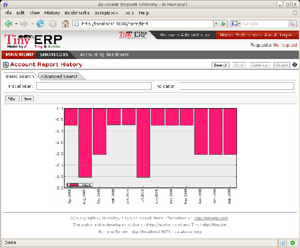
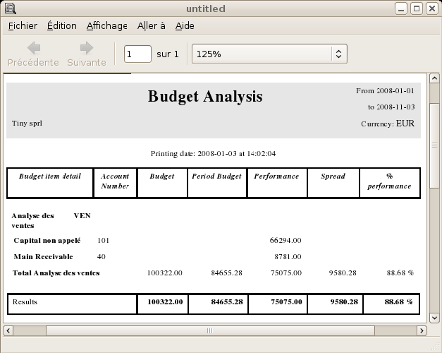
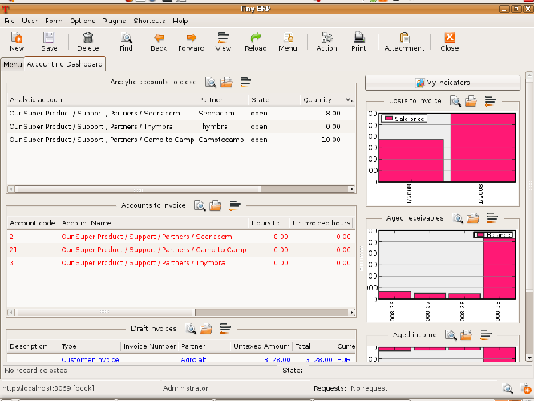

.. index::
  single: Financial Analysis
..

Company Financial Analysis
==========================

You'll see here the analysis tools for your company's financial situation, in particular:

* management indicators,

* budgets,

* the accounting dashboard.

.. index:: Indicators

Management Indicators
---------------------

.. tip::   **Terminology**  *Financial Indicators* 

	Indicators, sometimes called financial ratios, are tools for analyzing a company's finances. They enable you to compare two accounts or sets of accounts from the balance sheet or the profit and loss account, in the form of a ratio. They also let you measure the financial health of a company and make comparisons from one year to the next or against those of other companies.

To define accounting indicators in Open ERP you should install the module \ ``account_report``\  . When installing the module the usual financial indicators are registered in Open ERP.

You can consult your indicators, calculated in real time, from the menu  *Financial Management > Reporting > Custom Reports* .

Indicators defined by default in Open ERP are the following:

*  *Indicators of Working Capital* : determines if the company can pay its short term debts in normal conditions. It's calculated from \ ``(Stocks + Cash + Current Assets) / Current Liabilities``\  .

*  *Financial Ratios* : enables you to calculate the company's liquidity. It is defined as follows: \ ``( Current Assets – Stocks) / Current Liabilities``\  . 

*  *Fixed Assets* : in a going concern, the value of fixed assets are covered in the first place by owners' capital and in the second place by all of the long term liabilities. Ideally this indicator will be greater than 1.

.. tip::   **Advice**  *Calculation of indicators* 

	Calculating indicators can take quite a while in Open ERP because you have to analyze the whole company's accounting entries.

	So it's best not to calculate all of the indicators at once, but just a small selection to keep calculation time within limits.

Time analysis of indicators
^^^^^^^^^^^^^^^^^^^^^^^^^^^

You can analyze the financial indicators along two axes. You must have a figure calculated at a particular instant of time when you compare accounts, balances and the ratios between them. But you can also calculate a time series to follow the change of a given indicator throughout the life of the company.

To do a temporal analysis of your indicators, you must install the module \ ``account_report_history``\   from the set of modules in extra_addons.

Once this module is installed, you can click on a financial indicator to get a graph of its evolution in time.

*History of an accounting indicator.*

Defining your own indicators
^^^^^^^^^^^^^^^^^^^^^^^^^^^^

You can define your own indicators in Open ERP using the menu  *Financial Management > Configuration > Custom Reporting > New Reporting Item Formula* .

.. image::  images/account_indicator_new.png
	:align: center

*Defining a new indicator.*

You should make sure that the accounts that you base indicators on are given unique account codes, because codes are used in the creation of formulae. Create a formula using the syntax indicated in the instructions at the bottom of the form:

* Sum of debits in a general account: \ ``debit('12345')``\  ,

* Sum of credits in a general account: \ ``credit('12345')``\  ,

* Balance of a general account: \ ``balance('12345')``\  ,

* Value of another indicator: \ ``report ('IND')``\  .

where:

* \ ``12345``\   represents the code of a general account,

* \ ``IND``\   represents the code of another indicator.

So, using this notation, the cash ratio is defined by \ ``balance('4', '5') / balance('1')``\   – that's the balance in accounts 4 and 5 divided by the balance in account 1.

.. index::
  single: Budgeting
..

Good management budgeting
-------------------------

Open ERP manages its budgets using both General and Analytic Accounts. You'll see how to do this here for General Accounts and then in Chapter 9 for Analytical Accounts.

Use the menu  *Financial Management > Configuration > Budgets > General Budgets*  to define a new budget.

.. index::
   single: Budget Revisions

.. tip::   **Advice**  *Budget Revisions* 

	Even though you can modify a budget at any time to make a revision of it, it's best if you don't do that.

	Rather than edit an existing budget document, make a new version so that you can keep your original estimates safe for comparison. This enables you to analyze your changing perspectives of the company from revision to revision.

Begin data entry by entering a  *Code*  and a  *Name*  in the first tab of your new budget. The budget  *Direction*  can be for \ ``Products``\   or \ ``Charges``\   – choose one. Then, in the second tab,  *Dotations/Expenses* , you can define the charges per period. For each period you can define a quantity and/or an amount spent in the default currency of the chart of accounts.

It's also possible to automatically create the different income and expenses over the periods of a single fiscal year. To do that, click  *Spread*  on the second tab. A window then opens requesting the fiscal year over which you want to budget, and the total quantities and amounts for that year. If you want your budget to cover several years, repeat this operation several times.

Once the charges have been generated you can modify them manually to revise the charges period by period. Once the amounts have been assigned over the period, you must specify the accounts for creating this budget on the third tab,  *Accounts* . 

To do this, click  *Add*  and make multiple selections for the different accounts to be represented in the budget. Once the three tabs are completed you can save your budget.

.. tip::   **Reminder**  *Multiple selection* 

	You can select several elements (accounts, partners, etc) at the same time from a list. In the web client, click the checkbox alongside their name in the list view. In the GTK client, click on each element with the mouse, while holding the Ctrl button down.

*Printing a budget.*

To print a budget and make calculations of expenditure to budget use the menu  *Financial Management > Reporting > Print Budgets* . Open ERP then gives you a list of available budgets. Select one or more budgets and then click  *Print*  to configure the report. The following figure gives an example of a budget produced by Open ERP.

The Accounting Dashboard
------------------------

*Accounting Dashboard*

If you've installed the module \ ``board_account``\  , Open ERP gives you an accounting dashboard that can be presented to your accounting staff as they sign into the system (if you have set it as their Home Page). This dashboard provides an analysis of the company's financial health at a glance.

This gives a description of the different parts of the dashboard, from top to bottom then from left to right:

*  *Analytic accounts to close* : when you're managing cases each analytical account is a project or a contract. This area gives the accounts that must be closed (for example, contracts expired, support hours exceeded).

*  *Accounts to invoice* : shows analytical accounts where there are charges to be invoiced.

*  *Draft invoices* : gives the list of invoices waiting to be approved by an accountant.

*  *Costs to invoice* : gives the weekly change which can be, but haven't yet been, invoiced.

*  *Aged receivables* : gives a weekly graph of the receivables that haven't yet been reconciled.

*  *Aged revenues* : gives a weekly graph of the company's turnover.

In each panel of the accountants' dashboard you can click the  *Zoom*  button at the top right to investigate the detail of your financial indicators

The Accounting dashboard is dynamically integrated, which means that you can navigate easily through the data if you want more detail about certain factors, and edit the entries if necessary.

.. Copyright © Open Object Press. All rights reserved.

.. You may take electronic copy of this publication and distribute it if you don't
.. change the content. You can also print a copy to be read by yourself only.

.. We have contracts with different publishers in different countries to sell and
.. distribute paper or electronic based versions of this book (translated or not)
.. in bookstores. This helps to distribute and promote the Open ERP product. It
.. also helps us to create incentives to pay contributors and authors using author
.. rights of these sales.

.. Due to this, grants to translate, modify or sell this book are strictly
.. forbidden, unless Tiny SPRL (representing Open Object Presses) gives you a
.. written authorisation for this.

.. Many of the designations used by manufacturers and suppliers to distinguish their
.. products are claimed as trademarks. Where those designations appear in this book,
.. and Open ERP Press was aware of a trademark claim, the designations have been
.. printed in initial capitals.

.. While every precaution has been taken in the preparation of this book, the publisher
.. and the authors assume no responsibility for errors or omissions, or for damages
.. resulting from the use of the information contained herein.

.. Published by Open ERP Press, Grand Rosière, Belgium
