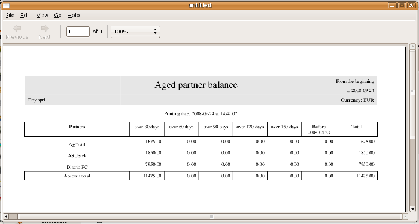
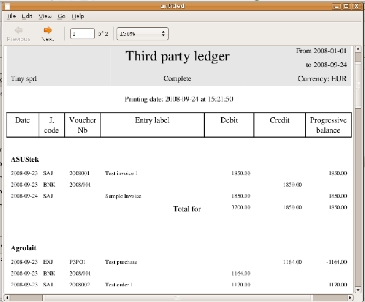
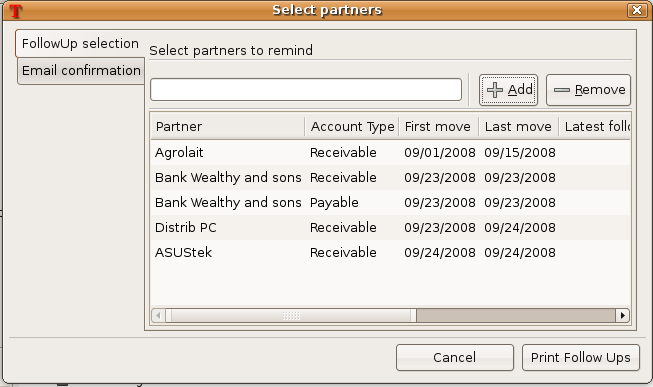
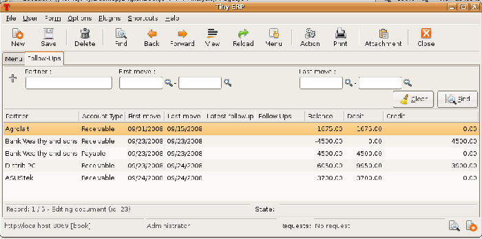

.. index::
   single: Payable
   single: Receivable
   single: Creditors
   single: Debtors

Managing accounts payable / creditors and accounts receivable / debtors
=======================================================================

Open ERP provides numerous tools for managing customer and supplier accounts. You'll see here:

* financial analysis of partners, to understand the reports that enable you to carry out an analysis of all of your partners,

* multi-level reminders, which is an automatic system for preparing reminder letters or emails when invoices remain unpaid,

* detailed analysis of individual partners.

Financial analysis of partners
------------------------------

When members of your accounts department sign on to the Open ERP system, they're immediately presented with the  *Accounting Dashboard.*  By default it contains a useful graph for analyzing Receivables. To get access to it, install the module \ ``board_account``\  . Then look at it using the menu  *Dashboards > Accounting > Accounting Dashboard* .

.. image::  images/account _board.png
	:align: center

*Accounting Dashboard.*

.. index:: Balance; Aged

In the dashboard, the graph at the right entitled  *Aged Receivables*  represents your receivables week by week. That shows you at a glance the cumulative amount of your customer debtors by week.

All of Open ERP's graphs are dynamic. So you can, for example, filter the data by clicking  *Zoom*  and then  *Filter*  on the Search form. Or just click on  *Zoom*  to open in a larger window for a graph, then click  *Search*  to display this in a list view.

To obtain a more detailed report of the aged balance (or order by past date) use the menu  *Finance > Accounting > Reporting > Partner Accounts > Aged Partner balance* . 

*Aged balance using a 30 day period.*

When opening that report, Open ERP asks for the name of the company, the fiscal period and the size of the interval to be analyzed (in days). Open ERP then calculates a table of credit balance by period. So if you request an interval of 30 days Open ERP generates an analysis of creditors for the past month, past two months, and so on.

For an analysis by partner you can use the partner balance that you get through the menu  *Financial Management > Reporting > Partner Accounts > Partner balance* . The system then supplies you with a PDF report containing one line per partner representing the cumulative credit balance. 

.. image::  images/account_partner_balance.png
	:align: center

.. index:: Ledger

*Partner balances.*

If you want detailed information about a partner you can use the partner ledgers that you reach through the menu  *Financial Management > Reporting > Partner Accounts > Partner Ledger* .

*Partner ledger.*

Finally you can look up individual account entries by searching for useful information. To search for account entries:

* by journal, go through the menu  *Financial Management > Entries > Entries by journal* ,

* by account, go through the menu  *Financial Management > Charts > Chart of Accounts*  and double-click the appropriate account,

* by making a global search, go through the menu  *Financial Management > Entries > Search Entries* 

* by partner, do it by right-clicking on the Partner field in any form that shows it, or by using the buttons to the right of the partner form.

.. tip::   **Advantage**  *Exporting entries* 

	It's helpful to remember that you can export all types of resource in Open ERP. From the web client you need to navigate to a search list for the resource then click the Export link at the bottom left of the list. From the GTK client you'd use the menu Form > Export. This enables you to easily make your own analysis in Microsoft Excel or OpenOffice.org Calc, by exporting accounting entries.
	
.. index::
  single: Follow-ups
..

.. index:: Reminders

Multi-step follow-ups
---------------------

To automate the management of followups (reminders) you must install the module \ ``account_followup``\  . This is installed automatically as part of the accounting profile, but is not part of the other profiles.

Once the module is installed configure your levels of followup using the menu  *Financial Management > Configuration > Payment Terms > Follow-Ups* .

The levels of follow-up are relative to the date of creation of an invoice and not the due date. This enables you to put payment conditions such as 'payable in 21 days' and send a reminder in 30 days, or the converse.

For each level you should define the number of days and create a note which will automatically be added into the reminder letter. The sequence determines the order of the level in ascending order.

.. csv-table::  **Example of configuring followup levels**
   :header: "Sequence","Level","Days","Description"
   :widths: 5, 5, 15, 15
   
   "1","Level 1","30 days net","First payment reminder"
   "2","Level 2","45 days net","Second reminder"
   "3","Level 3","60 days from end of month","Put on notice"

You can send your reminders by mail and/or email with the menu  *Financial Management > Periodic Handling > Send Follow-Ups* .

*Form for preparing follow-up letters.*

Open ERP presents you with a list of partners who are due reminders, which you can modify before starting the procedure. On the second tab of the form you can supply the information you'll send in the email reminder.

The system then gives you a PDF report with all of the reminder letters for each partner. Each letter is produced in the language of the partner (if that's available) and you can therefore get letters in several languages in the same PDF on several pages.

To analyze the due date of customers and/or suppliers before starting the reminder procedure, use the submenus of  *Financial Management > Periodical Processing > Send Follow-Ups* :

*  *Receivable entries* ,

*  *Payable entries* .

So you obtain the list of unreconciled entries in Receivable and Payable type accounts. You can then modify the date and the last follow-up and the level of reminder for each entry.

To obtain a detailed report per partner use the menu  *Financial Management > Reporting > Follow-Ups* .

The different reports are classic Open ERP screens, so you can filter them and explore the elements in detail. 

*Summary screen for follow-ups.*

.. index::
   single: Overdue payments

Partner situation
-----------------

In daily use of Open ERP a senior manager will often need to search quickly for financial information amongst partner data. For this she can use the buttons to the right of form when she opens a partner form, to go directly to:

* a follow-up letter from the  *Overdue payments*  Report button,

* the list of  *Open Invoices* ,

* a shortcut to  *All account entries* ,

* the unclosed CRM requests from  *Open cases* ,

* a shortcut to the unreconciled  *Receivables and Payables* .

These links are also available to her when she right-clicks the mouse on a partner field on any form.

The  *Overdue payments*  report produces a PDF document which is used for follow-up but it doesn't modify any of the partner's accounting entries. It's use doesn't increase the follow-up level so you can use this report repeatedly without any problem.

In Open ERP you can search for a partner on the basis of the value of its trade receivables. So search for partners with a credit amount between 1 and 99999999 and you'll get a list of partners that owe you payment. You can then select the whole list and print follow-up letters for them all.

To the right of the partner form there's a shortcut to  *Open invoices* . This link includes all of the invoices defined in the systems, namely:

* customer invoices,

* supplier invoices,

* credit notes,

* supplier credit notes.

.. tip::   **Advice**  *Reminders from accounting entries* 

	Companies that do not have computerized records tend to keep track of payments from invoices and paperwork and not from a formal partner account

	It's better to create reminder letters from a partner's account receivable than from unpaid bills, however. By using the Open ERP system you can easily take account of all advances, unreconciled payments, credit notes and credit payments.

	So it's better to send a letter based on the accounting entries of invoices and unreconciled payments than just on a list of unpaid invoices.

In the links appearing on the partner form, two buttons enable the opening of partner accounting entries:

*  *All account entries* ,

*  *Receivables & Payables* .

The first button is useful for obtaining a historical analysis of the customer or supplier. You can get information about such significant items as sales volume and payment delays. The second button is a filter which shows only the open trade credits and debits for the partner.

Finally, keep in mind that all of the functions on the partner form are accessible from any Open ERP document by right-clicking with the mouse on a Partner field. This is extremely useful for gaining rapid access to information from any screen.

.. Copyright © Open Object Press. All rights reserved.

.. You may take electronic copy of this publication and distribute it if you don't
.. change the content. You can also print a copy to be read by yourself only.

.. We have contracts with different publishers in different countries to sell and
.. distribute paper or electronic based versions of this book (translated or not)
.. in bookstores. This helps to distribute and promote the Open ERP product. It
.. also helps us to create incentives to pay contributors and authors using author
.. rights of these sales.

.. Due to this, grants to translate, modify or sell this book are strictly
.. forbidden, unless Tiny SPRL (representing Open Object Presses) gives you a
.. written authorisation for this.

.. Many of the designations used by manufacturers and suppliers to distinguish their
.. products are claimed as trademarks. Where those designations appear in this book,
.. and Open ERP Press was aware of a trademark claim, the designations have been
.. printed in initial capitals.

.. While every precaution has been taken in the preparation of this book, the publisher
.. and the authors assume no responsibility for errors or omissions, or for damages
.. resulting from the use of the information contained herein.

.. Published by Open ERP Press, Grand Rosière, Belgium
