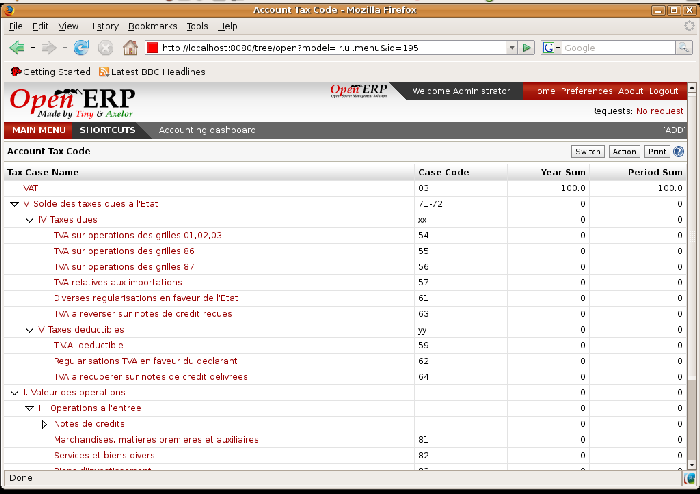

Statutory taxes and accounts
============================

This section deals with statutory taxes and accounts which are legally required from the company:

* the taxation structure provided by Open ERP,

* the accounts ledgers,

* account balance (used to produce the income statement and balance sheet),

* the different journals (general, centralized and detailed),

* the tax declaration.

.. tip::   **A step further**  *Other declarations* 

	In addition to the legal declarations available in the accounts modules, Open ERP supplies declarations based on the functionality in other modules.

	You can, for example, install the ``report_intrastat`` module for intra-stat declarations about sending goods to and receiving goods from other countries.

.. index:: Tax

Taxation
--------

You can attach taxes to financial transactions so that you can 

* add taxes to the amount that you pay or get paid,

* report on the taxes in various categories that you should pay the tax authorities,

* track taxes in your general accounts,

* manage the payment and refund of taxes using the same mechanisms that Open ERP uses for other monetary transactions. 

Since the detailed tax structure is a mechanism for carrying out governments' policies, and the collecting of taxes so critical to their tax authorities, tax requirements and reporting can be complex. Open ERP has a flexible mechanism for handling taxation that can be configured through its GUI or through data import mechanisms to meet the requirements of many various tax jurisdictions.

The taxation mechanism can also be used to handle other tax-like financial transactions, such as royalties to authors based on the value of transactions through an account.

Setting up a tax structure
^^^^^^^^^^^^^^^^^^^^^^^^^^

Three main objects are involved in the tax system in Open ERP:

* a  *Tax Case*  (or  *Tax Code* ), used for tax reporting, that can be set up in a hierarchical structure so that multiple codes can be formed into trees in the same way as a Chart of Accounts.

* a  *Tax* , the basic tax object that contains the rules for calculating tax on the financial transaction it's attached to, and is linked to the General Accounts and to the Tax Cases. A tax can contain multiple child taxes and base its calculation on those taxes rather than the base transaction, providing considerable flexibility. Each tax belongs to a  *Tax Group*  (currently just \ ``VAT``\   or \ ``Other``\  ).

* the  *General Accounts* , that record the taxes owing and paid. Since the general accounts are discussed elsewhere in this part of the book and are not tax-specific, they won't be detailed in this section.

You can attach zero or more  *Supplier Tax* es and Customer taxes to products, so that you can account separately for purchase and sales taxes (or Input and Output VAT – where VAT is Value Added Tax). Because you can attach more than one tax, you can handle a VAT or Sales Tax separately from an Eco Tax on the same product.

You can also attach a  *Default Tax*  to a partner, which replaces any taxes belonging to the same Tax Group that may have been defined in a Product. 

So you can define a \ ``Tax Exempt``\   tax in the \ ``VAT``\   group and assign it to partners who declare themselves to be charities. All product sales to a charity would then be VAT free even if the products themselves carry various tax rates, but non-VAT taxes such as Eco-taxes can still be applied.

Tax Cases
^^^^^^^^^

Tax Cases are also known in Open ERP as Tax Codes. They're used for tax reporting, and can be set up in a hierarchical structure to form trees in the same way as a Chart of Accounts.

To create a new Tax Case, use the menu  *Financial Management > Configuration > Taxes > Tax Codes* . You define the following fields:

*  *Tax Case Name* : a unique name required to identify the Case,

*  *Company* : a required link that attaches the Case to a specific company, such as the Main Company,

*  *Case Code* : a short code for the case,

*  *Parent Code* : a link to a parent Tax Case that forms the basis of the tree structure like a Chart of Accounts,

*  *Sign for Parent* : choose 1.00 to add the total to the parent account or -1.00 to subtract it,

*  *Description* : a free text field for documentation purposes.

You can also see two read-only fields:

*  *Year Sum* : a single figure showing the total accumulated on this case for the financial year.

*  *Period Sum* : a single figure showing the total accumulated on this case for the current financial period (perhaps 1 month or 3 months).

You will probably need to create two tax cases for each different tax rate that you have to define, one for the tax itself and one for the invoice amount that the tax is based on. And you'll create tax cases that you won't link to Tax objects (similar to General Account \ ``View``\   types) just to organize the tree structure.

To view the structure that you've constructed you can use the menu  *Financial Management > Periodical Processing > Taxes* . This tree view reflects the structure of the Tax Cases and shows the current tax situation.

Tax objects
^^^^^^^^^^^

Tax objects calculate tax on the financial transactions that they're attached to, and are linked to the General Accounts and to the Tax Cases. 

To create a new Tax Case, use the menu  *Financial Management > Configuration > Taxes > Taxes* . You define the following fields:

*  *Tax Name* : a unique name required for this tax (such as \ ``12% Sales VAT``\  ),

*  *Company* : a required link to a company associated with the tax, such as the Main Company,

*  *Tax Group* : \ ``VAT``\   or \ ``Other``\  , used to determine which taxes on products can be substituted by taxes on partners,

*  *Tax Type* : a required field directing how to calculate the tax: \ ``Percent``\  , \ ``Fixed``\  , \ ``None``\   or \ ``Python Code``\  , (the latter is found in the  *Compute Code*  field in the  *Special Computation*  tab),

*  *Applicable Type* : a required field that indicates whether the base amount should be used unchanged (when the value is \ ``True``\  ) or whether it should be processed by Python Code in the  *Applicable Code*  field in the  *Special Computation*  tab when the value is \ ``Code``\  ),

*  *Amount* : a required field whose meaning depends on the Tax Type, being a multiplier on the base amount when the  *Tax Type*  is \ ``Percent``\  , and a fixed amount added to the base amount when the  *Tax Type*  is \ ``Fixed``\  ,

*  *Include in base amount* : when checked, the tax is added to the base amount and not shown separately,

*  *Domain* : is only used in special developments, not in the core Open ERP system,

*  *Invoice Tax Account* :a General Account used to record invoiced tax amounts, which may be the same for several taxes or split so that one tax is allocated to one account,

*  *Refund Tax Account* : a General Account used to record invoiced tax refunds, which may be the same as the Invoice Tax Account or, in some tax jurisdictions, must be separated,

*  *Tax on childs* : when checked, the tax calculation is applied to the output from other tax calculations specified in the  *Childs Tax Account* field (so you can have taxes on taxes), otherwise the calculation is applied to the base amount on the transaction,

*  *Childs Tax Account* : other tax accounts that can be used to supply the figure for taxation.

.. tip::   **Note**  *Using Child Taxes* 

	You can use child taxes when you have a complex tax situation that you want to hide your end users from. For example, you might define a motor mileage expenses product with a composite tax made up of two child taxes – a non-reclaimable private element and a reclaimable tax element (which is the case in some European countries). 

	When your staff come to claim motor mileage, they do not need to know about this taxation, but the accounting impact of their claim will be automatically managed in Open ERP.

The fields above apply the taxes that you specify and record them in the general accounts but don't provide you with the documentation that your tax authorities might need. For this use the Tax Declaration tab to define which Tax Cases should be used for this tax:

*  *Invoices/Base Code* : tax case to record the invoiced amount that the tax is based on,

*  *Invoices/Tax Code* : tax case to record the invoiced tax amount

*  *Refund Invoices/Base Code* : tax case to record the refund invoice amount that the tax is based on,

*  *Refund Invoices/Tax Code* : tax case to record the refund invoice tax amount.

Use of Taxes on Products, Partners, Projects and Accounts
^^^^^^^^^^^^^^^^^^^^^^^^^^^^^^^^^^^^^^^^^^^^^^^^^^^^^^^^^

When you've created a tax structure consisting of Tax Cases and Tax objects, you can use the taxes in your various business objects so that financial transactions can be associated with taxes and tax-like charges. 

.. tip::   **Advice**  *Retail Customers* 

	When you're retailing to end users rather than selling to a business, you may want to (or be required to) show tax-inclusive prices on your invoicing documents rather than a tax-exclusive price plus tax. 

	To do this in Open ERP just install the ``account_tax_include`` module. Each invoice is given a new Price method field, in which you choose Tax included or Tax excluded. Prices are then displayed appropriately.

You can assign a tax to a Partner so that it overrides any tax defined in a Product. You'd do this, for example, if a partner was a charity and paid a lower or zero rate of VAT or Sales Tax on its purchases. Assuming that you have an appropriate Charities VAT or Sales Tax in the \ ``VAT``\   *Tax Group* , use the menu  *Partners > Partners* to open and edit a Partner form for the charity, then:

* select the  *Properties*  tab,

* set the  *Default Tax*  field to the \ ``Charities VAT``\   tax.

You can assign multiple taxes to a Product. Assuming you have set up the appropriate taxes, you would use the menu  *Products > Products*  to open and edit a Product definition, then:

* select one or more  *Customer Taxes*  for any products that you might sell, which may include a \ ``Sales Tax``\   or \ ``Output VAT``\  , and a \ ``Sales Eco Tax``\  ,

* select one or more  *Supplier Taxes*  for any products that you might purchase, which may include a \ ``Purchase Tax``\   or \ ``Input VAT``\  , and a \ ``Purchase Eco Tax``\  .

Generally, when you make a purchase or sale, the taxes assigned to the product are used to calculate the taxes owing or owed. But when you make a transaction with a partner that has a  *Default Tax*  defined, for example a sale to a charity with \ ``Charities ``\  \ ``Tax``\  , that tax will be used in place of other Product taxes in the same group – in this case replacing the standard \ ``Sales Tax``\   or \ ``Output VAT``\  .

You can also assign multiple taxes to a Project, so that invoices from the Project carry an appropriate rate of tax (project invoicing is dealt with in detail in a later chapter).

.. tip::   **A step further**  *Tax regions* 

	The third-party module ``import_export`` can be used to extend Open ERP's tax system, so that you can assign taxes to different accounts depending on the location of the Partner. The Partner is given a new Partner Location field that can be set to Local, Europeor Outside, so that taxes and tax bases can be channeled to different accounts. 

	This module could be the basis of more ambitious location-based tax accounting.

And you can assign multiple taxes to an account so that when you transfer money through the account you attract a tax amount. In such a case, this 'tax' may not be legally-required taxation but something tax-like, for example authors' royalties or sales commission.

.. index::
   single: Balance sheet

The accounts ledgers and the balance sheet
------------------------------------------

To print the balance of accounts or the accounts ledgers you should turn to the Chart of Accounts. To do that go to the menu  *Financial Management > Charts > Charts of Accounts* .

Select the accounting period you're interested in and click  *Open Charts* , then select one or several accounts for analysis by clicking and highlighting the appropriate line(s). Click the  *Print*  button and Open ERP asks you to select either the  *General Ledger* , the  *Account balance* , or an  *Analytic check* . If you select an account which has sub-accounts in the hierarchy you can automatically analyze that account and its child accounts.

.. tip::   **Advantage**  *Simulated balance* 

	While you're printing account balances, if you have installed the ``account_simulation`` module Open ERP asks you which level of simulation to execute.

	Results will vary depending on the level selected. You can, for example, print the balance depending on various methods of amortization:

	* the normal IFRS method,

	* the French method.

	More generally it enables you to make analyses using other simulation levels that you could expect..

The \ ``account_reporting``\ module was developed toprovide configurable reports for balance sheets or earnings statement in legally required formats.

.. index:: Journal

The accounting journals
-----------------------

To obtain the different journals use the menu  *Financial Management > Reporting > Printing Journals* .

.. tip::   **Terminology**  *Journals* 

	Note there are different types of journal in Open ERP

	* accounting journals (detailed in this chapter),

	* purchase journals (for distributing supplies provided or on certain dates),

	* sales journals (for example classifying sales by their type of trade),

	* the invoice journals (to classify sales by mode of invoicing: daily / weekly / monthly) and automating the tasks.

	To obtain these different journals install the modules ``sale_journal`` (found at the time of writing in ``addons``, so available in a standard installation) and ``purchase_journal`` (found in ``addons-extra`` at the time of writing, so needing special installation).

Then select one or several journals and click  *Print* . Open ERP then proposes the three following reports:

* detailed accounting entries,

* general journal,

* journal grouped by account.

*Printing a journal.*

Tax declaration
---------------

Information required for a tax declaration is automatically generated by Open ERP from invoices. In the section on invoicing you'll have seen that you can get details of tax information from the area at the bottom left of an invoice.

You can also get the information from the accounting entries in the columns to the right.

Open ERP keeps a tax chart that you can reach from the menu  *Financial Management > Periodical Processing > Taxes* . The structure of the chart is for calculating the tax declaration but also all the other taxes can be calculated (such as the French DEEE).

.. index::
   single: TVA

*Example of a Belgian TVA (VAT) declaration.*

The tax chart represents the amount of each area of the tax declaration for your country. It's presented in a hierarchical structure which lets you see the detail only of what interests you and hides the less interesting subtotals. This structure can be altered as you wish to fit your needs.

You can create several tax charts if your company is subject to different types of tax or tax-like accounts, such as:

* authors' rights,

* ecotaxes such as the French DEEE for recycling electrical equipment.

Each accounting entry can then be linked to one of the tax accounts. This association is done automatically by the taxes which had previously been configured in the invoice lines.

.. tip::   **Advantage**  *Tax declaration* 

	Some accounting software manages the tax declaration in a dedicated general account. The declaration is then limited to the balance in the specified period. In Open ERP you can create an independent chart of taxes, which has several advantages: 

	* it's possible to allocate only a part of the tax transaction

	* it's not necessary to manage several different general accounts depending on the type of sale and type of tax

	* you can restructure your chart of taxes as you need

At any time you can check your chart of taxes for a given period using the report:  *Financial Management > Reporting > Taxes Report* .

This data is updated in real time. That's very useful because it enables you at any time to preview the tax that you owe at the start and end of the month or quarter.

Furthermore, for your tax declaration you can click on one of the tax accounts to investigate the detailed entries that make up the full amount. This helps you search for errors such as when you've coded an invoice at full tax rate where it should be zero-rated for an inter-community trade or for a charity.

In some countries, tax can be calculated on the basis of payments received rather than invoices sent. In this instance choose  *Base on* \ ``Payments``\   instead of  *Base on* \ ``Invoices``\   in the  *Select period*  form. Even if you make your declaration on the basis of invoices sent and received it can be interesting to compare the two reports to see the amount of tax that you pay but haven't yet received from your customers.

.. Copyright © Open Object Press. All rights reserved.

.. You may take electronic copy of this publication and distribute it if you don't
.. change the content. You can also print a copy to be read by yourself only.

.. We have contracts with different publishers in different countries to sell and
.. distribute paper or electronic based versions of this book (translated or not)
.. in bookstores. This helps to distribute and promote the Open ERP product. It
.. also helps us to create incentives to pay contributors and authors using author
.. rights of these sales.

.. Due to this, grants to translate, modify or sell this book are strictly
.. forbidden, unless Tiny SPRL (representing Open Object Presses) gives you a
.. written authorisation for this.

.. Many of the designations used by manufacturers and suppliers to distinguish their
.. products are claimed as trademarks. Where those designations appear in this book,
.. and Open ERP Press was aware of a trademark claim, the designations have been
.. printed in initial capitals.

.. While every precaution has been taken in the preparation of this book, the publisher
.. and the authors assume no responsibility for errors or omissions, or for damages
.. resulting from the use of the information contained herein.

.. Published by Open ERP Press, Grand Rosière, Belgium
