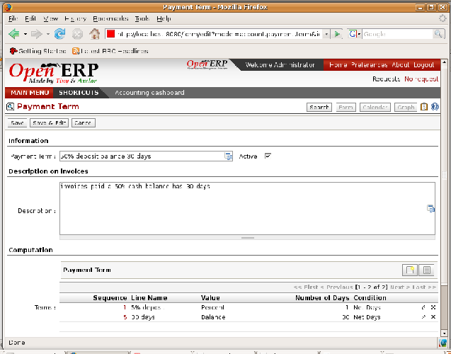

.. index:: Payment Terms

Payment Terms
=============

You can define whatever payment terms you need in Open ERP. Payment terms determine the due dates for paying an invoice.

To define new payment terms, use the menu  *Financial Management > Configuration > Payment Terms > Payment Terms* .

The figure below represents the following payment term: 35% on delivery, the balance 15 days after the end of the month.

*Configuring payment terms.*

To configure new conditions start by giving a name to the  *Payment Term*  field. Text that you put in the field  *Description*  is used on invoices, so enter a clear description of the payment terms there.

Then create individual lines for calculating the terms in the section  *Payment Term* . You must give each line a name ( *Line Name* ). These give an informative title and don't affect the actual calculation of terms. The  *Sequence*  field lets you define the order in which the rules are evaluated.

The  *Value*  field enables you to calculate the amount to pay for each line:

* \ ``Percent``\  : the line corresponds to a percentage of the total amount, the factor being given in Amount. The number indicated in the Amount must take a value between 0 and 1.

* \ ``Fixed amount``\  : this is a fixed value given by the  *Amount*  box.

* \ ``Balance``\  : indicates the balance remaining after accounting for the other lines.

Think carefully about setting the last line of the calculation to \ ``Balance``\   to avoid rounding errors. The highest sequence number is evaluated last.

The two last fields,  *Number of Days*  and  *Condition* , enable the calculation of the delay in payment for each line, The delay  *Condition*  can be set to \ ``Net Days``\   or \ ``End of Month``\  . For example if you set it to 15 days from the end of the month Open ERP adds 15 days to today's date and then sets the payment date to be the end of the month that the new date is in. So the payment date for 15 days from month end will be:

* 31 January if today is 5 January,

* 28 February if today is 20 January.

You can then add payment terms to a Partner through the  *Properties*  on the partner form.

.. Copyright © Open Object Press. All rights reserved.

.. You may take electronic copy of this publication and distribute it if you don't
.. change the content. You can also print a copy to be read by yourself only.

.. We have contracts with different publishers in different countries to sell and
.. distribute paper or electronic based versions of this book (translated or not)
.. in bookstores. This helps to distribute and promote the Open ERP product. It
.. also helps us to create incentives to pay contributors and authors using author
.. rights of these sales.

.. Due to this, grants to translate, modify or sell this book are strictly
.. forbidden, unless Tiny SPRL (representing Open Object Presses) gives you a
.. written authorisation for this.

.. Many of the designations used by manufacturers and suppliers to distinguish their
.. products are claimed as trademarks. Where those designations appear in this book,
.. and Open ERP Press was aware of a trademark claim, the designations have been
.. printed in initial capitals.

.. While every precaution has been taken in the preparation of this book, the publisher
.. and the authors assume no responsibility for errors or omissions, or for damages
.. resulting from the use of the information contained herein.

.. Published by Open ERP Press, Grand Rosière, Belgium
