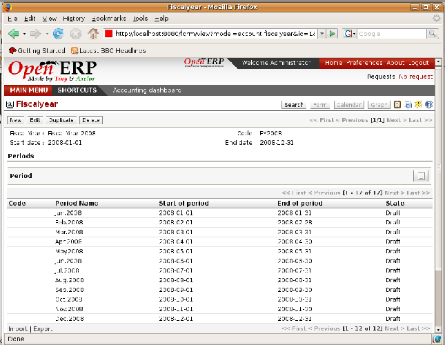
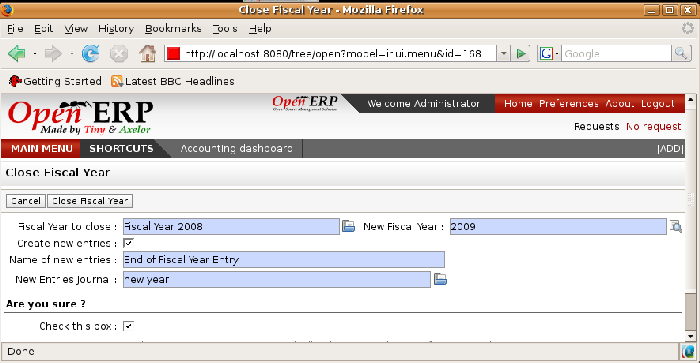

Periods and fiscal years
========================

.. tip::   **Terminology**  *Periods and fiscal years* 

	A fiscal year corresponds to twelve months for a company. In many countries, the fiscal year corresponds to a calendar year but that's not the case in others.

	The fiscal year is divided into monthly or three-monthly accounting periods.

Open ERP's management of the fiscal year is flexible enough to enable you to work on several years at the same time. This gives you several advantages, such as creating three-year budgets, and states straddling several calendar years.

.. index:: Period
.. index:: Fiscal Year

Defining a period or a fiscal year
----------------------------------

To define your fiscal year use the menu  *Financial Management > Configuration > Periods > Fiscal Year* . You can create several years in advance to define long-term budgets. 

*Defining a financial year and periods.*

First enter the date of the first day of your fiscal year and the last day. Then to create the periods click one of the two buttons at the bottom depending on whether you want to create twelve 1-month or four 3-month periods:

*  *Create monthly periods* ,

*  *Create 3-monthly periods* .

Closing the end of the year
---------------------------

To close the end the year, use the following menu:  *Financial Management > End of year processing > Close a Fiscal Year* . A form opens asking you for the essential information it needs to create entries to start the following year.

When the year is closed you can no longer create or modify any financial transactions in that year. So you should always make a backup of the database before closing the fiscal year. Closing a year isn't obligatory and you could easily do that sometime in the following year when your accounts are finally sent to the statutory authorities, and no further modifications are permitted.

*Closing a financial year.*

It's also possible to close an accounting period. You could for example close a monthly period when a tax declaration has been made. When a period is closed you can't modify any of the entries in that period. To close an accounting period use the menu  *Financial Management > End of Year Processing > Close a Period* .

.. Copyright © Open Object Press. All rights reserved.

.. You may take electronic copy of this publication and distribute it if you don't
.. change the content. You can also print a copy to be read by yourself only.

.. We have contracts with different publishers in different countries to sell and
.. distribute paper or electronic based versions of this book (translated or not)
.. in bookstores. This helps to distribute and promote the Open ERP product. It
.. also helps us to create incentives to pay contributors and authors using author
.. rights of these sales.

.. Due to this, grants to translate, modify or sell this book are strictly
.. forbidden, unless Tiny SPRL (representing Open Object Presses) gives you a
.. written authorisation for this.

.. Many of the designations used by manufacturers and suppliers to distinguish their
.. products are claimed as trademarks. Where those designations appear in this book,
.. and Open ERP Press was aware of a trademark claim, the designations have been
.. printed in initial capitals.

.. While every precaution has been taken in the preparation of this book, the publisher
.. and the authors assume no responsibility for errors or omissions, or for damages
.. resulting from the use of the information contained herein.

.. Published by Open ERP Press, Grand Rosière, Belgium
