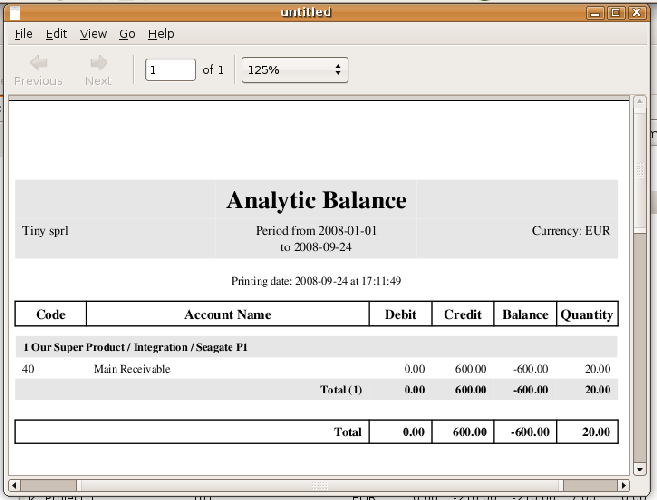
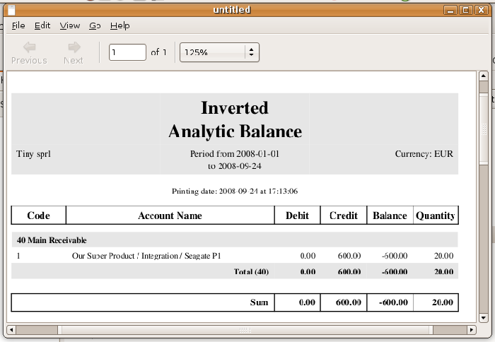
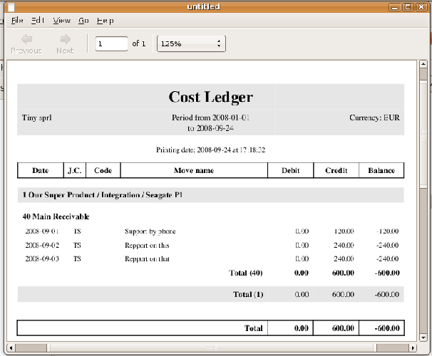
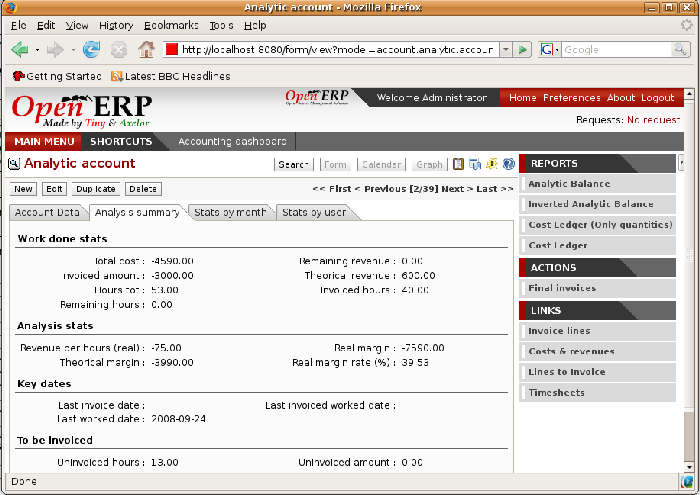
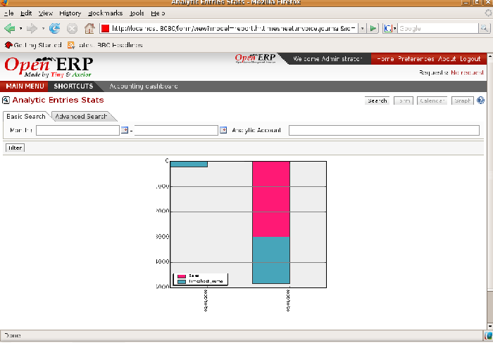
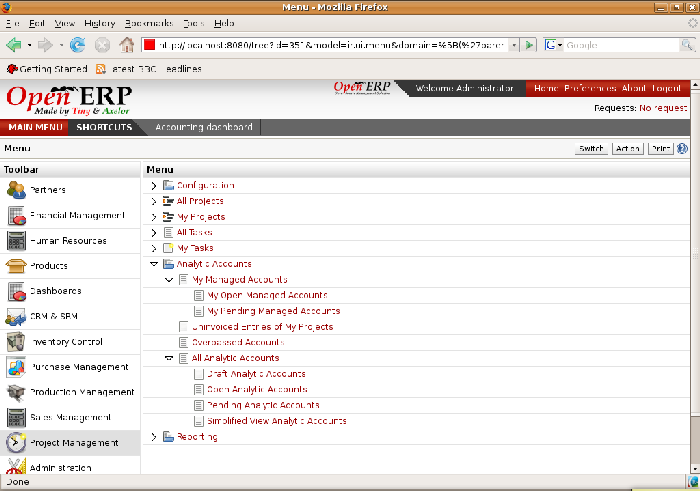

Financial Analysis
===================

Various reports designed for financial analysis are based on the analytic accounts. Most of those are available directly from the tree of accounts or from the form view of the account.

Analysis per account
---------------------

From an analytic form, click on the *Print* button to select a report. Open ERP proposes the following financial analyses:

*  *Analytic Balance* ,

*  *Inverted Analytic Balance* ,

*  *Cost Ledger* , 

*  *Cost Ledger (quantities only)* .

.. index::
   single: Balance; Analytic
   single: Analytic Balance

Analytic Balance
^^^^^^^^^^^^^^^^^

*The analytic balance presents the breakdown of each project by the nature of the operations given by the financial accounts.*

The analytic balance is a report that relates the analytic accounts to the general accounts. It gives, for a given period, the balances of the analytic accounts broken down by general account.

This report is useful for analyzing the profitability of projects. It gives you the profitability of a project for the different operations that you used to carry out the project.

Inverted Analytic Balance
^^^^^^^^^^^^^^^^^^^^^^^^^^^

The inverted analytic balance provides a similar report relating the general accounts and the analytic accounts. This report shows, for a given period, the balances of the general accounts broken down by the selected analytic accounts.

*The inverted analytic balance indicates the breakdown of operations by the nature of the different the analytic accounts (projects).*

This enables you to analyze your costs by general account. For example, if you examine your general account for staff salaries you can obtain all your salary costs broken down by the different analytic (or project) accounts.

.. index::
   single: Cost ledger; Analytic

The cost ledger
^^^^^^^^^^^^^^^^^

While the two reports above provide results summed by account, the cost ledger provides all of the detailed entries for the selected accounts. It enables a detailed analysis of each operation carried out on one or several projects.

*The analytic cost ledger gives a detailed history of the entries in an analytic account.*

The cost ledger (quantities only)
^^^^^^^^^^^^^^^^^^^^^^^^^^^^^^^^^^^

The last report gives the detail of entries for an analytic account and a list of selected journals. Only quantities are reported for this analysis, not costs and revenues. 

	.. image::  images/analytic_cost_ledger_quantity.png
	   :align: center

*The cost ledger (quantities only) gives a history of an analytic account.*

The report is frequently used to print the number of hours worked on a project, without showing the costs and revenues. So you can show it to a client as a record of the hours worked on a particular project.

To restrict the report to hours worked, without including sales and purchases, select only the services journal to print the report.

.. tip::   **Note**  *Multiple printing* 

	To print several analytic accounts at once you can make a multiple selection on the different account in the tree of accounts. For that select account lines using the Ctrl-Click keyboard and mouse combination.

	Then click on Print in the tree or list view to export the whole selection into a single PDF document.

.. index::
   single: Multi-company

.. tip::   **Note**  *Multi-company* 

	In a multi-company environment each company can have its own general chart of accounts on the same database. The two general charts of accounts are then independent but can be linked in a third chart using a view account to do the consolidation.

	If the different companies collaborate on joint projects they may all share the same analytic chart of accounts. In this environment, the cross-related reports like the balance and inverted balance are extremely useful because they enable you to make an analysis per company by linking up to the general accounts.

Key indicators
---------------

If you use analytic accounts with a structure of accounts by project client you should install the \ ``account_analytic_analysis``\   module. This module adds three new tabs to the analytic account form:

* management indicators in the  *Analysis summary*  tab,

* monthly statistics in the  *Stats by month*  tab,

* statistics on each user in the  *Stats by user*  tab.

*Management indicators for an analytic account.*

The figure shows all of the management indicators.

These indicators enable you to quickly see the following elements:

* project profitability,

* whether you can still invoice any services to the client, or not,

* the amount of services to invoice,

* the different margins.

*Breakdown of monthly costs for an analytic account.*

The real revenue is given by the amount invoiced to the client. The theoretical revenue is given by the sale price of different project costs which could be invoiced to the client. These give different margin figures.

For example, in the case of a fixed price project contract, the real sale price at the end of the project will be equal to the contract negotiated with the client. The theoretical price gives the amount that would have been invoiced if you had charged for all the time worked.

To give project managers a direct view of their different projects, the \ ``account_analytic_analysis``\   module creates new menus in the Project management module in  *Project Management > Analytic Accounts* .

*Analytic accounts in Project Management.*

These different menus give quick views that are very useful for live projects. For each project you can check if there are uninvoiced services, and see the last invoice date and the last uninvoiced service date, and reports on the amounts received and those planned. Project managers have therefore all the information necessary to manage their project well, shown in a single page.

In the following chapters you'll see how each project manager can use this information to carry out the different operations needed to manage the project, such as automatic invoicing, project planning, keeping customers up to date, and budgeting for resources.

.. tip::   **A step further**  *Analytic Budgets* 

	There's been no discussion of analytic budgets in this section because at the time this book was being prepared, the module that handles them was being completely rewritten.

	Nevertheless, it's worth trying them because they offer the possibility of:

	* forecasting projects in the medium term,

	* controlling project costs,

	* comparing with the general accounts.

.. Copyright © Open Object Press. All rights reserved.

.. You may take electronic copy of this publication and distribute it if you don't
.. change the content. You can also print a copy to be read by yourself only.

.. We have contracts with different publishers in different countries to sell and
.. distribute paper or electronic based versions of this book (translated or not)
.. in bookstores. This helps to distribute and promote the Open ERP product. It
.. also helps us to create incentives to pay contributors and authors using author
.. rights of these sales.

.. Due to this, grants to translate, modify or sell this book are strictly
.. forbidden, unless Tiny SPRL (representing Open Object Presses) gives you a
.. written authorisation for this.

.. Many of the designations used by manufacturers and suppliers to distinguish their
.. products are claimed as trademarks. Where those designations appear in this book,
.. and Open ERP Press was aware of a trademark claim, the designations have been
.. printed in initial capitals.

.. While every precaution has been taken in the preparation of this book, the publisher
.. and the authors assume no responsibility for errors or omissions, or for damages
.. resulting from the use of the information contained herein.

.. Published by Open ERP Press, Grand Rosière, Belgium

