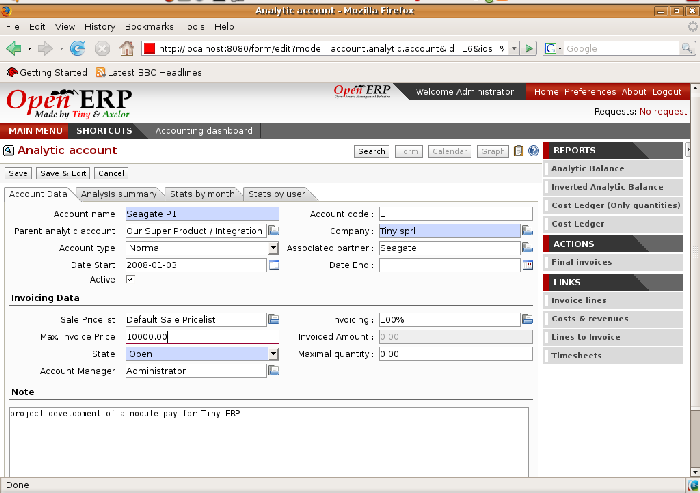
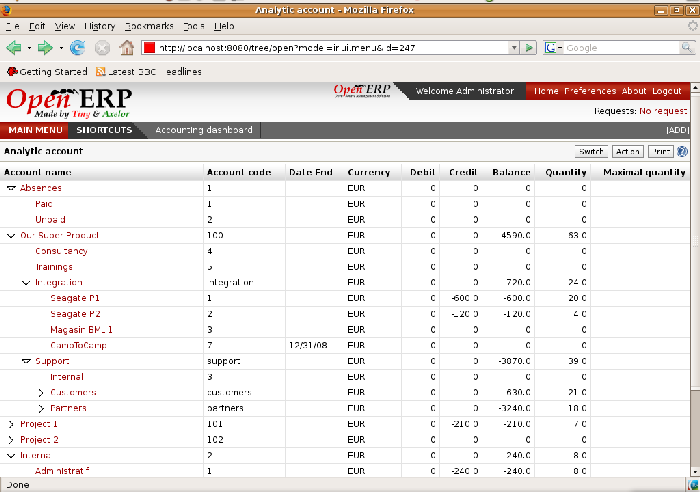
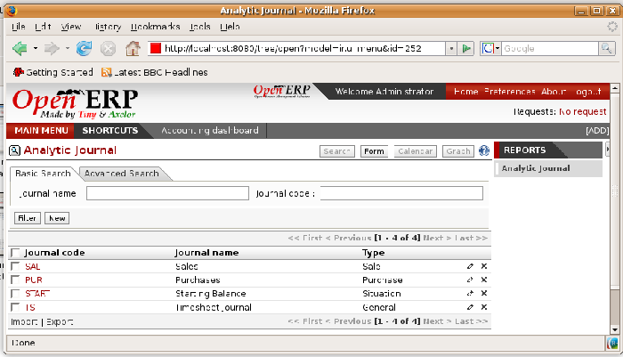

.. index::
   single: Analytic accounts

Putting analytic accounts in place
===================================

For the initial setup of good analytic accounts you should:

* set up the chart of accounts,

* create the different journals.

Setting up the chart of accounts
---------------------------------

Start by choosing the most suitable analytic representation for your company before entering it into Open ERP. To create the different analytic accounts, use the menu  *Financial Management > Configuration > Analytic Accounts > Analytic Accounts* .

*Setting up an analytic account.*

To create an analytic account you have to complete the main fields:

* the  *Account Name* ,

* the  *Account Code* , which is used as a shortcut for selecting the account,

* the  *Account type* , just like general accounts the \ ``View``\   type is used for virtual accounts which are used only to create a hierarchical structure and for subtotals, and not to store accounting entries,

* the  *Parent analytic account* , which defines the hierarchy between the accounts.

If the project is for a limited time you can define a start and end date here. The  *State*  field is used to indicate whether the project is running (\ ``Open``\  ), waiting for information from the client (Pending), \ ``Draft``\   or \ ``Closed``\  .

Finally, if the analytic account is a client project you can complete the fields about the partner, which you'd need so that you can invoice the partner:

* the  *Associated partner* ,

* a  *Sale Pricelist* , which shows how services linked to the project should be charged,

* a  *Max. Invoice Price* , showing the maximum invoice price regardless of actual overspend,

* a  *Max. Quantity* , for contracts with a fixed limit of hours to use,

* an  *Invoicing*  field, which defines an invoicing rate and whether the project should be invoiced automatically from the services represented by the costs in the analytic account.

.. index::
   single: Invoicing

.. tip::   **Methods**  *Invoicing* 

	You have several methods available to you in Open ERP for automated invoicing:

	* Service companies usually use invoicing from purchase orders, analytic accounts or, more rarely, project management tasks.

	* Manufacturing and trading companies more often use invoicing from deliveries or customer purchase orders.

*Example of an analytic chart for projects.*

Once you've defined the different analytic accounts you can view your chart through the menu  *Financial Management > Charts > Analytic Charts of Accounts* .

.. tip::   **Technique**  *Setting up an analytic account* 

	The setup screen for an analytic account can vary greatly depending on the modules installed in your database. For example, you'll only see information about recharging services if you have the module ``hr_timesheet_invoice`` installed.

	Some of these modules add helpful management statistics to the analytic account. The most useful is probably the module ``account_analytic_analysis``, which adds such information as indicators about your margins, invoicing amounts, and latest service dates and invoice dates.

Creating Journals
-------------------

Once the analytic chart has been created for your company you have to create the different journals. These enable you to categorize the different accounting entries by their type:

* services,

* expense reimbursements,

* purchases of materials,

* miscellaneous expenditure,

* sales,

* situation entries (special situations, such as installation of the software).

.. index::
   single: Journal; Minimal journals

.. tip::   **Attention**  *Minimal journals* 

	At a minimum you have to create one analytic journal for Sales and one for Purchases. If you don't create these two, Open ERP won't validate invoices linked to an analytic account because it wouldn't be able to create an analytic accounting entry automatically.

*Creating an analytic journal.*

To define your analytic journals, use the menu  *Financial Management > Configuration > Journal > Analytic Journal Definition* .

It's easy to create an analytic journal. Just give it a  *Name* , a  *Code*  and a  *Type* . The types available are:

* \ ``Sales``\  , for sales to customers and for credit notes,

* \ ``Purchases``\  , for purchases and miscellaneous expenses,

* \ ``Cash``\  , for financial entries,

* \ ``Situation``\  , to adjust accounts when starting an activity, or at the end of the financial year,

* \ ``General``\  , for all other entries.

The type of journal enables the software to automatically select the analytic journal based on the nature of the operation. For example if you enter an invoice for a customer, Open ERP will automatically search for an analytic journal of type \ ``Sales``\  .

.. Copyright © Open Object Press. All rights reserved.

.. You may take electronic copy of this publication and distribute it if you don't
.. change the content. You can also print a copy to be read by yourself only.

.. We have contracts with different publishers in different countries to sell and
.. distribute paper or electronic based versions of this book (translated or not)
.. in bookstores. This helps to distribute and promote the Open ERP product. It
.. also helps us to create incentives to pay contributors and authors using author
.. rights of these sales.

.. Due to this, grants to translate, modify or sell this book are strictly
.. forbidden, unless Tiny SPRL (representing Open Object Presses) gives you a
.. written authorisation for this.

.. Many of the designations used by manufacturers and suppliers to distinguish their
.. products are claimed as trademarks. Where those designations appear in this book,
.. and Open ERP Press was aware of a trademark claim, the designations have been
.. printed in initial capitals.

.. While every precaution has been taken in the preparation of this book, the publisher
.. and the authors assume no responsibility for errors or omissions, or for damages
.. resulting from the use of the information contained herein.

.. Published by Open ERP Press, Grand Rosière, Belgium

