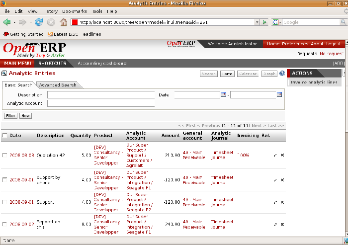

.. index::
   single: Analytic records
.. 

Analytic records
=================

Just as in general accounting, analytic entries must belong to an account and an analytic journal.

Analytic records can be distinguished from general records by the following characteristics:

* they're not necessarily legal accounting documents,

* they don't necessarily belong to an existing accounting period,

* they're managed according to their date and not an accounting period,

* they don't generate both a debit and a credit entry, but a positive amount (income) or a negative amount (cost).

*Analytic account records for a customer project.*

The figure represents the entries on an analytic account for a customer project.

You can see there:

* the service costs for staff working on the project,

* the costs for reimbursing the expenses of a return journey to the customer,

* purchases of goods that have been delivered to the customer,

* sales for recharging these costs.

Automated entries
-------------------

Analytic accounting is totally integrated with the other Open ERP modules, so you never have to re-enter the records. They're automatically generated by the following operations:

* confirmation of an invoice generates analytic entries for sales or purchases connected to the account shown in the invoice line,

* the entry of a service generates an analytic entry for the cost of this service to the given project,

* the manufacture of a product generates an entry for the manufacturing cost of each operation in the product range.

Other documents linked to one of these three operations produce analytic records indirectly. For example, when you're entering a customer sales order you can link it to the customer's analytic account. When you're managing by case or project, mark the project with that order. This order will then generate a customer invoice, which will be linked to the analytic account. When the invoice is validated it will automatically create general and analytic accounting records for the corresponding project.

Expense receipts from an employee can be linked to an analytic account for reimbursement. When a receipt is approved by the company, a purchase invoice is created. This invoice represents a debit on the company in favor of the employee. Each line of the purchase invoice is then linked to an analytic account which automatically allocates the costs for that receipt to the corresponding project.

To visualize the general entries following these different actions you can use one of the following menus:

	#. To see all of the entries:  *Financial Management > Entries > Analytic Entries > Analytic Entries* 

	#. To see the entries per account, click the  *Analytic Account * ield of any of the lines of Analytic Entries to see the details of that entry, then use the analytic  *Account name* to start a search of all entries with that name (just click the Date hyperlink on a line in the web client, or double-click the line in the GTK client).

	#. To see all of the entries by Journal:  *Financial Management > Entries > Analytic Entries > Entries by journal*  and then click on one of the journal names.

.. tip::   **Note**  *Reviewing a hierarchical account* 

	In the chart of analytic accounts, if you click on an account Open ERP opens a window showing the corresponding analytic entries. 

	It was intended that if you do that on a View-type account Open ERP opens all of the entries belonging to its child accounts. That can be very useful for opening entries belonging to several accounts, such as all project clients.

Manual record entry
---------------------

Even though most analytic entries are produced automatically by the other Open ERP documents it's sometimes necessary to make manual record entries. It's usually needed for certain analytic operations that have no counterpart in the general accounts.

To make manual record entries, use the menu  *Financial Management > Entries > Analytic Entries > Entries by journal* .

.. index::
   single: Analytic entries

.. tip::   **Comment**  *Analytic entries* 

	To make an analytic entry, Open ERP asks you to specify a general account. This is given only for information in the different cross-reports. It won't create any new entries in the general accounts.

Select a journal and complete the different fields. Write an expense as a negative figure and income as a positive figure.

.. tip::   **Note**  *Entering a date* 

	To enter a date in the editable list you can use the calendar widget in the web client or, in the GTK client, if you enter just the day of the month Open ERP automatically completes the month and year when you press the tab key (Tab).

	.. note::  *Example Cost redistribution* 

		For example 
		
					One of the uses of manual data entry for analytic operations is reallocation of costs. For example, if a development has been done for a given project but can be used again for another project you can reallocate part of the cost to the other project.
		
					In this case, make a positive entry on the first account and a negative entry for the same amount on the account of the second project.

.. Copyright © Open Object Press. All rights reserved.

.. You may take electronic copy of this publication and distribute it if you don't
.. change the content. You can also print a copy to be read by yourself only.

.. We have contracts with different publishers in different countries to sell and
.. distribute paper or electronic based versions of this book (translated or not)
.. in bookstores. This helps to distribute and promote the Open ERP product. It
.. also helps us to create incentives to pay contributors and authors using author
.. rights of these sales.

.. Due to this, grants to translate, modify or sell this book are strictly
.. forbidden, unless Tiny SPRL (representing Open Object Presses) gives you a
.. written authorisation for this.

.. Many of the designations used by manufacturers and suppliers to distinguish their
.. products are claimed as trademarks. Where those designations appear in this book,
.. and Open ERP Press was aware of a trademark claim, the designations have been
.. printed in initial capitals.

.. While every precaution has been taken in the preparation of this book, the publisher
.. and the authors assume no responsibility for errors or omissions, or for damages
.. resulting from the use of the information contained herein.

.. Published by Open ERP Press, Grand Rosière, Belgium

