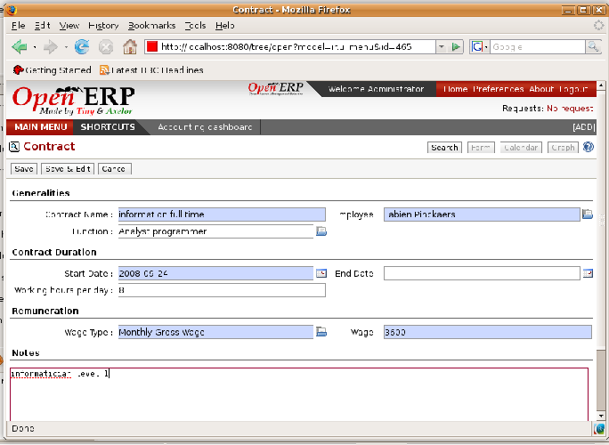

.. index::
   single: Human Resources; Management
   single: Employee
.. 

Managing Human Resources
=========================

To establish a system that's integrated into a company's management you need to start with an up to date list of collaborators.

.. tip::   *Don't confuse* 

	For Open ERP, “employee” represents all of the physical people who have an work contract with the company. This includes all types of contract: contracts with both fixed and indeterminate time periods, and also independent and freelance service contracts.

	A “user” is a physical person who's given access to the company's systems. Most employees are users but some users aren't employees: external partners can have access to parts of the system. You can manage them through the ``portal`` modules.

Here are some examples of functions which depend on the list of employees:

* the cost of a service, which depends on the employee's working contract,

* project planning, which depends on the work pattern of the project contributors,

* the client billing rate, which depends on the employee's job function,

* the chain of command, or responsibilities, which is related to the hierarchical structure of the company.

Management of staff
---------------------

To define a new employee in Open ERP, use the menu  *Human Resources > Employees > New Employee* .

*Form describing an employee.*

Start by entering the employee's  *Name*  and the company that this employee works for ( *Company* ). You can then create a new user of the Open ERP system which is linked to this employee by filling in the  *Username*  field. Even if the employee isn't a user, it's best if you create a system access for most of your staff just so that you can control their access rights from the outset.

.. tip::   *Advice* 

	If the employee has a user account on the system you shouldn't forget to link his or her user account to the employee form.

	Creating this link enables automatic completion to be done on the Employee field in the relevant forms, such as services and expense records.

Then enter the employee's address. This appears in the partner contact form in Open ERP. Since employees are people that your company has contacts with, it's logical that they have entries just like any other partner in your database. So enter the name of the employee as a new partner Name and the address in the Contact form. Then all of the functions that apply to a partner can also be applied to an employee. This becomes particularly useful because you can track debits and credits in the accounts – so you can track salary payments, for example.

It's then possible to indicate both an analytic journal and a linked product to this employee. If you do it that way, then this information can be used to track services. For now, just complete the form with the following information:

*  *Analytic Journal* 

*  *Product* 

Then type in the following information about the employee's working contract:

*  * per week* 

*  *Number of holidays* 

*  *Started on* 

*  *Boss* 

*  *Category* 

*  *Employee's work team* 

*Timesheet category for full time 38 hours per week.*

The different timesheet categories can be defined in the menu  *Human Resources > Configuration > Timesheet Categories* .

Management of employment contracts
-----------------------------------

\ ``hr_contract``\   *Contracts* 

*Definition of a working contract for a given employee.*

You can enter information about the employment contract for the employee there.

*  *Contract Name* 

*  *Function* 

*  *Working hours per day* 

*  *Start Date* 

*  *End Date* 

*  *Wage*  *Wage Type*  *Monthly Gross*  *Weekly Net* 

.. index::
   single: Employee; Sign in and out
.. 

Sign in and out
-----------------

In some companies, staff have to sign in when they arrive at work and sign out again at the end of the day. If each employee has been linked to a system user, then they can sign in on Open ERP by using the menu  *Human Resources > Attendances > Sign in / Out* .

If an employee has forgotten to sign out on leaving, the system proposes that they sign out manually and type in the time that they left when they come in again the next day. The gives you a simple way of managing forgotten sign-outs.

 *Human Resources > Employees* 

To get the detail of attendances from an employee's form in Open ERP you can use the three available reports:

*  *Print Timesheet by week* 

*  *Print Timesheet by month* 

*  *Print Attendance Error Report* 

The last report, about managing changes, can show you whether an employee has entered the time of entry or exit manually. It shows the difference between the expected sign out time and the time entered by the employee at sign out. This enables you to easily discover people who are systematically misrepresenting their attendances.

.. Copyright © Open Object Press. All rights reserved.

.. You may take electronic copy of this publication and distribute it if you don't
.. change the content. You can also print a copy to be read by yourself only.

.. We have contracts with different publishers in different countries to sell and
.. distribute paper or electronic based versions of this book (translated or not)
.. in bookstores. This helps to distribute and promote the Open ERP product. It
.. also helps us to create incentives to pay contributors and authors using author
.. rights of these sales.

.. Due to this, grants to translate, modify or sell this book are strictly
.. forbidden, unless Tiny SPRL (representing Open Object Presses) gives you a
.. written authorisation for this.

.. Many of the designations used by manufacturers and suppliers to distinguish their
.. products are claimed as trademarks. Where those designations appear in this book,
.. and Open ERP Press was aware of a trademark claim, the designations have been
.. printed in initial capitals.

.. While every precaution has been taken in the preparation of this book, the publisher
.. and the authors assume no responsibility for errors or omissions, or for damages
.. resulting from the use of the information contained herein.

.. Published by Open ERP Press, Grand Rosière, Belgium

