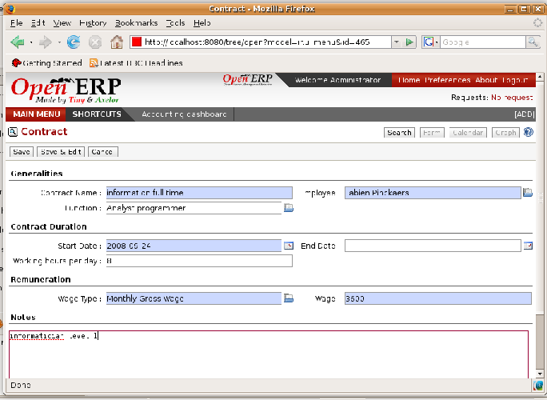

.. index::
   single: Human Resources; Management
   single: Employee
..

Managing Human Resources
========================

To establish a system that's integrated into a company's management you need to start with a
current list of collaborators.

.. note:: Don't confuse employees and users

	For Open ERP, “employee” represents all of the physical people who have an work contract with
	the company. This includes all types of contract: contracts with both fixed and indeterminate time
	periods, and also independent and freelance service contracts.
	
	.. index::
	   pair: modules; portal_	

	A “user” is a physical person who's given access to the company's systems. Most employees are
	users but some users aren't employees: external partners can have access to parts of the system.
	You can manage them through the :mod:`portal_` modules.

Here are some examples of functions which depend on the accuracy of the employee list:

* the cost of a service, which depends on the employee's working contract,

* project planning, which depends on the work pattern of the project contributors,

* the client billing rate, which probably depends on the employee's job function,

* the chain of command, or responsibilities, which is related to the hierarchical structure of the
  company.

Management of staff
-------------------

To define a new employee in Open ERP, use the menu :menuselection:`Human Resources --> Employees
--> New Employee`.

.. figure::  images/service_employee_form.png
   :scale: 50
   :align: center

   *Form describing an employee*

Start by entering the employee's name in :guilabel:`Employee` and the company that this employee works for
in :guilabel:`Company`. You can then create a new user of the Open ERP system linked to this
employee by filling in a new :guilabel:`User` form through the :guilabel:`Related User` field. 

Even if the employee isn't a user, it's best if you
create a system access for most of your staff just so that you can control their access rights from
the outset (and you can do that through this field if you need to).

.. tip:: Employee and User link.

	If the employee has a user account on the system you always link his or her user
	account to the employee form.

	Creating this link enables automatic completion to be done on the :guilabel:`Employee` field in the
	relevant forms, such as services and expense records.

Then enter the employee's address. 

.. todo:: We need to give better guidance about Partners vs Employees just here.

This appears in the partner contact form in Open ERP. Since
employees are people that have contacts with your company, it's logical that they have entries
like any other partner in your database. So enter the name of the employee as a new partner Name and
the address in the Contact form. Then all of the functions that apply to a partner can also be
applied to an employee. This is particularly useful for tracking debits and credits in
the accounts – so you can track salary payments, for example.

You can then set both an analytic journal and a linked product to this employee
in the :guilabel:`Timesheets` tab. If
you do it that way, then this information can be used to track services. For now, just complete the
form with the following information:

*  :guilabel:`Analytic Journal` : usually a ``Timesheet Journal``,

*  :guilabel:`Product` : a service product that describes how this employee would be charged out,
   for example as ``Senior Consultant``.

Management of employment contracts
----------------------------------

If you install the :mod:`hr_contract` module you can link contract details to the employee record.

   *Definition of a working contract for a given employee*

You can enter information about the employment contract for the employee, such as:

*  :guilabel:`Contract Name`

*  :guilabel:`Function`

*  :guilabel:`Working hours per day`

*  :guilabel:`Start Date`

*  :guilabel:`End Date`

*  :guilabel:`Wage Type` either :guilabel:`Monthly Gross` or :guilabel:`Weekly Net`

.. index::
   single: Employee; Sign in and out
..

Sign in and out
---------------

In some companies, staff have to sign in when they arrive at work and sign out again at the end of
the day. If each employee has been linked to a system user, then they can sign in on Open ERP by
using the menu :menuselection:`Human Resources --> Attendances --> Sign in / Sign out`.

If an employee has forgotten to sign out on leaving, the system proposes that they sign out manually
and type in the time that they left when they come in again the next day. This gives you a simple way
of managing forgotten sign-outs.

Find employee attendance details from their forms in 
:menuselection:`Human Resources --> Employees --> All Employees`.

To get the detail of attendances from an employee's form in Open ERP you can use the three
available reports:

*  :guilabel:`Print Attendance Error Report`

*  :guilabel:`Print Timesheet by week`

*  :guilabel:`Print Timesheet by month`

The first report highlights errors in attendance data entry. 
It shows you whether an employee has entered the time of
entry or exit manually and the differences between the actual and expected sign out time and the time.

The others are reports using the data recorded.

.. Copyright © Open Object Press. All rights reserved.

.. You may take electronic copy of this publication and distribute it if you don't
.. change the content. You can also print a copy to be read by yourself only.

.. We have contracts with different publishers in different countries to sell and
.. distribute paper or electronic based versions of this book (translated or not)
.. in bookstores. This helps to distribute and promote the Open ERP product. It
.. also helps us to create incentives to pay contributors and authors using author
.. rights of these sales.

.. Due to this, grants to translate, modify or sell this book are strictly
.. forbidden, unless Tiny SPRL (representing Open Object Press) gives you a
.. written authorisation for this.

.. Many of the designations used by manufacturers and suppliers to distinguish their
.. products are claimed as trademarks. Where those designations appear in this book,
.. and Open Object Press was aware of a trademark claim, the designations have been
.. printed in initial capitals.

.. While every precaution has been taken in the preparation of this book, the publisher
.. and the authors assume no responsibility for errors or omissions, or for damages
.. resulting from the use of the information contained herein.

.. Published by Open Object Press, Grand Rosière, Belgium

