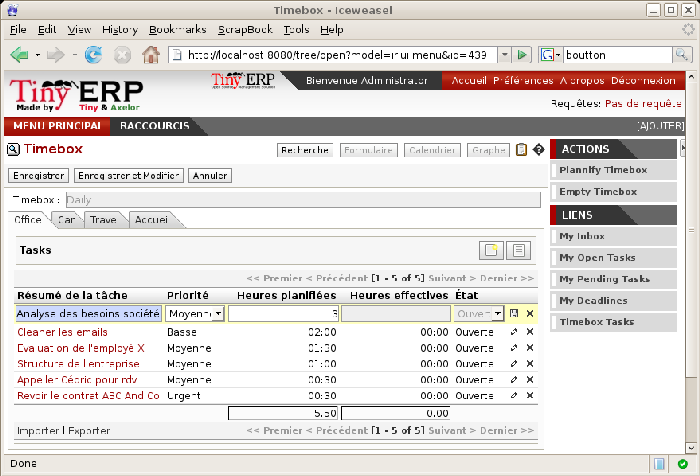

.. index:: GTD

The art of productivity without stress
=======================================

Now take a slight detour away from pure enterprise management by looking at some tools offered by Open ERP to improve your own personal time management. It's not much of a detour because good organization is the key to better productivity in your daily work.

Open ERP's \ ``project_gtd``\   module was inspired by the work of two books focusing on efficient time management:

* Getting Things Done – The Art of Stress-Free Productivity, by David Allen (2001), most often referred to by its initials GTD (trademark registered since 2005). This book is built around the principle that people should clearly write down all their outstanding tasks and store the details about these tasks in a trustworthy system.

 They then don't have to worry about holding all of this stuff in their head. Since they can be quite sure that it's recorded safely, they can allow themselves to relax and so have the energy and time to concentrate on handling the tasks themselves systematically. 

.. tip::   **References**  *Efficiently managing time* 

        David Allen, Getting Things Done, Penguin Books, New York, 2001, 267 pages. (ISBN : 978-0142000281). Also see the site: http://davidco.com

	Stephen R. Covey, The 7 Habits of Highly Effective People, Free Press, 1989, 15th Anniversary Edition : 2004, 384 pages. (ISBN : 978-0743269513).

.. tip::   **Note**  *De-stress yourself !* 

	Clear the tasks that clutter your thoughts by registering them in an organized system. This immediately helps you to de-stress yourself and organize your work in the best possible way.

	If you feel stressed by too much work, do the following exercise to convince yourself about the benefits. Take some sheets of blank paper and write down everything that passes through your head about the things you need to do. For each task, note the next action to do on an adjacent line, and rank it by the date that you'll commit yourself to doing it.

	At the end of the exercise you'll feel better organized, considerably de-stressed and remarkably free of worries !

* The 7 Habits of Highly Effective People by Stephen R. Covey (1989) : the author advises organizations on the use of these practices, and reports on the productivity improvements in the organization that result.

Our objective in this detour is not to detail the whole methodology but to describe the supporting tools provided by Open ERP's \ ``project_gtd``\   module.

Not everything that is urgent is necessarily important
-------------------------------------------------------

The first modification brought to the basic Open ERP system by the module is a separation of the concepts of urgency and importance. Tasks are no longer classified by a single criterion but by the product of the two criteria, enabling you to prioritize matters that are both urgent and important in a single list

Many managers with a heavy workload use urgency as their sole method of prioritization. The difficulty is then in working out how to plan for substantive tasks (like medium term objectives). These aren't urgent but are nevertheless very important.

	.. note::  *Example Distinction between urgency and importance* 

			If you're very well organized, urgent tasks can (and should often) be given lower precedence than important tasks. Take an example from daily life as an illustration: the case of having some time with your children.

			For most people this task is important. But if you have a busy professional life, the days and weeks flow on with endless urgent tasks to be resolved. Even if you manage your time well, you could let several months pass without spending time with your children because the task of seeing them is never as urgent as your other work, despite its importance.

In Open ERP urgency is given by the  *Deadline*  of the task and importance by the  *Priority* . The classification of the tasks then results from the product of the two factors. The most important tasks and the most urgent both appear at the top of the list.

Organizing your life systematically
-------------------------------------

A methodology of organizing yourself using the concepts of context and timebox is presented in this section.

Context
^^^^^^^^^

The context is determined by the work environment you must be in to deal with certain tasks. For example you could define the following contexts:

*  *Office* : for tasks which have to be dealt with at your workplace (such as telephone a customer, or write a document).

*  *House* : for tasks which have to happen at your private address (such as finding a cleaning contractor, or mowing the lawn).

*  *On the move* : for tasks that you need to do on the move (such as going shopping, or going to the post office).

*  *Traveling* : for tasks that you can handle on the plane or in the train while you're doing traveling on business (tasks such as writing an article, or analyzing a new product). 

An employee / system user can create his or her own contexts using the menu  *Project Management > Configuration > Time Management > Contexts* .

Timebox
^^^^^^^^^

You then have to define the timeboxes. You have to complete the tasks in the time interval specified by a timebox. You usually define timeboxes with the following periods:

*  *Day* : for tasks which must be handled today,

*  *Week* : for tasks that have to be dealt with this week,

*  *Month* : for tasks which have to be completed within the month,

*  *Long term* : for tasks that can be dealt with in more than one month.

A task can be put in one and only one timebox at a time. 

You should distinguish between a timebox and the deadline for completing a task because the deadline is usually fixed by the requirements of the project manager. A timebox, by contrast, is selected with reference to what an individual can do.

To define timeboxes for your company, use the menu  *Project Management > Configuration > Time Management > Timeboxes > My timeboxes* .

.. index:: Methodology; GTD

Methodology and iterative process
^^^^^^^^^^^^^^^^^^^^^^^^^^^^^^^^^^^

To organize your tasks efficiently, Open ERP uses a method based on the following systematic and iterative process:

	.. note::  *Method Iterative Process* 

		#. Identify all the tasks that you have to deal with, including everything that keeps you awake at night, and enter them in your Inbox, which you'll find in the menu Project Management > Time Management > Inbox.

		#. Classify the tasks in your Inbox periodically, assigning them a context and a timebox. This indicates both when and where the task should be handled. If a task takes less than 10 minutes then maybe it could be handled immediately.

		#. Every day, carry out the following process:

			* First thing in the morning, select those tasks contained in the current week's timebox that you want to deal with today. These are presented in order of importance and urgency, so you should select the tasks closest to the top of the list.

			* Carry out each task, that's to say either work on the task yourself or delegate it to another user,

			* Last thing at the end of the day's work, empty that day's timebox and return all unclosed tasks into the week's timebox.

		#. Repeat the same process each week and each month for the respective timeboxes.

.. index:: Agenda
.. index:: Timebox

.. tip::   **Don't confuse** *Agenda*  *and timebox* 

	The idea of timebox is independent from that of an agenda. Certain tasks, such as meetings, must be done on a precise date. So they can't be managed by the timebox system but by an agenda.

	The ideal is to put the minimum of things on the agenda and to put only tasks there that have a fixed date. The timebox system is more flexible and more efficient for dealing with multiple tasks.

So start by entering all the tasks required by project management. These could have been entered by another user and assigned to you. It's important to code in all of the tasks that are buzzing around in your head, just to get them off your mind. A task could be:

* work to be done,

* a short objective, medium or long term,

* a complex project that hasn't yet been broken into tasks.

A project or an objective over several days can be summarized in a single task. You don't have to detail each operation if the actions to be done are sufficiently clear to you.

You have to empty your Inbox periodically. To do that, use the menu  *Project Management > Time Management > My Inbox* . Assign a timebox and a context to each task. This operation shouldn't take more than a few minutes because you aren't dealing with the tasks themselves, just classifying them.

*Timebox for tasks to be done today.*

 *Project Management > Time Management > My timebox for the day* 

Then click on the button at the top right:  *Plan the timebox* . This procedure lets you select the tasks for the day from those in the timebox for the week. This operation gives you an overview of the medium term tasks and objectives and makes you review them there at least once a day. It's then that you'd decide to allocate a part of your time that day to certain tasks based on your priorities.

Since the tasks are sorted by priority, it's sufficient to take the first from the list, up to the number of hours in your day. That'll only take a minute, because the selection isn't taken from every task you know about in the future, but just from those selected for the current week. 

Once the timebox has been completed you can start your daily work on the tasks. For each task you can start work on it, delegate it, close it, or cancel it.

At the end of the day you empty the timebox using the button at the top right. All the tasks that haven't been done are sent back to the weekly timebox to sit in amongst the tasks that will be planned next morning.

Do the same each week and each month using the same principles, but just using the appropriate timeboxes for those periods.

Shortcuts to the right of the timebox help you use the system efficiently with:

* a direct link to the Inbox,

* the list of all of your open tasks,

* the list of your waiting tasks,

* your deadlines,

* a link to all of the tasks in the timebox.

Some convincing results
^^^^^^^^^^^^^^^^^^^^^^^^^

After a few days of carefully practicing this method, users have reported the following improvements:

* a reduction in the number of tasks and objectives that were forgotten,

* a reduction in stress because people felt more in control of their situation,

* a change of the priorities in the types of tasks carried out daily,

* more notice taken of the urgency and importance of tasks and objectives in the long-term organization of time,

* better management of task delegation and the selection of which tasks were better to delegate,

Finally, it's important to note this system is totally integrated with Open ERP's project management function. Staff can use the system or not depending on their own needs. The system is complementary to the project management function that handles team organization and company-wide planning.

.. Copyright © Open Object Press. All rights reserved.

.. You may take electronic copy of this publication and distribute it if you don't
.. change the content. You can also print a copy to be read by yourself only.

.. We have contracts with different publishers in different countries to sell and
.. distribute paper or electronic based versions of this book (translated or not)
.. in bookstores. This helps to distribute and promote the Open ERP product. It
.. also helps us to create incentives to pay contributors and authors using author
.. rights of these sales.

.. Due to this, grants to translate, modify or sell this book are strictly
.. forbidden, unless Tiny SPRL (representing Open Object Presses) gives you a
.. written authorisation for this.

.. Many of the designations used by manufacturers and suppliers to distinguish their
.. products are claimed as trademarks. Where those designations appear in this book,
.. and Open ERP Press was aware of a trademark claim, the designations have been
.. printed in initial capitals.

.. While every precaution has been taken in the preparation of this book, the publisher
.. and the authors assume no responsibility for errors or omissions, or for damages
.. resulting from the use of the information contained herein.

.. Published by Open ERP Press, Grand Rosière, Belgium

