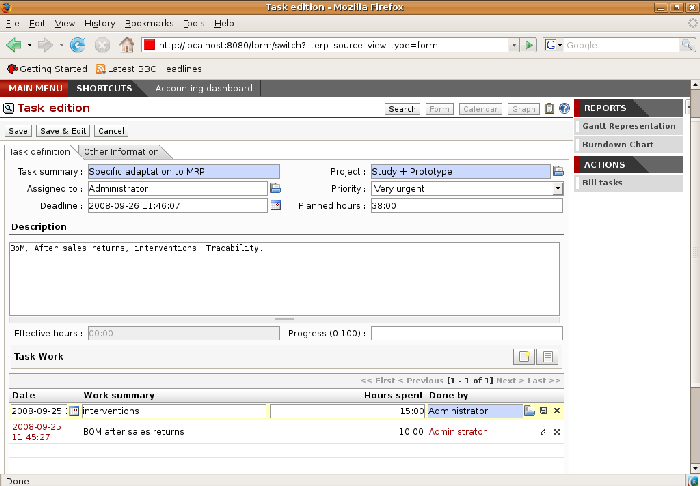
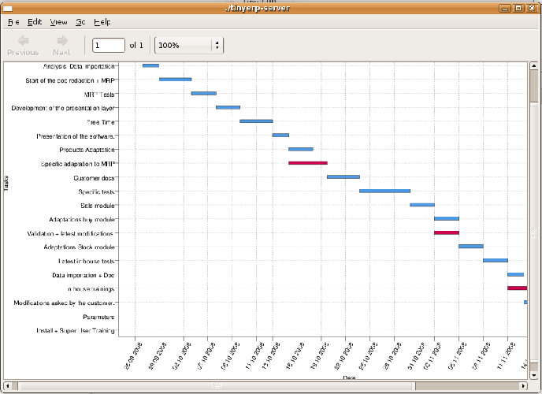
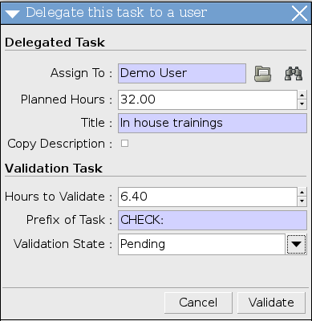

Project management
===================

In the previous chapter you dealt with the financial management of projects, which was based on Open ERP's analytic accounts, structured into cases. This way of working enables you to analyze time plans and budgets, to control invoicing, and to manage your different contracts.

In this chapter you can use operational project management to organize tasks and plan the work you need to get the tasks completed. All of the necessary operations are carried out through the menu  *Project Management* 

.. index::
   single: Project

.. tip::   **Terminology**  *Project* 

	In Open ERP a project is represented by a set of tasks for completion. Projects have a tree structure that can be divided into phases and sub-phases. This structure is very useful for work organization

	Whereas analytic accounts look at the past activities of the company, project management's role is to plan the future. Even when there's a close link between the two (such as where a project has been planned and then completed through Open ERP) they are still two different concepts, each making its own contribution to a flexible workflow.

Most client projects are represented by:

* one or several analytic accounts in the accounts system for tracking the contract and its different phases,

* one or several projects in project management for tracking the project and the different tasks to be completed.

Defining a project and its tasks
---------------------------------

To define a new project, go to the menu  *Project Management > Configuration > Projects*  and click  *New* .

 *Project Management > All projects* 

By checking the box  *Warn manager* , you configure the system to send the project manager an Open ERP request every time that a task is closed.

The status of a project can take the following values:

* \ ``Open``\  : while the project is being carried out,

* \ ``Pending``\  : while the project is paused,

* \ ``Canceled``\  : if the project has been canceled and therefore aborted,

* \ ``Done``\  : the project has been successfully completed.

 *Partner Info* 

If you check the box  *Warn customer* , you should define a page header and footer in that same tab for use in an email. Open ERP then prepares an email that the user can send to the client each time that a task is completed. The contents of this email are based on details of the project task, and can be modified by the user before the email is sent. 

.. tip::   **Note**  *Study of client satisfaction* 

	Some companies run a system where emails are automatically sent at the end of a task requesting the client to complete an online survey. This survey enables them to ask different questions about the work carried out, to gauge client satisfaction as the project progresses.

	This function can be used by companies certified to ISO 9001, to rate client satisfaction.

Once a project has been defined you can code in the tasks to be done. You've two possibilities for this:

*  *Tasks* 

* from the menu  *Project Management > All Tasks* , create a new task and assign it to an existing project.

Managing tasks
---------------

Each task contains one of the following statuses, depending on the state:

* \ ``Draft``\  : the task has been entered but hasn't yet been validated by the person who will have to do it,

* \ ``Open``\  

* \ ``Closed``\  

* \ ``Cancelled``\  

* \ ``Pending``\  

A task can be assigned to a user, who then becomes responsible for closing it. But you could also leave it unassigned so that nobody specific will be responsible: various team members instead are made jointly responsible for taking on tasks that they have the skills for.

*Tasks in project management.*

Each user then manages his or her own task using the different available menus. To open the list of unclosed tasks that you have been assigned specifically use the menu  *Project Management > My Tasks > My Open Tasks* . Or to open the unassigned tasks, go to  *Project Management > All Tasks > Unassigned Tasks*  and then select \ ``Draft``\   and \ ``Open``\   tasks from that list.

.. tip::   **Advice**  *Shortcuts* 

	Every user should create a link in their own shortcuts to the My Open Tasks menu because they'll have to consult this menu several times a day.

 *Task Work*  *Effective hours* 

.. tip::   **Note**  *Tasks and timesheet* 

	The module ``hr_timesheet_project`` gives you a way of creating the day's timesheet automatically from the effective work done for each of the different tasks. This way you don't have to encode service times twice – once for the project task and once for the timesheet.

	When you want to complete your timesheet, use the menu Human Resources > Timesheets > My Timesheets > Import projects.

Assigning roles: account manager and project manager
-----------------------------------------------------

In some companies two distinct responsibilities are defined for each important project:

* someone responsible for the client,

* someone responsible for manging the project technically.

The person responsible for the client, the client account manager, approves client requests, writes sales proposals, and assures that these activities and the invoicing progress properly. He is responsible for the functional definition of the client's needs. The account manager would have a sales, technical sales or financial profile.

The person responsible for the technical tracking of the project is called the project manager. She makes the project happen, organizing and sub-contracting the different project tasks. The project manager would often be responsible for a development team to carry the project out, and generally has a technical profile.

 *Account Manager*  *Project manager*  *Partner Info* 

If you don't make any such distinction in the roles then put the same person in both fields.

.. index::
   single: Invoicing; Tasks

Invoicing tasks
-----------------

Several methods of invoicing have already been reviewed:

* invoicing from a sales order,

* invoicing on the basis of analytic costs (service times, expenses),

* invoicing on the basis of deliveries,

* manual invoicing.

Although invoicing tasks might appear useful in certain situations, it's best to invoice from the service or purchase orders instead. These methods of invoicing are more flexible, with various pricing levels set out in the pricelist, and different products that can be invoiced. And it's helpful to limit the number of invoicing methods in your company by extending the use of an invoicing method that you already have.

If you want to connect your Sales Order with Project Management tasks you should create such products as \ ``Consultant``\  , and \ ``Senior Developer``\  . These products should be configured with  *Product Type* \ ``Service``\  , a  *Procurement Method*  of \ ``Make to Order``\  , and a  *Supply Method*  (on the second tab,  *Procurement* ) of \ ``Produce``\  . Once you've set this up, Open ERP automatically creates a task in the project management when the order is approved.

You can also change some of the order parameters, which affects the invoice:

*  *Shipping Policy* : \ ``Payment before delivery``\   or \ ``Invoice automatically after delivery``\   (at the closure of the task),

*  *Invoice On:* \ ``Ordered Quantities``\   or \ ``Delivered quantities``\   (effective hours in the task).

Planning and managing priorities
---------------------------------

Several methods can be used for ordering tasks by their respective priorities. Open ERP orders tasks based on a function of the following fields:  *Sequence* ,  *Priority*  and  *Deadline* .

Use the  *Sequence*  field on the second tab,  *Other Information* , to plan a project made up of several tasks. In the case of an IT project, for example, where development tasks are done in a given order, the first task to do will be sequence number 1, then numbers 2, 3, 4 and so on. When you first open the list of project tasks, they're listed in their sequence order.

 *Priority*  *Very low*  *Low*  *Medium*  *Urgent*  *Very Urgent* 

 *Deadline* 

You can use one of these three ordering methods, or combine several of them, depending on the project.

.. tip::   **A step further**  *Agile methods* 

	Open ERP implements the agile methodology Scrum for IT development projects in the ``scrum`` module.

	Scrum completes the task system by adding the following concepts: long-term planning, sprints, iterative development, progress meetings, burndown chart, and product backlog.

	Look at the site: http://controlchaos.com for more information on the Scrum methodology.

*Gantt plan, calculated for earliest delivery.*

You can set an attendance grid (or the timesheets) in the project file. If you don't specify anything, Open ERP assumes by default that you work 8 hours a day from Monday to Sunday. Once a grid is specified you can call up a project Gantt chart using the Print button. The system then calculates a project plan for earliest delivery using task ordering and the attendance grid.

.. tip::   **Point**  *Calendar view* 

	Open ERP's web client can give you a calendar view of the different tasks. This is all based on the deadline data and displays only tasks that have a deadline. You can then delete, create or modify tasks using simple drag and drop.

	This view isn't available in Open ERP's GTK client.

    .. image::  images/service_task_calendar.png
	    :align: center

    *Calendar view of the system tasks.*

.. index:: Delegation

Efficient delegation
---------------------

To delegate a task to another user you can just change the person responsible for that task. However the system doesn't help you track tasks that you've delegated, such as monitoring of work done, if you do it this way.

*Form for delegating a task to another user.*

Instead, you can use the button  *Delegate*  on a task.

 *Delegate* \ ``Pending``\  

\ ``Pending``\  \ ``Open``\  

The system enables you to modify tasks at all levels in the chain of delegation, to add additional information. A task can therefore start as a global objective and become more detailed as it is delegated down in the hierarchy.

The second tab on the task form gives you a complete history of the chain of delegation for each task. You can find a link to the parent task there, and the different tasks that have been delegated.

.. Copyright © Open Object Press. All rights reserved.

.. You may take electronic copy of this publication and distribute it if you don't
.. change the content. You can also print a copy to be read by yourself only.

.. We have contracts with different publishers in different countries to sell and
.. distribute paper or electronic based versions of this book (translated or not)
.. in bookstores. This helps to distribute and promote the Open ERP product. It
.. also helps us to create incentives to pay contributors and authors using author
.. rights of these sales.

.. Due to this, grants to translate, modify or sell this book are strictly
.. forbidden, unless Tiny SPRL (representing Open Object Presses) gives you a
.. written authorisation for this.

.. Many of the designations used by manufacturers and suppliers to distinguish their
.. products are claimed as trademarks. Where those designations appear in this book,
.. and Open ERP Press was aware of a trademark claim, the designations have been
.. printed in initial capitals.

.. While every precaution has been taken in the preparation of this book, the publisher
.. and the authors assume no responsibility for errors or omissions, or for damages
.. resulting from the use of the information contained herein.

.. Published by Open ERP Press, Grand Rosière, Belgium

