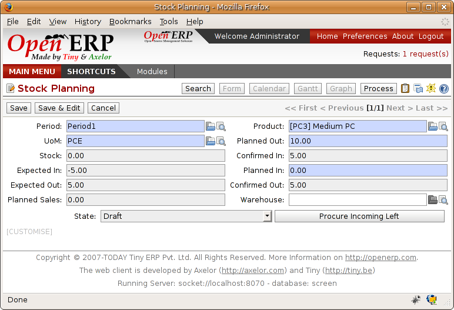
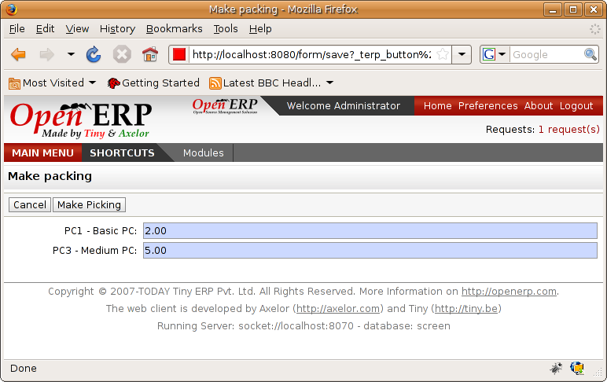
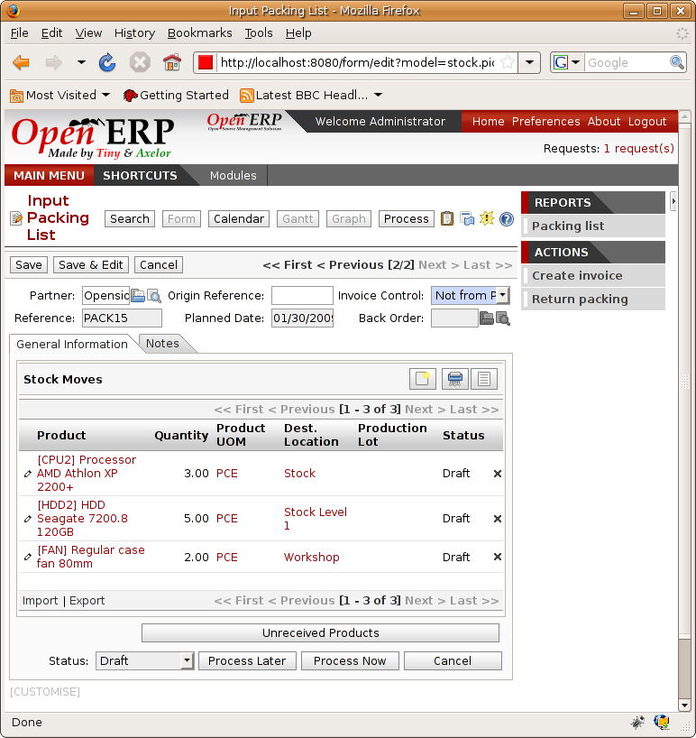
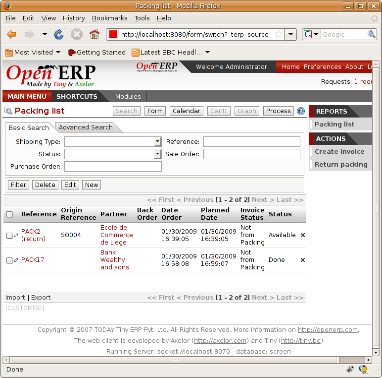
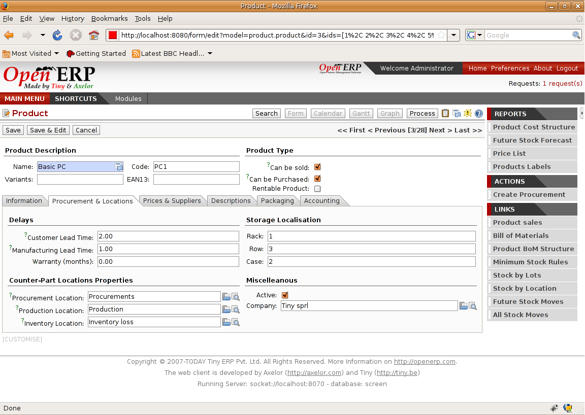

Advanced elements of stock management
======================================

In this section you'll enter the details of management and control of stocks.

Requirements Calculation
-------------------------

Requirements calculation is the calculation engine that plans, prioritizes and starts the automated restocking as a function of rules defined in the products.

.. tip:: **Terminology** *Requirements Calculation*

    Requirements Calculation is often called the Scheduler.

    It automatically starts once per day. You can also start it manually using the menu Manufacturing > Start All Schedulers. It then uses the parameters defined in the products, the suppliers, and the company to determine the priorities between the different product orders, deliveries and purchases from suppliers.

.. index:: Just in Time

Just in Time
-------------

By default, requirements calculation starts automatically once a day. You're advised to make this run overnight to ensure that the system doesn't slow down under the heavy load of scheduling when you're also trying to use it interactively yourselves. To specify the time it starts use the menu Administration > Configuration > Planning > Actions Planned. Select the rule called 'Run MRP Scheduler' and modify the date and time of the next execution.

Some companies want to plan the orders progressively as they are entered so they don't wait until the procurement orders are planned the next day. Install the module ``mrp_jit`` to handle this. Once it's installed each requirement (production or procurement order) will be planned in real time as soon as it's been confirmed.

Then if you make a customer order with a product that's *Make To Order* the quotation request for a supplier will be generated. 

 ..tip :: *Point** *Delivery from the supplier or to the customer*

    The ``sale_supplier_direct_delivery`` module enables you to deliver the product directly from the supplier to the customer. The logic to follow is configured for each products and affects only the products whose lines are marked “Make to Order”.

This mode is not always advisable. Each order is handled once it's been confirmed. Then if an order is to be delivered in three months the scheduler will reserve goods in stock for each order once it's been confirmed. It would have been more efficient to leave these products available for other orders.

If a customer order is configured 'From Order', the scheduler will directly create the corresponding supplier quotation request. Outside, it would have been preferable to wait for several weeks if the lead time enabled you to group the purchase with other future orders.

So the negative effects of working with the Just in Time module are:

* Bad management of priorities amongst orders,

* Additional stocked products.

.. index::
   single: Planning; Stock Management

Planning
----------

You've seen that most Open ERP documents can be changed in a planning view. It's the same for deliveries and goods receipts. You can put them into a calendar view at all times to plan your deliveries or goods receipts.

*Planning the deliveries of customer products.*

The planned dates on a packing order are put on each stock move line. Then if you have a packing order containing several products you don't have to have all of the lines on the order delivered on the same day. The minimum and maximum dates on a packing order show the earliest and latest dates on the stock move lines for the packing.

If you move a packing order in the calendar view, the planned date on the stock move lines will automatically be moved as a result.

.. index::
   single: Back Order

Management of partial deliveries
---------------------------------

Partial deliveries, sometimes call Back Orders, are generated automatically by Open ERP. When you confirm a customer delivery or the receipt of products from suppliers, Open ERP asks you to confirm the quantity delivered or received.

If you leave the quantities alone, Open ERP confirms and closes the order for delivery or reception. If you modify a quantity, Open ERP will automatically generate a second delivery or reception order for the remaining quantities. The first will be confirmed and the second will remain on the list of deliveries (or receipts) waiting.

*Confirmation screen for delivered quantities.*

When you open the list of current deliveries, you find the field 'Partial delivery' which shows the reference number of the first delivery sent to the customer. That enable you to easily find the partial orders delivered so that you can treat them as a priority.

Receiving supplier products
----------------------------

Open ERP supports three approaches to controlling data entry about products ordered from suppliers:

* Manual data entry,

* Work by controlling the receipts pre-generated by the system,

* Work by selecting the products waiting from the supplier, independent of good receipt documents.

You'll see the configuration of the supplier order in detail in the chapter on purchases.

.. index::
   single: Goods receipt

Manual data entry of goods receipt
-----------------------------------

To enter data about goods receipt manually you must use the menu Stock Management > Goods Receipt > New items received. Then enter the necessary data manually in the goods receipt form.

*Manual data entry for product receipt.*

Confirming pre-generated goods received
----------------------------------------

If you use supplier orders in Open ERP, product receipts are automatically generated by the system when the purchase order is confirmed. You don't then have to enter any date, but just confirm that the quantities ordered match the quantities received.

In this case Open ERP generates a list of all products waiting to be received from the menu *Stock Management > Incoming Products > Packings to Process*.

*List of items waiting for receipt.*

Then you just look for the  corresponding entry using the supplier name or order reference. Click it and confirm the quantities. If it shows you quantities that differ from the control form, Open ERP will automatically generate another receipt that will be put in waiting. You can let remain open or cancel it if products missed by your supplier will never be delivered.

Confirmation by selecting products waiting
---------------------------------------------

The approach shown above is very useful if product receipt corresponds to the original orders. Only if your suppliers deliver items that don't necessarily coincide with the orders it is easier to work by products received rather than by orders.

In this case you can manually create a new goods receipt using the menu *Stock Management > Incoming Products > New Reception Packing*. Instead of entering the product lines manually you can click the button at the lower right *Products not received*. Open ERP then opens all the products waiting from the selected supplier and you can then automatically add some or all of them on your form. This method of encoding is very useful when you're entering goods received at one time but from several orders.

.. index::
   single: Routing; Logistic

Product routing
----------------

You should install the ``stock_location`` module if routing products to customers, from suppliers or in your warehouse is a function of the product itself. 

*Managing the paths from one location to another in a product form.*

This will enable you to configure logistic rules individually for each product. For example, when a specific product arrives in stores it can automatically be sent to quality control. In this case it must be configured with rules on the product form. The fields that make up those rules are:

* Source location: the rule only applies if a product comes from this location,

* Destination location: the rule only applies if a product ends up in this location,

* Type of move: automatic, manual, automatic with no steps,

* Lead time for move,

* Name of operations: a free text field which will be included in the automatic stock move proposed by Open ERP.

You'll see some examples of using these locations and logistics by product:

* A rentable product,

* A product bought in China, following its freight by ship from port to port, 

* A product that you want to send to quality control before putting it in stocks.

Example 1: A rentable product

A rentable product is just a product delivered to a customer that is expected to be  returned in a few days time. When it has been delivered to the customer, Open ERP will generate a new goods receipt note with a forecast date at the end of the rental period. So you have a list of goods pending receipt for you to confirm when they are returned to your stores. To do this you should configure a product with the following rules:

==================== ==============
Field                Value
==================== ==============
Source location      Customer
Destination location Stock
Type of Movement     Manual
Lead time            15 days
Operation            Product return
==================== ==============

Then when the product is delivered to the customer, Open ERP automatically generates a goods receipt form in the draft state ready for returning it to Stock. This is due in 15 days time. With such a system your forecasts and stock graphs can always be correct in real time.

Example 2: Management of imports by sea

To manage products that follow a complex logistical import path by sea and then into customs, create as many 'Supplier' locations as there are steps, then create rules to move the product from one place to the other during the purchase.

Take a product that has been bought in China and delivered to you stores in Brussels, Belgium. Import by sea take around 7 weeks and must go through the following steps:

* Delivery from the supplier to the port of Shanghai: 2 days,

* Sea transport from Shanghai to the port of Anvers: 1 month,

* Customer at the port of Anvers: 2 weeks,

* Delivery by truch from the port of Anvers to your stores: 3 days.

You want to follow the movement of your products and encode all the documents as each move it made so that you know where your products are at any moment, and can estimate when they are likely to arrive in your stores. To do this, create all the locations for the intermediate steps:

* Shanghai Port,

* Anvers Port,

* Anvers Customs.

Finally, on the product form, create the following rule to show that when purchased, the products don't arrive at your stores directly, but instead at the port of Shanghai. In this example the stores are configured to enter all the products in a location called 'Input'.

==================== ========================
Field                Value
==================== ========================
Source location      Input
Destination location Shanghai Port
Type of Movement     Automatic without steps
Lead time            2 days
Operation            Sending to Shanghai Port
==================== ========================

Then Open ERP will change the usual product reception (which has them arriving in the Input location) to a delivery from this supplier to the external port. The move is automatically carried out because you don't want to do operations at this level manually.

You then have to create a rule on the product form to move it from one location to another:

==================== ==============================
Field                Value
==================== ==============================
Source location      Shanghai Port
Destination location Anvers Port
Type of Movement     Manual
Lead time            30 days
Operation            Sending to Anvers Port by ship
==================== ==============================

==================== =================
Field                Value
==================== =================
Source location      Anvers Port
Destination location Anvers Customs
Type of Movement     Manual
Lead time            15 days
Operation            Customs at Anvers
==================== =================

==================== ==============================
Field                Value
==================== ==============================
Source location      Anvers Customs
Destination location Stock
Type of Movement     Manual
Lead time            3 days
Operation            Truck transport into stock
==================== ==============================

Once the rules have been configured, Open ERP will automatically prepare all the documents needed for the internal stock movements of products from one location to another. These document will be assigned one after another depending on the order defined in the rules definition.

When the company received notification of the arrival at a port or at customers, the corresponding move can be confirmed. You can then follow, using each location:

* where a given product can be found,

* quantities of product awaiting customs,

* lead times for products to get to stores,

* the value of stock in different locations.

Example 3: Quality Control

You can configure the system to put a given product in the Quality Control bay automatically when it arrives in your company. To do that you just need to configure a rule for the product to be placed in the Quality Control location rather than the Input location when the product is received from the supplier.

==================== ==============================
Field                Value
==================== ==============================
Source location      Input
Destination location Quality Control
Type of Movement     Manual
Lead time            0 days
Operation            Quality Control
==================== ==============================

Once this product has been received, Open ERP will then automatically manage the request for an internal movement to send it to the “Quality Control” location.

.. Copyright © Open Object Press. All rights reserved.

.. You may take electronic copy of this publication and distribute it if you don't
.. change the content. You can also print a copy to be read by yourself only.

.. We have contracts with different publishers in different countries to sell and
.. distribute paper or electronic based versions of this book (translated or not)
.. in bookstores. This helps to distribute and promote the Open ERP product. It
.. also helps us to create incentives to pay contributors and authors using author
.. rights of these sales.

.. Due to this, grants to translate, modify or sell this book are strictly
.. forbidden, unless Tiny SPRL (representing Open Object Presses) gives you a
.. written authorisation for this.

.. Many of the designations used by manufacturers and suppliers to distinguish their
.. products are claimed as trademarks. Where those designations appear in this book,
.. and Open ERP Press was aware of a trademark claim, the designations have been
.. printed in initial capitals.

.. While every precaution has been taken in the preparation of this book, the publisher
.. and the authors assume no responsibility for errors or omissions, or for damages
.. resulting from the use of the information contained herein.

.. Published by Open ERP Press, Grand Rosière, Belgium
