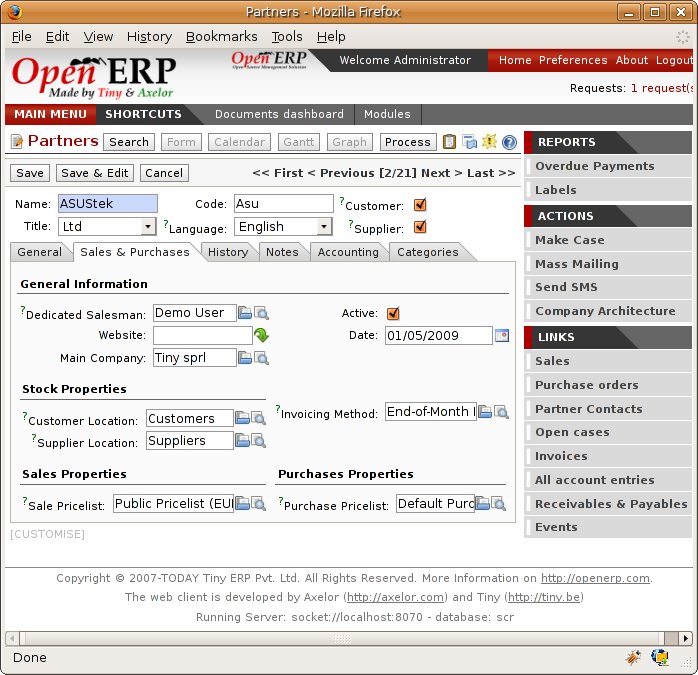
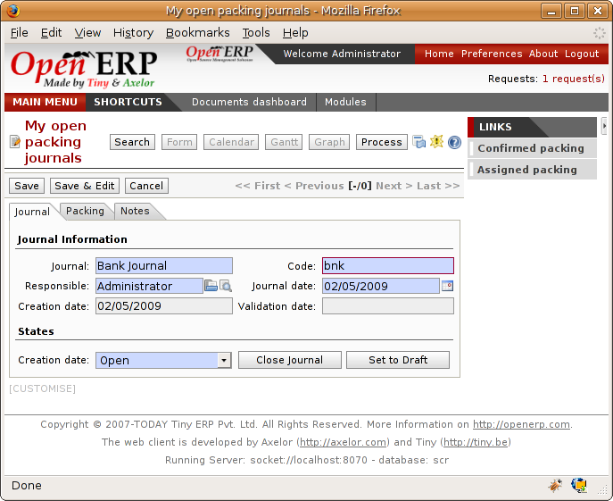

Management by Journal
======================

Just as with accounting you can manage stock through journals. This approach has the great advantage of being able to define journals in various ways at will as your company's needs change.

For example, a large company may want to organize deliveries by department or warehouse. You can then create a journal and a manager for each department. The different users can then work in a journal as a function of their position in the company. That enables you to structure your information better.

A company that does a lot of transport can organize its journals by delivery vehicle. The different delivery orders will then be assigned to a journal representing a particular vehicle. Then if the vehicle has left the company you can confirm all the orders that are found in the journal all at the same time.

.. index::
   single: Journal; Stock Management

The different journals
-----------------------

Install the module ``sale_journal`` to work with journals. This adds three new concepts to Open ERP:

* Invoicing journals,

* Order journals,

* Delivery journals.

Invoicing journals are used to assign purchase orders and/or delivery order to a given invoicing journal. Everything in the journal can be invoiced in one go, and you can control the amounts by journal. For example you can create the following journals: daily invoicing, end-of-week invoicing, and end-of-month invoicing. It's also possible to show the invoicing journal by default in the partner form.

Order journals look like orders and are automatically transferred to orders for the corresponding items. These enable you to classify the orders in various ways, such as by department, by salesperson, or by type. Then if a salesperson looks at her own journals after an order she can easily see the work on current items compared with her own orders.

.. tip::  **Point**  *Default Values*

      To enter all the orders in their own order journal, a salesperson can use the default values that are entered in the fields when creating orders.

Finally the delivery journals are used to post each item into a delivery journal. For example you can create journals dated according to customer delivery dates (such as Monday's deliveries, or afternoon deliveries) or these journals could represent the day's work for delivery vehicles (such as truck1, truck2).

Using the journals
-------------------

You'll now see how to use the journals to organize your stock management in practice. After installing the module ``sale_journal`` look at the list of partners. In the tab 'Sales and Purchases' on any of them you'll now see the field 'Invoicing Journal'.

.. image:: images/partner_property_view.png
    :align: center

*Partner form in invoicing mode.*

You can create a new *Invoicing Journal* on a partner on the fly. You can show if the invoices should be grouped or not after the generation in the journal. Create a second invoicing journal 'End-of-Month Invoicing' which you can assign to another partner.

*Defining an invoicing journal.*

Then enter the data for some orders for these two partners. After entering this order data, the field *Invoicing Mode* is completed automatically from the partner settings. Put these orders into the Invoicing Mode based on items in the second tab. 

Then you'll look at the assembly notes about these orders in the field 'Invoicing Mode' is automatically shown there. Then confirm the different orders in the list.

At the end of the day, the invoicing supervisor can put the list by journal. To do this, use the menu Stock Management > Sorted List > List to invoice. Choose the invoicing journal and all the lists of orders to invoice then open lin list5 view. It's then possible to automatically carry out invoicing by clicking the action Invoice (the gears in the application client).

.. tip::  **Point** *Confirming invoices*

    By default, invoices are generated in the draft state which enables you to modify them before sending them to the customer. But you can confirm all the invoices in one go by selecting them all from the list and doing the action 'Confirm draft invoices'.

At the end of the month the invoicing management does the same work but in the journal 'month-end invoicing'.

You can also enter a journal to confirm / cancel all the orders in one go. Then you can do several quotations and assign them in a journal and confirm or cancel them en masse at once.

*View of an order journal.*

.. Copyright © Open Object Press. All rights reserved.

.. You may take electronic copy of this publication and distribute it if you don't
.. change the content. You can also print a copy to be read by yourself only.

.. We have contracts with different publishers in different countries to sell and
.. distribute paper or electronic based versions of this book (translated or not)
.. in bookstores. This helps to distribute and promote the Open ERP product. It
.. also helps us to create incentives to pay contributors and authors using author
.. rights of these sales.

.. Due to this, grants to translate, modify or sell this book are strictly
.. forbidden, unless Tiny SPRL (representing Open Object Presses) gives you a
.. written authorisation for this.

.. Many of the designations used by manufacturers and suppliers to distinguish their
.. products are claimed as trademarks. Where those designations appear in this book,
.. and Open ERP Press was aware of a trademark claim, the designations have been
.. printed in initial capitals.

.. While every precaution has been taken in the preparation of this book, the publisher
.. and the authors assume no responsibility for errors or omissions, or for damages
.. resulting from the use of the information contained herein.

.. Published by Open ERP Press, Grand Rosière, Belgium
