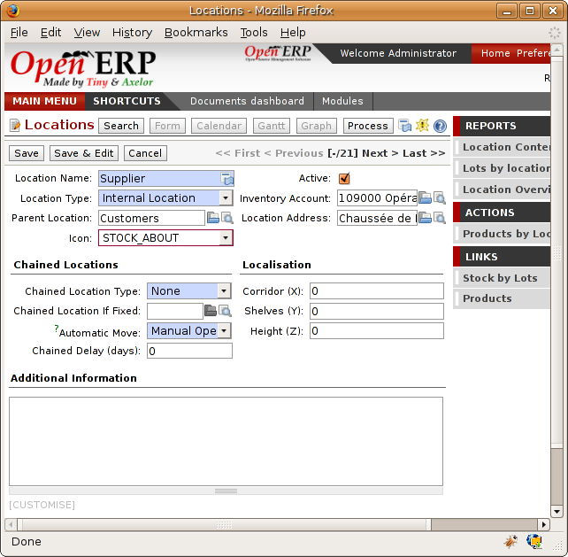
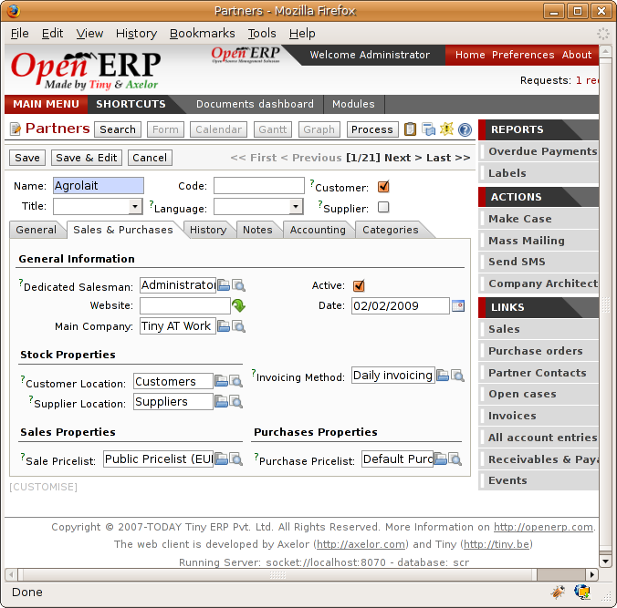
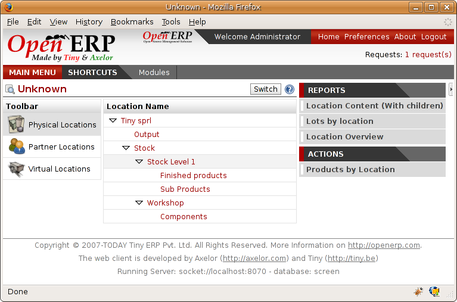

Logistics Configuration
========================

In this section you'll see how to configure stock management to match your company's needs. Open ERP can handle many different situations by configuring it to behave as needed. 

.. index:: Location

Stock locations
---------------

You've seen in the preceding sections that the whole of stock management is built on a concept of stock locations. Locations are structured hierarchically to account for the subdivision of a warehouse into sections, aisles, and/or cupboards. The hierarchical view also enables you to structure virtual locations such as production counterparts. That gives you a finer level of analysis. 

Use the menu *Stock Management > Configuration > Locations* then click *New* to define new locations.

*Definition of a stock location.*

You should then give a name to your stock location. Now look at location types and localization.

Location types
--------------------

The location must have one of the following types:

* View: shows that the location is only an organizational node for the hierarchical structure, and can't be involved in stock moves itself. The view type is not usually made into a leaf node in a structure – it usually has children.

* Customer: destination for products sent to customers,

* Supplier: source of products received from suppliers,

* Internal: locations for your own stock,

* Inventory: the counterpart for inventory operations used to correct stock levels,

* Production: the counterpart for production operations; receipt of raw material and sending finished products,

* Procurement: the counterpart for procurement operations when you don't yet know the source (supplier or production). Products in this location should be zero after the scheduler run completes.

You can have several locations of the same type. In that case your product, supplier and warehouse configurations determine the location that's to be used for any given operation.

The counterparts for procurement, inventory and production operations are given by the locations shown on the product form. The counterparts of reception and delivery operations are given by the locations shown on the partner form. The choice of stock location is given by the configuration of the warehouse, linked to a Shop.

.. image:: images/stock_product_location_form.png
    :align: center

*Definition of stock locations on the product form.*

*Definition of stock locations on the partner form.*

Localization
------------

Each location can be given an address. That enables you to create a location for a customer or a supplier, for example. You can then give it the address of that customer or supplier. You should indicate to Open ERP on the partner form that it should use this location rather than the default location given to partner deliveries.

.. tip::   **Point**  *Subcontracting production*

    You'll see in the chapter about Manufacturing that it is possible to assign a location to a manufacturing workcenter. If this lcoation is at a supplier's you must give it an address so that Open ERP can prepare a delivery order for the supplier and a receive operation for the manufactured goods.

    Creating a location specifically for a partner is also a simple solution for handled consigned stocks in Open ERP.

.. tip:  **Definition** *Consigned Stock*

    Consigned stock is stock that is owned by you (valued in your accounts) but is physically stocked by your supplier. Or, conversely, it could be stock owned by your customer (not valued by you) but stocked in your company.

To enable you to consolidate easily at a higher level, the location definition is hierarchical. This structure is given by the field *Parent location*. That also enables you to manage complex cases of product localization. For example, you could imagine the following scenario.

Example Structure for two warehouses

A company has a warehouse in Paris and in Bordeaux. For some orders you must deliver the products from Paris, and for others from Bordeaux. But you should also specify a fictitious warehouse that Open ERP uses to calculate if it should deliver products from Paris or from Bordeaux.

To do this in Open ERP, you'd create a third warehouse 'France' which consolidates the warehouses in Paris and Bordeaux. You create the following physical locations:

* Company

  * Output
  
    * Warehouses France
    
      * Warehouse Paris
      
      * Warehouse Bordeaux

Open ERP will then deliver the goods from the warehouse that has the ordered product in stock. When products are available in several warehouses, Open ERP will select the nearest warehouse. To formalize the notion of distance between warehouses you should use the geographic co-ordinates (X, Y, Z) of the different stores to enable Open ERP to search for the nearest goods.

The same co-ordinates could also be used to structure the shelves, aisles and interior rooms in a warehouse.

Accounting valuation in real time
----------------------------------

If you have experience of managing with traditional software you'll know the problem of getting useful indicators. If you ask your accountant for a stock valuation or the value added by production he'll give you a figure. If you ask for the same figure from your stores manager you'll get an entirely different figure. It's terrible because you have no idea who's right.

In Open ERP the management of stock is totally integrated with the accounts, to give strong coherence between the two systems. The double-entry structure of locations enables a very precise correspondance between stocks and accounts.

Each stock movement also generates a corresponding accounting entry in an accounting journal to ensure that the two systems can stay in permanent synchronization.

To do that, set up a general account for each location which must be valued in accounting. If a product goes to one location or another and the accounts are different in the two locations, Open ERP automatically generates the corresponding accounting entries in the accounts, in the stock journal.

If a stock move will go from a location without an account to a location where an account has been assigned (for example goods receipt from a supplier order), Open ERP generates an accounting entry using the properties defined in the product form for the counterpart. You can use different accounts per location or link several location to the same account, depending on the level of analysis needed.

You use this system for managing consigned stocks:

* supplier location that is valued in your own accounts or,

* location in your own company that isn't valued in your accounts.

.. index:: Chained Location

Linked locations
-----------------

Locations in Open ERP can be linked between themselves to define paths followed by products. So you can then define rules such as: all products that enter the warehouse must automatically be sent to quality control. The warehouse and quality control are represented by two different locations.

Then when a product arrives in a location, Open ERP can automatically suggest that you send the product to another linked location. Three link modes are available:

* Manual,

* Automatic,

* Automatic without steps.

The manual mode will create an internal move order to the linked location once products arrive in the source locations. This order will wait for a confirmation of the move by a user. This enables you to have a list of moves to do, proposed by the system and confirmed by the storesperson.

.. tip::   **Point**  *Logistic by Product*

    The module ``stock_location`` enables you to generate paths to follow, not just a the level of locations but also at the level of products. It then enables you to manage default locations for a given product or to refer the products as a function of operations such as quality control, supplier receipt, and after-sales service.

    A more detailed explanation of this module, with examples, is given at the end of this chapter.

The automatic mode will do the same but won't wait for a confirmation from the user. Products will automatically be sent to the linked location without any intervening manual operation to do. This corresponds to the case where, for simplicity, you delete a step in the process so the end user can set off the process automatically.

The *automatic without steps* mode won't include the additional stock move but will change the destination move transparently to assign the linked the location. You could then assign a destination location to which you send all the products that arrive in your warehouse. The storesperson will modify the goods receipt note.

If there is a linkage to do, the field 'Type of linked location' lets the destination location be determined. If the field is set to 'customer', the location is given by the properties of the partner form. If the field is set to 'fixed', the destination location is given by the field 'location if link is fixed'.

Some operations take a certain time between order and execution. To account for this lead time, you can set a figure in days in the field 'link lead time'. Then the extra move (automatic or not) will be carried out several days after the original move. If you use the mode 'automatic without step', the lead time is inserted directly into the initial order. In this way you can add security lead times at certain control points in the warehouse.

Case of structuring locations
------------------------------

You'll see in the next part that linking locations lets you manage a whole series of complex cases in manageing production efficiently:

* handling multiple operations for a customer order,

* tracking import and export by sea transport,

* managing a production chain in detail,

* managing rented products, 

* managing consigned products.

To show these concepts, five cases of structuring and configuring these locations are given below. Many other configurations are possible depending on needs.

Handling customer orders
-------------------------

Customer orders are usually handled in one of two ways:

* item note (or preparation order), confirmed when the item is ready to send,

* delivery order (or freight note), confirmed when the transporter has delivered the item to a customer.

You use the following stock move in Open ERP to simulate these operations:

* Packing Note: Stock > Output,

* Delivery Order: Output > Customer.

The first operation is automatically generated by the customer order. The second is then generated by the stock management by showing that the 'Output' location is linked to the 'Customer' location. That then gives the two operations waiting. If the 'Output' location isn't situated beneath the stock location you then have to move the item from stock to the place that the item is prepared.

Some companies don't want to work in two steps, because it just seems like extra work to have to confirm a delivery note in the system. You can then set the link mode to 'Automatic' to make Open ERP automatically confirm the second step. It's then assumed the all the items have automatically been delivered to the customer.

Linked Production
------------------

The ``stock_location`` module enables you to manage the linkages by product in addition to doing that by location. You can then create a location structure that represents your production chain by product.

The location structure looks like this:

* Stock

  * Level 1

  * Level 2

    * Link 1

      * Operation 1

      * Operation 2

      * Operation 3

      * Operation 4

You can then set the locations a product or a routing must go through on the relevant form. All products that enter the production chain will automatically follow the predetermined path.

*Logistics for a given product.*

To improve your logistics, you'll see further on in this chapter how you can put minimum stock rules onto different locations to guarantee security stocks for assembly operators. Reports on the state of stocks in different locations will rapidly show you the bottlenecks in your production chain.

.. Copyright © Open Object Press. All rights reserved.

.. You may take electronic copy of this publication and distribute it if you don't
.. change the content. You can also print a copy to be read by yourself only.

.. We have contracts with different publishers in different countries to sell and
.. distribute paper or electronic based versions of this book (translated or not)
.. in bookstores. This helps to distribute and promote the Open ERP product. It
.. also helps us to create incentives to pay contributors and authors using author
.. rights of these sales.

.. Due to this, grants to translate, modify or sell this book are strictly
.. forbidden, unless Tiny SPRL (representing Open Object Presses) gives you a
.. written authorisation for this.

.. Many of the designations used by manufacturers and suppliers to distinguish their
.. products are claimed as trademarks. Where those designations appear in this book,
.. and Open ERP Press was aware of a trademark claim, the designations have been
.. printed in initial capitals.

.. While every precaution has been taken in the preparation of this book, the publisher
.. and the authors assume no responsibility for errors or omissions, or for damages
.. resulting from the use of the information contained herein.

.. Published by Open ERP Press, Grand Rosière, Belgium
