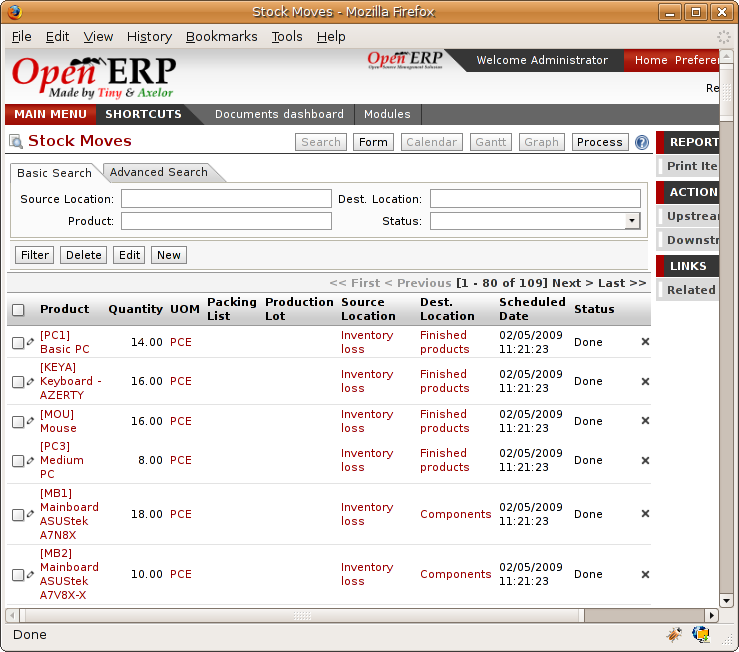
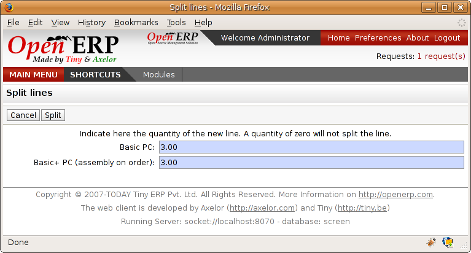
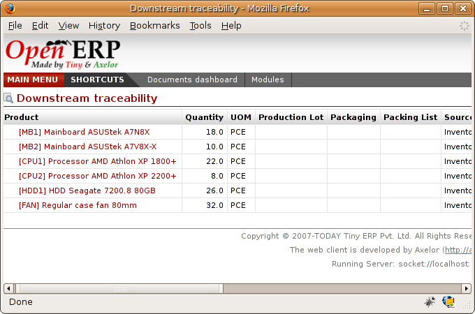

Management of lots and traceability
====================================

The double-entry management in Open ERP enables you to run very advanced traceability. All operations are formalized in terms of stock moves, so it's very simple to search for the cause of a gap in the whole stock moves.

.. tip::   **Definition** *Upstream and downstream traceability*

    Upstream traceability runs from the raw materials received from the supplier and follows the chain to the finished products delivered to customers.

    Downstream traceability follows the product in the other direction, from customer to the different suppliers of raw material.

Stock Moves
------------

To look at the history of transactions about a product or a given location, use the menu: Stock Management > Traceability > Low Level > Stock Moves. All the operations are then available. You can filter on the various field to retrieve the operations about an order, or a production, or a source location, or any given destination.

*History of stock movements.*

Each stock move is in a given state. The different possible states are:

* Draft: the move has so far had no effect in the system. The transaction hasn't yet been confirmed,

* Confirmed: the move will be done, so it will be counted in the calculations of virtual stock. But you don't know whether it will be done without problem because the products have been reserved for the move,

* Validated: the move will be done and the necessary raw material have been reserved for the transaction,

* Done: the stock move has been done, and entered into the calculations of real stock,

* Waiting: in the case of transactions 'From Order', this state shows that the stock move is blocked waiting for the end of another move,

* Cancelled: the stock move wasn't carried out, so there's no account in either real stock or virtual stock.

Delivery orders, goods receipts and internal picking lists are just documents that regroup a set of stock moves. You can also consult the history of these documents using the menu Stock Management > Traceability > Low level > Picking.

Lots
-----

Open ERP is also capable of managing product lots. Two lot types can be distinguished:

* Manufacturing lots (batch numbers) are represented by a unique product or an assembly of identical products leaving the same production. They are usually identified by bar codes stuck on the products. The batch can be identied for your supplier or your company.

* Tracking numbers are logistical lots by which you can identify the container for a set of products. This corresponds, for example, to the pallet numbers on which several different products are stocked.

These lots can be encoded on all stock moves and, more precisely, on goods-in lines, internal moves and product deliveries.

*Encoding of a line for production reception.*

To enter the lot number in an operation you can use an existing lot number or create a new lot. A manufacturing lot (batch number) must always be used for a single product. A tracking number can be used several times for different products so you can mix different products on a pallet or in a box.

.. tip::   **Point**  *Simplified View*

    In the simplified view the tracking numbers don't appear. The different fields are deliberately hidden while working in the simplified view.

On the product form it is also possible to indicate the operations in which a lot nubmer is required. You can then force the user to show the lot number for manufacturing operations, goods receipt, or customer packing.

To assign a unique lot number to a set of several items you don't have to encode the lot number one by one. You only need to take a stock move for several products line and click the button *Split move lines in two*. You can then give a lot number prefix and Open ERP will complete the prefix in the wizard with a continuing sequence number.

*Splitting a lot into uniquely identified parts.*

.. index:: Traceability (Stock)

Traceability
-------------

If you encode the lot numbers for stock moves you can then enquire about the traceability for a given lot number. To do this use the menu *Stock Management > Traceability > Production Lots*, or *Stock Management > Traceability > Tracking Lots*.

.. tip::   **Point**  *Product Shortcuts*

    From the product form the toolbar to the right offers useful information:

    * Minimum stock rules,

    * Stocks by location,

    * Sales detail,

    * Stocks by lot,

    * Bills of Materials.

Search for the expected lot using the filters for the lot number, the date or the product. Once you can see the form about this lot several actions are possible:

* Traceability upstream: from supplier to customers,

* Traceability downstream: from customer to suppliers,

* Stock spread amongst all the physical and virtual locations.

.. image:: images/stock_traceability_upstream.png
    :align: center

*Tracing upstream in 'From Order'.*

*Tracing downstream in 'From Stock'.*

Finally, on a lot, you can enter data on all the operations that have been done on the product. That forms a useful history of the presales operations.

.. Copyright © Open Object Press. All rights reserved.

.. You may take electronic copy of this publication and distribute it if you don't
.. change the content. You can also print a copy to be read by yourself only.

.. We have contracts with different publishers in different countries to sell and
.. distribute paper or electronic based versions of this book (translated or not)
.. in bookstores. This helps to distribute and promote the Open ERP product. It
.. also helps us to create incentives to pay contributors and authors using author
.. rights of these sales.

.. Due to this, grants to translate, modify or sell this book are strictly
.. forbidden, unless Tiny SPRL (representing Open Object Presses) gives you a
.. written authorisation for this.

.. Many of the designations used by manufacturers and suppliers to distinguish their
.. products are claimed as trademarks. Where those designations appear in this book,
.. and Open ERP Press was aware of a trademark claim, the designations have been
.. printed in initial capitals.

.. While every precaution has been taken in the preparation of this book, the publisher
.. and the authors assume no responsibility for errors or omissions, or for damages
.. resulting from the use of the information contained herein.

.. Published by Open ERP Press, Grand Rosière, Belgium
