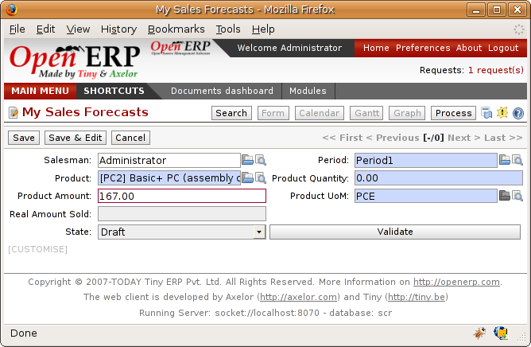

.. index:: MPS
.. index:: Master Production Schedule

Scheduling
===========================

The master production plan, sometimes called the MPS (Master Production Schedule), enables you to generate forecasts for incoming and outgoing material. It's based on forecasts of inputs and outputs by the logistics manager.

.. tip::   **Point**  *Product trading*

    Also called the Production Plan, this tools is also very useful for traded product which aren't manufactured. You can then use it for stock management with purchased and manufactured products.

To be able to use the production plan, you must install the ``stock_planning`` module which can be found amongst Open ERP's extra_addons rather in the main set of addons.

.. index:: Forecasts

Sales Forecasts
----------------

The first things to do to work with a production plan is to define the periods for stock management. Some companies plan daily, others weekly or monthly.

.. tip::   **Point**  *Stock Management interval*

The interval chosen for managing stock in the production plan will depend on the length of your production cycle. You generally work daily, weekly or monthly.

If your products take several days to assemble it's preferable to have a weekly plan. If your manufacturing cycles are several months you can work with a monthly plan.

To do this use the menu *Sales Management > Configuration > Create Sales Periods*. A window appears enabling you to automatically define the next periods that will be provided for stock management.

.. image:: images/sale_period.png
    :align: center

*Defining periods for stock management.*

Salespeople can then enter their sales forecasts by product and by period using the menu *Sales Management > Sales Forecasts > My Sales Forecasts*. The forecasts can be made by quantity or by value. For a forecast by amount Open ERP automatically calculates for you the quantity equivalent to the estimated amount. This can be modified manually as needed before completion.

*Sales Forecast to help create a master production plan.*

.. index::
   single: Plan; Production

Production Plan
----------------

The manager responsible for logistics then plans receipts (manufacturing or purchases) and outgoings (consumption or customer deliveries) by period. To do this use the menu *Stock Management > Planning > Master Production Schedule*.

For each period and product Open ERP gives you the following information:

* stock estimated at the end of the period, calculated as stock in the following period less total estimated outgoings plus total estimated inputs,

* closed entries, coming from production or confirmed purchases,

* forecast inputs for the period, calculated using the incoming entries less the closing amounts,

* planned inputs entered manually by the logistics manager,

* closed outgoings which are the consumption of manufacturing waiting and deliveries to be made to customers,

* forecast outgoings, calculated from the planned outgoings, less the closing amounts,

* planned outgoings, manually entered by the logistics manager,

* sales forecasts, which represent the sum of forecasts made by the salespeople.

.. image:: images/stock_forecast.png
    :align: center

*The master production schedule (MPS).*

The production plan then enables the logistics manager to play with the forecast income and outgoings and test the impact on the future stock for the product under consideration. It enables you for example to check that the stock doesn't fall below a certain level for the product under consideration.

You can also open the production plan for past periods. In this case Open ERP shows you the real stock moves, by period for forecast reports.

If you don't have automated restocking rules for a product you can at any time start a restocking based on the estimates of the production plan. To do this press the button 'Start restocking'. Open ERP manages the forecast of restocking for an amount equal to the entries 'forecast'.

.. Copyright © Open Object Press. All rights reserved.

.. You may take electronic copy of this publication and distribute it if you don't
.. change the content. You can also print a copy to be read by yourself only.

.. We have contracts with different publishers in different countries to sell and
.. distribute paper or electronic based versions of this book (translated or not)
.. in bookstores. This helps to distribute and promote the Open ERP product. It
.. also helps us to create incentives to pay contributors and authors using author
.. rights of these sales.

.. Due to this, grants to translate, modify or sell this book are strictly
.. forbidden, unless Tiny SPRL (representing Open Object Presses) gives you a
.. written authorisation for this.

.. Many of the designations used by manufacturers and suppliers to distinguish their
.. products are claimed as trademarks. Where those designations appear in this book,
.. and Open ERP Press was aware of a trademark claim, the designations have been
.. printed in initial capitals.

.. While every precaution has been taken in the preparation of this book, the publisher
.. and the authors assume no responsibility for errors or omissions, or for damages
.. resulting from the use of the information contained herein.

.. Published by Open ERP Press, Grand Rosière, Belgium
