.. index::
   single: Scheduler; Lead Time

Calculation of lead times
=========================

Each request for products will then 

All the operations are automatically calculated by the requirements calculator. But more than creating each production order and procurements, Open ERP plans each action, You will find on each document a plan date calculated by the system.

To organize a whole chain of manufacturing and restocking, Open ERP bases everythin on the delivery date promised to the customer. This is given by the date of the confirmation in the order and the lead times shown in each product line of the order. This lead time is itself suggested automatically in the field 'Customer Lead Time' shown in the product form. It shows the time promised to the customer between the order and that of the delivery.

To show the calculation of the lead times, take the example of the cabinet above. Suppose that the cabinet is assembled in two time, use the two following Bills of Materials.

============  ========  ===============
Product Code  Quantity  Unit of Measure
============  ========  ===============
ARM100        1         Unit
PANLAT        2         Unit
BOIS002       0.25      Unit
LIN040        1         Unit
BOIS010       0.25      m2
TAQ000        12        Unit
============  ========  ===============

============  ========  ===============
Product Code  Quantity  Unit of Measure
============  ========  ===============
PANLAT        2         Unit
BOIS002       0.17      Unit
============  ========  ===============

The PANLAT is made from an order using the workflow shown. The BOIS02 is purchased on order and the other products are all found in stock. An order for the product ARM100 will then generate two production orders (ARM100 et PANLAT) then produce two purchase orders for the product BOIS02. Product BOIS02 is used in the production of both ARM100 and PANLAT. Set the lead times on the product forms to the following:

============ ================== ==================== ==================
Product Code Customer Lead Time Production Lead Time Supplier Lead Time 
============ ================== ==================== ==================
ARM100       30 days            5 days            
PANLAT                          10 days
BOIS02                                               5 days
============ ================== ==================== ==================

Then a customer order placed on the 1st January will set uup the following operations and delays:

* Delivery ARM100: 31 January (=1st January + 30 days),

* Manufacture ARM100: 26 January (=31 January – 5 days),

* Manufacture PANLAT: 16 January (=26 January – 10 days),

* Purchase BOIS02 (for ARM100): 21 January (=26 January – 5 days),

* Purchase BOIS02 (for PANLAT): 11 January (=16 January – 5 days).

In this example, Open ERP will propose making two orders to the supplier of product BOIS02. Each of these orders can be for a different planned data. Clearly before confirming these orders, the purchasing manager can group these orders into single one.

Security days
--------------

The scheduler will plan all operations as a function of the time configured on the products. But it is also possible to configure these factors in the company. These factors are then global to the company, whatever the product concerned. In the description of the company, on the Configuration tab, you find the following parameters:

* Security days: number of days to deduct from a system order to cope with the problems of restocking,

* Purchase lead time: additional days to include for all purchase orders with this supplier,

* Production lead time: number of additional days needed for manufacturing.

Period for calculating requirements: all the requests which are for procuring for a later date to the number of days which aren't calculated in the scheduler.

.. tip::  **Point** *Purchasing lead time*

    The security delay for purchases is the average time between the order generated by Open ERP and the real purchase time from the supplier by your purchasing department. This delay takes account of the order process in your company, including negotation time.

Take for example the following configuration:

* Security days: 2,

* Purchase Lead time: 3,

* Production Lead Time: 1.

The example above will then be given the following lead times:

* Delivery ARM100: 29 January (=1st January + 30 days – 2 days),

* Manufacture ARM100: 23 January (=29 January – 5 days – 1 day),

* Manufacture PANLAT: 12 January (=26 January – 10 days – 1 day),

* Purchase BOIS02 (for ARM100): 15 January (=26 January – 5 days – 3 days),

* Purchase BOIS02 (for PANLAT): 4 January (=12 January – 5 days – 3 days).

.. index:: Work Orders

Operations
===========

In the first part of this chapter, manufacturing management was handled in terms of products and materials. This section focuses on manufacturing operations. To manufacture or assemble products, as well as using raw materials and finished product you should handle operations such as assembly, drilling wood, and cutting timber.

The different operation will have impacts on the costs of manufacture and the planning as function of the available workload.

Definition of concepts
-----------------------

To manage operations you should understand the following concepts

* Workcenters,

* Routing,

* Operations.

Workcenters
-----------

Workcenters represent units of product, capable of doing material transformation operations. You can distinguish three types of workcenter: machines, tools and human resources.

.. tip::   **Definition** *Workcenter*

    Workcenters are units of manufacture, consisting of one or several people and/or machines, which can be considered as a unit for the purposes of forecasting capacity and planning.

Use the menu *Manufacturing > Configuration > Workcenters* to define a new workcenter. You get a form as shown in the figure below.

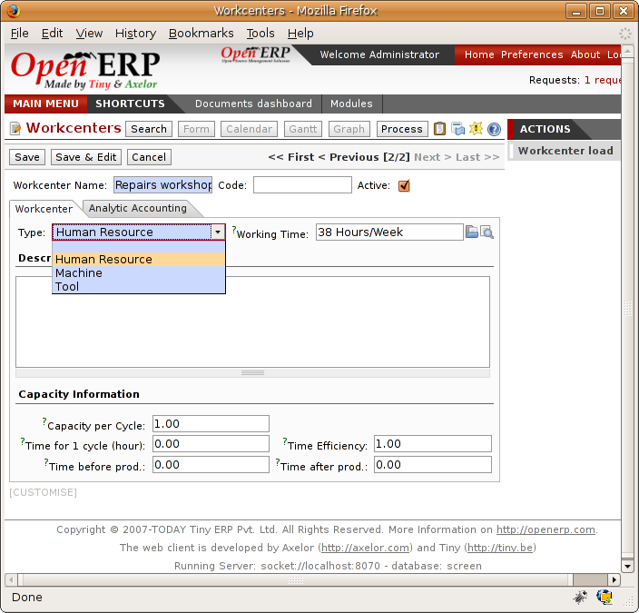

*Definition of a workcenter.*

A workcenter must have a name and a code. You then assign a type: machine, human resource, tool, and a description of operating hours or functionality. The figure below represents the hours from Monday to Friday, from 09:00 to 17:00 with a break of an hour from 12:00.

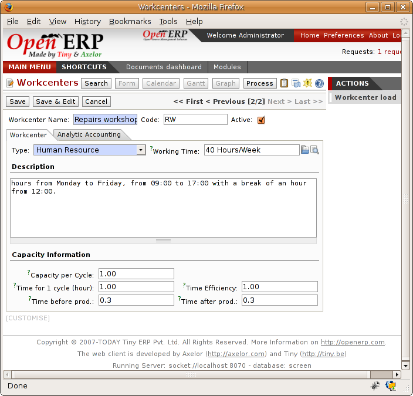

*Working hours for a workcenter.*

You should show a description of the workcenter and its operations.

Once the database is encoded you should enter data about the production capacity of the workcenter. Depending on whether you have a machine or a person, a workcenter will be defined in cycles or hours. If it represents a set of machines and people you can use both cycles and hours at the same time.

.. tip::   **Definition**  *A Cycle*

    A cycle corresponds to the time required to carry out an assembly operation. The user is free to determine which is the reference operation for a given workcenter. It must be represented by the cost and time of manufacture.

    For example, for a printing workcenter, a cycle will be the printing of 1 page. Or the printing of 1000 pages depending on the printer.

To define the capacity well it is necessary know for each workcenter what will be the reference operation which will serve to determine the cycle. You can then define the data relative to the capacity.

Capacity per cycle (CA): determine the number of operations that can be done in parallel during a cycle. Generally the number defines the number of identical machines or people defined by the workcenter.

Time for a cycle (TC): give the duration in hour for that or the operations defined by a cycle.

Time before production (TS): give the wait in hours to initialise production operations. Generally this represents the machine setup time.

Time after production (TN): give the delay in hours after the end of a production operation. Generally this represents the cleaning time necessary after an operation.

Effective time (ET): is a factor that is applied to the three times above to determine the real production time. This factor enables you to readjust the different times progressively and as a measure of machine utilization. You can't readjust the other times because generally they're taken from the machine's data sheet.

The total time for carrying out X operations is then given by the following formula: ((C / CA) * TC + TS + TN\_ * ET. In this formula the result of the division is rounded upwards. Then if the capacity per cycle is 6 it takes 3 cycles to realize 15 operations.

.. tip::   **Point** *Multi-level routing*

It is possible to define routing on several levels to support multi-level Bills of Materials

Then on each level of a Bill of Materials you can indicate the range. The levels are then linked to hierarchies of Bills of Materials.

The second tab of the production order lets you define the links to analytical account to report the costs of the workcenter operations. If you leave the different fields empty Open ERP won't have any effect on the analytic accounts.

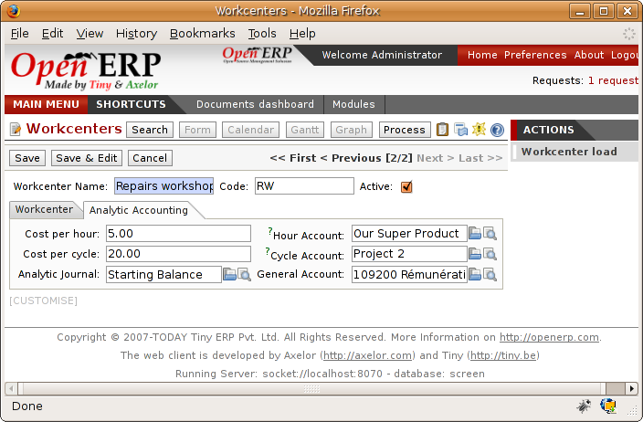

*Data about analytic accounts for a workcenter.*

.. index::
   single: Routing; Manufacturing

Routing
--------

Routings define the assembly operations to be done in workcenters for manufacturing a certain product. They are usually attached to Bills of Materials which will define the assembly of products required for manufacture or for finished products.

A routing can be defined directly in a Bill of Materials or through the menu Manufacturing > Configuration > Routings. A routing has a name, a code and a description. Later in this chapter you'll see that a routing can also be associated with a stock location. That enable you to indicate where assembly takes place.

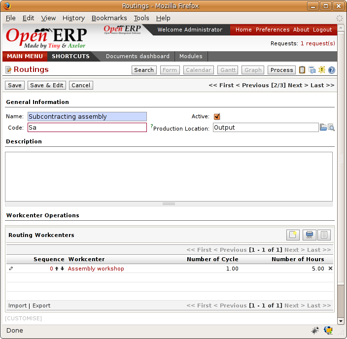

*Definition of a routing with three operations.*

.. tip::  **Point**  *Subcontracting assembly*

    You'll see further on in this chapter that it is possible to link a routing and a stock location for the customer or the supplier. It's the case, for examply. After you've subcontracted the assembly of a product to a supplier.

In the routing you must show the list of operations that must be done. Each operation must be done at a workcenter and possess a number of hours and/or cycles be done.

Impact of the production order
-------------------------------

The routings are then attached to the Bills of Materials which are then also used to generate product order. On a production order one the finds the assembly operations for making on the tab called 'Operations'.

mrp_production_workorder.png

Operations on a production order.

The times and the cycles shown in the production order are in the same way as the materials, theoretical data. The user can change the values to reflect reality for manufacture. 

So if you use routings, Open ERP automatically calculates the operations required for the production order. If the workcenters are linked to analytic accounts, at the end of production, Open Erp will generate the analytic accounts representing the costs of manufacture. This will allow you to work out profitability per workcenter or manufacturing unit through analytic accounting.

But the routings also enable you to manage your production capacity. You will be able to leave the demand charts for the days / weeks / months ahead to validate that you don't forecast more than you are capable of producing.

To see a demand chart, list the workcenters using the menu *Manufacturing > Configuration > Workcenters*. Then select one or several workcenters and click on the action *Workcenter load*. Open ERP then asks you if you work in cycles or in hours and your interval is calculated (by day, week or month).

*Charge by workcenter.*

.. tip::  **Point** *Theoretical times*

Once the routings have been clearly defined, that enables you to determine the effective  working time per assembly worker. The time corresponds to the time for each operation actually taken by the assembly worker. That enables you to compare the real working time in your company and work out the productivity per persons.

Work operations
----------------

A production order is for several products defined in the Bills of Materials, and several operations, defined in the routing. You've seen how to handle manufacturing production by production, Some companies like to have finer-grained control of operations where instead of encoding the production they enter data on each constituent operation of production.

Management of operations
-------------------------

.. tip::   **Definition**  *Operations*

    Operations are often called work orders.

To work using work orders you must install the optional module ``mrp_operations``. Once the module is installed you'll find a new menu called *Manufacturing > Operations > Operations* to be carried out. The assembly workers must then encode each step operation by operation and, for each step, the real working time for it.

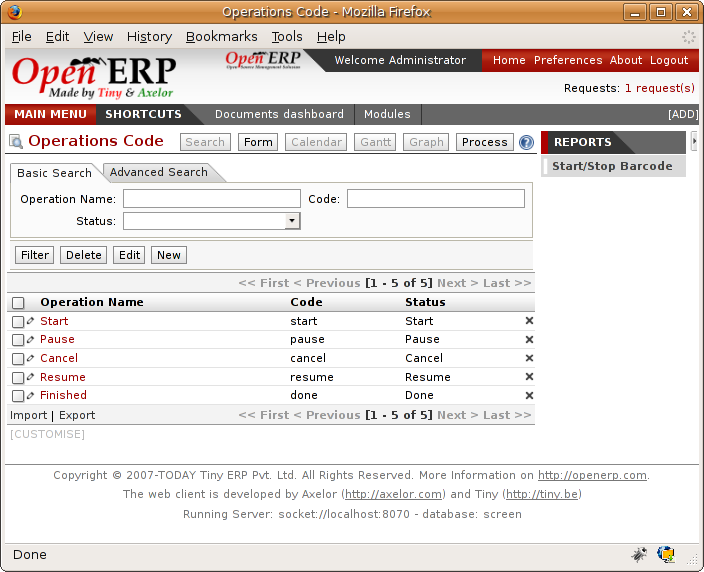

*List of operations to be carried out.*

Operations must then be carried out one by one. On each operation the operator can click on 'Start operation' and then 'Close Operation'. The time is then worked out automatically on the operation between the two changes of status. The operator can also put the operation on hold and start again later.

The following process is attached to each operation.

*Process for handling an operation.*

Thanks to this use by operation, the real working time is recorded on the production order.

The production order is automatically put into the state 'Running' once the first operation has been started. That consumes some raw materials. Similarly the production order is closed automatically once the last operation is completed. The finished products are then made.

.. index:: Barcodes

Scores, events and barcodes
============================

If the company wants to work with barcodes in manufacturing you can work on each operation using events. Here are some examples of events for an operations:

* Starting an operation,

* Pausing an operation,

* Restarting an operation,

* Closing an operation,

* Cancelling an operation.

You place barcodes on the production orders on the machines or operators and a form of barcodes representing the events. To print barcodes select the events using the menu *Manufacturing > Configuration > Codes from start to finish*. Then click for printing the barcodes for the selected events. You can do the same for printing barcodes for the workcenters using the menu *Manufacturing > Configuration > Workcenters*.

Using the system these operations don't need data to be entered on the keyboard. To use these barcodes, open the menu Manufacturing > Barcode events. You must then scan, in order:

#. The barcode of the production order,

#. The workcenter used,

#. The event code.

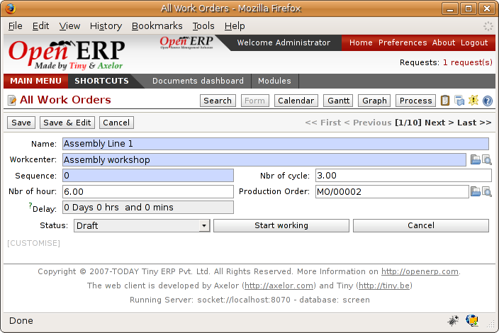

*Capturing events for work orders.*

Open ERP then applies the events to the relevant operation.

Subcontracting manufacture
---------------------------

In Open ERP it is possible to subcontract production operations (for example painting and item assembly) at a supplier's. To do this you must indicate on the relevant routing document a supplier location for stock management.

You must then configure a location dedicated to this supplier with the following data:

* Type of location: Supplier,

* Address of Location: Select an address of the subcontractor partner,

* Type of linkage: Fixed,

* Location of linkage: your Stock,

* Lead time for linkage: number of days before receipt of the finished product.

Then once the manufacture has been planned for the product in question, Open ERP will generate the following steps:

Delivery of raw materials to the stores for the supplier,

Production order for the products at the suppliers and receipt of the finished products in the stores.

Once the production order has been confirmed, Open ERP automatically generates a delivery order to send to the raw materials supplier. The storesperson can access this delivery order using the menu *Stock Management > Incoming Products*. The raw materials will then be placed in stock at the supplier's stores.

Once the delivery of raw materials has been confirmed, Open ERP activates the production order. The supplier uses the raw materials sent to produce the finished goods which will automatically be put in your own stores. The confirmation of this manufacture is made when you receive the products from your supplier. It's then that you indicate the quantities consumed by your supplier

.. tip::  **Point**  *Subcontract without routing*

    If you don't use routing you can always subcontract work orders by creating an empty routing in the subcontract bill of materials.

Production orders are found in the menu *Manufacture > Production Orders > Production Orders to start*. A production order is always carried out in two stages:

#. Consumption of raw materials

#. Production of finished products.

Depending on the company's needs, you can specify that the first step is confirmed at the acknowledgment of manufacturing supplier and the second at the receipt of finished goods in the warehouse.

Treatment of exceptions
========================

The set of stock requirements is generated by procurement orders. Then for each customer order line or raw materials in a manufacturing order, you will find a restocking form. To review all the procurement orders use the menu *Manufacturing > Procurement orders*.

In normal system use, you don't need to worry about procurement orders because they're automatically generated by Open ERP and the user will usually work on the results of a procurement: a production order, a task or a supplier order.

But if there are configuration problems, the system can remain blocked by a procurement without generating a corresponding document. For example, suppose that you configure a product “to produce” 'on order' but you haven't defined the bill of materials. In that case procurement of the product will stay blocked in an exception state 'No Bill of Materials defined for this product'. You must then create a bill of materials to unblock the problem.

Possible problems include:

* No bill of materials defined for production: in this case you've got to create one or indicate that the product can be purchased instead.

* No supplier available for a purchase: it's then necessary to define a supplier in the second tab of the product form.

* No address defined on the supplier partner: you must complete an address for the supplier by default for the product in consideration.

* No quantity available in stock: you must create a rule for automatically procuring (for example a minimum stock rule) and put it in the order, or manually procure it.

Some problems are just those of timing and can be automatically corrected by the system. That's why Open ERP has the two following menus:

* *Manufacturing > Automatic Procurement > Procurement Exceptions > Exceptions to correct*,

* *Manufacturing > Automatic Procurement > Procurement Exceptions > Temporary exceptions*.

If a product must be 'in stock' but is not available in your stores, Open ERP will make the exception in 'temporary' or 'to be corrected'. The exception is temporary if the system can procure it automatically, for example if a procurement rule is defined for minimum stock.

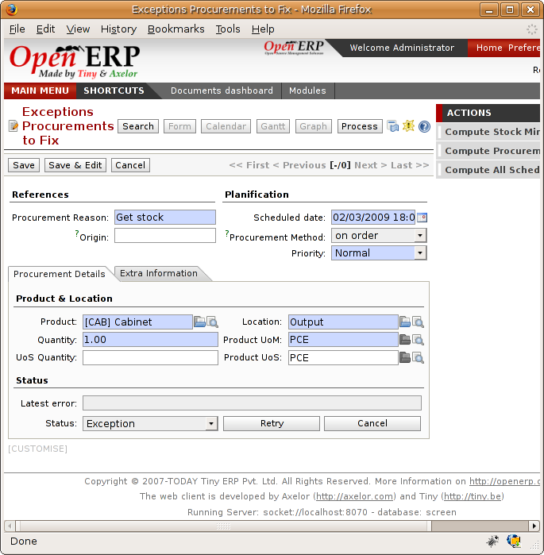

*Example of a procurement in exception.*

If no procurement rule is defined the exception must be corrected manually by the user. Once the exception is corrected you can restart by clicking on 'Retry'. If you don't do that then Open ERP will automatically recalcualte on the next automated requirements calculation.

Manual procurement
===================

To procure internally, you can create a procurement order manually. Use the menu *Manufacturing > Procurement Orders > New Procurement* to do this.

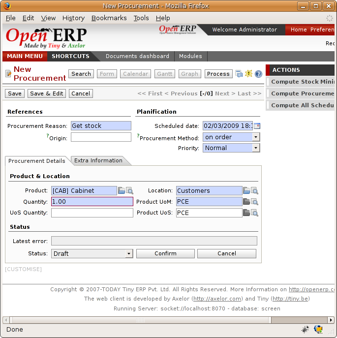

*Encoding for a new procurement order.*

The procurement order will then be responsible for calculating a  proposal for automatic procurement for the product concerned. This procurement wll start a task, a purchase order form the supplier or a production depending on the product configuration.

*Workflow for handling a procurement, a function of the product configuration.*

It is better to encode a procurement order rather than direct purchasing or production, That method has the following advantages:

The form is simpler because Open ERP calculates the different values from other values and defined rules: purchase date calculated from order date, default supplier, raw materials needs, selection of the most suitable bill of materials, etc

The calculation of requirements prioritises the procurements. If you encode a purchase directly you short-circuit the planning of different procurements.

.. tip::   **Point**  *Shortcuts*

    On the product form you have a shortcut to the left that lets you quickly create a new procurement order.

.. index:: Waste Products

Management of waste products and secondary products
====================================================

For the management of waste you must install the module ``mrp_subproduct``. The normal behaviour of manufacture in Open ERP enables you to manufacture several units of the same finished product from raw materials (A + B > C). With waste management, the result of a manufacture can be to have both finished products and secondary products (A + B > C + D).

.. tip::   **Definition** *Waste material*

    In Open ERP waste material corresponds to secondary products that are a by-product of the main manufacturing process. For example, cutting planks of timber will produce other planks but these bits of timber are too small (or the offcuts may have value for the company if they can be used elsewhere).

If the module ``mrp_subproduct`` has been installed you get a new field in the Bill of Material that lets you set secondary products resulting from the manufacture of the finished product.

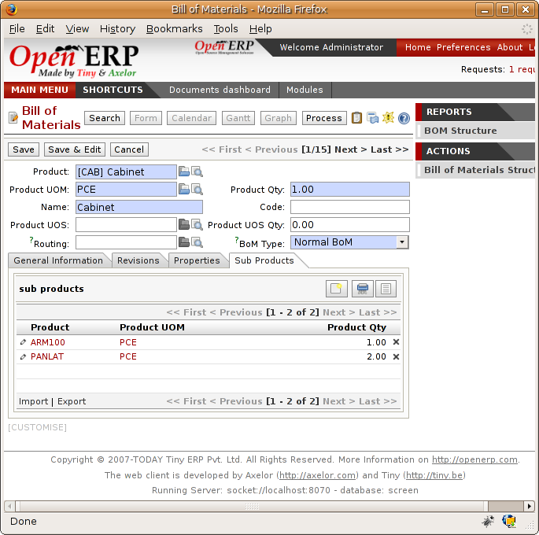

*Definition of waste products in a Bill of Materials.*

When Open ERP generates a production order based on a Bill of Materials that uses secondary product you pick up the list of all products in the the third tab of the production order 'Finished Products'.

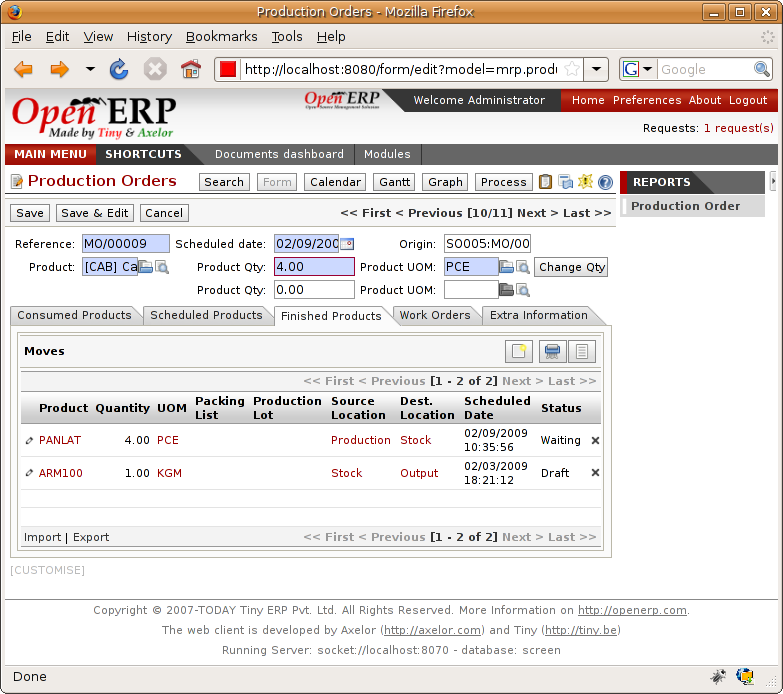

*A production order producing several finished products.*

Secondary products enable you to generate several types of products from the same raw materials and manufacturing methods – only these aren't used in the calculation of requirements. Then if you need the secondary products Open ERP won't ask you to manufacture another product to use the waste products and secondary products of this manufacture. In this case you should enter another production order for the secondary product.

.. tip::   **Point** *Services in Manufacturing*

    Unlike most software for production management, Open ERP manages services as well as stockable products. So it's possible to put products of type *Service* in a Bill of Materials. These don't appear in the production order but their requirements will be taken into account.

    If they're defined as *Make to Order*. Open ERP will generate a task for the manufacture or a subcontract order for the operations. The behaviour will depend on the supply method configured on the product form *Buy* or *Produce*.

.. index:: Repairs

Management of repairs
======================

The management of repairs is carried out using the module ``mrp_repair``. Once it's installed this module adds new menus to the Manufacturing menu:

* *Manufacturing > Repairs*

* *Manufacturing > Repairs > Repairs in quotation*

* *Manufacturing > Repairs > Repairs in progress*

* *Manufacturing > Repairs > Repairs Ready to Start*

* *Manufacturing > Repairs > Repairs to be invoiced*

* *Manufacturing > Repairs > New Repair*

In Open ERP a repair will have the following effects:

* Use of materials: items for replacement,

* Production of products: items replaced from reserved stock,

* Quality control: tracking the reasons for repair,

* Accounting entries: following stock moves,

* Receipt and delivery of product from and to the end user,

* Adding operations in the product traceability,

* Invoicing items used and/or free for repairs.

Entering data for a new repair
-------------------------------

Use the menu *Manufacturing > Repairs > New Repair* to enter a new repair into the system. You'll see a blank form for the repair data, as shown in the figure below.

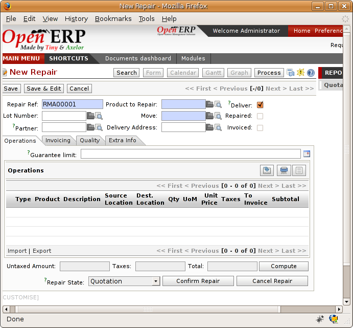

*Entering data for a new repair.*

Start by identifying the product that will be repaired using the product lot number. Open ERP then automatically completes fields from the selected lot – the partner fields, address, delivery location, and stock move.

If a warranty period has been defined in the product description, in months, Open ERP then completes the field 'Warranty limit' with the correct warranty date.

You must then specify the components that you'll be adding, replacing or removing in the operations part. On each line you must specify the following:

Add or remove a component of the finished product:

* Product Component,

* Quantity,

* Unit of Measure

* Price of Component,

* Possible lot number,

* Location where the component was found,

* To invoice or not.

Once the component has been selected, Open ERP automatically completes most of the fields:

* Quantity: 1,

* Unit of Measure: unit for managing stock defined in the product form,

* Component Price: calculated from the customer list price,

* Source location: given by the stock management,

* To invoice or not: depends on the actual date and the quarantee period.

This information is automatically proposed by the system but you can modify it all yourself.

You can also encode additional charges in the second tab of the repair: applicable list price, address and type of invoice, as well as additional line items that need to be added to the repair bill.

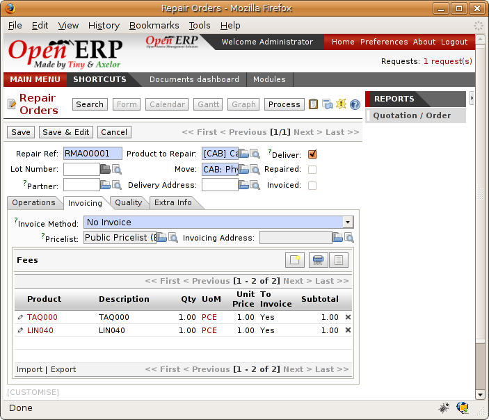

*Second tab.*

The third tab, Quality, is for encoding information about the quality: internal notes, notes for the quotation, corrective actions and preventative actions for example.

Repair workflow
----------------

A defined process handles a repair order – both the repair itself and invoicing the client. The figure below shows this repair process.

*Process for handling a repair.*

Once a repair has been entered onto the system, it is in the 'draft' state. In this state it has no impact on the rest of the system. You can print a quotation from it using the action 'Print Quotation'. The repair quotation can then be sent to the customer.

Once the customer approves the repair, use the menu *Manufacturing > Repairs > Repairs in quotation* to find the draft repair. Click to confirm the draft repair and put it into the running state. You can specify the invoicing mode in the second tab:

* no invoicing,

* invoicing before repair,

* invoicing after repair.

You can confirm the repair operation or create an invoice for the customer depending on this state.

.. index::
   single: Invoicing; Repair

Invoicing the repair
---------------------

When the repair is to be invoiced, an invoice is generated in the draft state by the system. This invoice contains the raw materials used (replaced components) and any other costs such as the time used for the repair. These other costs are entered on the second tab of the repair form.

If the product to be repaired is still under guarantee, Open ERP automatically suggests that the components themselves are not invoiced, but will still use any other defined costs. You can override any of these default values when you're entering the data.

The link to the generated invoice is shown on the second tab of the repair document.

Stock movements and repair
---------------------------

When the repair has been carried out, Open ERP automatically carries out stock movements for components that have been removed, added or replaced on the finished product.

The move operations are carried out using the locations shown on the first tab of the repair document. If a destination location has been specified, Open ERP automatically handles the final customer delivery order when the repair has been completed. This also lets you manage the delivery of the repaired products.

For example, take the case of the cabinet that was produced at the start of this chapter. If you have to replace the shelf PANLAT, you must enter data for the repair as in the figure below.

*Repair of a shelf in a cabinet.*

In this example, you'd carry out the following operations:

* Removal of a PANLAT shelf in the cabinet and put the faulty shelf in the location: *Defective Products*,

* Placement of a new PANLAT shelf that has been taken from stock.

When the repair is ready to be confirmed, Open ERP will generate the following stock moves:

* Put faulty PANLAT into suitable stock location: *Default Production > Defective Products*,

* Consume PANLAT:*Stock > Default production*.

If you analyze the traceability of this lot number you'll see all the repair operations in the upstream and downstream traceability lists of the products concerned.

.. Copyright © Open Object Press. All rights reserved.

.. You may take electronic copy of this publication and distribute it if you don't
.. change the content. You can also print a copy to be read by yourself only.

.. We have contracts with different publishers in different countries to sell and
.. distribute paper or electronic based versions of this book (translated or not)
.. in bookstores. This helps to distribute and promote the Open ERP product. It
.. also helps us to create incentives to pay contributors and authors using author
.. rights of these sales.

.. Due to this, grants to translate, modify or sell this book are strictly
.. forbidden, unless Tiny SPRL (representing Open Object Presses) gives you a
.. written authorisation for this.

.. Many of the designations used by manufacturers and suppliers to distinguish their
.. products are claimed as trademarks. Where those designations appear in this book,
.. and Open ERP Press was aware of a trademark claim, the designations have been
.. printed in initial capitals.

.. While every precaution has been taken in the preparation of this book, the publisher
.. and the authors assume no responsibility for errors or omissions, or for damages
.. resulting from the use of the information contained herein.

.. Published by Open ERP Press, Grand Rosière, Belgium
