========================
Management of production
========================

Production Orders describe the operations that need to be carried out and the raw materials usage for each stage of production, You use the specifications to work out the raw material requirements and the manufacturing orders needed for the finished products.

Manufacturing will have the following consequences:

* Stock reduction: consumption of raw materials,

* Stock increase: production of finished goods,

* Analytic costs: manufacturing operations,

* Added accounting value of stock: by the creation of value following the transformation of products.

.. index:: BoM
.. index:: Bill of Materials

Bills of Materials
===================

Use of Bills of Materials
---------------------------

Bills of Materials are documents that describe the list of raw materials used to make a finished product. To illustrate the concept of specification you're going to work on a cabinet where the manufacturing plan is given by the figure below.

.. image:: images/mrp_armoire.png
    :align: center

*Plan of construction of a cabinet.*

The cabinet is assembled from raw materials and intermediate assemblies:

================ =========================
Product Code     Description
================ =========================
ARM100           Cabinet
PANLAT           Wooden Side Panel
PANA100          Rear Panel
PROFIL           Metal Strut
ETA100           Shelf
PLET100          Shelf Panel
BOIS 002         Wood Panel
TAQ000           Panel Pins
LIN040           Lintel
================ =========================

To describe how to assemble this cabinet, you then define a specification for each intermediate product and for the final cabinet assembly. These are given by the table below.

============  ========  ===============
Product Code  Quantity  Unit of Measure
============  ========  ===============
ARM100        1         Unit
PANLAT        2         m2
PANA100       1         m2
PROFIL        4         m
ETA100        3         Unit
============  ========  ===============

============  ========  ===============
Product Code  Quantity  Unit of Measure
============  ========  ===============
ETA100        1         Unit
PLET100       1         Unit
TAQ0 00       4         Unit
============  ========  ===============

============  ========  ===============
Product Code  Quantity  Unit of Measure
============  ========  ===============
PROFIL        1         Unit
LIN40         0.25      m
============  ========  ===============

============  ========  ===============
Product Code  Quantity  Unit of Measure
============  ========  ===============
PANA100       1         Unit
BOIS002       0.25      m2
============  ========  ===============

============  ========  ===============
Product Code  Quantity  Unit of Measure
============  ========  ===============
PANLAT        2         Unit
BOIS002       0.083     m2
============  ========  ===============

============  ========  ===============
Product Code  Quantity  Unit of Measure
============  ========  ===============
ARM100        1         Unit
PANLAT        2         m2
PANA100       1         m2
PROFIL        4         m
ETA100        3         Unit
============  ========  ===============

The specifications are then used by the software to calculate the raw material needs based on the requirements of the finished products. Then if you want to manufacture 10 cabinets, the system can easily calculate what will be consumed:

============  =================  ===============
Product Code  Quantity           Unit of Measure
============  =================  ===============
BOIS002       2 * 0.083 + 0.25   Unit
LIN040        1                  Unit
BOIS002       0.083 * 3          m2
TAQ000        12                 Unit
============  =================  ===============

.. tip:: **Definition**  *Bill of Materials*

    To see the Bill of Materials in tree view, use the menu *Manufacturing > Configuration > Bill of Materials > Bill of Materials Structure*.

*Bill of Materials structure.*

Use the menu Manufacturing > Configuration > Bill of Materials > New Bill of Materials to define a new Bill of Materials.

.. tip::  **Point**   *The different views*

    To change the view in the Bill of Materials you can:

    * From the list, select a Bill of Materials name and then click *Other View*,

    * From a product form use the menu to the right *Structure of Bill of Materials*. 

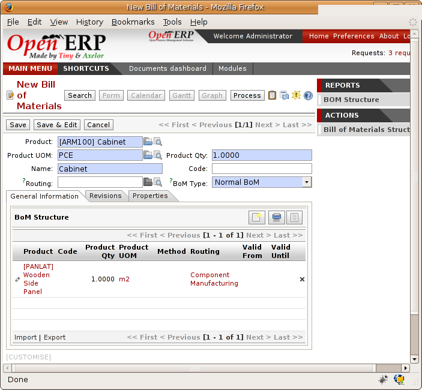

*Screen defining a Bill of Materials.*

In the area below the Bill of Materials you should set the finished product, which will be manufactured or assembled. Once the product has been selected, Open ERP automatically completes the name of the Bill of Materials and the default Unit of Measure for this product.

The type of specification (BoM Type: Phantom or Normal) and the range field will be described in more detail later in the chapter.

After this you can select the raw materials that are used in the manufacture of the finished product. The quantities are expressed in a report based on the quantities of finished product and the quantities needed to produce them from the Bill of Materials.

.. index::
   single: BoM;Revisions

The second tab, Revisions, is used to indicate all the changes made to the specification. After each change you can specify a revision number and some notes on the modifications you carried out.

.. tip::  **More information**  *Simplified View*

The Revisions tab is only visible if the user works in the Extended View mode (which means that the user must belong to the group “Usability / Extended View“.

*Revisions of a Bill of Materials.*

In the third tab, Properties, you can put a free text reference to a plan, a sequence number that is used to determine the priorities between specifications, dates between which the bill of materials is valid, and values for rounding and product efficiency.

Rounding is used to set the smallest Unit of Measure for expressing the quantities of the selected product. So if you set the rounding to 1.00 you're not able to manfuacture half a piece. The efficiency of the product lets you indicate the percentage you lose during manufacture. This loss can be set for the finished product or for each raw materials line. The impact of this efficiency figure is to reserve more raw materials for manufacture than you'd otherwise use just from the Bill of Materials calculations.

The final part of the third tab enables you to set some properties for the product's manufacturing processes. These will be detailed further on in the chapter in a section on configurable products.

.. index::
   single: BoM;Multi-level
   
.. index:: Multi-level BoM

Multi-level Bills of Materials
===============================

In Open ERP each line of a Bill of Materials may itself be a Bill of Materials. So it's possible to define BoMs with several levels. Instead of defining several BoMs for the cabinet in the figure mrp_chest.png you could define the single Bill of Materials below:

ARM100 ; 1 ; Unit
PANLAT ; 2 ; m2
BOIS002 ; 0.166 ; m2
PANA100 ; 1 ; m2
BOIS002 ; 0.25 ; m2
PROFIL ; 4 ; m
LIN040 ; 1 ; m
ETA100 ; 3 ; Unit
PLET100 ; 3 ; Unit
BOIS010 ; 0.249 ; m2
TAQ000 ; 12 ; Unit

Open ERP behaves differently depending on whether the Bill of Materials is defined in several small BoMs each on a single level or in one BoM tree-structured on several levels.

So if you select a BoM using intermediate products that automatically generates production orders based on calculated requirements, Open ERP will propose manufacturing an intermediate product. To manufacture a cabinet, you'd create 6 production orders:

============  ========  ===============
Product Code  Quantity  Unit of Measure
============  ========  ===============
PLET100       3         Unit
BOIS002       0.25      m2
============  ========  ===============

============  ========  ===============
Product Code  Quantity  Unit of Measure
============  ========  ===============
ETA100        3         Unit
PLET100       3         Unit
TAQ000        12        Unit
============  ========  ===============

============  ========  ===============
Product Code  Quantity  Unit of Measure
============  ========  ===============
PROFIL        4         Unit
LIN040        1         Unit
============  ========  ===============

============  ========  ===============
Product Code  Quantity  Unit of Measure
============  ========  ===============
PANA100       1         Unit
BOIS002       0.25      m2
============  ========  ===============

============  ========  ===============
Product Code  Quantity  Unit of Measure
============  ========  ===============
PANA100       2         Unit
BOIS002       0.17      m2
============  ========  ===============

============  ========  ===============
Product Code  Quantity  Unit of Measure
============  ========  ===============
ARM100        1         Unit
PANLAT        2         m2
PANA100       1         m2
PROFIL        4         m
ETA100        3         Unit
============  ========  ===============

In the case where a single Bill of Materials is defined in multiple levels, a single manufacturing order will be generated for each cabinet, including all of the sub-BoMs. You'd then get the following production order:

============  ========  ===============
Product Code  Quantity  Unit of Measure
============  ========  ===============
ARM100        1         Unit
BOIS002       0.17      Unit
BOIS002       0.25      Unit
LIN040        1         Unit
BOIS010       0.25      m2
TAQ000        12        Unit
============  ========  ===============

Table: Single manufacture from a tree-structured BoM

.. index::
   single: Phantom; Bill of Materials

Phantom Bills of Materials
----------------------------

If a finished product is defined using intermediate products that are themselves defined using other BoMs, Open ERP will then propose the manufacture of each intermediate product. This will give several production orders. If you only want a single production order you can define the BoM on several levels.

Sometimes, however, it is useful to define the intermediate product separately and not as part of a multi-level assembly even if you don't want the separate production orders for intermediate products.

In the example, the intermediate product ETA100 is used in the manufacture of several different cabinets. In this case you'd want to define a unique BoM for it even if you didn't want any instances of this product to be built, nor wanted to re-write these elements in a series of different multi-level BoMs.

If you only want a single work order for the complete cabinet, and not one for the BoM itself, you can define the BoM line corresponding to product ETA100 in the cabinet's BoM as type *Phantom*. Then it will automatically put ETA100's BoM contents into the cabinet's work order regardless of whether it's been defined as multi-level.

This way of representing the assembly is very useful because it allows you to define reusable elements of the assembly and keep them isolated.

If you define the BoM for the ARM100 cabinet in the way shown by the table arm100_phantom below, you'll get production orders of the 

============  ========  ===============  ===========
Product Code  Quantity  Unit of Measure  Type of BoM
============  ========  ===============  ===========
ARM100        1         Unit             normal
PANLAT        2         m2               normal
PANA100       1         m2               phantom
PROFIL        4         m                phantom
ETA100        3         Unit             phantom
============  ========  ===============  ===========

Table: arm100_phantom: definition and use of phantom BoMs

============  ========  ===============
Product Code  Quantity  Unit of Measure
============  ========  ===============
ARM100        1         Unit
PANLAT        2         Unit
BOIS002       0.25      Unit
LIN040        1         Unit
BOIS010       0.25      m2
TAQ000        12        Unit
============  ========  ===============

============  ========  ===============
Product Code  Quantity  Unit of Measure
============  ========  ===============
PANLAT        2         Unit
BOIS002       0.17      m2
============  ========  ===============

Table: arm100_phantom_of: generated production orders

Assembly Bills of Materials
-----------------------------

.. tip::  **Point**   *Sales Bills of Materials*

    In some software this is all named Sales Bills of Materials. In Open ERP the term assembly is used because the effect of the Bill of Material is visible not only in sales but also, for example, in the intermediate manufactured products.

Sales Bills of Materials enable you to define assemblies that will be sold immediately but these products could also be used in deliveries and stock management rather than just sold in isolation. For example if you deliver the cabinet in piecesfor self-assembly, set the ARM100 BoM to type 'Assembly'.

When a salesperson creates an order for an ARM100 product, Open ERP automatically changes the ARM100 from components into a packaged for sending to a customer. Then it will ask the storesperson to deliver: 2 PANLAT, 1 PANA100, 4 PROFIL, 3 ETA100. This assembly fully represent an ARM100 not the delivered products.

Example: Large distributor

As an example of using these assemblies, take the case of a supermarket. In a supermarket, you can buy bottles of cola individually or in a pack of 6 bottles. The pack and the bottles are two different products and the barcodes used are also different.

Only the customers have the right to open a pack and take out some bottles for taking them individually to the checkout. The supermarket can't then hold its stock in packs and bottles, but only individually in bottles.

You can then define a Bill of Materials for sale which defines a pack as an assembly of 6 bottles. Then when you've sold a pack, you can find a pack on the invoice or bill of sale but the associated stock operation will still be 6 bottles.

In this case of an assembly, this isn't a production order to transform the product. The transformation is done directly between the order and the set.

.. tip::   **Point** *Assemblies and Purchases*

    The use of assemblies for selling to customers has been presented here, but this functionality works just as well for purchases from suppliers.

    So in the example of a supermarket, you can buy cola in packs and the storesperson will see a number of bottles at goods in reception.

Configurable Bills of Materials
--------------------------------

In Open ERP you can define several Bills of Materials for the same product. In fact you can have several manufacturing methods or several approved raw materials for a given product. You'll see in the following section that the manufacturing procedure (the range) is attached to the Bill of Materials, so the choice of Bill of Materials implicitly includes the operations to carry out. 

Once several Bill of Materials have been defined for a particular product it's necessary to have a system to enable Open ERP to select one of them for use. By default the Bill of Materials with the lowest sequence number is selected by the system.

But to gain more control over the process during the sale or procurement, you can use *properties*. The menu *Production Management > Configuration > Properties* enables you to define properties, which are concept that can be defined arbitrarily to help in the selection of Bills of Materials when you have a choice of BoM.

.. tip::  **Definition** *Properties*

    Properties are a concept that enables the selection of a method for manufacturing a product. They are a common language between the salespeople and the technical people, to enable the salespeople to have an impact on the manufacture of the products using non-technical language and the possibilities decided on by the technicians who define the Bills of Materials.

For example you can define the properties and the following groups:

=====================  ============
Property Group         Property
=====================  ============
Warranty               3 years
Warranty               1 year
Method of Manufacture  Serial
Method of Manufacture  Batch
=====================  ============

Once the Bills of Materials have been defined you could associate the corresponding properties. Then when the salesperson goes to encode a product line he can attach the properties there. If the product must be manufactured, Open ERP will automatically choose the Bill of Materials that matches the defined properties most closely in the order.

Note the properties are only visible in the Bills of Materials and the Sales Management if you're working in the Extended View mode. If you can't see it on your screen add the group Useability / Extended View to your user.

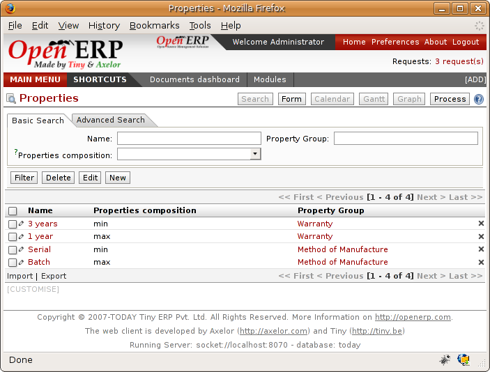

*Properties on a customer order line.*

Example: Manufacturing in a batch or on a production line

As an example, take the manufacture of the cabinet presented above. You can imagine that the company has two methods of manufacturing this cabinet:

* Manually: staff assemble the cabinets one by one and cut the wood plank by plank. This approach is usually used to assembly prototypes. It enables you to have very rapid production but only in small quantities.

* On a production line: staff use machines that are capable of cutting wood by chainsaw. This method is used for production runs of at least 50 items because the lead times using this method are quite lengthy. The start of production is much slower.

You define two Bills of Materials for the same cabinet. To distinguish between them, you will define to properties in the same group: manual assembly and production line assembly. On the quotation, the salesperson will have the possibility of indicating the method of manufacture he wants on each order line, depending on the quantities and the lead time requested by the customer.

.. tip:: **Definition** *Bills of Materials and substitute products*

    In some software, you use the term 'substitute' for this principle of configurable properties in a Bill of Materials.

By putting a Bill of Materials on its own line, you can also implement substitute products. You set the Bill of Materials to type 'Assembly' to make the substitution transparent and for Open ERP not to propose an intermediate production order.

Manufacturing
=============

Once the Bills of Materials have been defined, Open ERP becomes capable of automatically deciding on the manufacturing route depending on the needs of the company.

Production orders can be suggested automatically by the system depending on several criteria described in the preceding chapter:

* Using the 'Make to Order' rules,

* Using the order point rules,

* Using the production plan.

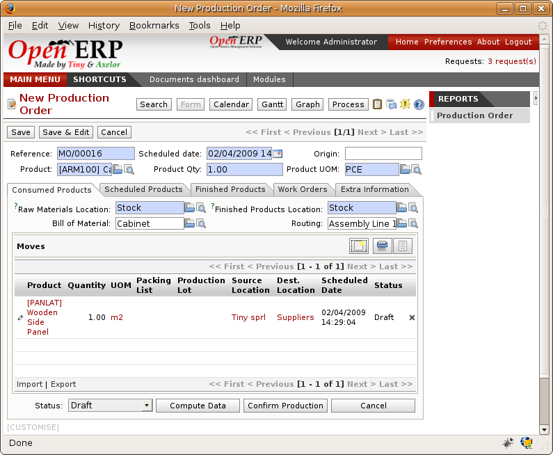

*Automatically suggesting the production orders.*

Clearly it's also possible to start production manually. To do this you can use the menu *Manufacturing > Production Orders > New Production Order*.

If you haven't installed the 'Just-In-Time' planning module ``mrp_jit``, you should start the calculation of requirements for Open ERP managed automatically the production order using the different system rules. To do this use the menu *Manufacturing > Calculate all requirements*.

Workflow for complete production
=================================

To understand the usefulness and the functioning of the system you should test a complete workflow on the new database installed with the demonstration data. In the order you can see:

* The creation of a customer order,

* The manufacturing workflow for an intermediate product,

* The manufacture of an ordered product,

* The delivery of products to a customer,

* Invoicing at the end of the month,

* Traceability for after-sales service.

.. tip:: **Attention**  *Demonstration data*

    To follow the workflow shown below well, it's important to keep the same quantities as in the example and start from a new database so that you don't run into exceptions from a lack of stock.

This case, more advanced, of handling problems of procurement, will be sorted out later in the chapter.

The customer order
-------------------

.. index:: Quotation

Begin by encoding a customer order. To do this, use the menu *Sales Management > Orders > New Quotation*. Enter the following information:

* Customer: Agrolait,

* Shipping Policy: Invoice from picklist (second tab),

* Order Line:

  * Product: PC2 – Basic PC (assemble on demand),

  * Quantity (UoM): 1,

  * Product UoM: PCE,

  * Procure method: Make To Order.

Once the quotation has been entered you can confirm it immediately by clicking the button at the bottom to the right *Confirm Order*. Keep note of the order reference because this follows all through the process. Usually, in a new database, this will be “SO007”. At this stage you can look at the process linked to your order using the 'Process' button above and to the right of the form.

*Process for handling Sales Order SO007.*

Start the requirements calculation using the menu *Manufacturing > Compute All Schedulers*.

.. index::
   Semi Finnished Product

Producing an Intermediate Product
-----------------------------------

To understand the implications of requirements calculation, you must know the configuration of the sold product. To do this, go to the form for product PC2 and click on the link to the right: Bill of Materials. You get the scheme show below which is the composition of the selected product.

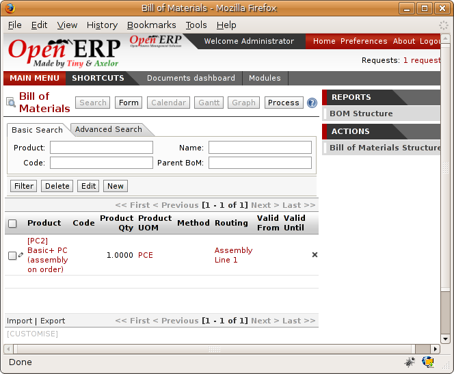

*Composition of product PC2 in the demonstration data.*

You can see that manufacturing the PC2 computer must be done in two steps:

1: Manufacture of the intermediate product: CPU_GEN

2: Manufacture of the finished product using that intermediate product: PC2

The manufacturing supervisor can then consult the product orders using the menu Manufacturing > Production Orders > Production Orders to start. You then get a list of orders to start and the estimated start date if the customer order date is not to be missed.

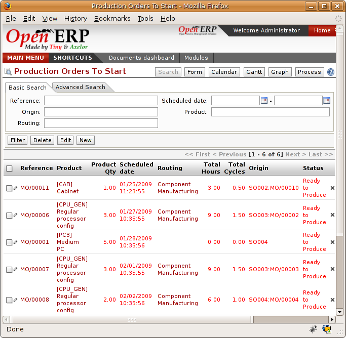

*List of production orders.*

You'll see the production order for CPU_GEN but not that for PC2 because that one depends on an intermediate product. Return to the production order for CPU_GEN and click below it. If there are several of them, select the one corresponding to your order using the reference that contains your order number (in this example SO007).

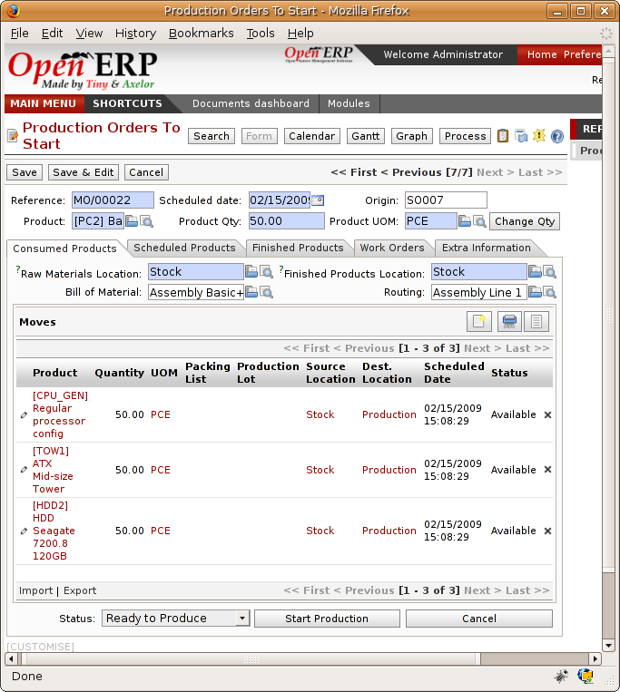

*The detail of a production order.*

The system shows you that you must manufacture product CPU_GEN using the components: MB1, CPU1, FAN, RAM. You can then confirm the production twice:

Start of production: consumption of raw materials,

End of production: manufacture of finished product.

At this stage, you should click to edit the line for the product MB1 to encode a lot number for it. The lot number is usually shown the parent chart, so you should just copy that over. To do that put the cursor in the field Production Lot and press <F1> to create a new lot. Set a lot reference, for example: MB1345678. The system may then show you a warning because this lot is not in stock, but you can ignore this message.

The production order must be in the closed state as shown in the figure below.

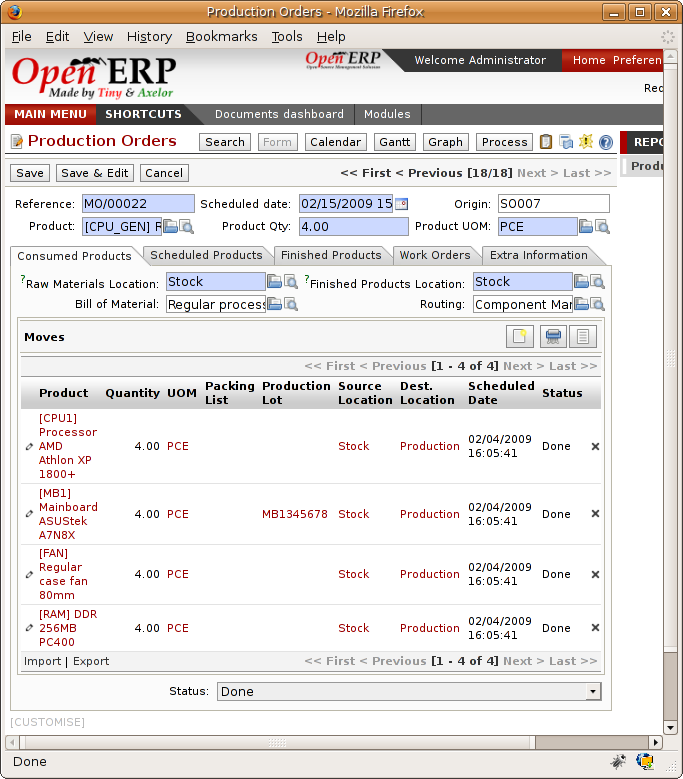

*Production order at the end of the different steps.*

Manufacture of finished product
--------------------------------

Having manufactured the intermediate product CPU_GEN, Open ERP then automatically suggests the manufacture of the computer PC2 using the order created earlier. So return to the menu for production orders to start *Manufacturing > Production Orders > Production Orders to start*.

You'll now find the computer PC2 which has been sold to the customer, as shown in the figure below.

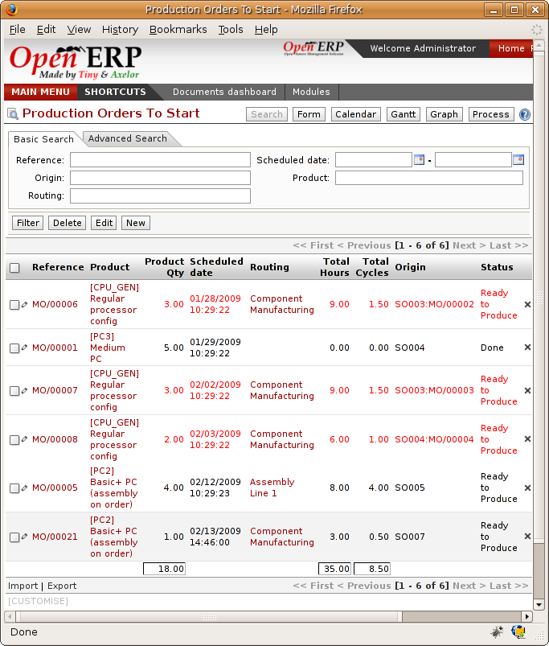

*List of production orders.*

Just as for product CPU_GEN, confirm the production order on two dates: start of production and end of production.

At this stage the product sold to the customer has been manufactured and the raw materials have been consumed and taken out of stock.

.. tip:: **Point**  *Automatic Actions*

    As well as managing the use of materials and the production of stocks, manufacturing can have the following effects which are detailed further on in the chapter:

    * adding value to stock,

    * managing operations for assembly staff,

    * automatically creating analytical accounting entries.

Delivery of product to the customer
--------------------------------------

.. index::
   single: Picking
   single: Packing

When the products have been manufactured, the storesperson automaticallys finds the order in his list of items to do. To see the items waiting for delivery, use the menu Stock Management > Outgoing Products > Available Packings. You'll find there the lists of packing to do, as shown in the figure below.

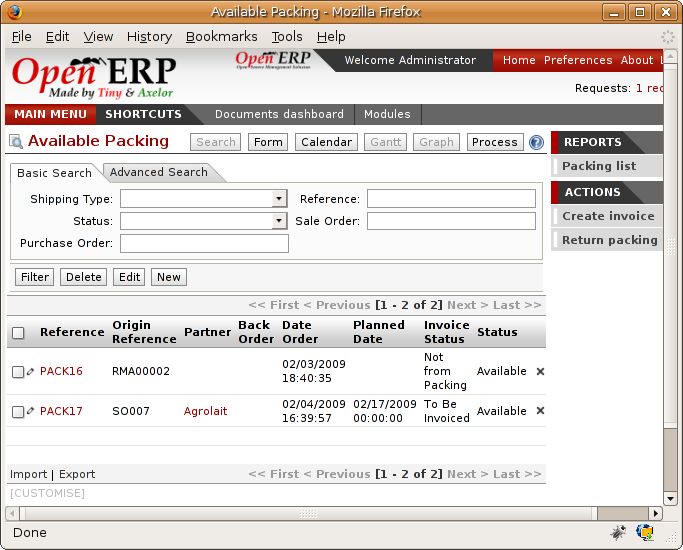

*List of packings to do.*

The packing orders are treated by priority of leaving so the storesperson must begin with the orders at the top of the list. Confirm that your packing list has been create by looking for the customer name (Agrolait) or by its reference (SO007). Click on it and then click the button “Approve”.

.. tip::   **Point** *Packings and Delivery*

    Depending on whether you work in the simplified or extended mode you may have to do a further operation to make a delivery to your customer and so carry out the two steps:

    * pick lists,

    * delivery order.

.. index::
   single: Invoicing; At Delivery

Invoicing at delivery
----------------------

Periodically the administrator or an accountant can send invoices based on the deliveries that have been carried out. To do that, you can use the menu *Stock Management > Outgoing Products > Items to Invoice*. You then get a list of all the deliveries that have been made but haven't yet been invoiced. 

So select some or all of the deliveries. Click on the action “Invoice pickings”. Open ERP asks if you want to group the deliveries from the same partner into a single invoice or if you prefer to invoice for each delivery individually.

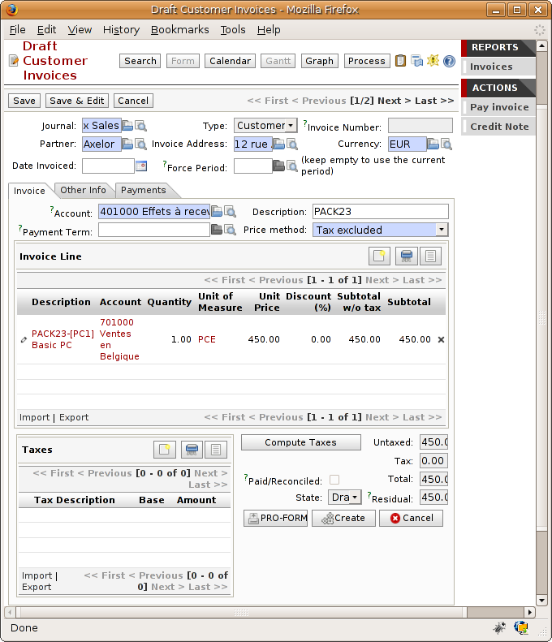

*Invoicing of deliveries.*

Invoices are then produced automatically in the draft state by Open ERP and the orders of deliveries are eventually added if they were configured on the order. You can also modify the invoice before approving them finally.

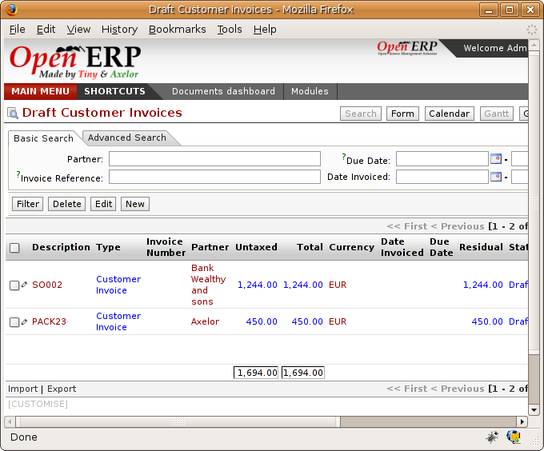

*List of invoices generated by the system based on deliveries.*

Once you have reviewed the different invoices that were generated, you can confirm them one by one or all at once from the actions available to you. Then print the invoices using the multiple print option and send them to your customers by post.

Traceability
-------------

Now suppose that the customer phones you to tell you about a production fault in a delivered product. You can then consult the traceability through the whole manufacturing chain using the serial number indicate on the product MB1. To consult the detailed history, use the menu *Stock Management > Traceability > Production Lots*.

So find the product corresponding to the product or lot number. Once it's been found you can use the following actions:
* Upstream traceability: go back through the entire production chain to various suppliers of the final customer.

* Downstream traceability: follow the production chain to find the final customer of specified components.

Examples of the two traceability types are given in the by the following figures:

.. image:: images/mrp_tracability_upstream.png
    :align: center

*Upstream traceability from customer to suppliers.*

.. image:: images/mrp_tracability_downstream.png
    :align: center

*Downstream traceability from supplier to customers.*

.. index:: Manufacturing Order
.. index:: Production Order

Production order in detail
===========================

In this section production orders are detailed. To open a production order, use the menu Manufacturing > Production Orders > New Product Order. You get a blank for for encoding a new production order as shown in the figure below.

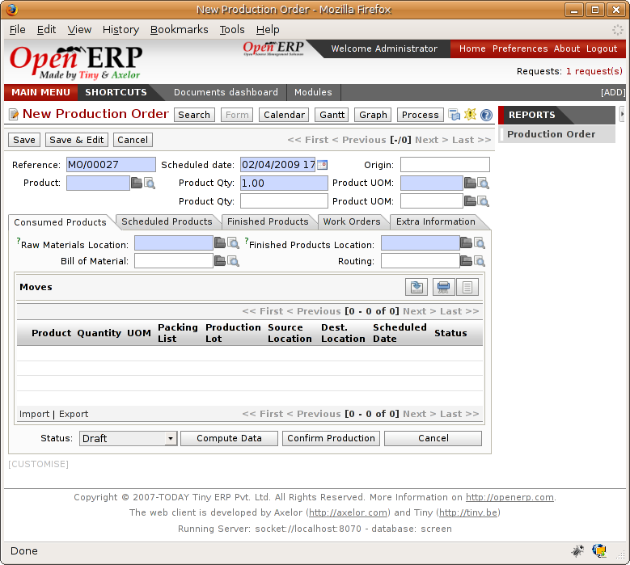

*New production order.*

The production order follows the process given by the figure below.

.. image:: images/mrp_production_processus.png
    :align: center

*Process for handling a production order.*

The date fields, priority and reference, are automatically completed when the form is first opened. Enter the product that you want to produce, and the quantity required. The Unit of Measure by default is completed automatically by Open ERP when the product is first created.

You then have to set two locations:

The location where the required raw materials should be looked for, and

The location for depositing the finished products.

You can put the Stock location in both places for simplicilty. The field Bill of Materials will automatically be completed by Open ERP when you click the button 'Calculate the Requirements'. You can then overwrite it with another BoM to specify something else to use for this specific manufacture.

The tabs 'Planned Products' and 'Works Orders' are also completed automatically when you click 'Calculate the requirements'. You'll find the raw materials there that are required for the production and the operations needed by the assembly staff.

If you want to start production, click the button 'Confirm production', and Open ERP then automatically completes the field 'Products planned'. The information in the first tab can be changed for example if:

* you want to encode a serial number for raw materials,

* you want to change the quantities consumed (lost during production).

For traceability you can take the lot numbers from the raw materials used or from the finished products. To do this click on one of the lines of the first or the third tab. Note the Lot Number.

Once the order is confirmed, you should force the reservation of materials. This means that you're not waiting for the scheduler to assign and reserve the raw materials from your stock for this production. This shortcuts the procurement process. If you don't want to change the priorities, just leave the production order in this state and the scheduler will create a plan based on the priority and your planned date.

To start the production of products, click 'Start Production'. The raw materials are then consumed automatically from stock, which means that the draft movements become 'Done'.

Once the production is complete, click 'Production Finished'. The finished product are then put into stock.

.. index:: Scheduler

Scheduling
===========

Calculation requirements is the calculation engine which makes planning, prioritising and ?? automatically procurement as a function of the rules defined on these products. It's started once per day. You can also start it manually using the menu Manufacturing > Calculate requirements. This then uses the parameters defined in the products, the suppliers and the company to determine the priorities between the different production orders, deliveries and supplier purchases.

You can decide the starting time by modifying the corresponding action in the menu Administration > Configuration > Planning > Planned Actions. Modify the resource called 'Run MRP Scheduler'.

*Configuring the start time for calculating requirements.*

.. tip::   **Technique** *Calculating requirements*

    Scheduling only validates procurement confirmed but not started. These procurement reservations will themselves start production, tasks or purchases depending on the configuration of the requested product.

You take account of the priority of operations in the start of the reservations and procurement. Then the urgent requests or those having a past date or a date sooner than the others will be started first so that if there are not enough products in stock to satisfy all the requests, the most urgent will be produced first.

.. Copyright © Open Object Press. All rights reserved.

.. You may take electronic copy of this publication and distribute it if you don't
.. change the content. You can also print a copy to be read by yourself only.

.. We have contracts with different publishers in different countries to sell and
.. distribute paper or electronic based versions of this book (translated or not)
.. in bookstores. This helps to distribute and promote the Open ERP product. It
.. also helps us to create incentives to pay contributors and authors using author
.. rights of these sales.

.. Due to this, grants to translate, modify or sell this book are strictly
.. forbidden, unless Tiny SPRL (representing Open Object Presses) gives you a
.. written authorisation for this.

.. Many of the designations used by manufacturers and suppliers to distinguish their
.. products are claimed as trademarks. Where those designations appear in this book,
.. and Open ERP Press was aware of a trademark claim, the designations have been
.. printed in initial capitals.

.. While every precaution has been taken in the preparation of this book, the publisher
.. and the authors assume no responsibility for errors or omissions, or for damages
.. resulting from the use of the information contained herein.

.. Published by Open ERP Press, Grand Rosière, Belgium
