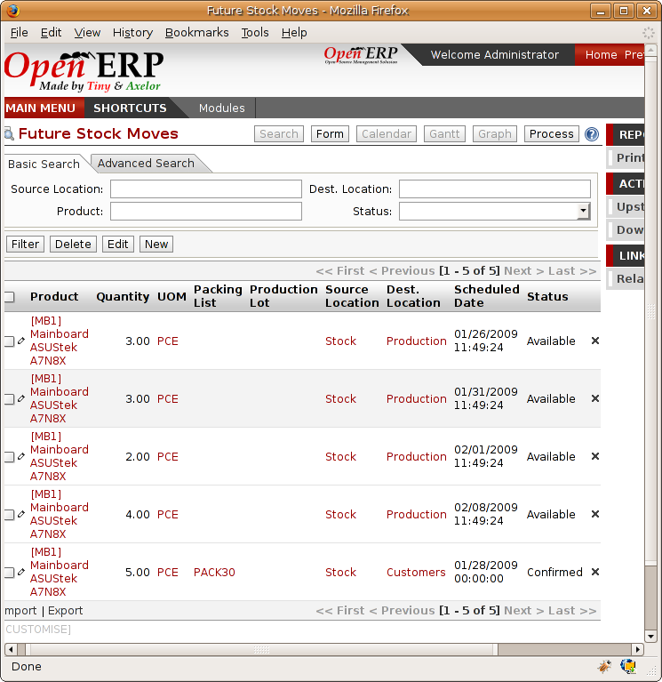
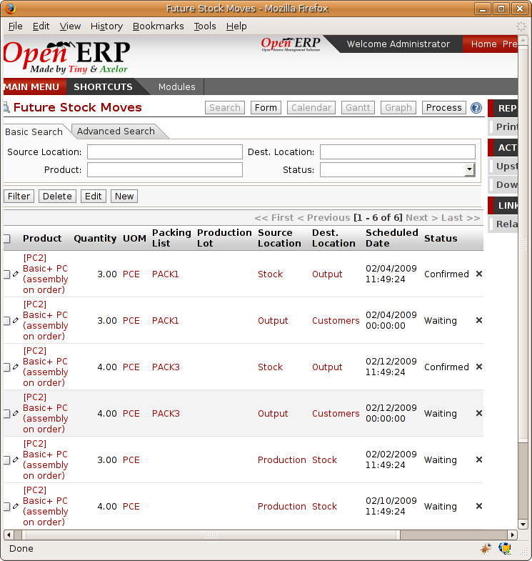

Complete workflow from supplier to customer
===========================================

Now you'll follow a practical example by adapting stock management operations. In order you'll see:

* defining a new product,

* initial setting of inventory,

* receiving products from a supplier,

* delivering to a customer,

* analysis of the state of stock.

Defining a new product
-----------------------

To start, define the following product:

.. table:: *Product Definition*

   ==================== ======================
   Field                Value
   ==================== ======================
   Name                 Central Heating Type 1
   Code                 CCT1
   Product Type         Stockable
   Method of restocking Purchase
   ==================== ======================

Use the menu :menuselection:`Products --> Products`, then click :guilabel:`New` to define a new
product.

.. figure:: images/stock_product.png
   :scale: 75
   :align: center

   *Definition of a new product*

Three fields are important for stock management when you're configuring a new product:

* :guilabel:`Product Type`,

* :guilabel:`Procure Method`,

* :guilabel:`Supply Method`.

Product Types
--------------

The product type indicates if the product is handled in stock management and if Open ERP manages its
procurement. The three distinct product types are:

* :guilabel:`Stockable Product` : this product is used in stock management and its replenishment is
  more or less automated as defined by the rules established in the system. Examples, a bicycle, a
  computer or a central heating system.

* :guilabel:`Consumable` : handled in stock management, you can receive it, deliver it and make it.
  But its stock level isn't managed by the system. Open ERP assumes that you've got sufficient levels
  in stock at all time, so it doesn't restock it automatically. Example, nails.

* :guilabel:`Service` : doesn't appear in the various stock operations. Example, a consulting
  service.

Procure Methods – Make to Stock and Make to Order
-------------------------------------------------

The procure method determines how the product will be replenished:

* :guilabel:`Make to Stock` : your customers are supplied from available stock. You procure a
  set quantity of each product when its stock is too low. Example, a classic distributor.

* :guilabel:`Make to Order` : when a customer order is confirmed, you then procure or manufacture
  the products for this order. A customer order 'Make to Order' won't modify stock in the medium term
  because you restock with the exact amount that was ordered. Example, computers from a large supplier
  assembled on demand.

You find a mix of these two modes used for the different final and intermediate products in most
industries. The procurement method shown on the product form is a default value for the order,
enabling the salesperson to choose the best mode for fulfilling a particular order by varying the 
sales order parameters as needed.

The figures :ref:`fig-stfrst` and :ref:`fig-stfrord` show the change of stock levels for one product 
managed Make to Order and another
managed Make to Stock. The two figures are taken from Open ERP's :guilabel:`Future Stock Forecast` report,
available from the product form.

.. _fig-stfrst:

   *Change in stock for a product managed as Make to Stock*

.. _fig-stfrord:

   *Change in stock for a product managed as Make to Order*

.. note:: Logistical Methods

   The :guilabel:`Make to Stock` logistical approach is usually used for high volumes and when the
   demand is seasonal or otherwise easy to forecast.
   The :guilabel:`Make to Order` approach is used for products that are measured, or very costly to
   stock or have a short re-stocking time.

Supply Methods
---------------

Open ERP supports two supply methods:

* Produce: when the product or service is supplied from internal resources,

* Buy: when the product is bought from a supplier.

These are just the default settings used by the system during automated replenishment. The same
product can be either manufactured internally or bought from a supplier.

These three fields (:guilabel:`Supply Method`, :guilabel:`Procurem Method`, :guilabel:`Product
Type`) determine the system's behaviour when a product is required. The system will generate
different documents depending on the configuration of these three fields when satisfying an order, a
price quotation to a supplier or a manufacturing order.

Open ERP manages both stockable products and services. A service bought from a supplier in
:guilabel:`Make to Order` mode, will generate a subcontract order from the supplier in question.

Figure :ref:`fig-stflow` illustrates different cases for automatic restocking.

.. _fig-stflow:

.. figure:: images/stock_flow.png
   :scale: 90
   :align: center

   *Workflow for automatic procurement, dependent on the configuration of the product*

The table below shows all possible cases for the figure :ref:`fig-stflow`.

.. table:: *Restocking Modes for Make to Stock and Make To Order*

   ================== ===================== =====================
   Mode of restocking Produce               Buy
   ================== ===================== =====================
   MTS                Wait for availability Wait for availability
   MTO                Production Order      Supplier Order
   ================== ===================== =====================

.. table:: *Restocking Modes for Services*

   ================== ===================== =====================
   Mode of restocking Produce               Buy
   ================== ===================== =====================
   MTS                /                     /
   MTO                Create task           Subcontract
   ================== ===================== =====================

You'll see the automated management processes for restocking in detail further on in this chapter.

Units of Measure
----------------

Open ERP supports several units of measure. Quantities of the same product can be expressed in
several units of measure at once. For example you can buy grain by the tonne and resell it by kg.
You just have to make sure that all the units of measure used for a product are in the same units of
measure category.

.. note:: Categories of units of measure

   All units of measure in the same category are convertible from one unit to another.

The table below shows some examples of units of measure and their category. The factor is used to
convert from one unit of measure to another as long as they are in the same category.

.. table:: *Example Units of Measure*

   ========= ============ ======
   UoM       Category     Factor
   ========= ============ ======
   Kg        Weight            1
   Gram      Weight         1000
   Tonne     Weight         0.01
   Hour      Working time      8
   Day       Working time      1
   Half-day  Working time      2
   Item      Unit              1
   100 Items Unit           0.01
   ========= ============ ======

Depending on the table above you have 1Kg = 1000g = 0.001 Tonnes. A product in the ``Weight``
category could be expressed in Kg, Tonnes or Grammes. You can't express them in hours or pieces.

Use the menu :menuselection:`Products --> Configuration --> Units of Measure --> Units of Measure`
to define a new unit of measure.

In the definition of a Unit of Measure, you have a :guilabel:`Rounding precision` factor which shows how
amounts are rounded after the conversion. A value of 1 gives rounding to the level of one unit. 0.01
gives rounding to one hundredth.

.. note::  Secondary Units

   Open ERP supports double units of measure.
   When you use this, the whole of the stock management system is encoded in two units that don't
   have a real link between them.

   This is very useful in the agro-food industry, for example: you sell ham by the piece but invoice
   by the Kg.
   A weighing operation is needed before invoicing the customer.

To activate the management options for double units of measure, assign the group :guilabel:`Useability /
Product UoS View` to your user.

In this case the same product can be expressed in two units of measure belonging to different
categories. You can then distinguish between the unit of stock management (the piece) and the unit
of invoicing or sale (kg).

In the product form you can then set one unit of measure for sales and stock management, and one
unit of measure for purchases.

These units are given suggested titles. For each operation on a product you can use another unit of
measure, as long as it can be found in the same category as the two units already defined. If you
use another unit of measure, Open ERP automatically handles the conversion of prices and quantities.

So if you have 430 Kg of carottes at 5.30 EUR/Kg, Open ERP will automatically make the conversion if
you want to sell in tonnes – 0.43 tonnes at 5300 EUR / tonne. If you had set a rounding factor of
0.1 for the :guilabel:`tonne` unit of measure then Open ERP will tell you that you have only 0.4 tonnes
available.

.. Copyright © Open Object Press. All rights reserved.

.. You may take electronic copy of this publication and distribute it if you don't
.. change the content. You can also print a copy to be read by yourself only.

.. We have contracts with different publishers in different countries to sell and
.. distribute paper or electronic based versions of this book (translated or not)
.. in bookstores. This helps to distribute and promote the Open ERP product. It
.. also helps us to create incentives to pay contributors and authors using author
.. rights of these sales.

.. Due to this, grants to translate, modify or sell this book are strictly
.. forbidden, unless Tiny SPRL (representing Open Object Press) gives you a
.. written authorisation for this.

.. Many of the designations used by manufacturers and suppliers to distinguish their
.. products are claimed as trademarks. Where those designations appear in this book,
.. and Open Object Press was aware of a trademark claim, the designations have been
.. printed in initial capitals.

.. While every precaution has been taken in the preparation of this book, the publisher
.. and the authors assume no responsibility for errors or omissions, or for damages
.. resulting from the use of the information contained herein.

.. Published by Open Object Press, Grand Rosière, Belgium
