Management of production
========================

Production Orders describe the operations that need to be carried out and the raw materials usage
for each stage of production, You use specifications (bills of materials) 
to work out the raw material requirements
and the manufacturing orders needed for the finished products.

Manufacturing has the following results:

* Stock reduction: consumption of raw materials,

* Stock increase: production of finished goods,

* Analytic costs: manufacturing operations,

* Added accounting value of stock: by the creation of value following the transformation of
  products.

.. index:: BoM
.. index:: bill of materials

Bills of Materials
===================

Use of Bills of Materials
---------------------------

Bills of Materials are documents that describe the list of raw materials used to make a finished
product. To illustrate the concept of specification you're going to work on a cabinet where the
manufacturing plan is given by the figure :ref:`fig-mrparm`.

.. _fig-mrparm:

.. figure:: images/mrp_armoire.png
   :scale: 75
   :align: center

   *Plan of construction of a cabinet*

The cabinet is assembled from raw materials and intermediate assemblies:

.. table:: *Product Definitions prior to defining Bills of Materials*

================ =========================
Product Code     Description
================ =========================
ARM100           Cabinet
PANLAT           Wooden Side Panel
PANA100          Rear Panel
PROFIL           Metal Strut
ETA100           Shelf
PLET100          Shelf Panel
BOIS 002         Wood Panel
TAQ000           Panel Pins
LIN040           Lintel
================ =========================

To describe how to assemble this cabinet, you define a bill of materials for each intermediate
product and for the final cabinet assembly. These are given by the table below.

.. table:: *Bills of Materials*

============  ========  ===============
Product Code  Quantity  Unit of Measure
============  ========  ===============
ARM100        1         Unit
PANLAT        2         m2
PANA100       1         m2
PROFIL        4         m
ETA100        3         Unit
============  ========  ===============

============  ========  ===============
Product Code  Quantity  Unit of Measure
============  ========  ===============
ETA100        1         Unit
PLET100       1         Unit
TAQ0 00       4         Unit
============  ========  ===============

============  ========  ===============
Product Code  Quantity  Unit of Measure
============  ========  ===============
PROFIL        1         Unit
LIN40         0.25      m
============  ========  ===============

============  ========  ===============
Product Code  Quantity  Unit of Measure
============  ========  ===============
PANA100       1         Unit
BOIS002       0.25      m2
============  ========  ===============

============  ========  ===============
Product Code  Quantity  Unit of Measure
============  ========  ===============
PANLAT        2         Unit
BOIS002       0.083     m2
============  ========  ===============

============  ========  ===============
Product Code  Quantity  Unit of Measure
============  ========  ===============
ARM100        1         Unit
PANLAT        2         m2
PANA100       1         m2
PROFIL        4         m
ETA100        3         Unit
============  ========  ===============

The bills of materials are then used by the software to calculate the raw material needs based on the
requirements of the finished products. Then if you want to manufacture 10 cabinets, the system can
calculate what will be consumed:

.. table:: *Total Quantities*

============  =================  ===============
Product Code  Quantity           Unit of Measure
============  =================  ===============
BOIS002       2 * 0.083 + 0.25   Unit
LIN040        1                  Unit
BOIS002       0.083 * 3          m2
TAQ000        12                 Unit
============  =================  ===============

.. tip:: Bill of Materials

   To see the Bill of Materials in tree view, use the menu :menuselection:`Manufacturing -->
   Configuration --> Bill of Materials --> Bill of Materials Structure`.

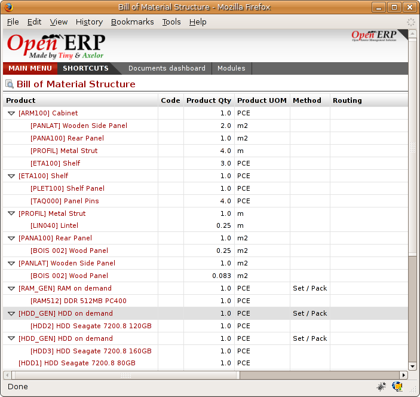

   *Bill of Materials structure*

Use the menu :menuselection:`Manufacturing --> Configuration --> Bill of Materials --> New Bill of
Materials` to define a new Bill of Materials.

.. tip::The different views

    To change the view in the Bill of Materials you can:

    * From the list, select a Bill of Materials name and then click :guilabel:`Other View`,

    * From a product form use the menu :guilabel:`Structure of Bill of Materials` to the right.

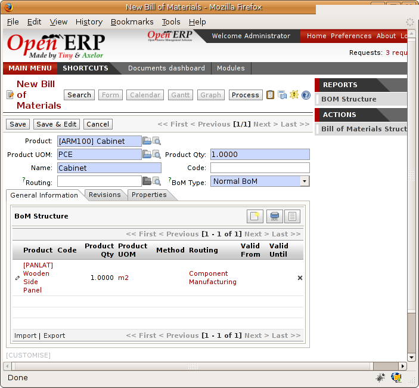

   *Screen defining a Bill of Materials*

In the area below the Bill of Materials you should set the finished product, which will be
manufactured or assembled. Once the product has been selected, Open ERP automatically completes the
name of the Bill of Materials and the default Unit of Measure for this product.

The type of BoM (:guilabel:`BoM Type` : Phantom or Normal) and 
the :guilabel:`Range` field will be described in
more detail later in the chapter.

After this you can select the raw materials that are used in the manufacture of the finished
product. The quantities are set out in a report based on the quantities of finished product and
the quantities needed to produce them from the Bill of Materials.

.. index::
   single: BoM; revisions

The second tab, :guilabel:`Revisions`, is used to indicate all the changes made to the 
Bill of Materials. After each
change you can specify a revision number and some notes on the modifications you carried out.

.. note:: Simplified View

   The Revisions tab is only visible if the user works in the Extended View mode
   (which means that the user must belong to the group ``Usability / Extended View`` .

.. figure:: images/mrp_bom_revision.png
   :scale: 75
   :align: center

   *Revisions of a Bill of Materials*

In the third tab, :guilabel:`Properties`, you can put a free text reference to a plan, 
a sequence number that is
used to determine the priorities between bills of materials, dates between which a bill of materials
is valid, and values for rounding and product efficiency.

:guilabel:`Rounding` is used to set the smallest :guilabel:`Unit of Measure` 
for expressing the quantities of the selected
product. So if you set the rounding to 1.00 you're not able to manufacture half a piece. The
:guilabel:`Efficiency` of the product lets you indicate the percentage you lose during manufacture. This loss
can be set for the finished product or for each raw materials line. The impact of this efficiency
figure is to reserve more raw materials for manufacture than you'd otherwise use just from the Bill
of Materials calculations.

The final part of the third tab lets you set some properties for the product's manufacturing
processes. These will be detailed further on in the chapter in the section on configurable products.

.. index::
   single: BoM; multi-level
   single: multi-level BoM

Multi-level Bills of Materials
===============================

In Open ERP each line of a Bill of Materials may itself be a Bill of Materials. So you can
define BoMs with several levels. Instead of defining several BoMs for the cabinet in the figure
:ref:`fig-mrparm` you could define the single Bill of Materials below:

ARM100 ; 1 ; Unit
PANLAT ; 2 ; m2
BOIS002 ; 0.166 ; m2
PANA100 ; 1 ; m2
BOIS002 ; 0.25 ; m2
PROFIL ; 4 ; m
LIN040 ; 1 ; m
ETA100 ; 3 ; Unit
PLET100 ; 3 ; Unit
BOIS010 ; 0.249 ; m2
TAQ000 ; 12 ; Unit

Open ERP behaves differently depending on whether the Bill of Materials is defined in several small
BoMs each on a single level or in one BoM tree-structured on several levels.

So if you select a BoM using intermediate products that automatically generates production orders
based on calculated requirements, Open ERP will propose manufacturing an intermediate product. To
manufacture a cabinet, you'd create 6 production orders:

.. table:: *Production Orders*

============  ========  ===============
Product Code  Quantity  Unit of Measure
============  ========  ===============
PLET100       3         Unit
BOIS002       0.25      m2
============  ========  ===============

============  ========  ===============
Product Code  Quantity  Unit of Measure
============  ========  ===============
ETA100        3         Unit
PLET100       3         Unit
TAQ000        12        Unit
============  ========  ===============

============  ========  ===============
Product Code  Quantity  Unit of Measure
============  ========  ===============
PROFIL        4         Unit
LIN040        1         Unit
============  ========  ===============

============  ========  ===============
Product Code  Quantity  Unit of Measure
============  ========  ===============
PANA100       1         Unit
BOIS002       0.25      m2
============  ========  ===============

============  ========  ===============
Product Code  Quantity  Unit of Measure
============  ========  ===============
PANA100       2         Unit
BOIS002       0.17      m2
============  ========  ===============

============  ========  ===============
Product Code  Quantity  Unit of Measure
============  ========  ===============
ARM100        1         Unit
PANLAT        2         m2
PANA100       1         m2
PROFIL        4         m
ETA100        3         Unit
============  ========  ===============

In the case where a single Bill of Materials is defined in multiple levels, a single manufacturing
order will be generated for each cabinet, including all of the sub-BoMs. You'd then get the
following production order:

============  ========  ===============
Product Code  Quantity  Unit of Measure
============  ========  ===============
ARM100        1         Unit
BOIS002       0.17      Unit
BOIS002       0.25      Unit
LIN040        1         Unit
BOIS010       0.25      m2
TAQ000        12        Unit
============  ========  ===============

Table: Single manufacture from a tree-structured BoM

.. index::
   pair: phantom; bill of materials

Phantom Bills of Materials
----------------------------

If a finished product is defined using intermediate products that are themselves defined using other
BoMs, Open ERP will then propose the manufacture of each intermediate product. This will give
several production orders. If you only want a single production order you can define a single BoM with
several levels.

Sometimes, however, it is useful to define the intermediate product separately and not as part of a
multi-level assembly even if you don't want separate production orders for intermediate
products.

In the example, the intermediate product ETA100 is used in the manufacture of several different
cabinets. So you'd want to define a unique BoM for it even if you didn't want any
instances of this product to be built, nor wanted to re-write these elements in a series of
different multi-level BoMs.

If you only want a single production order for the complete cabinet, and not one for the BoM itself, you
can define the BoM line corresponding to product ETA100 in the cabinet's BoM as type :guilabel:`Phantom`. Then
it will automatically put ETA100's BoM contents into the cabinet's production order even though
it's been defined as multi-level.

This way of representing the assembly is very useful because it allows you to define reusable
elements of the assembly and keep them isolated.

If you define the BoM for the ARM100 cabinet in the way shown by the table below,
you'll get two production orders when the order is confirmed, as shown in the tables below that.

.. table:: *Definition and use of phantom BoMs*

============  ========  ===============  ===========
Product Code  Quantity  Unit of Measure  Type of BoM
============  ========  ===============  ===========
ARM100        1         Unit             normal
PANLAT        2         m2               normal
PANA100       1         m2               phantom
PROFIL        4         m                phantom
ETA100        3         Unit             phantom
============  ========  ===============  ===========

.. table:: *Production Orders from phantom BoMs*

============  ========  ===============
Product Code  Quantity  Unit of Measure
============  ========  ===============
ARM100        1         Unit
PANLAT        2         Unit
BOIS002       0.25      Unit
LIN040        1         Unit
BOIS010       0.25      m2
TAQ000        12        Unit
============  ========  ===============

============  ========  ===============
Product Code  Quantity  Unit of Measure
============  ========  ===============
PANLAT        2         Unit
BOIS002       0.17      m2
============  ========  ===============

Assembly Bills of Materials
-----------------------------

.. note:: Sales Bills of Materials

    In some software this is named a Sales Bills of Materials.
    In Open ERP the term assembly is used because the effect of the Bill of Materials is visible not
    only in sales but also elsewhere, for example in the intermediate manufactured products.

Assembly Bills of Materials enable you to define assemblies that will be sold directly. These
could also be used in deliveries and stock management rather than just sold in isolation.
For example if you deliver the cabinet in pieces for self-assembly, set the ARM100 BoM to type
``Assembly`` .

When a salesperson creates an order for an ARM100 product, Open ERP automatically changes the ARM100
from a set of components into an identifiable package for sending to a customer. 
Then it asks the storesperson to pack 2 PANLAT, 1 PANA100, 4 PROFIL, 3 ETA100. 
This is described as an ARM100 not just the individual delivered products.

Example: Large distributor
^^^^^^^^^^^^^^^^^^^^^^^^^^

As an example of using these assemblies, take the case of a supermarket. In a supermarket, you can
buy bottles of cola individually or in a pack of 6 bottles. The pack and the bottles are two
different products and the barcodes used are also different.

But customers have the right to open a pack and extract some bottles to take them
individually to the checkout. The supermarket can't track its stock in packs and bottles any more, but
only individually in bottles.

So you can define a Bill of Materials for sale which defines a pack as an assembly of 6 bottles.
Then when you've sold a pack, you can find a pack on the invoice or bill of sale but the associated
stock operation will still be 6 bottles.

In the case of this assembly, this isn't a production order to transform the product. The
transformation is done directly between the order and the set.

.. note:: Assemblies and Purchases

   The use of assemblies for selling to customers has been described here, but this functionality
   works just as well for purchases from suppliers.

   So in the example of a supermarket, you can buy cola in packs and the storesperson will see a
   number of bottles at goods in reception.

Configurable Bills of Materials
--------------------------------

In Open ERP you can define several Bills of Materials for the same product. In fact you can have
several manufacturing methods or several approved raw materials for a given product. You'll see in
the following section that the manufacturing procedure (the routing) is attached to the Bill of
Materials, so the choice of Bill of Materials implicitly includes the operations to make it.

Once several Bill of Materials have been defined for a particular product it's necessary to have a
system to enable Open ERP to select one of them for use. By default the Bill of Materials with the
lowest sequence number is selected by the system.

To gain more control over the process during the sale or procurement, you can use **properties**.
The menu :menuselection:`Production Management --> Configuration --> Properties` enables you to
define properties, which can be defined arbitrarily to help you select a 
Bill of Materials when you have a choice of BoMs.

.. note:: Properties

   Properties is a concept that enables the selection of a method for manufacturing a product.
   Properties define a common language between salespeople and technical people,
   letting the salespeople to have an influence on the manufacture of the products using
   non-technical language and the choices decided on by the technicians who define Bills
   of Materials.

For example you can define the properties and the following groups:

.. table:: *Properties*

=====================  ============
Property Group         Property
=====================  ============
Warranty               3 years
Warranty               1 year
Method of Manufacture  Serial
Method of Manufacture  Batch
=====================  ============

Once the Bills of Materials have been defined you could associate the corresponding properties to them. Then
when the salesperson goes to encode a product line he can attach the properties there. If the
product must be manufactured, Open ERP will automatically choose the Bill of Materials that matches
the defined properties in the order most closely.

Note the properties are only visible in the Bills of Materials and Sales Management if you're
working in the Extended View mode. If you can't see it on your screen add the group ``Useability /
Extended View`` to your user.

.. figure:: images/sale_line_property.png
   :scale: 75
   :align: center

   *Properties on a customer order line*

Example: Manufacturing in a batch or on a production line

As an example, take the manufacture of the cabinet presented above. You can imagine that the company
has two methods of manufacturing this cabinet:

* Manually: staff assemble the cabinets one by one and cut the wood plank by plank. This approach is
  usually used to assembly prototypes. It gets you very rapid production, but at a high cost and
  only in small quantities.

* On a production line: staff use machines that are capable of cutting wood by bandsaw. This method
  is used for production runs of at least 50 items because the lead times using this method are quite
  lengthy. The delay to the start of production is much longer, yet the cost per unit is much lower
  in this volume.

You define two Bills of Materials for the same cabinet. To distinguish between them, you will define
to properties in the same group: ``manual assembly`` and ``production line assembly`` . On the quotation, the
salesperson can set the method of manufacture he wants on each order line, 
depending on the quantities and the lead time requested by the customer.

.. note:: Bills of Materials and substitute products

    In some software, you use the term ``substitute`` for this principle of configurable properties in
    a Bill of Materials.

By putting a Bill of Materials on its own line, you can also implement substitute products. You set
the Bill of Materials to type ``Assembly`` to make the substitution transparent and to prevent Open ERP 
from proposing an intermediate production order.

Manufacturing
=============

Once the Bills of Materials have been defined, Open ERP becomes capable of automatically deciding on
the manufacturing route depending on the needs of the company.

Production orders can be proposed automatically by the system depending on several criteria
described in the preceding chapter:

* Using the ``Make to Order`` rules,

* Using the ``Order Point`` rules,

* Using the Production plan.

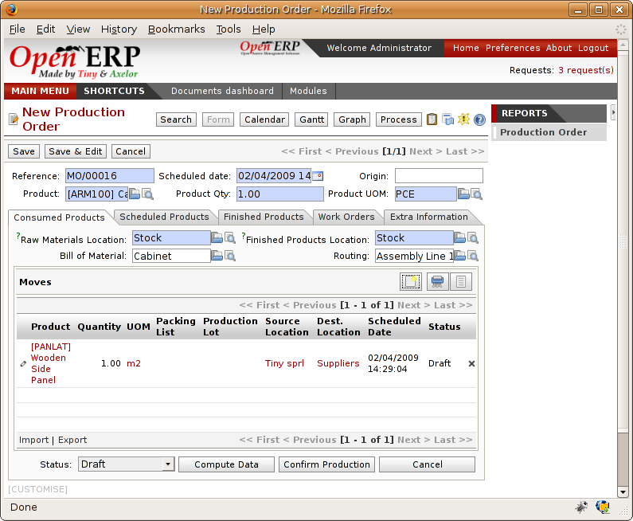

   *Automatically proposing production orders*

Clearly it's also possible to start production manually. To do this you can use the menu
:menuselection:`Manufacturing --> Production Orders --> New Production Order`.

.. index::
   single: module; mrp_jit

If you haven't installed the Just-In-Time planning module :mod:`mrp_jit`, you should start
using Open ERP to schedule the Production Orders automatically using the
various system rules. To do this use the menu :menuselection:`Manufacturing --> Compute All Schedulers`.

Workflow for complete production
=================================

To understand the usefulness and the functioning of the system you should test a complete workflow
on the new database installed with the demonstration data. In the order you can see:

* The creation of a customer order,

* The manufacturing workflow for an intermediate product,

* The manufacture of an ordered product,

* The delivery of products to a customer,

* Invoicing at the end of the month,

* Traceability for after-sales service.

.. tip:: Demonstration data

    To follow the workflow shown below exactly, you should keep the same quantities as in the
    example and start from a new database. Then you won't run into exceptions that would result
    from a lack of stock.

This more advanced case of handling problems in procurement, will be sorted out later in the
chapter.

The customer order
------------------

.. index:: quotation

Begin by encoding a customer order. To do this, use the menu :menuselection:`Sales Management -->
Sales Orders -> New Quotation`. Enter the following information:

* :guilabel:`Customer` : Agrolait,

* :guilabel:`Shipping Policy` : Invoice from picklist (second tab),

* :guilabel:`Order Line` :

  * :guilabel:`Product` : PC2 – Basic PC (assemble on demand),

  * :guilabel:`Quantity (UoM)` : 1,

  * :guilabel:`Product UoM` : PCE,

  * :guilabel:`Procure method` : Make To Order.

Once the quotation has been entered you can confirm it immediately by clicking the button
:guilabel:`Confirm Order` at the bottom to the right. Keep note of the order reference because this
follows all through the process. Usually, in a new database, this will be ``SO007`` . At this stage
you can look at the process linked to your order using the :guilabel:`Process` button above and to the right
of the form.

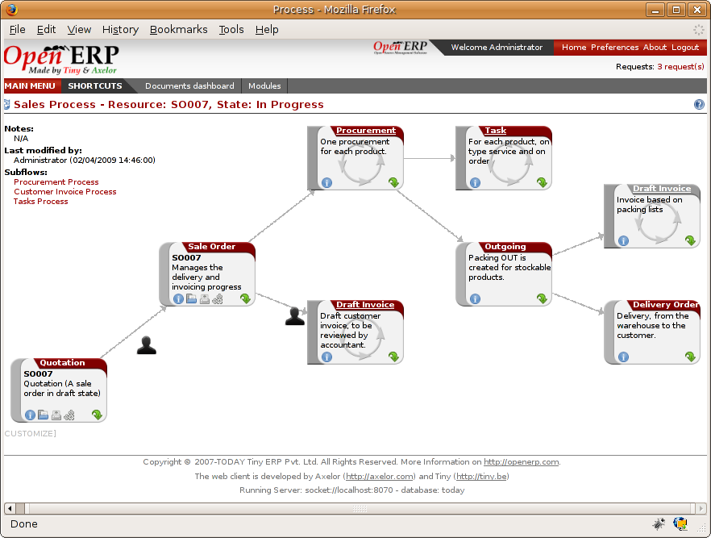

   *Process for handling Sales Order SO007*

Start the requirements calculation using the menu :menuselection:`Manufacturing --> Compute All
Schedulers`.

.. index::
   single: semi-finished product

Producing an Intermediate Product
-----------------------------------

To understand the implications of requirements calculation, you must know the configuration of the
sold product. To do this, go to the form for product PC2 and click on the link :guilabel:`Bill of
Materials` to the right. You get the scheme shown in :ref:`fig-mrpbomtree` which is the composition 
of the selected product.

.. _fig-mrpbomtree:

.. figure:: images/mrp_product_bom_tree.png
   :scale: 75
   :align: center

   *Composition of product PC2 in the demonstration data*

Manufacturing the PC2 computer must be done in two steps:

1: Manufacture of the intermediate product: CPU_GEN

2: Manufacture of the finished product using that intermediate product: PC2

The manufacturing supervisor can then consult the product orders using the menu
:menuselection:`Manufacturing --> Production Orders --> Production Orders To Start`. You then get a
list of orders to start and the estimated start date to meet the ordered customer delivery date.

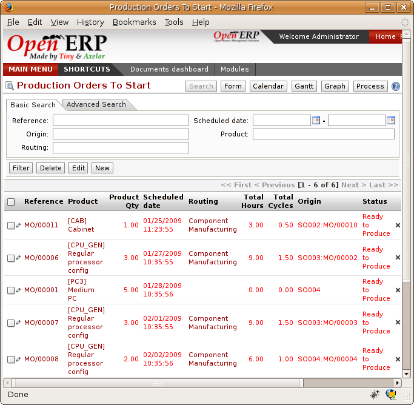

   *List of production orders*

You'll see the production order for CPU_GEN but not that for PC2 because that one depends on an
intermediate product. Return to the production order for CPU_GEN and click below it. If there are
several of them, select the one corresponding to your order using the reference that contains your
order number (in this example ``SO007`` ).

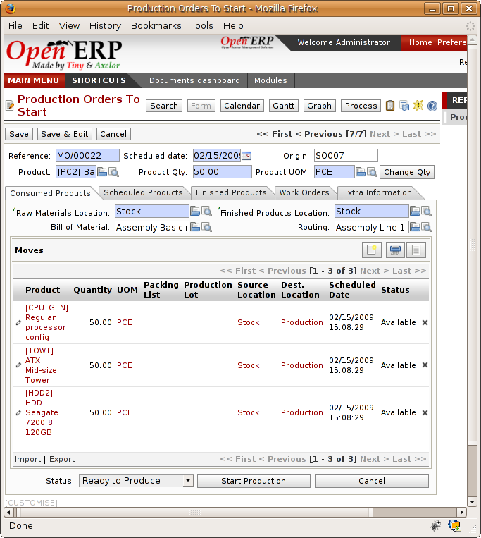

   *The detail of a production order*

The system shows you that you must manufacture product CPU_GEN using the components: MB1, CPU1, FAN,
RAM. You can then confirm the production twice:

Start of production: consumption of raw materials,

End of production: manufacture of finished product.

At this stage, you should click to edit the line for the product MB1 to enter a lot number for it.
The lot number is usually shown the parent chart, so you should just copy that over. To do that put
the cursor in the field :guilabel:`Production Lot` and press :kbd:`<F1>` to create a new lot. Set a lot
reference, for example: ``MB1345678`` . The system may then show you a warning because this lot is not in
stock, but you can ignore this message.

The production order must be in the closed state as shown in the figure :ref:`fig-mrpprdfrm`.

.. _fig-mrpprdfrm:

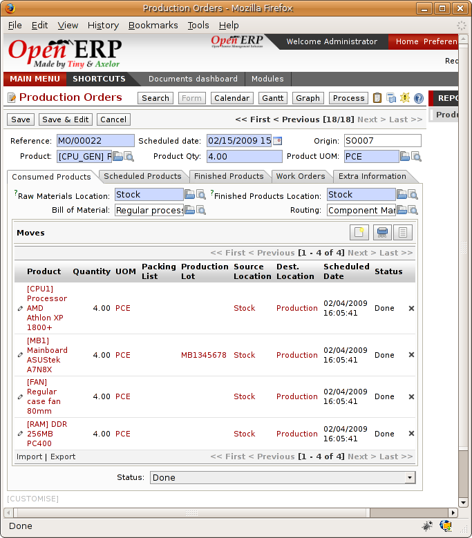

   *Production order after the different stages*

Manufacture of finished product
--------------------------------

Having manufactured the intermediate product CPU_GEN, Open ERP then automatically proposes the
manufacture of the computer PC2 using the order created earlier. So return to the menu for
production orders to start :menuselection:`Manufacturing --> Production Orders --> Production Orders
to start`.

You'll find computer PC2 which has been sold to the customer, 
as shown in the figure :ref:`fig-mrpprdlis`.

.. _fig-mrpprdlis:

.. figure:: images/mrp_production_list_end.png
   :scale: 75
   :align: center

   *List of production orders*

Just as for product CPU_GEN, confirm the production order between two dates: start of production and end
of production. 

.. todo:: Between two dates? What does that mean?

The product sold to the customer has now been manufactured and the raw materials have been
consumed and taken out of stock.

.. tip:: Automatic Actions

    As well as managing the use of materials and the production of stocks,
    manufacturing can have the following automatic effects which are detailed further on in the
    chapter:

    * adding value to stock,

    * generating operations for assembly staff,

    * automatically creating analytical accounting entries.

Delivery of product to the customer
--------------------------------------

.. index::
   single: picking
   single: packing

When the products have been manufactured, the storesperson automatically finds the order in his
list of items to do. To see the items waiting for delivery, use the menu :menuselection:`Stock
Management --> Outgoing Products --> Available Packing`. You'll find lists of packing to
be done, there, as shown in the figure :ref:`fig-mrppacko`.

.. _fig-mrppacko:

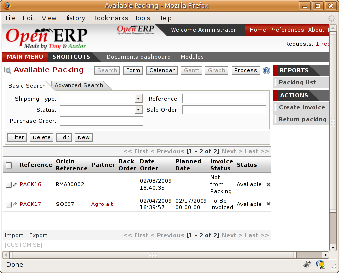

   *List of packing operations to be done*

The packing orders are presented in priority order of despatch 
so the storesperson must begin with the orders
at the top of the list. Confirm that your packing list has been created by looking for the customer
name ( ``Agrolait`` ) or by its reference ( ``SO007`` ). Click on it and then click the button
:guilabel:`Approve`.

.. tip:: Packing and Delivery

    Depending on whether you work in the simplified or extended mode you may need a further
    step to make a delivery to your customer, so you'd have to carry out the two steps:

    * picking list,

    * delivery order.

.. index::
   single: invoicing; at delivery

Invoicing at delivery
----------------------

Periodically the administrator or an accountant can send invoices based on the deliveries that have
been carried out. To do that, you can use the menu :menuselection:`Stock Management --> Outgoing
Products --> Packing to Invoice --> Packing by Invoice Method`. 
You then get a list of all the deliveries that have been made but
haven't yet been invoiced.

So select some or all of the deliveries. Click on the action :guilabel:`Create Invoice`. Open ERP asks
if you want to group the deliveries from the same partner into a single invoice or if you'd prefer to
invoice for each delivery individually.

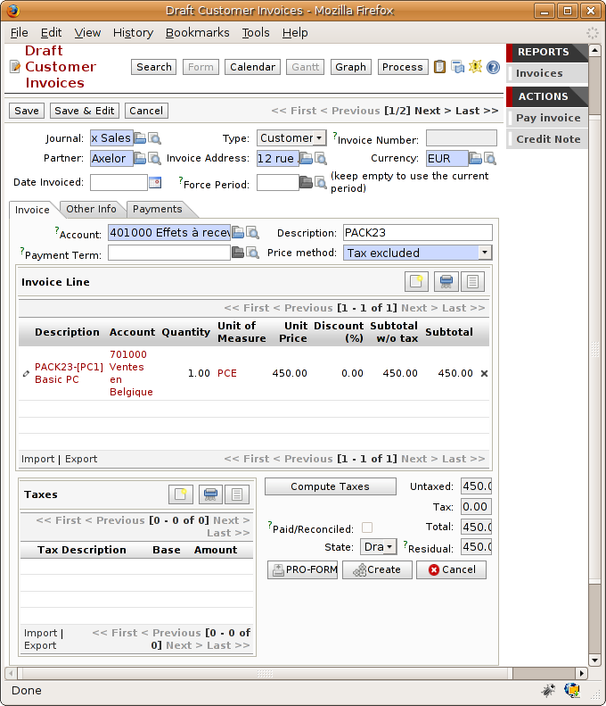

   *Invoicing of deliveries*

Invoices are generated automatically in the ``Draft`` state by Open ERP. 
You can modify invoices before approving them finally.

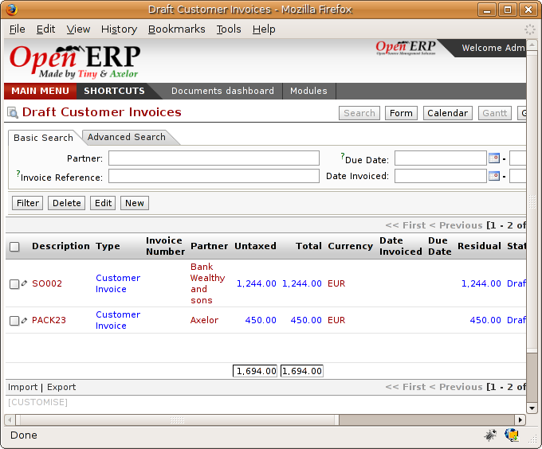

   *List of invoices generated by the system based on deliveries*

Once you have reviewed the different invoices that were generated, you can confirm them one by one
or all at once by using the available actions. Then print the invoices using the multiple print
option and send them to your customers by post.

Traceability
-------------

Now suppose that the customer phones you to tell you about a production fault in a delivered
product. You can consult the traceability through the whole manufacturing chain using the
serial number indicated on the product MB1. To look through the detailed history, use the menu
:menuselection:`Stock Management --> Traceability --> Production Lots`.

Find the product corresponding to the product or lot number. Once it's been found you can use the
following actions:

.. index::
   single: traceability; upstream

* Upstream traceability: trace where an identified component has been used, from the product
  that it was used on to the customer that currently has it, if it has been tracked. 
  (Note that the name is confusing - this would normally be considered a downstream direction.) 

.. index::
   single: traceability; downstream

* Downstream traceability: trace where the components of an identified product at a
  customer came from. 
  (Note that the name is confusing - this would normally be considered an upstream direction.) 

Examples of the two traceability types are given in the by the 
figures :ref:`fig-mrptracu` and :ref:`fig-mrptracd`:

.. _fig-mrptracu:

.. figure:: images/mrp_tracability_upstream.png
   :scale: 75
   :align: center

   *Upstream traceability from supplier to customers*

.. _fig-mrptracd:

.. figure:: images/mrp_tracability_downstream.png
   :scale: 75
   :align: center

   *Downstream traceability from customer to suppliers*

.. index:: 
   single: manufacturing order
   single: production order
   single: order; manufacturing
   single: order; production

Production order in detail
===========================

To open a Production Order, use the menu
:menuselection:`Manufacturing --> Production Orders --> New Production Order`. You get a blank form for
entering a new production order as shown in the figure :ref:`fig-mrpprdnew`.

.. _fig-mrpprdnew:

.. figure:: images/mrp_production_new.png
   :scale: 75
   :align: center

   *New production order*

The production order follows the process given by the figure :ref:`fig-mrpprdproc`.

.. _fig-mrpprdproc:

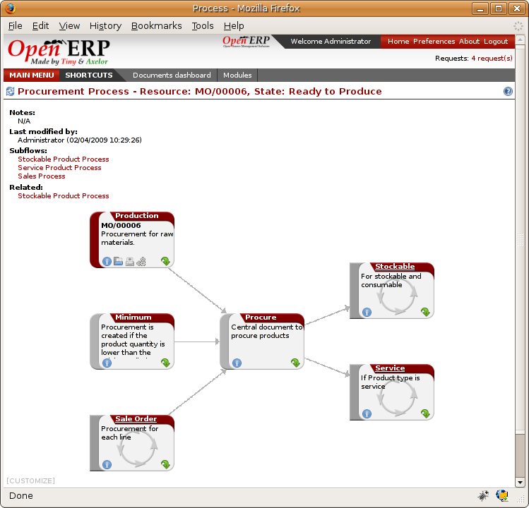

   *Process for handling a production order*

The date fields, priority and reference, are automatically completed when the form is first opened.
Enter the product that you want to produce, and the quantity required. The :guilabel:`Product UOM` by
default is completed automatically by Open ERP when the product is first created.

You then have to set two locations:

The location from which the required raw materials should be found, and

The location for depositing the finished products.

For simplicity, put the ``Stock`` location in both places. The field :guilabel:`Bill of Materials` will
automatically be completed by Open ERP when you click the button :guilabel:`Compute Data`. You
can then overwrite it with another BoM to specify something else to use for this specific
manufacture.

The tabs :guilabel:`Planned Products` and :guilabel:`Work Orders` are also completed automatically when you click
:guilabel:`Compute Data`. You'll find the raw materials there that are required for
the production and the operations needed by the assembly staff.

If you want to start production, click the button :guilabel:`Confirm Production`, and Open ERP then
automatically completes the :guilabel:`Moves` fields in the :guilabel:`Consumed Products` and
:guilabel:`Finished Products` fields. 
The information in the :guilabel:`Consumed Products` tab can be changed if:

* you want to enter a serial number for raw materials,

* you want to change the quantities consumed (lost during production).

For traceability you can set lot numbers on the raw materials used, or on the finished
products. To do this click on one of the lines of the first or the third tab. 
Note the :guilabel:`Production lot` and :guilabel:`Tracking lot` numbers.

Once the order is confirmed, you should force the reservation of materials
using the :guilabel:`Force Reservation` button. This means that you don't have
to wait for the scheduler to assign and reserve the raw materials from your stock for this
production run. This shortcuts the procurement process. 

If you don't want to change the priorities, just
leave the production order in this state and the scheduler will create a plan based on the priority
and your planned date.

.. todo:: Report that State is not shown on a Production Order

To start the production of products, click :guilabel:`Start Production`. The raw materials are then
consumed automatically from stock, which means that the draft ( ``Waiting`` ) movements become ``Done`` .

Once the production is complete, click :guilabel:`Production Finished`. The finished products are
then moved into stock.

.. index:: 
   single: scheduler
   single: requirements planning

Scheduling
===========

The requirements scheduler is the calculation engine which plans and prioritises production
and purchasing automatically from the rules defined on these products. It's started once
per day. You can also start it manually using the menu :menuselection:`Manufacturing --> Compute All
Schedulers`. This uses all the relevant parameters defined in the products, the suppliers and the company
to determine the priorities between the different production orders, deliveries and supplier
purchases.

You can set the starting time by modifying the corresponding action in the menu
:menuselection:`Administration --> Configuration --> Scheduler --> Scheduled Actions`. Modify the
``Run MRP Scheduler`` configuration document.

.. figure:: images/stock_cron.png
   :scale: 75
   :align: center

   *Configuring the start time for calculating requirements*

.. tip::  Calculating requirements / scheduling

    Scheduling only validates procurement confirmed but not started. These procurement reservations
    will themselves start production, tasks or purchases depending on the configuration of the
    requested product.

You take account of the priority of operations in starting reservations and procurement.
The urgent requests, or those with a date in the past, or those with a date earlier than the others will be
started first so that if there are not enough products in stock to satisfy all the requests, the
most urgent will be produced first.

.. Copyright © Open Object Press. All rights reserved.

.. You may take electronic copy of this publication and distribute it if you don't
.. change the content. You can also print a copy to be read by yourself only.

.. We have contracts with different publishers in different countries to sell and
.. distribute paper or electronic based versions of this book (translated or not)
.. in bookstores. This helps to distribute and promote the Open ERP product. It
.. also helps us to create incentives to pay contributors and authors using author
.. rights of these sales.

.. Due to this, grants to translate, modify or sell this book are strictly
.. forbidden, unless Tiny SPRL (representing Open Object Press) gives you a
.. written authorisation for this.

.. Many of the designations used by manufacturers and suppliers to distinguish their
.. products are claimed as trademarks. Where those designations appear in this book,
.. and Open Object Press was aware of a trademark claim, the designations have been
.. printed in initial capitals.

.. While every precaution has been taken in the preparation of this book, the publisher
.. and the authors assume no responsibility for errors or omissions, or for damages
.. resulting from the use of the information contained herein.

.. Published by Open Object Press, Grand Rosière, Belgium
