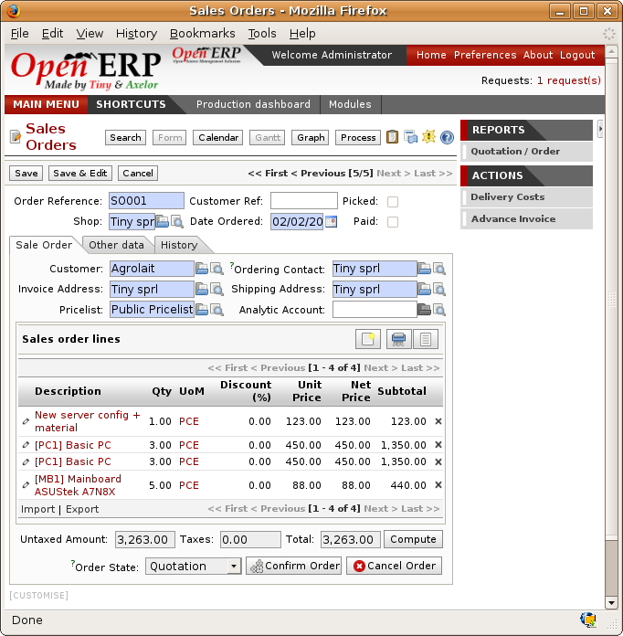
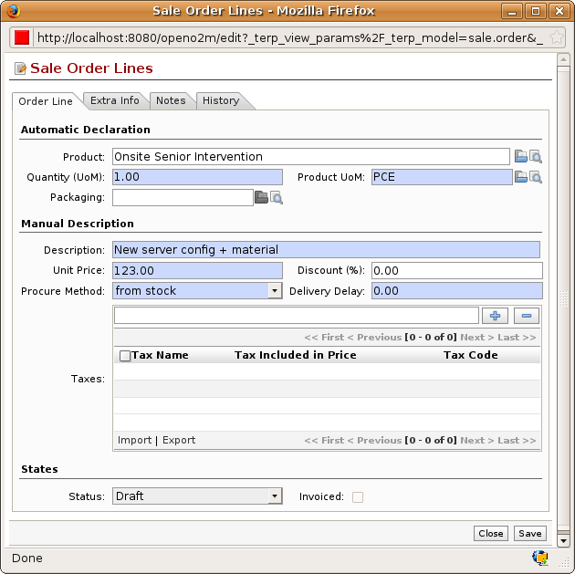
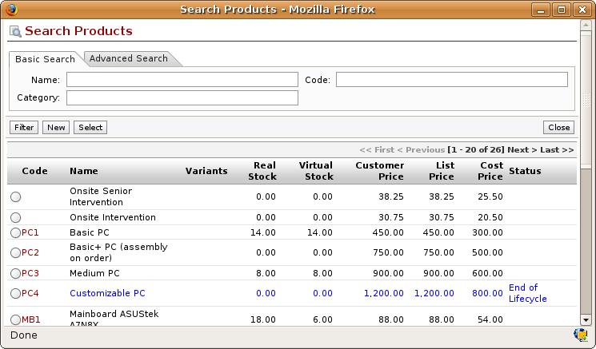
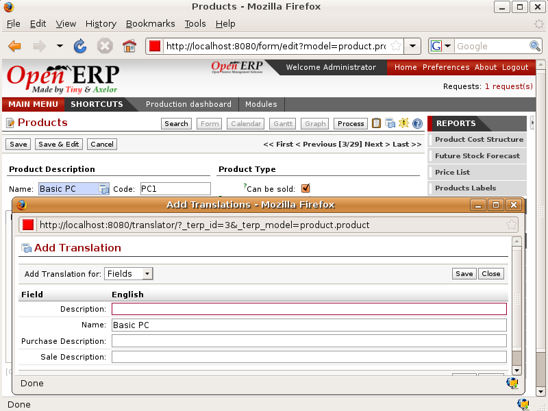
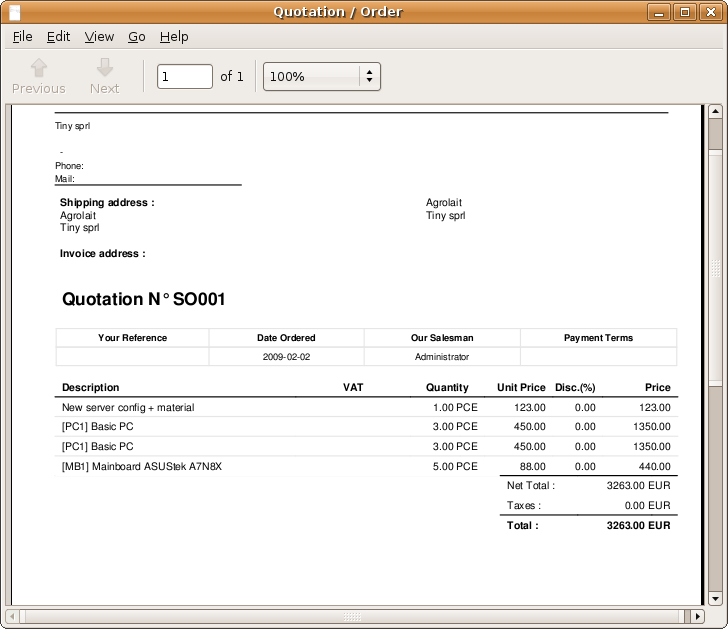
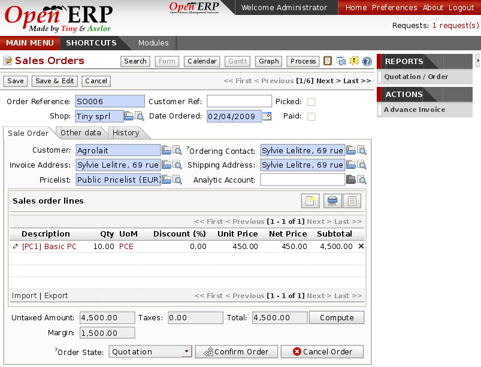
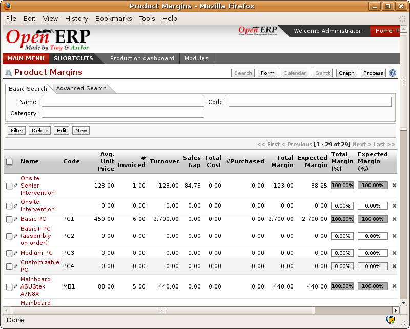
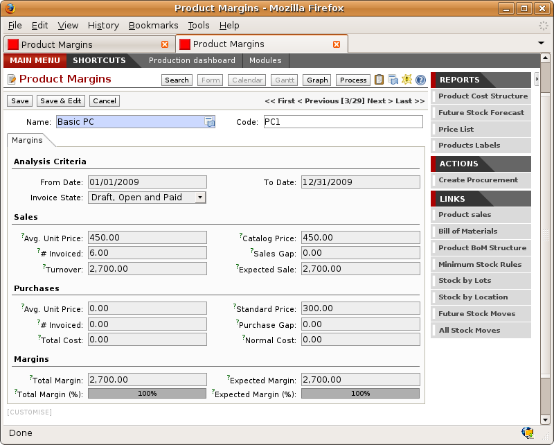
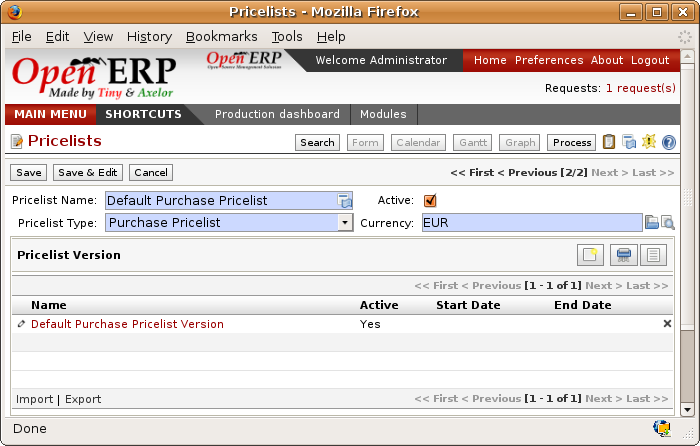
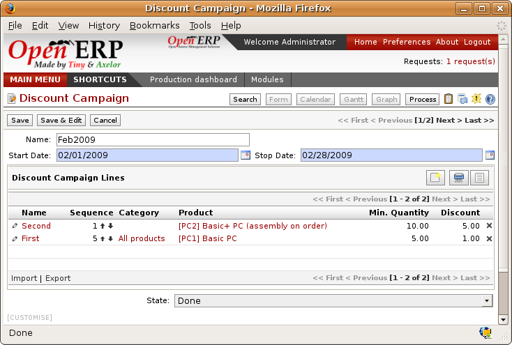

.. index:: Sales

Management of Sales
^^^^^^^^^^^^^^^^^^^^

Summary

* Quotation

* Sales Order

* Sales Workflow

* Advanced Management

Keywords

order

quotation

control

delivery

invoicing

*This chapter is for sales management in Open ERP, handling the complete order process from quotation to customer order, including control of deliveries and invoicing.*

*It doesn't look at customer relations and pre-sales. These functions are handled by the CRM (Customer Relationship Management) modules.*

Estimation of the order
------------------------

In Open ERP a quotation and an order are handled by the same object, but in different states. You can consider an order to be a quotation that has evolved because it has been confirmed by the customer. Or, conversely, that a quotation is an order that hasn't yet been validated or cancelled. All of the orders and quotations in the system can be reached using the menu *Sales Management > Orders*.

Entering Quotation details
-------------------------------

To enter details of a new quotations you can use the menu *Sales Management > Orders > New Quotation*. Open ERP then opens a new window so that you can enter data into new blank quotation form.

*Data entry for a new quotation.*

Some information is automatically completed by the system:

* an internal reference for the quotation or order,

* the point of sale that the order will be expedited from,

* the order date.

You can modify any of that information before validating the quotation. You can see the customer reference in the header of the order. This optional field represent's the customer's own reference number – if the customer doesn't supply one then just leave it empty.

You then enter all the data about the order in the tab 'Customer Order'. Start by entering the customer name, selecting the correct customer from the list of customers in the system. You can create a new customer on the fly at this stage if necessary – press <F1> in the corresponding field.

Once the customer name has been selected, different fields of the order become completed automatically, based on the configuration of the partner form for the selected customer:

* Order Address: person handling the order at the customer. By default, Open ERP proposes the Contact Address at the selected partner.

* Delivery Address: address used on the delivery order. By default, Open ERP proposes the Delivery address from the partner form. If nothing is defined in that slot, it uses the default address instead.

* Invoice Address: address used to send the invoice to the customer. By default, Open ERP proposes the address labelled “Invoice” from the partner form. If nothing is defined there, it uses the default address instead.

* Price List: will determine both the currency of the quotation and the price that will be used for each product

* Payment Conditions: shows the payment mode that the customer will follow, for example “50% on order, 50% on delivery”

* Delivery Method: for example “Post – Express Mail”

You can modify any of these fields on the order as you go.

You can also indicate an analytic account for your order. This account will be used during invoicing to automatically generate accounting entries corresponding to the invoice. This is extremely useful for assigning revenues to the project or case specified by this order.

    .. tip::   *Point*   Analytic Accounts

        If you're managing by task, the analytic account to be selected is the one that corresponds to the project for the order. The sale carried out by the order can be allotted to the project so that profitability calculations can be made.

Once the information has been entered, you can enter data for the order lines. To do that, create a new order line as shown in the figure below:

*Entering an new customer order line.*

First of all select the product that is to be sold to the customer. Open ERP gives you all the useful information for your sale in the list of products it provides:

* Real stock: physically present in your warehouses. This value depends on the sale point selected in the order header. Different sale points can be linked to different warehouses, giving different stock levels, or can use the same warehouse.

* Virtual stock: shows a salesperson the quantity that can be sold, taking into account both stock reserved for other orders and quantities that could arrive in the short term.

* The Customer Price: depends on the conditions attached to the customer, calculated on the list price. This is the price that's proposed by default in the customer quotation, unless it's been modified by the salesperson.

* The List Price: the base sale price for the given product. It provides a base for the salesperson to be able to judge whether to offer a discount to the customer, and how much any discount should be.

* The Standard Cost: shows the cost price of the product. If the salesperson sells at less than this figure, then the company loses money.

*Selecting a product in a Sales Order.*

When the product that's to be sold to the customer has been selected, Open ERP automatically completes all the other required fields: price, unit of measure, description, discount, lead times, applicable taxes, default packaging and the product description. All of this information comes from the product form.

  .. tip::   *Point*   Visible Discount

    By default, the customer discount is directly included in the sale price to the customer. He'll then see a discount of 0% but a reduced unit procie. If you install the module ``product_visible_discount`` you can configure whether you want to make the discount explicitly visible on the order form, or just reduce the unit price.

In the form, the selected product is presented in the language of the user so that he can understand what he's selling. The description of the product sold is presented in the customer's language. This language is used on the quotation or order when it's printed for the customer.

*Sale of a product in a partner language that differs from the user language.*

  .. tip::   *Point*   Exceptional Sales

    If a product's only sold to a customer once, you don't have to enter data into a complete new product form just for that sale. You can manually complete all the information in the order without putting it into a product: description, price, quantity, lead time, taxes. In that case Open ERP won't generate a delivery note because the product isn't held in stock.

When all of the products are entered, you can print the quotation and send it to the customer. To do this, click on the report to the right *Quotation / Order*. Open ERP then opens the quotation in PDF to enable to you to see it before printing.

*Printing a customer quotation.*

You can then confirm the quotation to move it on to an order if the order is confirmed by the customer, or just cancel the window without confirming the order to leave it in quotation state. To find all of the current quotations, you can use the menu *Sales Management > Orders > My Orders > My Quotations*.

To follow the process for your order, you can click on the process view from the order form. Open ERP then shows you an interactive process view of that order. For more information about its use, look at the chapter on Process.

*Process view from following a customer order.*

Management of Packaging
========================

Certain products can be managed in several different packaged forms. For example if you sell batteries you can define the following packages for a given battery product:

* by Piece: a battery

* Blister: a pack of 4 batteries

* Pack of 100 blisters: 400 batteries

* Palette, containing 40 packs for a total of 16,000 batteries.

Open ERP's packaging management enables you to sell the same product in several different forms. The salesperson could sell, independently, one battery or a palette of batteries. In the order, you can select the default packaging type as a function of the quantities ordered.

For example, if the customer wants to buy 30,000 batteries, the salesperson will select the packaing “palette”. Open ERP will then propose the sale of 32,000 batteries, which corresponds to two palettes, or of 75 packs.

The available packages are defined in the product form, in the *Packaging* tab. The first one on the list is the one that will be used by default.

Once a package has been defined on the order, Open ERP will throw up an alert if the ordered quantities don't correspond to the proposed packages. The quantity must be a multiple of the field *Quantity of items* defined on the packaging form.

.. image:: images/sale_warning_packaging.png
    :align: center

*Alert on the quantities sold compared with the packaging.*

Don't confuse the management of packaging with the management of multiple units of measure. The Units of Measure are used to manage the stock in different units. In the case of packages, the stock is always managed by individual battery but information about the package to use is supplied along with the item for the storesperson.

Even if the effects are the same, the printed documents will be different. The two following operations will have the same effect on the levels of stock movement but will be printed differently on the sales order and the packing order:

* 32,000 batteries, delivered on two palettes,

* 2 palettes of batteries, with no information about packaging.

If the customer wants to order a palette and 10 packs, the salesperson can always put two order lines on the sales order using the same product but different units of measure.

Example Packing and different products
---------------------------------------

It's sometimes more useful to define different product than to define several possible packages for the same product. A case of beer in a supermarket is a good example. A case holds 24 bottles, plus the empty case itself. The customer can buy bottles by the piece or a case of 24 bottles at one go.

You could define two packages for the product *Bottle of beer*: *PCE* and *case*. But this representation doesn't let you manage the stock and price of empty cases. So you might instead prefer a Bill of Materials for the sale defining and using three different products:

* the empty case for the beer,

* the bottle of beer,

* the case of 24 bottles of beer.

You also define the bill of materials below which determines the make-up of the case of 24 beers:

* Case of 24 bottles of beer: 1 unit,

* Bottle of beer: 24 units,

* Empty case of beer: 1 unit.

Each of these three products has a different price. The products *Bottle of beer* and *Empty case of beer* have a stock to be managed. The *Case of 24 bottles of beer* has no stock because, if you sell the product, Open ERP automatically moves the stock in two lines, one for the empty case and the other for the 24 individual bottles of beer. For more information on bills of material for sale, look at the chapter on manufacturing management.

Management of Alerts
=====================

.. index:: Warning
.. index:: Alerts

To manage alerts on products or partners, you can install the ``warning`` module. Once that is installed, it will enable you to configure a series of alerts on the partners or products.

*Management of alerts on partners.*

.. image:: images/warning_product.png
    :align: center

*Management of alerts on products.*

You can activate alerts for a series of events. For each alert you should enter a message that will be attached to the person setting off the event. The different available events on the partner form are:

* Entering a customer order for the partner,

* Entering a supplier order for the partner,

* Sending a delivery to the partner (or receiving an item),

* Invoicing a partner.

The alerts that can be configured on a product form are:

* The sale of that product to a customer,

For example, if you enter an alert for the invoicing of a customer, for an accountant entering an invoice for that customer, the alert message will be attached as shown in the figure below:

*Alert from invoicing a customer.*

Control of deliveries and invoicing
====================================

Configuration of orders
------------------------

.. index:: Control

Depending on the configuration of the order, several different possible consequences might follow. Three fields will determine the behaviour of the order:

* Packing Policy : partial delivery, or complete delivery

* Invoicing : based on the order, or based on delivery

* Shipping Policy: invoicing based on order items, delivery and manual invoice, automatic invoicing after delivery.

     .. tip::   *Note*   Simplified view

         If you work in the simplified view mode, only the *Shipping Policy* field is visible in the second tab on the order. To get to the Extended View mode, assign the group *Usability – Extended View* to the current user.

Packing mode
--------------

The packing mode determines the way that the storesperson will do the packing. If the order is put into *Partial Delivery* mode, the packing order will appear in the list of things for the storesperson to do as soon as one of the products on the order is available. To get the list of items to be done you can use the menu *Stock Management > Outgoing Products > Available Packings*.

The storesperson will then be able to make a partial delivery of the quantities actually available and do a second packing later when the remaining products are available in stock.

If the packing mode is *Complete Delivery*, the packing list won't appear in the list of packings to do until all of the products are available in stock. In this case there will only be a single delivery for a given order.

If the storesperson wants, the delivery mode can be modified on each packing list even after the order has been confirmed.

In the case of invoicing on the basis of packing, the cost of delivering the products will be calculated on the basis of multiple deliveries. This risks a higher cost for the customer because of each delivery. If the invoicing is on the basis of the orders, the customer will only be invoiced once for the whole delivery, even if the delivery of several items has already been made.

.. index:: Delivery Grid
.. index:: Carriers

Management of Carriers
========================

To manage deliveries in Open ERP, install the ``delivery`` module. If you have installed the *industry* profile this is installed by default during configuration of the database. This module enables you to manage:

* the different carriers with whom you work,

* the different possible modes of transport,

* cost calculation and invoicing of each delivery,

* the modes of transport and their tariffs.

Once the delivery module has been installed, the first thing to do is to configure the different modes of delivery accepted by your company. To do that use the menu *Stock Management > Configuration > Deliveries > Methods of Delivery*.

For each delivery mode, you should define the following elements:

* Name of the delivery mode,

* The partner associated with the transport (which can be yourselves),

* The associated product.

For example you can create the following modes:

================    ===========   ==========================
Delivery Mode       Partner       Associated Product
================    ===========   ==========================
Express Track       Mail Office   Express Track Delivery
Priority Courier    Mail Office   Courier Express Delivery
EFG Standard        EFG Inc       Delivery EFG
EFG Express         EFG Inc       Delivery EFG Express
================    ===========   ==========================

Information about the invoicing of transport (such as accounts, applicable taxes) are entered in the product linked to the delivery mode. Ideally the product should be configured as type 'service' and 'from stock'.

It's also possible to use the same product for several delivery modes. This simplifies the configuration but in this case your sales figures won't be be your delivery mode but globalized.

Tariff grids
=============

Unlike classical products, delivery prices aren't given by pricelists but by delivery grids, designed specifically for this purpose. For each delivery mode, you must enter several tariff grids. Each grid will be used for a given region/destination.

For example, for the postal tariffs for Priority Courier, you generally define the three taiff grids for Mail Office:

* Courier National,

* Courier Europe,

* Courier Outside Europe.

To define a new delivery grid, use the menu *Stock Management > Configuration > Deliveries > Delivery List Price*. You must then give a name to your delivery grid and define the region for which the tariffs in the grid will be applicable. To do this, use the second tab *Destination*. There you can set:

* A list of countries (for UK or Europe, for example),

* A list of states,

* A range of post codes (for Paris you might have 75000 – 75900).

You must then set the rules for calculating the price of transport in the first tab *Transprt Grid*. A rule must first of all have a name. Then set the condition for which this rule is applicable, for example Weight < 0.5kg.

    .. tip::   *Note*   Weights

        Weights are expressed in kilograms. You can define a number with a decimal point or comma, so that to set 500g you'd put 0.5 in the weight rule.

Then give the sale price and the cost price. The price can be expressed in different ways:

* a fixed price,

* a variable price, as a function of weight, or volume, or weight x volume or price.

For example, the rules for defining 

==========  =============  =====   =============
Rule Title  Condition      Price   Type of Price
==========  =============  =====   =============
S           Weight < 3 kg   6.9    Fixed
M           Weight < 5 kg  7.82    Fixed
L           Weight < 6 kg  8.53    Fixed
XL          Weight < 7 kg  9.87    Fixed
==========  =============  =====   =============

You can also define rules that depend on the total amount on the order. For example to offer the delivery if the order is more than 150 USD, add the following rule:

================= ===============  ======   =============
Rule Title        Condition        Price    Type of Price
================= ===============  ======   =============
Franked > 150 USD Price > 150 USD   10      Fixed
================= ===============  ======   =============

Using delivery modes
--------------------

Once the delivery modes and their tariffs have been defined you can use them in an order. To do that, two methods exist in Open ERP.

* Delivery based on order quantities,

* Delivery based on sent items.

Delivery based on the order
---------------------------

To add the delivery charges on the quotation, use the action *Delivery Costs* available to the right of the form. A dialog box opens, asking you to select a delivery mode from one of the available ones.

*Adding a delivery charge to an order.*

Once the delivery mode has been selected, Open ERP automatically adds a line on the draft oder with the amount calculated by the delivery function. This technique will then enable you to calculate the delivery charge based on the order and then independently how the products will really be delivered to the customer.

If you want to calculate the exact delivery charges depending on the actual deliveries you must use invoicing based on deliveries.

Delivery based on the packed items
----------------------------------

To invoice the delivery on the basis of items packed you must set the delivery mode in the field 'carrier' on *Other Information*, the second tab of the order. In this case you don't add this line at the level of the order but the delivery lines are added after the generation of invoices based on the items delivered.

For this to work properly, your order must be set to the state 'Invoice on the basis of deliveries'. You can then confirm the order and validate the delivery.

When the responsible manager has generated the invoices corresponding to the deliveries carried out, Open ERP automatically adds a line on each invoice corresponding to the delivery charge, calculated on the basis of the items actually sent.

Margin Control
================

It's important to keep good control of margins in every company. Even if you have a good level of sales it won't guarantee company profitability if margins aren't high enough. Open ERP provides a number of systems for monitoring margins. You'll see the main ones are:

* Margins on a sales order,

* Margins by product,

* Margins by project,

* Using price lists.

Margins on sales orders
------------------------------

If you want to check your margins on sales orders you can install the ``sale_margin`` module. This will add margins calculated on each order line and on the order total.

*An order with the module ``sale_margin``.*

The margin on each line is defined as the quantity sold multiplied by the sale price for the customer less the cost price of the products. By default, products are managed using standard price in Open ERP (cost price fixed manually and reviewed once per year). You can change that to “Average Weighted Price”, meaning that the product cost fluctuates with purchases from suppliers. After product receipt you can even add fixed costs such as delivery costs in the cost of each product.

Open ERP supports a third method of updating the cost price of products using the module ``product_extended``. This will add a button on the product form which will permit you to automatically recalculate the cost price for the selected products. The cost price is then calculated as a function of the raw materials and the operations carried out (if the products have been manufactured internally so that you know their costs).

Margins by product
--------------------

To follow the margins by product, you should install the module ``product_margin``. Once the module is installed you can look at the margins by product using the menu *Products > Reporting > Margins by Product*.

When you've clicked on the menu, Open ERP asks for an analysis period and the state of invoices. If no period is given, Open ERP will calculate margins on all of the operations without restriction. By default, however, Open ERP proposes a period of the last 12 months for analysis.

You can also filter the analysis on certain types of invoice:

* All invoices, including draft invoices not yet validated,

* All open and/or paid invoices,

* Paid invoices only.

*Screen following product margins.*

You then get a margin analysis table. The following fields are given by product for sales:

* Average unit price: the average unit sale price,

* List price: the list price based on this product,

* # Invoices: the number of sold products that have been invoiced,

* Product Turnover: the turnover for the product selected,

* Sales Gap: the gap between the 

* Sales Waiting: the number of products sold multiplied by the theoretical list price.

*Detail of margins for a given product.*

The following fields are given by product for purchases:

* Average unit price: the average unit purchase price,

* # Invoices: the number of purchased products,

* Total cost: the total amount of purchases for the product under consideration,

* Standard price: the cost price of the product over the whole company,

* Purchase gap: the total negotiated amount, the difference between the standard cost and the average unit price, weighted by the number of products bought,

* Normal cost: the number of products sold multiplied by the supplier price.

The following fields are given by product for margins:

* Total real margins,

* The theoretical margin,

* The real margin in percent,

* The theoretical margin in percent.

Margins by Project
-------------------

To manage margins by project you must install the analytical accounts with management by task. Use of these accounts is described in the relevant chapter.

You should install the module ``account_analytic_analysis``. This module will add a tab on the product form to handle the different margins in an analytic account representing a project or a case.

.. image:: images/account_analytic_analysis_form.png
    :align: center

*Detail of margins for a case.*

In this screen you'll find the following information:

* The total costs for the analytic account,

* The total amount of invoiced sales,

* The number of hours worked,

* The number of hours remaining to be worked,

* The remaining income,

* The theoretical income (hours worked multipled by their sale price),

* The number of hours invoiced,

* The real income per hour,

* The real margin,

* The theoretical margin taking into account everything yet to be invoiced,

* The real margin rate in percent,

* The last invoicing date,

* The last worked hours,

* The number of hours remaining to be invoiced,

* The amount remaining to be invoiced.

For detailed information on the analytic account you can use any of the several reports available in the toolbar to the right.

Price management policies
==========================

Some companies are notorious for their complicated pricelists. Many forms of price variation are used, such as end-of-year refunds, discounts, changes of terms and conditions with time, various prepayments, cascaded rebates, seasonal promotions, and progressive price reductions.

    .. tip::   **Terminology**  *Rebate, Refund, Reduction*

        In some accounting jurisdictions you have to differentiate between the three following terms:

        * Rebate: reimbursement to the client, usually at the end of the year, that depends on the quantity of goods purchased over a period.

        * Refund: reduction on the order line or invoice line if a certain quantity of goods is purchased at one time or is sold in a framework of a promotional activity.

        * Reduction: A one-off reduction resulting from a quality defect or a variation in a product's conformance to a specification.

Intelligent price management is difficult, because it requires you to integrate several conditions from clients and suppliers to create estimates quickly or to invoice automatically. But if you have an efficient price management mechanism you can often keep margins raised and respond quickly to changes in market conditions. A good price management system gives you scope for varying any and all of the relevant factors when you're negotiating a contract.

To help you work most effectively, Open ERP's pricelist principles are extremely powerful yet are based on simple and generic rules. You can develop both sales pricelists and purchase pricelists for products capable of accommodating conditions such as the date period, the quantity requested and the type of product.

    ..tip::   **Don't confuse**   *The Different Prices*

        Don't confuse the sale price with the base price of the product. In Open ERP's basic configuration the sale price is the basic price set on the product form but a customer can be given a different sale price depending on the conditions.

 It's the same for purchase price and standard cost. Purchase price is your suppliers' selling price, which changes in response to different criteria such as quantities, dates, and supplier. This is automatically set by the accounting system. You'll find that the two prices have been set to the same for all products by default with the demonstration data, which can be a source of confusion since you're free to set the standard cost to something different.

Each pricelist is calculated from defined policies, so you'll have as many sales pricelists as active sales policies in the company. For example a company that sells products through three sales channels could create the following price lists:

 #. Main distribution:

"	- pricelist for Walbury,"

"	- pricelist for TesMart,"

 #. Postal Sales.

 #. Walk-in customers.

A single pricelist can exist in several versions, only one of which is permitted to be active at a given time. These versions let you set different prices at different points in time. So the pricelist for walk-in customers could have five different versions, for example: \ ``Autumn``\,  \ ``Summer``\, \ ``Summer Sales``\, \ ``Winter``\, \ ``Spring``\. Direct customers will see prices that change with the seasons.   

Each pricelist is expressed in a single currency. If your company sells products in several currencies you'll have to create as many pricelists as you have currencies.

The prices on a pricelist can depend on another list, which means that you don't have to repeat the definition of all conditions for each product. So a pricelist in USD can be based on a pricelist in EUR. If the currency conversion rates between EUR and USD change, or the EUR prices change, the USD rates can be automatically adjusted.

.. index::
   single: Pricelists; Create
.. 

Creating pricelists
---------------------

To define a pricelist use the menu  *Products > Pricelists > Pricelists* .

For each list you should define:

* a  *Name*  for the list,

* a  *Type*  of list: \ ``Sale``\   for customers or \ ``Purchase``\   for suppliers,

* the  *Currency*  in which the prices are expressed.

.. tip::   **Terminology**  *Consumer Price* 

"	If you install the module ``edi`` a third type of list appears – the *Consumer Price* - which defines the price displayed for the end user. This doesn't have to be the same as your selling price to an intermediary or distributor."

.. index::
   single: Pricelists; versions
.. 

Pricelist versions
^^^^^^^^^^^^^^^^^^^

Once the list is defined you must provide it with at least one version. To do that use the menu  *Products > Pricelists > Pricelist Versions* . The version contains all of the rules that enable you to calculate a price for a product and a given quantity.

So set the  *Name*  of this associated version. If the list only has a single version you can use the same name for the pricelist and the version. In the  *Pricelist*  field select the pricelist you created.

Then set the *Start date* and *End date* of this version. The fields are both optional: if you don't set any dates the version will be permanently active. Use the  *Active*  field in the versions to activate or disable a pricelist version.

    .. tip::   **Note**  *Automatically updating the sale pricelist* 

"	  It's possible to make any sale pricelist depend on one of the other pricelists. So you can decide to make your sale pricelist depend on your supplier's purchase pricelist, to which you add a margin. The prices are automatically calculated as a function of the purchase price and need no further manual adjustment."

.. index:: Price

Rules for calculating price
^^^^^^^^^^^^^^^^^^^^^^^^^^^^^

A pricelist version is made up of a set of rules that apply to the product base prices.

*Detail of a rule in a pricelist version.*

You define the conditions for a rule in the first part of the definition screen labeled  *Rules Test Match* . The rule applies to the  *Product*  or  *Product Template*  and/or the named  *Product Category* . If a rule is applied to a category then it is automatically applied to all of its subcategories too (using the tree structure for product categories).

If you set a minimum quantity in  *Min. Quantity*  the rule will only apply to a quantity the same as or larger than that indicated. This lets you set reduced rates in stages that depend on ordered quantities.

Several rules can be applied to an order. Open ERP evaluates these rules in sequence to select which to apply to the specified price calculation. If several rules are valid only the first in sequence is used for the calculation. The  *Sequence*  field determines the order, starting with the lowest number.

Once a rule has been selected, the system has to determine how to calculate the price from the rule. This operation is based on the criteria set out in the lower part of the form, labeled *Price Computation* .

The first field you have to complete is labeled *Based on*. You must set the mode for partner price calculation. Choose between:

* the \ ``List Price set``\   in the product file,

* the \ ``Standard Cost set``\   in the product file,

* an \ ``Other Pricelist``\   given in the field  *If Other Pricelist* ,

* the price that varies as a function of a supplier defined in the \ ``Partner section of the product form``\  .

Several other criteria can be considered and added to the list, as you'll see in the following section.

Next, various operations can be applied to the base price to calculate the sales or purchase price for the partner at the specified quantities. To calculate it you apply the formula shown on the form: Price = Base Price x (1 – Field1) + Field2.

The first field, *Field1*, defines a discount. Set it to 0.20 for a discount of 20% from the base price. If your price is based on standard cost, you can set -0.15 to get a 15% price uplift compared with the standard costs.

*Field2* set a fixed supplement to the price expressed in the currency of the list price. This amount is just added (or subtracted, if negative) to the amount calculated with the *Field1* discount.

Then you can specify a rounding method. The rounding calculation is carried out to the nearest number. For example if you set 0.05 in this example, a price of 45.66 will be rounded to 45.65, and 14,567 rounded to 100 will give a price of 14,600.

    .. tip::   **Attention**  *Swiss special situation* 

"	    In Switzerland, the smallest monetary unit is 5 cents. There aren't any 1 or 2 cent coins. So you set Open ERP's rounding to 0.05 to round everything in a Swiss franc pricelist."

The supplement from *Field2* is applied before the rounding calculation, which enables some interesting effects. For example if you want all your prices to end in 9.99, set your rounding to 10 and your supplement to -0.01 in *Field2* 

Minimum and Maximum margins enable you to guarantee a given margin over the base price. A margin of 10 USD enables you to stop the discount from returning less than that margin. If you put 0 into this field, no effect is taken into account. 

Once the pricelist is defined you can assign it to a partner. To do this, find a Partner and select its  *Properties*  tab. You can then change the  *Purchase Pricelist*  and the  *Sale Pricelist*  that's loaded by default for the partner.

Case of using pricelists
-------------------------

Let's take the case of an IT systems trading company, for whom the following product categories have been configured:

All products

 #. Accessories

                * Printers

                * Scanners

                * Keyboards and Mice

 #. Computers

                * Portables

                 - Large-screen portables

                * Computers

                 - Office Computers

                 - Professional Computers

In addition, the products presented in the table below are defined in the currency of the installed chart of accounts.

  **Examples of products with their different prices**

TABLE

.. csv-table::

   "Product ","List Price","Standard Price","Default supplier price",
   "Acclo Portable","1,200 ","887 ","893 ",
   "Toshibishi Portable","1,340 ","920 ","920 ",
   "Berrel Keyboard","100 ","50 ","50 ",
   "Office Computer","1,400 ","1,000 ","1,000 ",

.. index::
   single: Pricelists; Default Pricelist
.. 

Default pricelists
^^^^^^^^^^^^^^^^^^^^^^^^^^^^^

*Default pricelist after installing Open ERP.*

When you install the software two pricelists are created by default: one for sales and one for purchase. These each contain only one pricelists version and only one line in that version.

The price for purchases that's defined in the Default Purchase Pricelist is set in the same way by the Standard Cost of the product in the product file.

.. index::
   single: Trading Company
.. 

Example of a trading company
^^^^^^^^^^^^^^^^^^^^^^^^^^^^^^^^

Take the case of a trading company, where the sale price for resellers can be defined like this:

* For portable computers, the sale price is calculated from the list price of the supplier Acclo, with a supplement of 23% on the cost of purchase.

* For all other products the sale price is given by the standard cost in the product file, on which 31% is added. The price must end in “.99”.

* The sale price of Berrel keyboards is fixed at 60 for a minimum quantity of 5 keyboards purchased. Otherwise it uses the rule above.

* Assume that the Acclo pricelist is defined in Open ERP. The pricelist for resellers and the pricelist version then contains three lines:

"	#. \ ``Acclo``\  line:"

                *  *Product Category* : \ ``Portables``\  ,

               *  *Based on* : \ ``Other pricelist``\  ,

               *  *Pricelist if other* : \ ``Acclo pricelist``\  ,

                *  *Field1* : \ ``-0.23``\  ,

                *  *Priority* : \ ``1``\  .

"	#. \ ``Berrel Keyboard``\  line:"

                *  *Product Template* : \ ``Berrel Keyboard``\  ,

                *  *Min. Quantity* : \ ``5``\  ,

                *  *Field1* : \ ``1.0``\  ,

                *  *Field2* : \ ``60``\  ,

                *  *Priority* : \ ``2``\  .

 #. \ ``Other products``\  line:

                *  *Based on:* \ ``Standard Price``\  ,

                *  *Field1* : \ ``-0.31``\  ,

                *  *Field2* : \ ``-0.01``\  ,

                *  *Rounding* : \ ``1.0``\  .

                *  *Priority* :  \ ``3``\ .

It's important that the priority of the second rule is set below the priority of the third in this example. If it were the other way round the third rule would always be applied because a quantity of 5 is always greater than a quantity of 1 for all products.

Also note that to fix a price of 60 for the 5 Berrel Keyboards, the formula \ ``Price = Base Price x (1 – 1.0) + 60``\   has been used.

Establishing customer contract conditions
^^^^^^^^^^^^^^^^^^^^^^^^^^^^^^^^^^^^^^^^^^^

The trading company can now set specific conditions to a customer, such as the company TinAtwo, who might have signed a valid contract with the following conditions:

* For Toshibishi portables, TinAtwo benefits from a discount of 5% of resale price.

* For all other products, the resale conditions are unchanged.

The list price for TinAtwo, called “TinAtwo contract”, contains two rules:

"	#. \ ``Toshibishi portable``\  line:"

                *  *Product* : \ ``Toshibishi Portable``\  ,

                *  *Based on* : \ ``Other pricelist``\  ,

                *  *Pricelist if other* : \ ``Reseller pricelist``\  ,

                *  *Field1* : \ ``0.05``\  ,

                *  *Priority* : \ ``1``\  .

 #. \ ``Other Products``\  

                *  *Product:*

                *  *Based on* : \ ``Other pricelist``\  ,

                *  *Pricelist if other* : \ ``Reseller pricelist``\  ,

                *  *Priority* : \ ``2``\  .

Once this list has been entered you should look for the partner form for TinAtwo again. Click the *Properties* tab to set the *Sale List Price* field to *TinAtwo Contract*. If the contract is only valid for one year, don't forget to set the *Start Date* and *End Date* fields in the *Price List Version*.

Then when salespeople prepare an estimate for TinAtwo the prices proposed will automatically be calculated from the contract conditions.

Different bases for price calculation
-----------------------------------------

Open ERP's flexibility enables you to make prices that depend not only on prices on the product form, but in addition to those two predefined ones – standard price and catalog price.

To do this use the menu *Products > Definitions > Price Types*. Create a new entry for the new price type. Enter the field name, the field on the product form that this type of price corresponds to and the currency that will be expressed in this field. The operation works just as well on new fields added to the product form to meet specific developments.

Once this operation has been carried out you can make pricelists depend on this new price type.

Then, adding the weight and/or volume field, the price of a product by piece can vary by its weight and/or volume. This is different from defining a price by weight – in that case the default unit of measure is weight and not piece.

Pricelists and managing currencies
------------------------------------

If your trading company wants to start a product catalog in a new currency you can handle this several ways:

* Enter the prices in a new independent pricelist and maintain the lists in the two currencies separately,

* Create a field in the product form for this new currency and make the new pricelist depend on this field: prices are then maintained separately but in the product file,

* Create a new pricelist for the second currency and make it depend on another pricelist or on the product price: the conversion between the currencies will then be done automatically at the prevailing currency conversion rate.

Rebates at the end of a campaign
=====================================

If you want to provide discounts on an order, use the pricelist system in Open ERP. But it's better to work with end of campaign rebates or year-end rebates. In this case the customer pays a certain price for the whole of the campaign or the year and a rebate is returned to him at the end of the campaign that depends on the sales he's made throughout the year.

Example: Using returns for the end of a campaign
--------------------------------------------------

Take the case of a contract negotiations with a wholesaler. To get the best selling price, the wholesaler will ask you for an advantageous deal and will sign up to a certain volume of orders over the year.

You can then propose a price based on the volume that the wholesaler agrees to sell. But then you don't have any control over his orders. If at the end of the year the wholesaler hasn't taken the agreed volumes then you can't do anything. At most you can review his terms for the following year.

Rebates at the end of a campaign can help you avoid this sort of problem. You can propose a contract where the price is dependent on the usual wholesaler's terms. You can propose a rebate grid which will be assigned at the end of the year as a function of the actual sales made.

Install the ``discount_campaign`` module to generate the rebates at the end of the campaign. Once the modules have been installed you can configure your campaign using the menu *Sales Management > Configuration > Rebates at the end of a campaign*.

    .. tip:: *Terminology* Year-end rebate

        Most companies use the term *year-end rebate*. Most of the time the rebates are applied at the end of the year. But if you're using rebates for the end of campaigns, this will only actually be the case if the campaign lasts exactly one year. 

.. image:: images/discount_campaign_RFA.png
    :align: center

*Configuring a year-end rebate.*

A campaign must have a name, a start date, and an end date. After entering this information, you should describe the lines of the campaign. Each line can be applied to a product or a category of products. Then set the quantity of products sold from which the discount is applied, and the amount of the rebate as a percentage of the actual sales volume.

When you've defined the campaign you can active it by clicking the *Open* button. The figure below shows a campaing with a rebate on computers which is between 10% and 20% depending on the sales volume.

*Configuring a discount campaign for computers.*

Once the campaign has been defined you can assign a given campaign to various partners. To do that set a campaign in the second tab on the partner form *Sales and Purchases*.

Finally at the end of the campaign you should close it and Open ERP will automatically generate invoices or credit notes for your partner associated with this campaign. Open ERP then opens credit notes in the draft state that you can modify before validating them. To calculate the amount on the credit note, Open ERP uses all of the invoices sent out during the period of the campaign as its basis.

You can also reach all of the draft credit notes using the menu *Financial Management > Invoices > Customer Credit Notes*.

Open orders
------------

In certain trades, customers place orders for a certain volume of product and ask for regular deliveries off an order up to the total amount on it. This principle, called open orders, is managed by the *sale_delivery* module in Open ERP.

Open ERP has a system that enables open orders to be handled easily. An open order is an order for a certain quantity of products but whose deliveries are planned on certain dates over a period of time.

To do that you must install the ``sale_delivery`` module. The order is entered as a classic order but you also set the total quantity that will be delivered on each order line.

Then you can use the new tab *Deliveries* on the order to plan the quantities sold and enter your delivery planning there.

*Managing open orders, planning forecasts.*

In the order lines, Open ERP shows you the quantity planned in addition to the quantity sold so you can verify that the quantities sold equal the quantities to be delivered. When you confirm the order, Open ERP no longer generates a single delivery order but plans scheduled despatches.

    .. tip::   **Note**  *Invoicing Mode* 

        If you work with Open Orders, you should set the order into the mode *Invoicing on the basis of deliveries*. Then the storesperson will be able to replan and change the quantities of the forecast deliveries in the system.

Order templates
================

The ``sale_layout`` module enables you to have a more elaborate template than the standard order forms.

For example you could put the following in the order lines:

* a horizontal separator line,

* titles and subtitles,

* subtotals at the end of the section,

* comments,

* a page break.

This enables you to lay out a more elaborate professional-looking quotation page. There's also the module ``account_invoice_layout`` which gives you the same functionality for invoice templates.

The two following figures show an invoice template in Open ERP and the resulting printed invoice.

*Template for an invoice in Open ERP using the ``account_invoice_layout`` module.*

*The resulting printed invoice.*

.. Copyright © Open Object Press. All rights reserved.

.. You may take electronic copy of this publication and distribute it if you don't
.. change the content. You can also print a copy to be read by yourself only.

.. We have contracts with different publishers in different countries to sell and
.. distribute paper or electronic based versions of this book (translated or not)
.. in bookstores. This helps to distribute and promote the Open ERP product. It
.. also helps us to create incentives to pay contributors and authors using author
.. rights of these sales.

.. Due to this, grants to translate, modify or sell this book are strictly
.. forbidden, unless Tiny SPRL (representing Open Object Presses) gives you a
.. written authorisation for this.

.. Many of the designations used by manufacturers and suppliers to distinguish their
.. products are claimed as trademarks. Where those designations appear in this book,
.. and Open ERP Press was aware of a trademark claim, the designations have been
.. printed in initial capitals.

.. While every precaution has been taken in the preparation of this book, the publisher
.. and the authors assume no responsibility for errors or omissions, or for damages
.. resulting from the use of the information contained herein.

.. Published by Open ERP Press, Grand Rosière, Belgium
