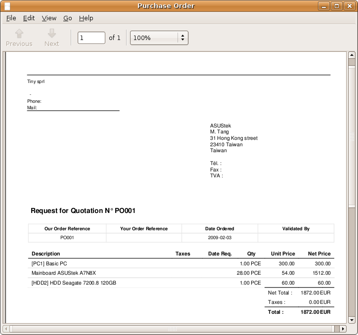
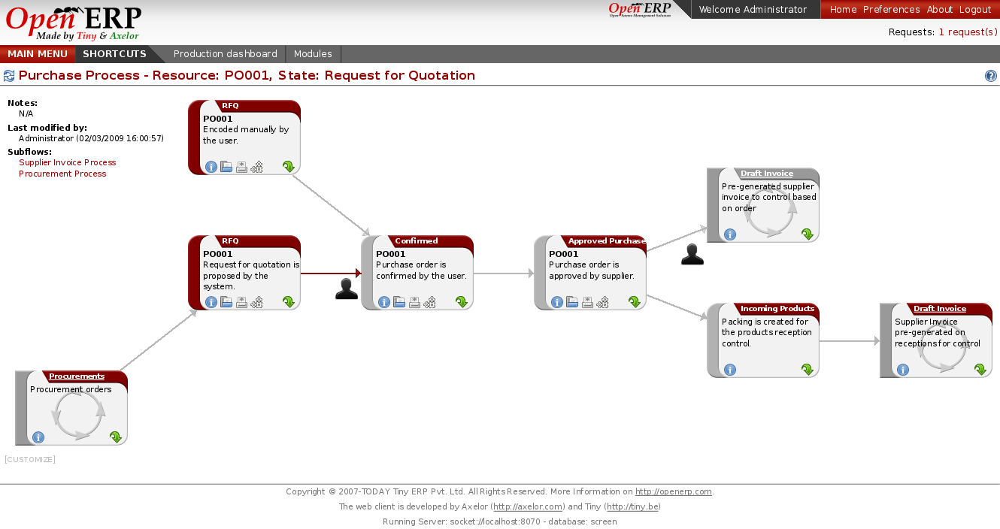
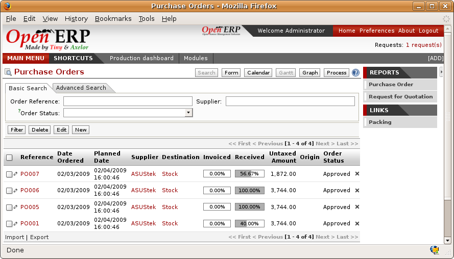
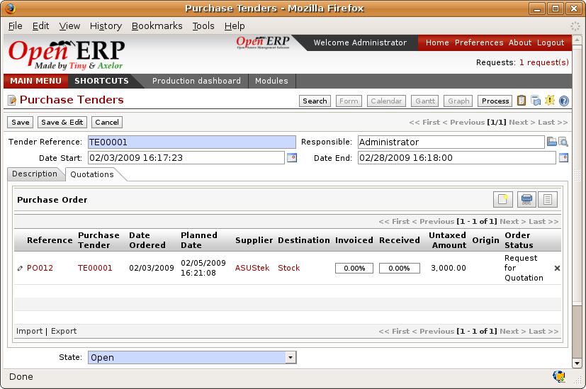
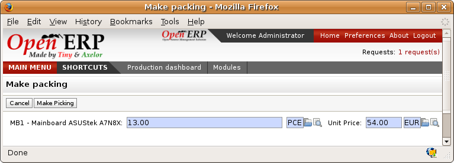
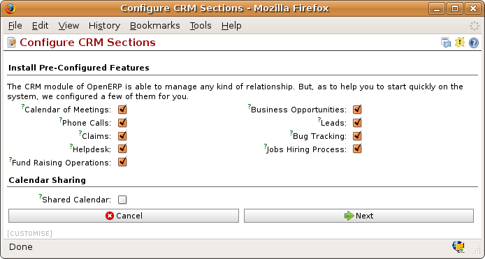
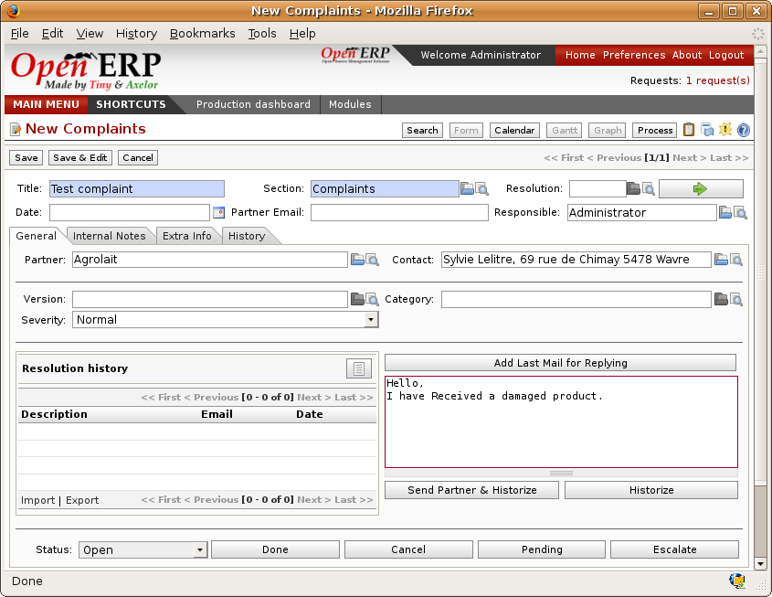

Purchase Management
####################

*In the preceding chapters you saw how to use supplier invoices and delivery notes in Open ERP. This chapter is about the management of purchases, the process upstream of these two operations. You'll now see how Open ERP handles and simplifies this and the control of purchases at the suppliers.*

A complete workflow
====================

The supplier order is the document that will enable you to manage price negotiations, control of supplier invoices, control of goods receipt and synchronization between all of these documents.

Start by reviewing the following order workflow:

#. Price request to the supplier,

#. Confirmation of purchase,

#. Receipt and control of products,

#. Control of invoicing.

Setting up your database
-------------------------

To set a system up for these examples, create a new database with demonstration data in it, and select the *Minimal Profile* when you log in as the *admin* user. You can enter your own company details when asked, or just select the default of *Tiny SPRL* if you want. 

You'll be asked what View Mode you want during the Configuration stage. *Extended Interface* is recommended at this stage. You don't need any additional users.

Then install the ``purchase`` module, which installs several other modules as dependencies. Continue the remainder of this chapter logged in as the admin user.

Price request from the supplier
-------------------------------

To enter data for a new supplier price request, use the menu *Purchase Management > New Purchase Order*. Open ERP opens a blank purchase form that you use for requesting prices from a supplier. This is shown in the figure below. If the price request came from an automatic procurement created by Open ERP you'll find in the *Origin* field a reference to the document that generated the request.

*Data entry for a supplier order.*

.. tip:: **Point**   *Managing Alerts*

    If you install the ``warning`` module you will be able to define alerts that will appear when the purchaser enters a price request or order. You can set alerts on the product or on the supplier.

The internal reference, the date, and the warehouse that the products should be delivered to are completed automatically by Open ERP but you can change these values if you need. Select the supplier. Once the supplier has been selected, Open ERP then automatically completes the contact address for the supplier. The pricelist is also completed when you select the supplier. This should bring in all of the conditions that you've negotiated with the supplier for a given period.

.. tip:: **Point**   *Supplier Selection*

    Searching for a supplier is limited to all of the partners in the system that have the 'Supplier' checkbox checked. If you don't find your supplier it might be worth checking the whole list of all partners to make sure that the supplier has been only partially entered into the system. 

Once the main body of the purchase order has been completed you can enter the product lines.

*Order line on a  supplier order.*

When you've completed the product, Open ERP automatically completes the other fields on the form:

* Unit of Measure: taken from the *Purchase UoM* field on the product form, 

* The product title in the supplier's language,

* Forecast delivery date, calculated from the order date and the supplier lead time  

* Purchase Price, provide by the supplier pricelist,

* Applicable taxes, taken from the information on the product form and partner form, depending on the rules seen in the chapter on Accounting.

.. tip:: **Point**   *Product wording and code*

    When you enter supplier names on the product form, you can fix the name and a product code for each individual supplier. If you do that, Open ERP will then use those details in place of your own internal product names for the selected supplier.

If you work with management by case you can also set the analytic account that should be used to report all the purchase costs. The costs will then be reported at the receipt of the supplier invoice.

.. tip:: **Point**   *Management by case*

    The analytic accounts will be very useful for all companies that manage costs by case, by site, by project or by folder. To work with several analytic axes you can install the module ``purchase_analytic_plans``.

For that the analytic account is automatically selected as a function of the partner, the date, the products or the user, you can install the module ``account_analytic_default`` (which is installed automatically as a dependency of ``purchase_analytic_plans``, since the latter depends on it).

In the second tab of the product line you can enter a note that will be attached when the order confirmation or price quotation is printed. This note can be predefined on the product form to automatically appear on each order for that product. For example you can put “Don't forget to send by express delivery as specified in our contract reference 1234.”

Once the document is encoded, you can print it and Open ERP gives you the price quotation to send to the supplier. You can set a note for the attention of the supplier in the form's third tab.

*Printing the supplier price quotation.*

Then leave the document in that state. When you receive the response from the supplier, use the menu *Purchase Management > Supplier Orders > My Price Requests*. Then select the order and complete it.

When you want to approve the order, use the button *Confirm ??? Supplier*. The price request then passes into the confirmed state. Since this isn't confirmed by the supplier any more, it has no further impact on the system. To approve it click the button *Approved by Supplier*.

.. tip:: **Point**   *??? receipt*

You can confirm the order but not validate it straightaway. Do this when you want to validate the order on receipt of order acknowledgement from the supplier. This gives you an intermediate state for all orders waiting validation from the supplier using the menu *Purchase Management > Supplier Orders > Orders awaiting validation*.

*Supplier order process.*

.. tip:: **Point**   *Supplier validation*

    If you want to automate the data entry stage at goods receipt, install the module ``purchase_approve``. This will automatically validate all the orders that have been confirmed.

Goods receipt
--------------

Once the order has been validate, Open ERP automatically prepares the goods receipt order in the draft state for you. To get a list of the products you're waiting for from your suppliers, use the menu *Stock Management > Incoming Goods > Items to handle*.

.. tip:: **More information**   *Purchasing Services*

    If you buy services from your supplier, Open ERP doesn't generate a goods receipt note. In this case there's no service receipt equivalent to goods receipt.

Select the document that corresponds to the item that you're receiving. Usually the goods receipt note is found by making a search on the order reference or the supplier name. You can then confirm the receipt of the products.

Just as you saw in the chapter on Stock Management, if you receive only part of the order, Open ERP manages the remains of that order. A second receipt note is then automatically forecast with goods not received. You can cancel if you think that you will never receive the forgotten products.

After receiving the goods, Open ERP will show you which orders are open and the state of their receipt and invoicing if you return to the list of orders.

*List of open orders, and their receipt and invoice status.*

Control of invoicing
---------------------

To control supplier invoicing, Open ERP provides three systems as standard, which can differ order by order:

* Invoicing based on quantities ordered,

* Invoicing based on quantities received,

* Manual Invoicing.

The mode of invoicing control is set in the second tab of the purchase order in the field *Invoicing*. 

*Supplier order, invoice control.*

.. tip:: **Point**   *Default value*

    A company generally uses a single invoicing control method for all of its invoices. So you're advised after installation to go and set a default value in the Invoicing Control field.

Control based on orders
------------------------

If you selected your invoicing control based on order, Open ERP will automatically generate a supplier invoice in the draft state when the order is confirmed. You can obtain a list of invoices waiting using the menu *Financial Management > Invoices > Supplier Invoices > Draft Supplier Invoices*.

When you receive a paper invoice from your supplier, all you need to do is validate the invoice pre-generated by the system. Don't forget to check the price and the quantities. When the invoice is confirmed the accounting entries represent the cost of purchase and are automatically entered into the system.

The supplier order is then automatically set that it has been paid when you pay the supplier invoice.

This method of controlling invoices is often used in service companies, because the invoiced amounts correspond to the ordered amounts. In logistics by contrast you most often work with invoicing controlled by goods receipt.

Control based on goods receipt
-------------------------------

TO control your supplier invoices based on goods receipt, set the field *Invoicing Control* on the second tab of the order to *From Picking*.

In this case no invoice, draft state or any other, is generated by the order. On the goods receipt note, the field *Invoicing Control* is set to *To be Invoiced*.

The storesperson can then receive different orders. If he wants to generate the draft invoice for a goods receipt, he can click the action *Create Invoice*. Open ERP asks you then for the journal for this invoice. It then opens that or the generated invoices (in the case of creating invoices for several receipts at one time) which enables you to modify it before confirming it.

This approach is useful when you receive the invoice at the same time as the item from the supplier. Usually invoices are sent by post some days later. In this case, the storesperson leaves the item unchanged without generating an invoice. Then once per day or once per week the accountant will create the draft invoices based on all the receipts for the day. To do that he uses the menu *Stock Management > Incoming Products > Create draft Invoices by receipt*. From the list of receipts that haven't yet been invoiced he clicks on the action to generate all draft invoices.

At that state, the user can decide if he wants to generate an invoice per item or group all items for the same partner into the same invoice.

The invoices are then handled just like the controlled from On Order. Once the invoice arrives at the accounting service he just compares it with the invoices waiting to control what the supplier invoices you.

.. tip:: **Point**   *Delivery Charges*

    To manage delivery charges, install the module ``purchase_delivery``. This will automatically add delivery changes to the creation of the draft invoice as a function of the products delivered or ordered.

.. index:: Tender

Tenders
--------

To manage tenders, you should use the module ``purchase_tender``. This lets you create several supplier price reqests for a single supply requirement. Once the module is installed, Open ERP adds a new menu in the Purchase management, Tenders. You will then be able to define the new tenders.

*Defining a tender.*

To enter data for a new tender, use the menu *Purchase Management > Purchase Tenders > New Purchase Tenders*. Open ERP then opens a new blank tender form. The reference number is set by default and you can enter information about you tender in the other fields.

If you want to enter the respond of a supplier into your tender offer, complete the file *Tender* on the supplier order. If you want to enter a revised supplier price, enter an order that you've left in the draft state and link that to the tender. In the list of supplier orders, Open ERP indicates, in the second column, if the order about a tender or not.

When one of the orders about a tender is confirmed, all of the other orders are automatically cancelled by Open ERP. That enables you to accept only one order for a particular tender.

Price revisions
----------------

Open ERP supports several methods of calculating and automatically updating product prices:

* Standard price: manually fixed, and 

* Standard price revalued automatically and periodically,

* Weighted average: updated at each receipt to the warehouse.

This price is used to value your stock and represents your product costs. Included in that price is everything directly related to the received price. You could include such elements as:

* supplier price,

* delivery charges,

* manufacturing costs,

* storage charges.

Standard Price
---------------

The mode of price management for the product is shown in the third tab on the product form, *Price*. On each product you can select if you want to work in standard price or on weighted average.

.. tip:: **Point**   *Simplified view*

    If you work in the Simplified View mode you won't see the field that enables you manage the price calculation mode for a product. In that case the default value is standard price.

The standard price shows that the product price is fixed manually by product in the field *Cost Price*. This is usually revalued once a year based on the average of purchase costs or manufacturing costs.

You usually use standard costs to manage products where the price hardly changes over the course of the year. For example the standard costs would be used to manage books, or the cost of bread.

Those costs that can be fixed for the whole year bring certain advantages:

* you can base the sale price on the product cost and then work with margins rather than instead of a fixed price per product,

* accounting is simplified because there's a direct relationship between the value of stock and the number of items received.

To automate periodic revaluation of the standard price you can use the module ``product_extended``. This will add an action on the product form enabling you to set a date all the selected products. It will then recalculate the price of the products as a function of the cost of raw materials and the manufacturing operations given in the routing.

Weighted average
-----------------

Working in standard price does not lend itself well to the management of the cost price of products when the price changes a lot with the state of the market. This is case for many commodities and energy.

In this case you'd want Open ERP to automatically set the price in respond to each goods receipt into the warehouse. The deliveries (exit from stock) will have no impact on the product price.

.. tip:: **More information**   *Calculating the price*

At each goods receipt the product price is recalculated using the following accounting formula: NP = (OP * QS + PP * QR) / (QS + QR), where the following notation is used:

* NP: New Price,

* OP: Old Price,

* QS: Quantity actually in stock,

* PP: Price Paid for the quantity received,

* QR: Quantity received.

If the product are managed as a weighted average, at each reception of product, Open ERP will open a window that enables you to specify the price of the product received. The purchase price is by default proposed from the purchase order. But you can change the price to, for example, add the cost of delivery to the different received products.

*Goods receipt of products managed in weighted average.*

Once the receipt has been confirmed, the price is automatically recalculated and entered on the product form.

Analyis of purchases
=====================

Elementary statistics
----------------------

To get statistics about your purchases you can install the modules ``report_purchase`` and ``product_margin``.

The first, report_purchase, will add two new reports in your purchase menu, analysis of purchases by month and by product, and analysing product by month and by product category. To use these reports use the menu *Purchase Management > Reporting > This month > Purchases by product*.

*Analysis of purchases over the month by product.*

This analysis carries on the supplier orders and not on the invoices or the quantities effectively received. To get an analysis by product, use the module ``product_margin``. The function of this module is described in detail in the chapter on Sales Management.

To analyze the received quantities, you can use the statistical moduels based on the management of stock.

Supplier relationship management
=================================

To manage supplier relations, you should install the ``crm_configuration`` module. You will then be able to manage supplier complaints and integrate them with your emails and document management.

Once you've installed the CRM module, check the checkbox by the *Complaints* option. Open ERP will then create a menu configuration for managing supplier complaints.

*Selection of the management of complaints in the CRM installation.*

Once the module is installed you can use the menu *CRM & SRM > After Sales Service > Complaints > New Supplier Complaint*.

*Data entry screen for a supplier complaint.*

The CRM module has many reports predefined. You can analyse:

* the number and the severity of the complaints by supplier or user,

* the response time of your suppliers to your requests,

* the supplier problems by type.

Analytic accounts
==================

To manage purchases by project you should use the analytic accounts. On each line of a supplier order you can note an analytic account. The analytic costs linked to this purchase will be managed by Open ERP to the receipt and confirmation of the supplier invoice.

The ``hr_timesheet_invoice`` module lets you reinvoice the analytic costs automatically by reference to the parameters in the analytic accounts: such as pricelist, end customer, maximum amount, employee ????

So you can put an inverse order/invoice workflow in place based on the analytic accounts. If you're working 'Make to Order', the workflow will be:

#. Customer Order,

#. Procurement order on Supplier,

#. Receive invoice and goods from the supplier,

#. Delivery and invoicing to the customer.

Re-invoicing based on costs you'd get the following workflow:

#. Enter the customer contract conditions from the analytic accounts,

#. Purchase raw materials and write the services performed into the timesheets,

#. Receive the supplier invoice and the products,

#. Invoice these costs to the customer.

.. tip:: **Point**   *Analytic multiplans*

    If you want several analysis plans you should install the module ``purchase_analytic_plans``. These enable you to split a line on a supplier purchase order into several accounts and analytic plans. Look back at the chapters on accounting for more information on the use of analytic accounts.

.. Copyright © Open Object Press. All rights reserved.

.. You may take electronic copy of this publication and distribute it if you don't
.. change the content. You can also print a copy to be read by yourself only.

.. We have contracts with different publishers in different countries to sell and
.. distribute paper or electronic based versions of this book (translated or not)
.. in bookstores. This helps to distribute and promote the Open ERP product. It
.. also helps us to create incentives to pay contributors and authors using author
.. rights of these sales.

.. Due to this, grants to translate, modify or sell this book are strictly
.. forbidden, unless Tiny SPRL (representing Open Object Presses) gives you a
.. written authorisation for this.

.. Many of the designations used by manufacturers and suppliers to distinguish their
.. products are claimed as trademarks. Where those designations appear in this book,
.. and Open ERP Press was aware of a trademark claim, the designations have been
.. printed in initial capitals.

.. While every precaution has been taken in the preparation of this book, the publisher
.. and the authors assume no responsibility for errors or omissions, or for damages
.. resulting from the use of the information contained herein.

.. Published by Open ERP Press, Grand Rosière, Belgium
