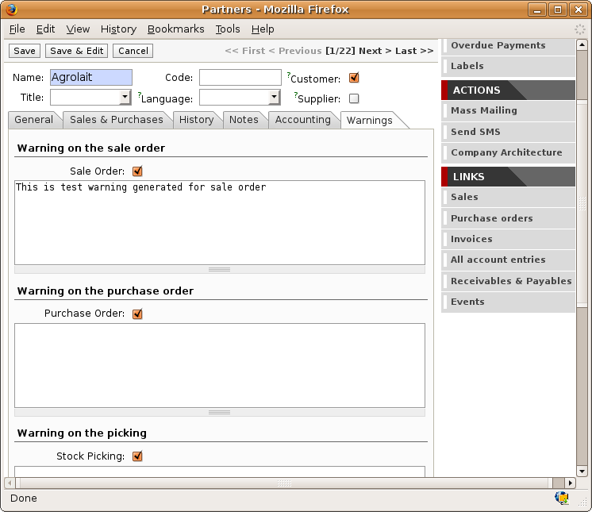
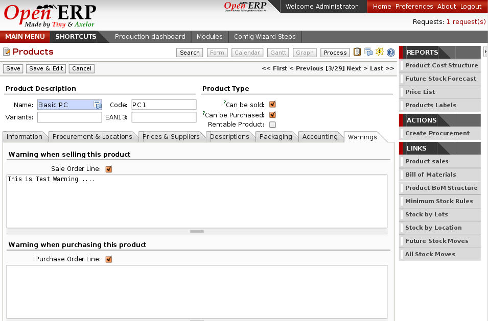
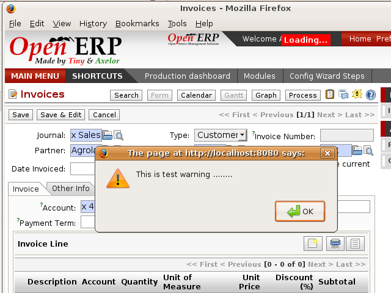

Management of Alerts
====================

.. index:: 
   single: warning
   single: alerts
   pair: module; warning

To manage alerts on products or partners, you can install the :mod:`warning` module. Once that is
installed, you will be able to configure a series of alerts on the partners or products by
setting parameters in the new :guilabel:`Warnings` tab on each of the forms.

   *Management of alerts on partners*

   *Management of alerts on products*

You can activate alerts for a series of events. For each alert you should enter a message that will
be attached to the person setting off the event. The different available events on the partner form
are:

* Entering a customer order for the partner,

* Entering a supplier order for the partner,

* Sending a delivery to the partner (or receiving an item),

* Invoicing a partner.

The alerts that can be configured on a product form are:

* The sale of that product,

* The purchase of that product.

For example, if you enter an alert for the invoicing of a customer, for an accountant entering an
invoice for that customer, the alert message will be attached as shown in the figure :ref:`fig-warnsmp`:

.. _fig-warnsmp:

   *Alert from invoicing a customer*

.. Copyright © Open Object Press. All rights reserved.

.. You may take electronic copy of this publication and distribute it if you don't
.. change the content. You can also print a copy to be read by yourself only.

.. We have contracts with different publishers in different countries to sell and
.. distribute paper or electronic based versions of this book (translated or not)
.. in bookstores. This helps to distribute and promote the Open ERP product. It
.. also helps us to create incentives to pay contributors and authors using author
.. rights of these sales.

.. Due to this, grants to translate, modify or sell this book are strictly
.. forbidden, unless Tiny SPRL (representing Open Object Press) gives you a
.. written authorisation for this.

.. Many of the designations used by manufacturers and suppliers to distinguish their
.. products are claimed as trademarks. Where those designations appear in this book,
.. and Open Object Press was aware of a trademark claim, the designations have been
.. printed in initial capitals.

.. While every precaution has been taken in the preparation of this book, the publisher
.. and the authors assume no responsibility for errors or omissions, or for damages
.. resulting from the use of the information contained herein.

.. Published by Open Object Press, Grand Rosière, Belgium