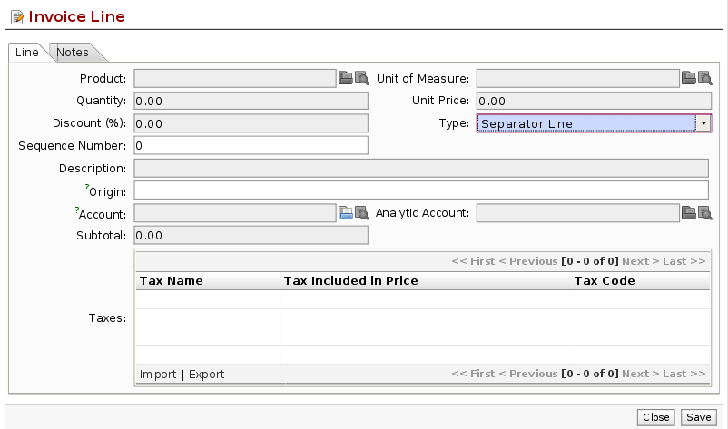
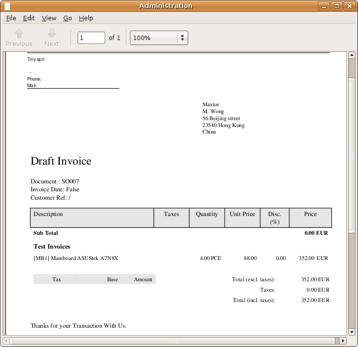

Layout templates
================

.. index::
   single: module; sale_layout

The :mod:`sale_layout` module enables you to have a more elaborate template than the standard order
forms.

For example you could put the following in the order lines:

* a horizontal separator line,

* titles and subtitles,

* subtotals at the end of the section,

* comments,

* a page break.

.. index::
   single: module; account_invoice_layout

This enables you to lay out a more elaborate professional-looking quotation page. There's also the
module :mod:`account_invoice_layout` which gives you the same functionality for invoice templates.

The two figures :ref:`fig-invlayfrm` and :ref:`fig-invlayprin` show an invoice template in Open ERP 
and the resulting printed invoice.

.. _fig-invlayfrm:

   *Template for an invoice in Open ERP using the account_invoice_layout module*

.. _fig-invlayprin:

   *The resulting printed invoice*

.. Copyright © Open Object Press. All rights reserved.

.. You may take electronic copy of this publication and distribute it if you don't
.. change the content. You can also print a copy to be read by yourself only.

.. We have contracts with different publishers in different countries to sell and
.. distribute paper or electronic based versions of this book (translated or not)
.. in bookstores. This helps to distribute and promote the Open ERP product. It
.. also helps us to create incentives to pay contributors and authors using author
.. rights of these sales.

.. Due to this, grants to translate, modify or sell this book are strictly
.. forbidden, unless Tiny SPRL (representing Open Object Press) gives you a
.. written authorisation for this.

.. Many of the designations used by manufacturers and suppliers to distinguish their
.. products are claimed as trademarks. Where those designations appear in this book,
.. and Open Object Press was aware of a trademark claim, the designations have been
.. printed in initial capitals.

.. While every precaution has been taken in the preparation of this book, the publisher
.. and the authors assume no responsibility for errors or omissions, or for damages
.. resulting from the use of the information contained herein.

.. Published by Open Object Press, Grand Rosière, Belgium
