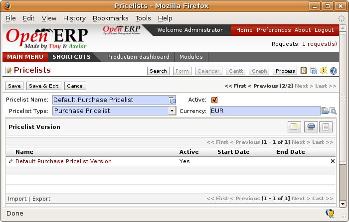

Price management policies
=========================

Some companies are notorious for their complicated pricelists. Many forms of price variation are
used, such as end-of-year refunds, discounts, changes of terms and conditions with time, various
prepayments, cascaded rebates, seasonal promotions, and progressive price reductions.

.. note:: Rebate, Refund, Reduction

   In some accounting jurisdictions you have to differentiate between the three following terms:

   * Rebate: reimbursement to the client, usually at the end of the year, that depends on the
     quantity of goods purchased over a period.

   * Refund: reduction on the order line or invoice line if a certain quantity of goods is purchased
     at one time or is sold in a framework of a promotional activity.

   * Reduction: A one-off reduction resulting from a quality defect or a variation in a product's
     conformance to a specification.

Intelligent price management is difficult, because it requires you to integrate several conditions
from clients and suppliers to create estimates quickly or to invoice automatically. But if you have
an efficient price management mechanism you can often keep margins raised and respond quickly to
changes in market conditions. A good price management system gives you scope for varying any and all
of the relevant factors when you're negotiating a contract.

To help you work most effectively, Open ERP's pricelist principles are extremely powerful yet are
based on simple and generic rules. You can develop both sales pricelists and purchase pricelists for
products capable of accommodating conditions such as the date period, the quantity requested and the
type of product.

.. tip:: Don't confuse the different price specifications

   Don't confuse the sale price with the base price of the product.
   In Open ERP's basic configuration the sale price is the list price set on the product form
   but a customer can be given a different sale price depending on the conditions.

It's the same for purchase price and standard cost. Purchase price is your suppliers' selling price,
which changes in response to different criteria such as quantities, dates, and supplier. This is
automatically set by the accounting system. You'll find that the two prices have been set by default to the
same for all products with the demonstration data, which can be a source of confusion.
You're free to set the standard cost to something different.

Each pricelist is calculated from defined policies, so you'll have as many sales pricelists as
active sales policies in the company. For example a company that sells products through three sales
channels could create the following price lists:

 #. Main distribution:

	- pricelist for Walbury,

	- pricelist for TesMart,

 #. Postal Sales.

 #. Walk-in customers.

A single pricelist can exist in several versions, only one of which is permitted to be active at a
given time. These versions let you set different prices at different points in time. So the
pricelist for walk-in customers could have five different versions, for example: \ ``Autumn``\,  \
``Summer``\, \ ``Summer Sales``\, \ ``Winter``\, \ ``Spring``\. Direct customers will see prices
that change with the seasons.

Each pricelist is expressed in a single currency. If your company sells products in several
currencies you'll have to create as many pricelists as you have currencies.

The prices on a pricelist can depend on another list, which means that you don't have to repeat the
definition of all conditions for each product. So a pricelist in USD can be based on a pricelist in
EUR. If the currency conversion rates between EUR and USD change, or the EUR prices change, the USD
rates can be **automatically** adjusted.

.. index::
   single: pricelist; create

Creating pricelists
-------------------

To define a pricelist use the menu :menuselection:`Products --> Pricelists --> Pricelists` .

For each list you should define:

* a :guilabel:`Name` for the list,

* a :guilabel:`Type` of list: \ ``Sale``\   for customers or \ ``Purchase``\   for suppliers,

* the :guilabel:`Currency` in which the prices are expressed.

.. index::
   pair: module; edi

.. tip:: Customer Price

   If you install the module :mod:`edi` (in ``addons-extra`` at the time of writing)
   a third type of list appears – the :guilabel:`Customer Price` - which
   defines the price displayed for the end user.
   This doesn't have to be the same as your selling price to an intermediary or distributor.

.. index::
   single: pricelists; version

Pricelist versions
^^^^^^^^^^^^^^^^^^

Once the list is defined you must provide it with at least one version. To do that use the menu
:menuselection:`Products --> Pricelists --> Pricelist Versions`. The version contains all of the
rules that enable you to calculate a price for a product and a given quantity.

So set the :guilabel:`Name` of this associated version. If the list only has a single version you
can use the same name for the pricelist and the version. In the :guilabel:`Pricelist` field select
the pricelist you created.

Then set the :guilabel:`Start date` and :guilabel:`End date` of this version. The fields are both
optional: if you don't set any dates the version will be permanently active. Only one version
may be active at any one point, so bear this in mind when creating them.
Use the :guilabel:`Active` field in the versions to activate or disable a pricelist version.

.. note:: Automatically updating the sale pricelist

   You can make any sale pricelist depend on one of the other pricelists.
   So you could make your sale pricelist depend on your supplier's purchase pricelist, to
   which you add a margin.
   The prices are automatically calculated as a function of the purchase price and need no further
   manual adjustment.

.. index:: price

Rules for calculating price
^^^^^^^^^^^^^^^^^^^^^^^^^^^

A pricelist version is made up of a set of rules that apply to the product base prices.

.. figure:: images/service_pricelist_line.png
   :scale: 50
   :align: center

   *Detail of a rule in a pricelist version*

You define the conditions for a rule in the first part of the definition screen labeled :guilabel:`Rules Test
Match`. The rule applies to the :guilabel:`Product` or :guilabel:`Product Template` and/or the named :guilabel:`Product
Category`. If a rule is applied to a category then it is automatically applied to all of its
subcategories too (using the tree structure for product categories).

If you set a minimum quantity in :guilabel:`Min. Quantity` the rule will only apply to a quantity the same
as or larger than that set. This lets you set reduced rates in steps that depend on the quantities ordered.

Several rules can be applied to an order. Open ERP evaluates these rules in sequence to select
which to apply to the specified price calculation. If several rules are valid only the first in
sequence is used for the calculation. The :guilabel:`Sequence` field determines the order, starting with the
lowest number and working up.

Once a rule has been selected, the system has to determine how to calculate the price from the rule.
This operation is based on the criteria set out in the lower part of the form, labeled :guilabel:`Price
Computation`.

The first field you have to complete is labeled :guilabel:`Based on`. Set the mode for
partner price calculation, choosing between:

* the :guilabel:`List Price` set in the product file,

* the :guilabel:`Standard Cost` set in the product file,

* an :guilabel:`Other Pricelist` given in the field :guilabel:`If Other Pricelist`,

* the price that varies as a function of a supplier defined in the :guilabel:`Partner section of the
  product form`.

Several other criteria can be considered and added to the list, as you'll see in the following
section.

Next, various operations can be applied to the base price to calculate the sales or purchase price
for the partner at the specified quantities. To calculate it you apply the formula shown on the
form: ``Price = Base Price x (1 – Field1) + Field2`` .

The first field, :guilabel:`Field1`, defines a discount. Set it to 0.20 for a discount of 20% from
the base price. If your price is based on standard cost, you can set -0.15 to get a 15% price uplift
compared with the standard costs.

:guilabel:`Field2` sets a fixed supplement to the price, expressed in the currency of the pricelist.
This amount is just added (or subtracted, if negative) to the amount calculated with the
:guilabel:`Field1` discount.

Then you can specify a rounding method. The rounding calculation is carried out to the nearest
number. For example if you set 0.05 in this example, a price of 45.66 will be rounded to 45.65, and
14,567 rounded to 100 will give a price of 14,600.

.. note:: Swiss special situation

   In Switzerland, the smallest monetary unit is 5 cents.
   There aren't any 1 or 2 cent coins.
   So you set Open ERP's rounding to 0.05 to round everything in a Swiss franc pricelist.

The supplement from :guilabel:`Field2` is applied before the rounding calculation, which enables
some interesting effects. For example if you want all your prices to end in 9.99, set your rounding
to 10 and your supplement to -0.01 in :guilabel:`Field2`.

Minimum and Maximum margins enable you to guarantee a given margin over the base price. A margin of
10 USD enables you to stop the discount from returning less than that margin. If you put 0 into this
field, no effect is taken into account.

Once the pricelist is defined you can assign it to a partner. To do this, find a Partner and select
its :guilabel:`Properties` tab. You can then change the :guilabel:`Purchase Pricelist` and the
:guilabel:`Sale Pricelist` that's loaded by default for the partner.

Case of using pricelists
------------------------

Take the case of an IT systems trading company, for which the following product categories have
been configured:

All products

 #. Accessories

                * Printers

                * Scanners

                * Keyboards and Mice

 #. Computers

                * Portables

                 - Large-screen portables

                * Computers

                 - Office Computers

                 - Professional Computers

In addition, the products presented in the table below are defined in the currency of the installed
chart of accounts.

TABLE

.. csv-table:: Examples of products with their different prices

   "Product ","List Price","Standard Price","Default supplier price",
   "Acclo Portable","1,200 ","887 ","893 ",
   "Toshibishi Portable","1,340 ","920 ","920 ",
   "Berrel Keyboard","100 ","50 ","50 ",
   "Office Computer","1,400 ","1,000 ","1,000 ",

.. index::
   single: pricelist; default pricelist

Default pricelists
^^^^^^^^^^^^^^^^^^

   *Default pricelist after installing Open ERP*

When you install the software two pricelists are created by default: one for sales and one for
purchases. These each contain only one pricelist version and only one line in that version.

The price for sales defined in the Default Public Pricelist is set by default to
the Public Price of the product in the product file, which is the Sale Price in the Product file.

The price for purchases defined in the Default Purchase Pricelist is set by default in the same way to
the Standard Cost of the product in the product file.

.. index::
   single: trading company

Example of a trading company
^^^^^^^^^^^^^^^^^^^^^^^^^^^^

Take the case of a trading company, where the sale price for resellers can be defined like this:

* For portable computers, the sale price is calculated from the list price of the supplier Acclo,
  with a supplement of 23% on the cost of purchase.

* For all other products the sale price is given by the standard cost in the product file, on which
  31% is added. The price must end in ``.99`` .

* The sale price of Berrel keyboards is fixed at 60 for a minimum quantity of 5 keyboards purchased.
  Otherwise it uses the rule above.

* Assume that the Acclo pricelist is defined in Open ERP. The pricelist for resellers and the
  pricelist version then contains three lines:

       #. \ ``Acclo``\  line:

                *  :guilabel:`Product Category` : \ ``Portables``\  ,

                *  :guilabel:`Based on` : \ ``Other pricelist``\  ,

                *  :guilabel:`Pricelist if other` : \ ``Acclo pricelist``\  ,

                *  :guilabel:`Field1` : \ ``-0.23``\  ,

                *  :guilabel:`Priority` : \ ``1``\  .

       #. \ ``Berrel Keyboard``\  line:

                *  :guilabel:`Product Template` : \ ``Berrel Keyboard``\  ,

                *  :guilabel:`Min. Quantity` : \ ``5``\  ,

                *  :guilabel:`Field1` : \ ``1.0``\  ,

                *  :guilabel:`Field2` : \ ``60``\  ,

                *  :guilabel:`Priority` : \ ``2``\  .

       #. \ ``Other products``\  line:

                *  :guilabel:`Based on:` \ ``Standard Price``\  ,

                *  :guilabel:`Field1` : \ ``-0.31``\  ,

                *  :guilabel:`Field2` : \ ``-0.01``\  ,

                *  :guilabel:`Rounding` : \ ``1.0``\  .

                *  :guilabel:`Priority` :  \ ``3``\ .

It's important that the priority of the second rule is set below the priority of the third in this
example. If it were the other way round the third rule would always be applied because a quantity of
5 is always greater than a quantity of 1 for all products.

Also note that to fix a price of 60 for the 5 Berrel Keyboards, the formula \ ``Price = Base Price x
(1 – 1.0) + 60``\   has been used.

Establishing customer contract conditions
^^^^^^^^^^^^^^^^^^^^^^^^^^^^^^^^^^^^^^^^^

The trading company can now set specific conditions to a customer, such as the company TinAtwo, who
might have signed a valid contract with the following conditions:

* For Toshibishi portables, TinAtwo benefits from a discount of 5% of resale price.

* For all other products, the resale conditions are unchanged.

The list price for TinAtwo, called ``TinAtwo contract`` , contains two rules:

       #. \ ``Toshibishi portable``\  :

                *  :guilabel:`Product` : \ ``Toshibishi Portable``\  ,

                *  :guilabel:`Based on` : \ ``Other pricelist``\  ,

                *  :guilabel:`Pricelist if other` : \ ``Reseller pricelist``\  ,

                *  :guilabel:`Field1` : \ ``0.05``\  ,

                *  :guilabel:`Priority` : \ ``1``\  .

       #. \ ``Other Products``\ :

                *  :guilabel:`Product` :

                *  :guilabel:`Based on` : \ ``Other pricelist``\  ,

                *  :guilabel:`Pricelist if other` : \ ``Reseller pricelist``\  ,

                *  :guilabel:`Priority` : \ ``2``\  .

Once this list has been entered you should look for the partner form for TinAtwo again. Click the
:guilabel:`Properties` tab to set the :guilabel:`Sale List Price` field to *TinAtwo Contract*. If
the contract is only valid for one year, don't forget to set the :guilabel:`Start Date` and
:guilabel:`End Date` fields in the :guilabel:`Price List Version`.

Then when salespeople prepare an estimate for TinAtwo the prices proposed will automatically be
calculated from the contract conditions.

Different bases for price calculation
-------------------------------------

Open ERP's flexibility enables you to make prices that depend not only on prices on the product
form, but in addition to the two predefined ones – Cost Price and Public Price.

To do this use the menu :menuselection:`Products --> Definitions --> Price Types`. Create a new
entry for the new price type. Enter the field name, the field on the product form that this type of
price corresponds to and the currency that will be expressed in this field. The operation works just
as well on new fields added to the product form to meet specific developments.

Once this operation has been carried out you can make pricelists depend on this new price type.

Then, adding the weight and/or volume field, the price of a product by piece can vary by its weight
and/or volume. This is different from defining a price by weight – in that case the default unit
of measure is weight and not piece.

Pricelists and managing currencies
----------------------------------

If your trading company wants to start a product catalog in a new currency you can handle this
several ways:

* Enter the prices in a new independent pricelist and maintain the lists in the two currencies
  separately,

* Create a field in the product form for this new currency and make the new pricelist depend on this
  field: prices are then maintained separately but in the product file,

* Create a new pricelist for the second currency and make it depend on another pricelist or on the
  product price: the conversion between the currencies will then be done automatically at the
  prevailing currency conversion rate.

.. Copyright © Open Object Press. All rights reserved.

.. You may take electronic copy of this publication and distribute it if you don't
.. change the content. You can also print a copy to be read by yourself only.

.. We have contracts with different publishers in different countries to sell and
.. distribute paper or electronic based versions of this book (translated or not)
.. in bookstores. This helps to distribute and promote the Open ERP product. It
.. also helps us to create incentives to pay contributors and authors using author
.. rights of these sales.

.. Due to this, grants to translate, modify or sell this book are strictly
.. forbidden, unless Tiny SPRL (representing Open Object Press) gives you a
.. written authorisation for this.

.. Many of the designations used by manufacturers and suppliers to distinguish their
.. products are claimed as trademarks. Where those designations appear in this book,
.. and Open Object Press was aware of a trademark claim, the designations have been
.. printed in initial capitals.

.. While every precaution has been taken in the preparation of this book, the publisher
.. and the authors assume no responsibility for errors or omissions, or for damages
.. resulting from the use of the information contained herein.

.. Published by Open Object Press, Grand Rosière, Belgium
