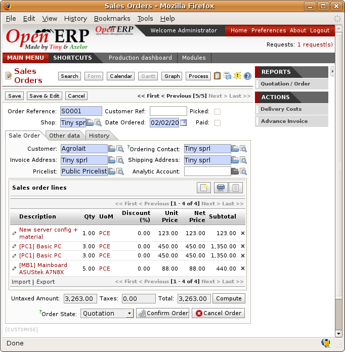
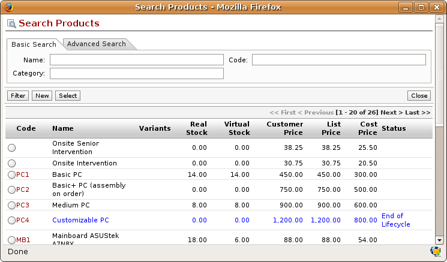
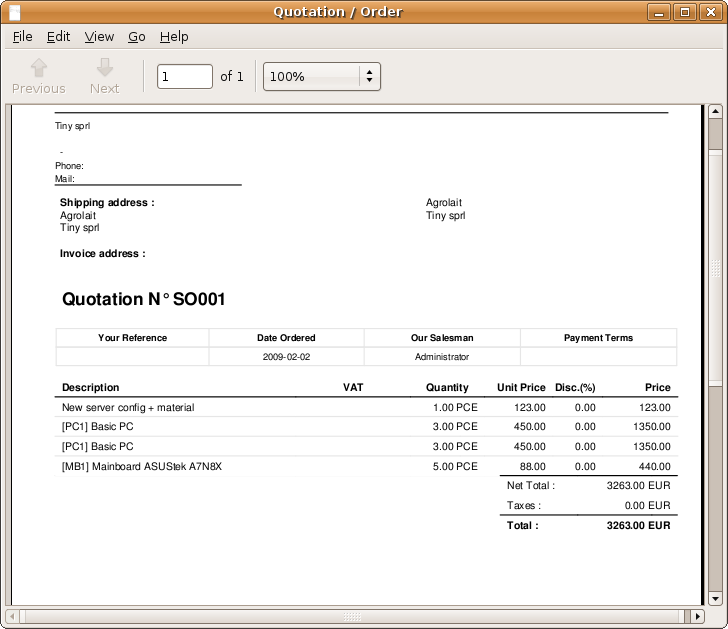

Sales Quotations
================

In Open ERP a quotation and an order are handled by the same underlying object, but in different states. You
can consider an order to be a quotation that has evolved because it has been confirmed by the
customer. Or, conversely, that a quotation is an order that hasn't yet been validated or cancelled.
All of the orders and quotations in the system can be reached using the menu :menuselection:`Sales
Management --> Orders`.

Entering Quotation details
--------------------------

To enter details of a new quotations you can use the menu :menuselection:`Sales Management -->
Orders --> New Quotation`. Open ERP then opens a new window so that you can enter data into new
blank quotation form.

   *Data entry for a new quotation*

Some information is automatically completed by the system:

* an internal reference for the quotation or order,

* the sale point that the order will be delivered from,

* the order date.

You can modify any of that information before validating the quotation. The customer
reference is shown in the header of the order. This optional field if for the customer's own reference
number – if the customer doesn't supply one then just leave it empty.

You then enter all the data about the order in the :guilabel:`Sale Order` tab. Start by entering
the customer name, selecting the correct customer from the list of customers in the system. You can
create a new customer on the fly at this stage if necessary – press :kbd:`<F1>` in the empty
:guilabel:`Customer` field to do that.

Once the customer name has been selected, different fields of the order become completed
automatically, based on the configuration of the partner form for that customer:

* :guilabel:`Order Address` : person handling the order at the customer. By default, Open ERP
  proposes the Contact Address at the selected partner.

* :guilabel:`Delivery Address` : address used on the delivery order. By default, Open ERP proposes
  the Delivery address from the partner form. If nothing is defined in that slot, it uses the default
  address instead.

* :guilabel:`Invoice Address` : address used to send the invoice to the customer. By default, Open
  ERP proposes the address labelled :guilabel:`Invoice` from the partner form. If nothing is defined there,
  it uses the default address instead.

* :guilabel:`Price List` : will determine both the currency of the quotation and the price that will
  be used for each product.

* :guilabel:`Payment Conditions` : shows the payment method that the customer will follow, for example
  ``50% on order, 50% on delivery`` .

* :guilabel:`Delivery Method` : for example ``Post – Express Mail`` .

You can modify any of these fields on the order as you go.

You can also set an analytic account for your order. This account will be used during invoicing
to generate accounting entries corresponding to the invoice automatically. This is extremely useful
for assigning revenues to the project or case specified by this order.

.. tip::  Analytic Accounts

   If you're managing by task, the analytic account to be selected is the one that corresponds to
   the project for the order.
   The sale carried out by the order can be allocated to the project so that profitability
   calculations can be made.

Once the information has been entered, you can enter data for the order lines. To do that, create a
new order line as shown in the figure :ref:`fig-slinf`:

.. _fig-slinf:

.. figure:: images/sale_line_form.png
   :scale: 75
   :align: center

   *Entering a new customer order line*

First of all select the product that is to be sold to the customer. Open ERP shows some
useful information in the list of products to help you during your sale:

* :guilabel:`Real stock` : physically present in your warehouses. This value depends on the sale
  point selected in the order header. Different sale points can be linked to different warehouses,
  giving different stock levels, or can use the same warehouse.

* :guilabel:`Virtual stock` : shows a salesperson the quantity that can be sold, taking into account
  both stock reserved for other orders and amounts that could arrive in the short term.

* :guilabel:`Customer Price` : (May not be shown, depending on the installed modules). depends on the conditions attached to the customer, calculated on the
  list price. This is the price that's proposed by default in the customer quotation, unless it's been
  modified by the salesperson. 

* :guilabel:`List Price` : the base sale price for the given product. It provides a base for the
  salesperson to be able to judge whether to offer a discount to the customer, and how much any
  discount should be.

* :guilabel:`Cost Price` : shows the cost price of the product. If the salesperson sells at less
  than this amount, then the company loses money.

   *Selecting a product in a Sales Order*

When the product that's to be sold to the customer has been selected, Open ERP automatically
completes all the other required fields: price, unit of measure, description, discount, lead times,
applicable taxes, default packaging and the product description. All of this information comes from
the product form.

.. index::
   single: module; product_visible_discount

.. tip:: Visible Discount

   If a discounted price is taken from a price list then by default that figure is shown as the 
   sale price to the customer. He'll see a discount of 0% along with unit price that is different 
   from the list price.
   If you install the module :mod:`product_visible_discount` from addons-extra
   you can configure whether you want to make the discount
   explicitly visible on an order form as a percentage difference from the list price, 
   or just show a reduced unit price as it does by default.

In the form, the selected product is presented in the language of the user so that he can see
what he's selling. The description of the product sold can also be expressed in the customer's language. 
The translation to the customer's language is used on the quotation or order when it's printed.

.. figure:: images/sale_line_translation.png
   :scale: 75
   :align: center

   *Sale of a product in a partner language that differs from the user language*

.. note:: One-off Sales

   If a product's only sold to a customer once, you don't have to enter data into a complete new
   product form just for that sale.
   You can manually complete all the information in the order without putting it into a product:
   description, price, quantity, lead time, taxes.
   In this case Open ERP won't generate a delivery note because the product isn't held in stock.

When all of the products are entered, you can print the quotation and send it to the customer. To do
this, click on the report :guilabel:`Quotation / Order` in the :guilabel:`REPORTS` links to the right. 
Open ERP opens the quotation in PDF to enable to you to see it before printing.

   *Printing a customer quotation*

You can then confirm the quotation to move it on to an order if the order is confirmed by the
customer, or just cancel the window without confirming the order to leave it in quotation state. To
find all of the current quotations, you can use the menu :menuselection:`Sales Management --> Orders
--> My Orders --> My Quotations`.

To follow the process for your order, you can click on the process view from the order form. Open
ERP shows you an interactive process view of that order. For more information about its use,
look at :ref:`ch-process`.

.. figure:: images/sale_process.png
   :scale: 75
   :align: center

   *Process view from following a customer order*

.. Copyright © Open Object Press. All rights reserved.

.. You may take electronic copy of this publication and distribute it if you don't
.. change the content. You can also print a copy to be read by yourself only.

.. We have contracts with different publishers in different countries to sell and
.. distribute paper or electronic based versions of this book (translated or not)
.. in bookstores. This helps to distribute and promote the Open ERP product. It
.. also helps us to create incentives to pay contributors and authors using author
.. rights of these sales.

.. Due to this, grants to translate, modify or sell this book are strictly
.. forbidden, unless Tiny SPRL (representing Open Object Press) gives you a
.. written authorisation for this.

.. Many of the designations used by manufacturers and suppliers to distinguish their
.. products are claimed as trademarks. Where those designations appear in this book,
.. and Open Object Press was aware of a trademark claim, the designations have been
.. printed in initial capitals.

.. While every precaution has been taken in the preparation of this book, the publisher
.. and the authors assume no responsibility for errors or omissions, or for damages
.. resulting from the use of the information contained herein.

.. Published by Open Object Press, Grand Rosière, Belgium
