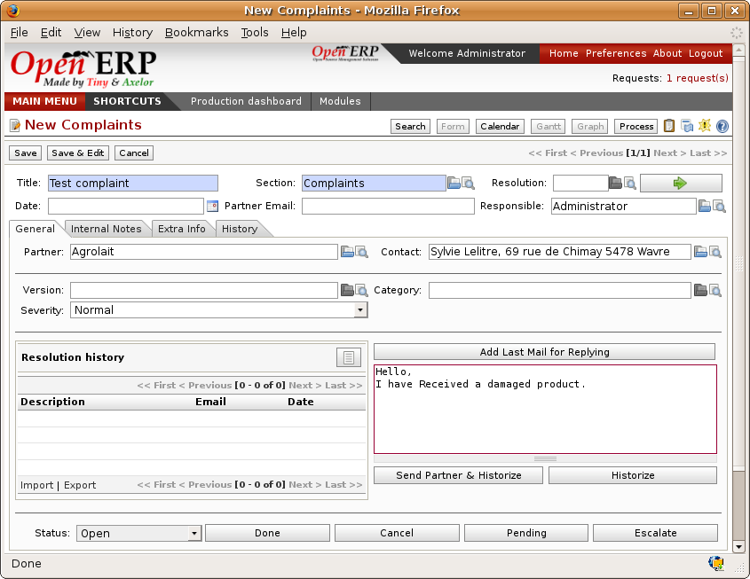

Supplier relationship management
================================

.. index::
   single: module; crm_configuration
   single: module; crm

To manage supplier relations, you should install the :mod:`crm_configuration` module. You will then be
able to manage supplier complaints and integrate them with your emails and document management.

Once you've installed the :mod:`crm` module, check the checkbox by the :guilabel:`Complaints` option
during configuration. Open ERP will then create a menu in your working database for managing supplier complaints.

.. figure:: images/crm_config.png
   :scale: 50
   :align: center

   *Selection of the management of complaints in the CRM installation*

Once the module is installed you can use the menu :menuselection:`CRM & SRM --> After Sales Service
--> Complaints --> New Supplier Complaint`.

   *Data entry screen for a supplier complaint*

The CRM module has many reports predefined. You can analyse:

* the number and the severity of the complaints by supplier or user,

* the response time of your suppliers to your requests,

* the supplier problems by type.

.. Copyright © Open Object Press. All rights reserved.

.. You may take electronic copy of this publication and distribute it if you don't
.. change the content. You can also print a copy to be read by yourself only.

.. We have contracts with different publishers in different countries to sell and
.. distribute paper or electronic based versions of this book (translated or not)
.. in bookstores. This helps to distribute and promote the Open ERP product. It
.. also helps us to create incentives to pay contributors and authors using author
.. rights of these sales.

.. Due to this, grants to translate, modify or sell this book are strictly
.. forbidden, unless Tiny SPRL (representing Open Object Press) gives you a
.. written authorisation for this.

.. Many of the designations used by manufacturers and suppliers to distinguish their
.. products are claimed as trademarks. Where those designations appear in this book,
.. and Open Object Press was aware of a trademark claim, the designations have been
.. printed in initial capitals.

.. While every precaution has been taken in the preparation of this book, the publisher
.. and the authors assume no responsibility for errors or omissions, or for damages
.. resulting from the use of the information contained herein.

.. Published by Open Object Press, Grand Rosière, Belgium
