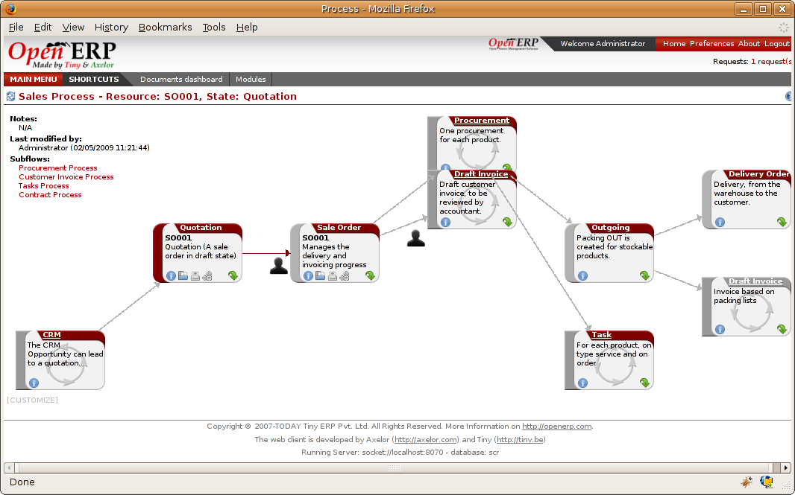
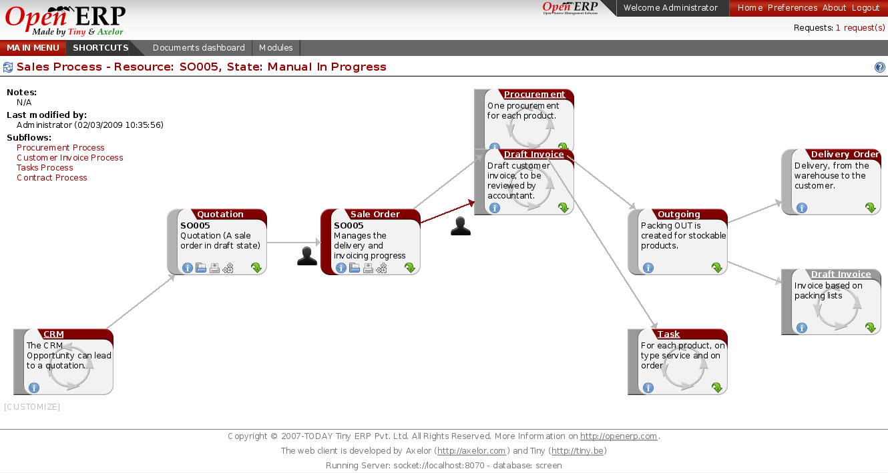
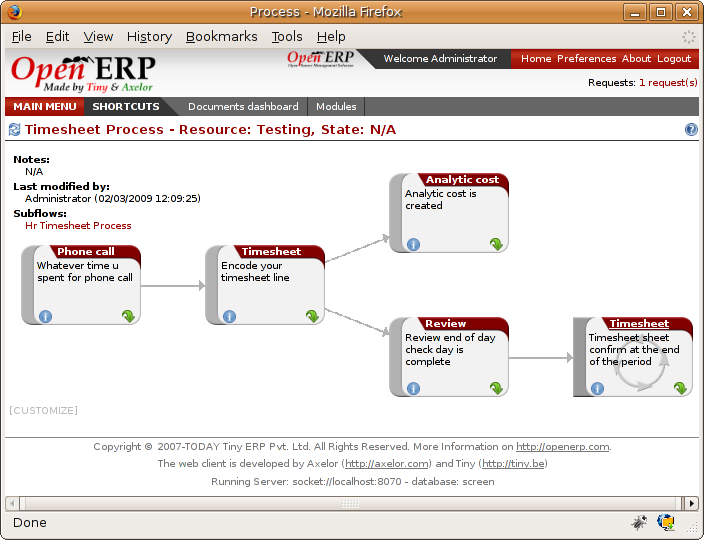
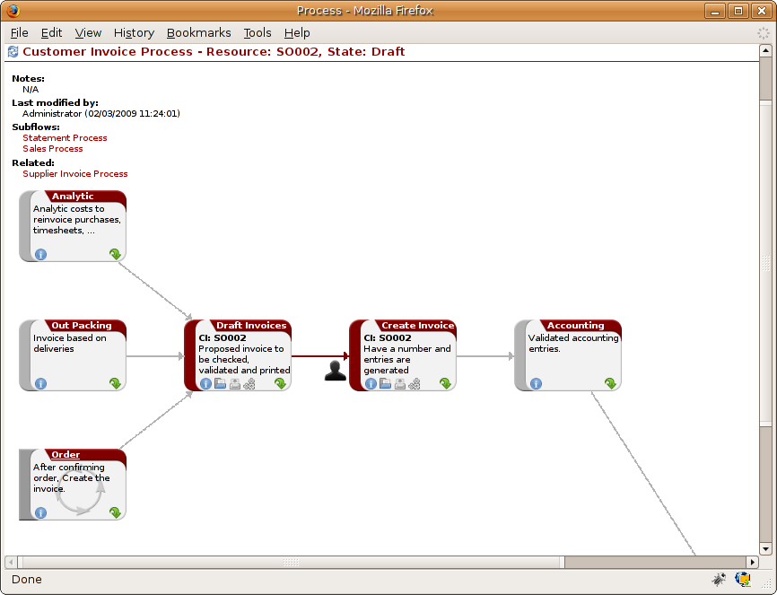
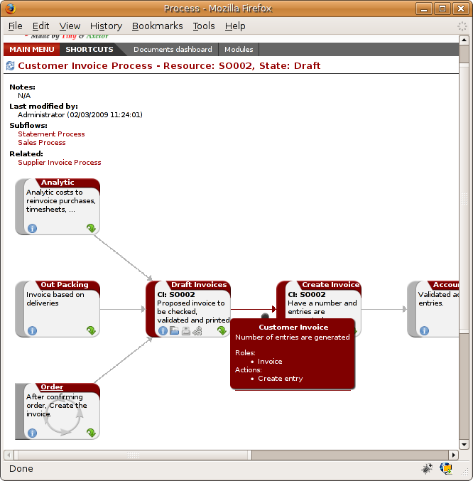

Process
#######

The organization and quality of a company is related to its maturity. A mature
company is one where processes are well established, and where staff don't
waste much time searching for documents or trying to find out how to do their
different tasks.

From this need for effective organization and explicit quality improvement,
have appeared numerous tools:

* The ISO9001 quality standard,
* Business Process Management (BPM) tools,
* Use Case workflows, and formalized standards such as UML,
* The company Quality Manual.

The problem is that these tools are usually quite separate from your management
system and often reserved for the use of just a few specific people in your
company. They're treated separately rather than put at the heart of your
management system. When you ask company staff about ISO9001 they usually see it
as a constraint rather than a helpful daily management tool.

.. tip:: **Don't confuse**   Workflow and User Processes

  Workflows give you a vertical representation of a document's lifecycle. They
  are technical processes, used by system implementers to adapt the behaviour of
  Open ERP to your company's needs.
  
  Conversely user processes represent the workflows across your whole company and
  its documents. They are useful for end users to locate an action in a complete
  horizontal workflow.
  
  The two systems are complementary and link together so that a modification to a
  workflow becomes visible in the user processes of the corresponding document.

To help the company meet its quality requirements and to form these processes
into assistance integrated with everyday work, Open ERP supplies a 'Corporate
Intelligence ( r )' tool that enables you to put company processes at the heart
of your management system.

The system enables:

* new employees to learn how to use the software by graphically and dynamically discovering how each document and action works,
* easy access to the all the links to a document and everything that's attached to it,
* people to see both a high-level map and the detail of all a company's processes,
* access to a graphical model and integrated quality manual for rapid access that depends on the work context,
* use of a knowledge base and capitalization of that knowledge for all of the company's actions in the form of interactive processes, 
* an employee to become more aware of his role in the whole environment.

The integration of processes into the management system
========================================================

Processes are at the heart of a company: they form a structure for all
activities that enable the company to function effectively. A company's human
dimension is often disconnected from its processes at the moment, preventing
individual employees' aspirations from being directed towards a collective
objective.

From a mapping process, integrating management and the changing needs of each
employee becomes very useful for the fulfillment of each. Based on that, each
employee becomes aware of his own personal contribution to the company's value
chain. This representation also helps an employee's own personal management
because it shows his place and his role in the overall process, very often over
several departments.

The system of 'Corporate Intelligence' will also be highly useful to system
implementers who, after studying the requirements, have to formalize a
company's processes to put them into operation in Open ERP.

Examples of process
-------------------

To understand the aims of the system of Corporate Intelligence (process)
better, you'll now see an overview of the functions available in a the study of
two processes:

* A customer order quotation,
* The engagement of a new employee.

Setting up your database
------------------------

To set a system up for these examples, create a new database with demonstration
data in it, and select the *Minimal Profile* when you log in as the *admin*
user. You can enter your own company details when asked, or just select the
default of *Tiny SPRL* if you want. 

You'll be asked what View Mode you want during the Configuration stage.
*Extended Interface* is recommended at this stage, although it's quite a lot
more cluttered than the *Simple Interface* because it shows you all the menu
options. You don't need any additional users.

Then install the ``sale`` module for the first example below, which installs
several other modules as dependencies. Also install some of the ``hr`` modules for
the second example below, such as ``hr_attendence``, ``hr_contract``,
``hr_holidays``, and ``hr_holidays_request``.

You'll be asked to set up a Chart of Accounts during the configuration stage.
Selecting *None* is fine: you can also try one that matches your own
jurisdiction, if a suitable working one is available.

You'll also be asked to define a default picking policy. Select the default
that's offered.

Following a customer sales order
----------------------------------

The example below shows the process for handling a customer sales order. Use
the menu *Sales Management > Sales Orders* to list all orders, then choose
Order SO001 – you can either check the checkbox to its left, or you can open
the order itself by clicking the order date to the left of its name in the
list.

To view the process for that specific order, click the *Process* button at the
top right of the list or form. The process for this order is shown in the
window, and the current state of this document can be seen by looking for the
node whose left edge is coloured maroon rather than grey.

*Example of a process handling a customer order quotation.*

This order is in the Quotation state. The whole of some nodes is greyed out
because the selected document will never enter into that state, such as
invoicing based on deliveries (the order is in an invoicing mode that's based
on orders, not deliveries).

The process is completely dynamic and based on that specific sale order
document. You can click each of the process nodes (Quotation, Sale Order,
Procurement, Draft Invoice, Outgoing Products) using one of the links or icons
on it:

* Obtaining the documentation and the corresponding process in the quality manual, using the Help (or Information) icon,
* Opening the corresponding Open ERP document, using the Open icon,
* Printing the document, using the Print icon,
* Printing the technical workflow by using the Gears (or Print Workflow) icon.
* Obtaining the documents that an employee needs to carry out the process by clicking the green arrow icon,
* Seeing the menu that Open ERP uses to get the document by hovering over the green arrow icon.

Returning to the process diagram, note that you can also get more information
about the transitions between nodes by hovering the mouse cursor over a
transition:

* A description of the transition,
* A list of the roles that can carry out the transition,
* The actions available to you from the state. 

.. image:: images/process_transition_zoom.png
    :align: center

*Detail of a transition in the process.*

Confirm quotation SO001 by clicking on the icon of a person beside the
maroon-coloured transition that takes the document from quotation to order.
Then click the *Confirm* button. The process automatically moves on to the next
state and updates its references to some new delivery reservations that you've
just created (see the third tab, *History*, for a reference to the Packing List
PACK13).

This dynamic response is extremely useful for learning about the software. It
gives you a high-level veiw of the different actions carried out and their
results.

*The process after confirming a process into an order.*

During order processing, the salesperson can quickly:

* Print the corresponding delivery note,
* Zoom into the invoice to see payment details,
* Get examples of the necessary documents (such as quotation types, exportation documents, and fax to confirm the order with the customer).

Create a draft invoice by starting the next step on your own.

It should be clear that this system of user processes gives you great
visibility of the company's overall functions. Each process individually
reflects the specific situation of the company and its documents.

New employee induction
-----------------------

Open the employee form for Fabien Pinckaers from the menu *Human Resources >
Employees > All Employees*. Click the *Process* button to open the detailed
process of engagement.

.. image:: images/process_employee_flow.png
    :align: center

*Example of a process engaging a new employee.*

You can immediately see things that might interest the HR manager. On a single
screen she has all of the documents about the selected employee. She can then
zoom into each document to look at employee holidays, associated documents, or
the user account in the system.

It's also a great help for day-to-day management. When a new employee is
engaged an HR manager, or anyone else with suitable a role, can complete each
node in the corresponding process, such as:

* Entering his address,
* Creating his user account in the system,
* Sending any mandatory employment documents to the relevant government departments,
* Declaring the required insurance documents,
* Setting meal preferences, perhaps,
* Entering statutory public holidays into the system.

You can click on each node to open the corresponding form in Open ERP. Some
actions aren't owned by Open ERP, such as contacts with government offices and
insurance companies. In this case click on the document icon to get the
documents to be completed and posted or faxed to the institutions:

* Fax for insurance declarations,
* Statutary forms for government departments.

*Example of a process required for the declarations for a new employee.*

The system of 'Corporate Intelligence' gives you a complete overview of all the
company's processes. So if you click on the node to the left it will start the
recruitment process of selecting and interviewing new employees if the
necessary modules have been installed.

.. index:: Process

Workflows and User Processes
=============================

.. tip:: **Don't confuse**   Technical Workflows and User Processes

Workflows are used to define the behaviour of a given document. They are used
by developers and system implementers to determine which object should execute
which actions and at which moments. These are principally technical processes
defined in a vertical way on the lifecycle of a complete object (represented by
a document). Changing a workflow will have a direct impact on the behaviour of
the software in response to user actions. You handle all possible exceptions
there so that the software is robust.

*Example of a workflow handling a customer order.*

Unlike workflows, user processes represent workflows across all of a company
and its documents. They are used by end users to locate an action for more
complete handling. A change of user process won't have any effect on the
software but will show the user another way of working on a given problem.

*Example of a process handling a customer order.*

Processes are used by end users to help them understand the problems which
haven't been handled in Open ERP. You can find actions that have no influence
on the software, such as 'Telephone customer to thank him', and 'Send a fax to
reassure him'. As well as providing user help, processes provide functions such
as:

* integration with Open ERP help and the company's quality manual,

* showing the user menu for finding a specific document.

*Relationship between workflow and user process.*

User processes are thus connected to technical workflows. If you modify the
software's behaviour with a workflow, the changes will be directly visible in
the user processes that are based on the modified document. So if you add new
required roles for certain transitions on a workflow they will automatically be
shown in the process corresponding to the modified document.

To get maximum benefit from the power of user processes and the workflow
engine, Open ERP provides an integrated workflow editor and user process
editor. This enable you to modify them through the client interface.

You'll only handle the process editor in this chapter. If you want to test the
workflow editor click on the link to the bottom left of a document and select
the menu *Customize > Manage Workflows*. Open ERP opens a graphical editor to
modify the workflow for the selected document type.

*Workflow editor modifying the behaviour of invoices.*

The workflow editor is only available in Open ERP's web client. If you use the
GTK client you can use the menus in *Administration > Low Level Objects >
Workflow Items*. These are text-based not graphical.

Using processes effectively
----------------------------

Regardless of which Open ERP screen you're in you can call up a process on the
current document by clicking the 'Process' icon. Depending on the document you
can have several processes defined using it, Open ERP then asks you to choose
which one of them you want.

For example if you are in a meeting form, Open ERP will ask you to choose from
the processes it knows about that involve such forms:

* processes for selecting and inducting new employees,
* tracing customer orders in pre-sales,
* processes for visiting customers and handling expenses.

*Button for entering a user process from a form.*

The element coloured red shows the active process for the selected document.
Elements in grey are the states that the selected document won't go through
because of its configuration. You can use the different icons to open the
document, print it, or get its documentation.

Some states have an image inside of arrows formed into a circle. These show
that the state refers to another process. To go to this other process you can
click on the title of the state. For example you can click on the invoice in
the customer order management workflow to see in detail how that invoice is
handled.

*A state that refers to another workflow.*

Finally, you can place your mouse for a second over a transition (hover over a
transition) to get a help balloon about this transition to appear. Open ERP
then shows you:

* A description of the transition,

* The actions you can take at this step,

* The roles you need to make anything happen from this step.

*Detail of a transition in a workflow.*

If you click on the transition, Open ERP opens a dialog box with buttons that
enable you to change the document state. These are the same buttons that you
see on the active document form. They enable you to confirm an order directly
from the process and then see the consequences in real time at a macro level.

Defining your own user processes
---------------------------------

Use the menus under *Administration > Customization > Enterprise Processes* To
define new processes or modify existing processes. When entering a process,
Open ERP shows you the list of states available for that process.

*Form for defining a process.*

You can add a new state or modify an existing state. A state can be associated
with an object (whose instances are represented by documents). If that is the
case, choose it in the case object. You can set an expression that shows if the
object can be found in that state or not. Expressions are in Python format. For
example for the quotation state choose the object *sale.order* and set the
following expression *object.state == 'draft'*.

You can also link to a menu so that users can learn which menu to use to access
objects in a state. You can set the conditions in which this object is in a
greyed-out state in the second tab *Conditions*. These expressions, too, are
encoded in Python format.

Once the node has been defined you should set the transitions leaving this
object. For each transition you can:

* Give the leaving and destination states,

* Set up a list of buttons that start various transitions in the process,

* Map between workflow transitions and the document that's selected,

* Put an explanatory notice in different languages.

*Screen for defining a process transition.*

.. Copyright © Open Object Press. All rights reserved.

.. You may take electronic copy of this publication and distribute it if you don't
.. change the content. You can also print a copy to be read by yourself only.

.. We have contracts with different publishers in different countries to sell and
.. distribute paper or electronic based versions of this book (translated or not)
.. in bookstores. This helps to distribute and promote the Open ERP product. It
.. also helps us to create incentives to pay contributors and authors using author
.. rights of these sales.

.. Due to this, grants to translate, modify or sell this book are strictly
.. forbidden, unless Tiny SPRL (representing Open Object Presses) gives you a
.. written authorisation for this.

.. Many of the designations used by manufacturers and suppliers to distinguish their
.. products are claimed as trademarks. Where those designations appear in this book,
.. and Open ERP Press was aware of a trademark claim, the designations have been
.. printed in initial capitals.

.. While every precaution has been taken in the preparation of this book, the publisher
.. and the authors assume no responsibility for errors or omissions, or for damages
.. resulting from the use of the information contained herein.

.. Published by Open ERP Press, Grand Rosière, Belgium
