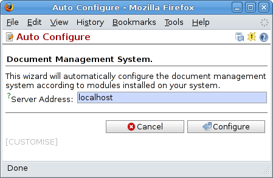
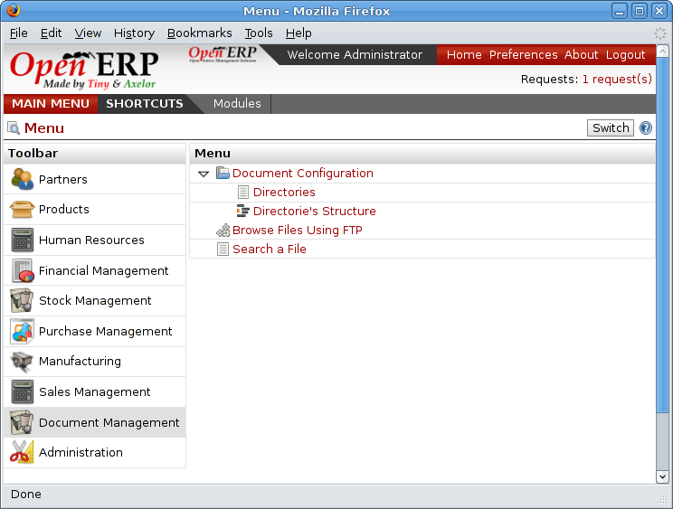

The Open ERP solution
----------------------

Open ERP's management of documents is unique and totally innovative in its integrated approach. Its complete integration with the company's management system solves most of the problems that are encountered when you use independent document management systems:

* Login and the management of access rights is integrated with that of Open ERP for controlling access to different document types,

* Ultra-rapid access to documents, which are directly accessible through your email client or through the company management software,

* Automatic assignment of meta-information comes directly from information contained in your Open EPR login registration,

* Document workflow which automatically follow Open ERP's documentation process provide complete synchronization between the systems,

* Document classification is determined by Open ERP itself so that the structure that is created is always synchronized between the systems,

* Automatic indexation and classification of all documents produced by Open ERP for maximum efficiency.

Getting Started
================

This section is about how to get started with the document management system from its installation to advanced use with FTP access.

Installation
-------------

To install Open ERP's document management system you just need is to install the \ ``document``\  and \ ``board_document``\ modules through the menu *Administration > Modules Management > Modules*. After installing the module the system automatically proposes that you configure the document management system.

*Screen for configuring document management.*

Once the module has been installed you'll see a new entry in the main menu called *Document Management*.

*The document management menu.*

.. Copyright © Open Object Press. All rights reserved.

.. You may take electronic copy of this publication and distribute it if you don't
.. change the content. You can also print a copy to be read by yourself only.

.. We have contracts with different publishers in different countries to sell and
.. distribute paper or electronic based versions of this book (translated or not)
.. in bookstores. This helps to distribute and promote the Open ERP product. It
.. also helps us to create incentives to pay contributors and authors using author
.. rights of these sales.

.. Due to this, grants to translate, modify or sell this book are strictly
.. forbidden, unless Tiny SPRL (representing Open Object Presses) gives you a
.. written authorisation for this.

.. Many of the designations used by manufacturers and suppliers to distinguish their
.. products are claimed as trademarks. Where those designations appear in this book,
.. and Open ERP Press was aware of a trademark claim, the designations have been
.. printed in initial capitals.

.. While every precaution has been taken in the preparation of this book, the publisher
.. and the authors assume no responsibility for errors or omissions, or for damages
.. resulting from the use of the information contained herein.

.. Published by Open ERP Press, Grand Rosière, Belgium
