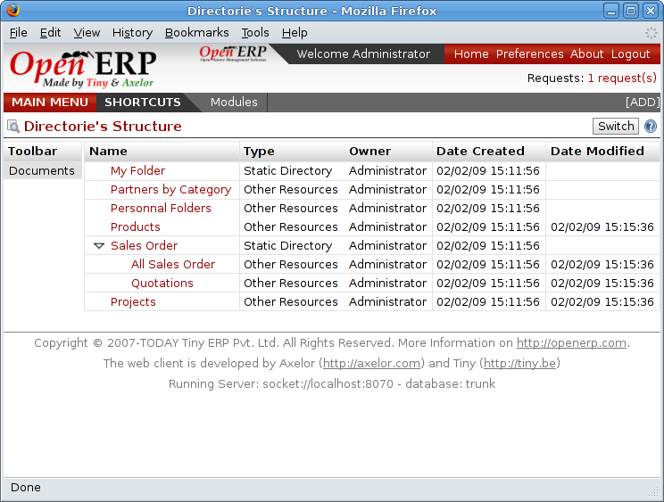
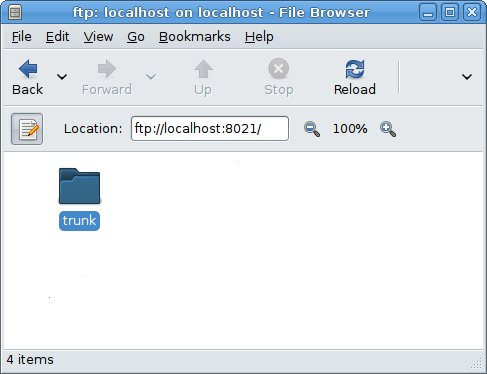
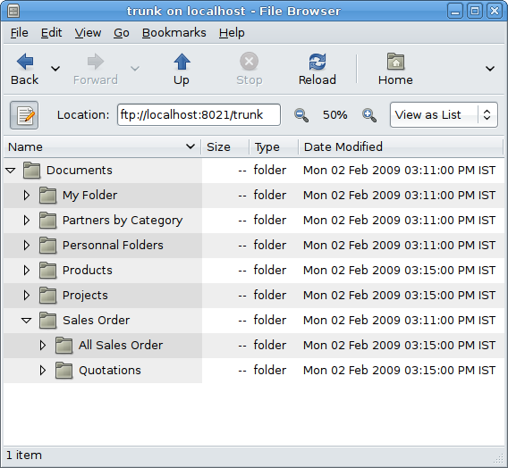

.. index:: FTP

Internal and external access using FTP
---------------------------------------
.. index:: Directory

The first configuration step is to create a directory structure that will be used to classify your document set. You can use the structure automatically propsoed by Open ERP from the menu *Document Management > Directory Structure*.

*Structure of directories when the ``document`` module has been installed.*

In addition to the usual access to documents through Open ERP, you will be able to connect to them directly through the filesystem using the FTP protocol. To connect to the FTP server, use the following address:

========= ===========================================
Parameter Value
========= ===========================================
Server    Your Open ERP server, for example 127.0.0.1
Port      8021
Path      The '/' character, for the root
User      Your user account in Open ERP
Password  Your Open ERP password
========= ===========================================

.. tip::   **Note**  *FTP server* 

    This comment about an FTP server may appear a bit technical, but it's just a standard for getting hold of files without worrying too much about the platform standards (Windows, Mac, Linux, or other Unix-like system). So FTP is just a way of getting access to files without needing to use an Open ERP client. There are other ways, but FTP proved itself to the developers to be the one that performed best at lowest cost.

Once you're connected using FTP you appear to get to the root of a directory for the document management system. Once you enter the directory you find a structure that matches the structure defined in Open ERP.

*Root of the database directory seen through FTP.*

*Structure of the directories in the document management system.*

.. Copyright © Open Object Press. All rights reserved.

.. You may take electronic copy of this publication and distribute it if you don't
.. change the content. You can also print a copy to be read by yourself only.

.. We have contracts with different publishers in different countries to sell and
.. distribute paper or electronic based versions of this book (translated or not)
.. in bookstores. This helps to distribute and promote the Open ERP product. It
.. also helps us to create incentives to pay contributors and authors using author
.. rights of these sales.

.. Due to this, grants to translate, modify or sell this book are strictly
.. forbidden, unless Tiny SPRL (representing Open Object Presses) gives you a
.. written authorisation for this.

.. Many of the designations used by manufacturers and suppliers to distinguish their
.. products are claimed as trademarks. Where those designations appear in this book,
.. and Open ERP Press was aware of a trademark claim, the designations have been
.. printed in initial capitals.

.. While every precaution has been taken in the preparation of this book, the publisher
.. and the authors assume no responsibility for errors or omissions, or for damages
.. resulting from the use of the information contained herein.

.. Published by Open ERP Press, Grand Rosière, Belgium

