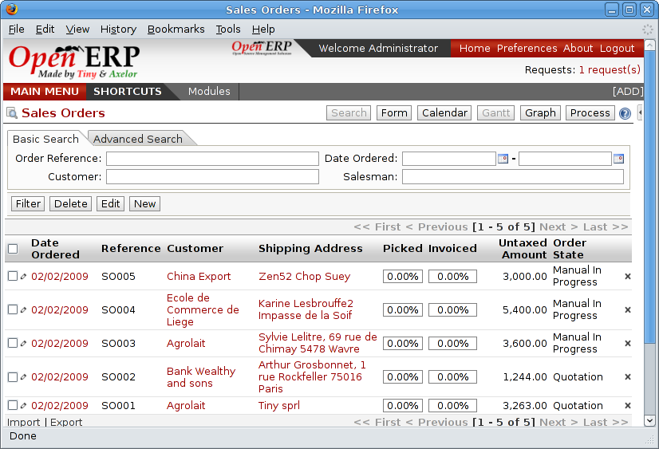

Mapping between Open ERP resources and directories
---------------------------------------------------

Each directory can have the type Static or be linked to another resource. A static directory, as with Operating Systems, is the classic directory that can contain a set of files. The directories linked to systems resources automatically possess sub-directores for each resource type defined in the parent directory.

.. tip::   **Note**  *Directories in English* 

    To keep them synchronized to the working language, directory names are not translateable. But Open ERP's demonstration data automatically creates directories in English. You can rename them through the menu *Document Management > Configuration > Directories*.

For example you can look at the directory shown in *Main Repository > Sales Orders > All Sales Orders*. You'll see the directory for all the orders present in Open ERP that was created automatically by the system.

*Orders in Open ERP.*

.. image::  images/document_ftp_sale.png
    :align: center

*Directories representing all the orders in the document management system.*

Directories can follow a tree like the tree of resources in Open ERP. For example if you go to the directory *Main Repository > Projects* you'll see the structure of the analytic accounts.

To define a directory containing a specific type of resource you have to define parameters when you define the directory itself:

* **Type** : Other Resources

* **Child Models** : Choose one of the system objects

* **Domain** :  an event filtered so that it sees only a subset of the resources

* **Tree structure** : to show the resources hierarchically

*Configuration of the directory containing quotations (draft orders).*

This is a very flexible approach because any modification of the resource in Open ERP is automatically reflected in the document management system. So when the quotation gets confirmed in Open ERP the directory no longer appears as a quotation through FTP access.

Here are some examples of directories linked to Open ERP resources that could be helpful if configured in the document management system:

* Quotations and Order: storing documents that relate to orders,

* Products: for storing products' technical datasheets,

* Users: to automatically define a directory owned by each user of the system,

* Employees: to store documents about employees, such as their CVs, your interview notes, contract details, and their annual assessments,

* Support Requests: storing items about requests or about technical support responses,

* Analytic accounts or project: to store project management and tracking documents.

.. Copyright © Open Object Press. All rights reserved.

.. You may take electronic copy of this publication and distribute it if you don't
.. change the content. You can also print a copy to be read by yourself only.

.. We have contracts with different publishers in different countries to sell and
.. distribute paper or electronic based versions of this book (translated or not)
.. in bookstores. This helps to distribute and promote the Open ERP product. It
.. also helps us to create incentives to pay contributors and authors using author
.. rights of these sales.

.. Due to this, grants to translate, modify or sell this book are strictly
.. forbidden, unless Tiny SPRL (representing Open Object Presses) gives you a
.. written authorisation for this.

.. Many of the designations used by manufacturers and suppliers to distinguish their
.. products are claimed as trademarks. Where those designations appear in this book,
.. and Open ERP Press was aware of a trademark claim, the designations have been
.. printed in initial capitals.

.. While every precaution has been taken in the preparation of this book, the publisher
.. and the authors assume no responsibility for errors or omissions, or for damages
.. resulting from the use of the information contained herein.

.. Published by Open ERP Press, Grand Rosière, Belgium
