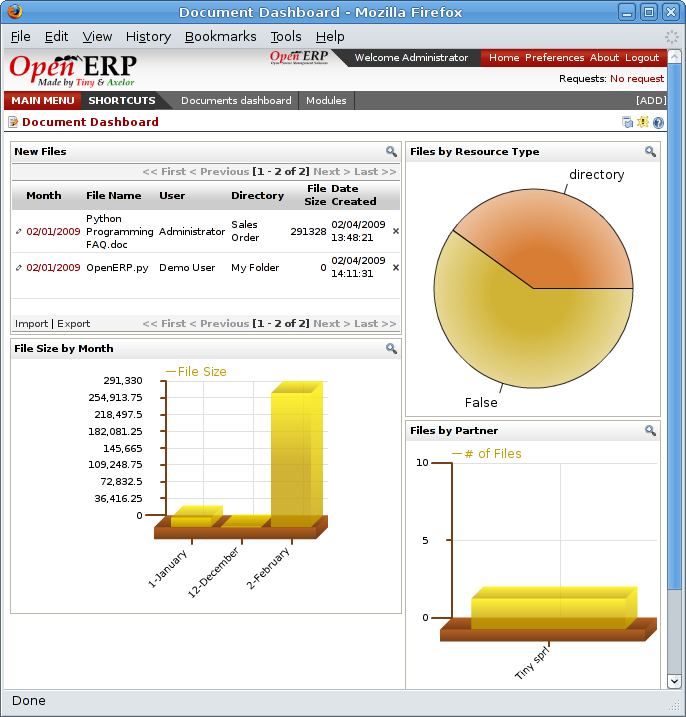
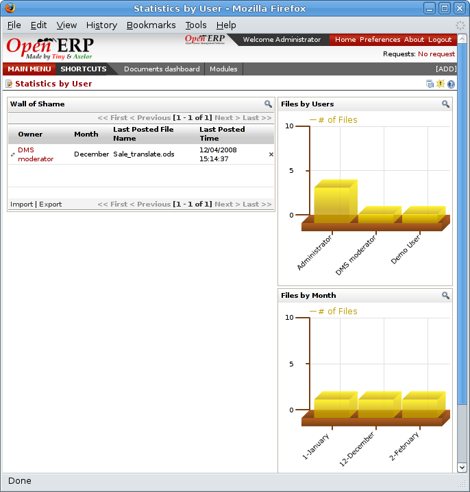
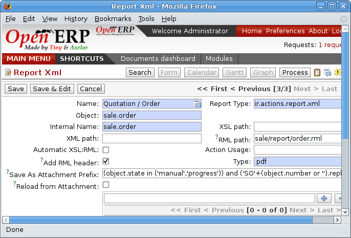
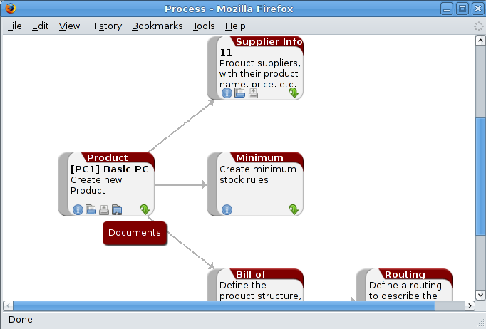

.. index:: Search

Searching for documents
------------------------

You've seen several methods of accessing documents quickly:

* From attachments to an Open ERP resource,

* Through FTP access to Open ERP,

* Using the menu Document Management > Structure of Directories.

But if you don't know where a specific document can be found, Open ERP also has a search tool integrated into its document management. To search for a file use the menu *Document Management > Search for a file*. You get to a document search screen that lets you search amongst all the attachments and all the documents in the FTP server.

You can search for a file using various different criteria:

* The filename,

* The owner of a file,

* The title of the resource that the file is attached to,

* The partner that the document is about,

* The directory that it's found in,

* Its creation and modification dates.

Notice here an important advantage for an integrated document management system. Information such as which partner is associated with a document is automatically detected by Open ERP when the document has been stored in a directory. This information is never input by the user – it's detected automatically using the information about the resource when it's being saved as a file.

But your search isn't limited to these few fields. You can also search on the content in the files. Each file is automatically indexed by the system to give you a search engine rather like Google's on the whole set of company documents.

.. tip::   **Note**  *Supported file formats* 

    The Open ERP document management system can index the following file formats:

    * **TXT** : text files,

    * **PDF** : PDF files,

    * **SXW** : Open Office V1 files,

    * **ODT** : Open Office V2 files,

    * **DOC** : Microsoft Word files.

    The other file formats are properly handled in the document management system but their content is not indexed automatically.

This functionality is very significant. All you need to do is search for a partner name or an order number to automatically get all the documents that are referenced there. And you can use a fragment of text to find the document you need from within that subset.

Integration with your emails
=============================

Using Outlook and Thunderbird
^^^^^^^^^^^^^^^^^^^^^^^^^^^^^^

.. image::  images/document_attachment_outlook.png
    :align: center

*Sending an attachment that's in the document management system from Outlook.*

Working with users' changes
============================

To make the document management system's use as unobtrusive as possible the system's users should easily be able to store all the documents that they produce or receive from their customers and suppliers. So Open ERP supplies dashboards to help system users approve their acceptance of such documents.

So you'll find two dashboards in the menu *Dashboards > Document Management* : one dashboard for the document management system manager and one dashboard for follwing use by different users.

The first lets you track the change of documents by month, by customer and by type of resource. You could also quickly assess the use that's made of the system by the various users.

*Dashboard for the document management system manager.*

The second dashboard lets you track the user that's made of the system by different employees. You'll find the number of files sent by user and a classification of the users using document management system the least. That will enable you to know who has been well-trained and if it is necessary to do something about changing work methods.

*Dashboard for the document management system amalyzed by user.*

Version Management
===================

There's usually a need to keep track of all the important documents that you have printed. For example, when you send an invoice to a customer it's a good idea to store a copy of that invoice internally in paper or electronic form. Then you can reprint it exactly in the same format as when you sent it, even if the company's details have changed in the meantime.

To do this, Open ERP can automatically store as attachments the different reports printed by users. By default, only invoices are saved as attachments, and they're saved when they are printed.

But you can configure the system so that it doesn't matter which type of report is printed. To activate that functionality on another type of report, modify this in the menu: *Administration > Configuration > Low Level > Actions > XML Reports*.

*Modifying the definition of a report.*

Select the report that you want to change and complete the field 'Prefix for saving as an attachment'. Once you've done that each document print action will automatically be saved as an attachment to the document.

Documents used for company processes
=====================================

Finally, the document management system is also completely linked to the main system that manages company processes. Then on each node of your management process you could store a procedure. Once the user sees a process view of the relevant document he would be able to click on the directory to get all the documents that might be useful for this phase of the process.

So you could also efficiently store the documents required for each phase of a process.

*Example of a document linked to process management.*

.. Copyright © Open Object Press. All rights reserved.

.. You may take electronic copy of this publication and distribute it if you don't
.. change the content. You can also print a copy to be read by yourself only.

.. We have contracts with different publishers in different countries to sell and
.. distribute paper or electronic based versions of this book (translated or not)
.. in bookstores. This helps to distribute and promote the Open ERP product. It
.. also helps us to create incentives to pay contributors and authors using author
.. rights of these sales.

.. Due to this, grants to translate, modify or sell this book are strictly
.. forbidden, unless Tiny SPRL (representing Open Object Presses) gives you a
.. written authorisation for this.

.. Many of the designations used by manufacturers and suppliers to distinguish their
.. products are claimed as trademarks. Where those designations appear in this book,
.. and Open ERP Press was aware of a trademark claim, the designations have been
.. printed in initial capitals.

.. While every precaution has been taken in the preparation of this book, the publisher
.. and the authors assume no responsibility for errors or omissions, or for damages
.. resulting from the use of the information contained herein.

.. Published by Open ERP Press, Grand Rosière, Belgium
