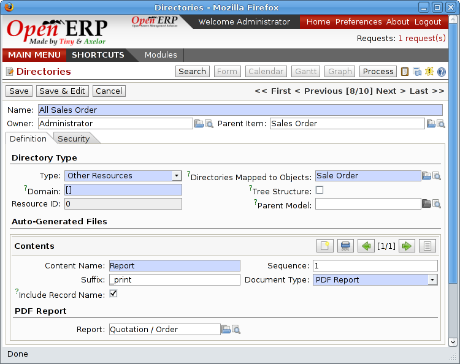
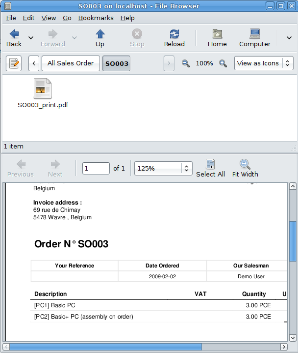

.. index::
   single: Virtual; Files

Virtual Files
--------------

The most well-organized companies keep track of all the documents they've sent to customers in their document management system. It's very useful to be able to retrieve every document about a customer or a project. But the work of storing these documents can itself often take up quite a bit of time for staff. Each report must be saved in the document management system as well as simply being sent by email to the customer.

That's not the case in Open ERP. To automatically make Open ERP reports available in the FTP server, Open ERP enably the definition of 'virtual files'. You can then put virtual files into directories that have the special type of 'linked resource' and link the virtual files to Open ERP's reports.

.. tip::   **Technique**  *Virtual Files* 

    Virtual files don't actually existing in Open ERP but are made visible with a size of 0 in the FTP server. Once these files have been read by the client software, Open ERP prints the document related to this file and returns a PDF document linked to the resource.

    When you copy or open a virtual file you print the selected resource. You then don't have to go and print a document through Open ERP – you just open the file containing that document in the document management system. The PDF file is then created in real time by Open ERP by reading the relevant data.

The screen below shows the parameters of the virtual files in Orders. You define the virtual files using the name NUMCOMMAND_print.pdf, where NUMCOMMAND represents the reference to the order. To do this you must complete the section Descriptive Contents of the file for a directory. For each report associated with an order you can then find a virtual file.

*Virtual files about sales orders in Open ERP.*

To see the effect of this configuration, connect to the FTP server and go into a directory for an order, such as Main Repository > Sales Orders > All Sales Orders > SO003. You can then just double-click the file SO003_print.pdf to get a printout of Order SO003. You can attach it to an email or put it on your desktop.

*Virtual files about sale orders through FTP.*

This system of virtual files is very useful in a lot of situations. For example if you must quickly re-send a quotation to a customer you don't have to open Open ERP, you can just attach the relevant virtual file to your email.

Once the files have been read or copied they become real files, taking up real space, rather than just virtual.

.. Copyright © Open Object Press. All rights reserved.

.. You may take electronic copy of this publication and distribute it if you don't
.. change the content. You can also print a copy to be read by yourself only.

.. We have contracts with different publishers in different countries to sell and
.. distribute paper or electronic based versions of this book (translated or not)
.. in bookstores. This helps to distribute and promote the Open ERP product. It
.. also helps us to create incentives to pay contributors and authors using author
.. rights of these sales.

.. Due to this, grants to translate, modify or sell this book are strictly
.. forbidden, unless Tiny SPRL (representing Open Object Presses) gives you a
.. written authorisation for this.

.. Many of the designations used by manufacturers and suppliers to distinguish their
.. products are claimed as trademarks. Where those designations appear in this book,
.. and Open ERP Press was aware of a trademark claim, the designations have been
.. printed in initial capitals.

.. While every precaution has been taken in the preparation of this book, the publisher
.. and the authors assume no responsibility for errors or omissions, or for damages
.. resulting from the use of the information contained herein.

.. Published by Open ERP Press, Grand Rosière, Belgium
