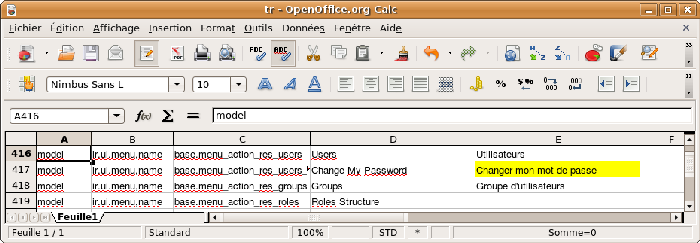
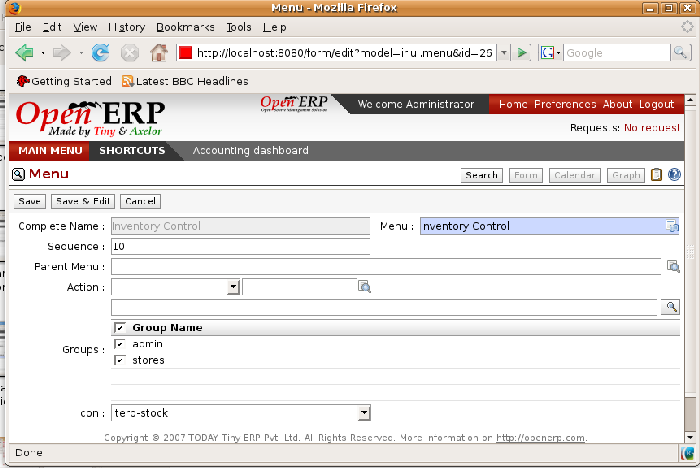
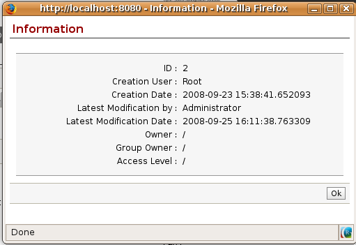
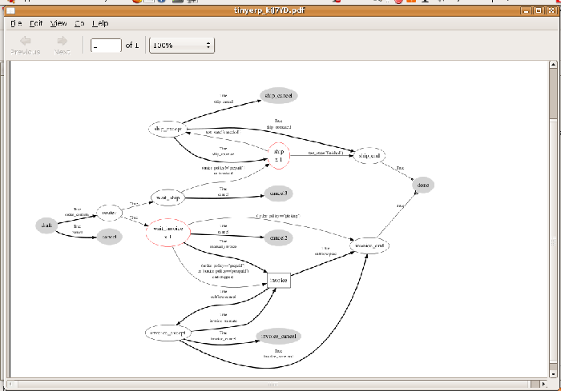
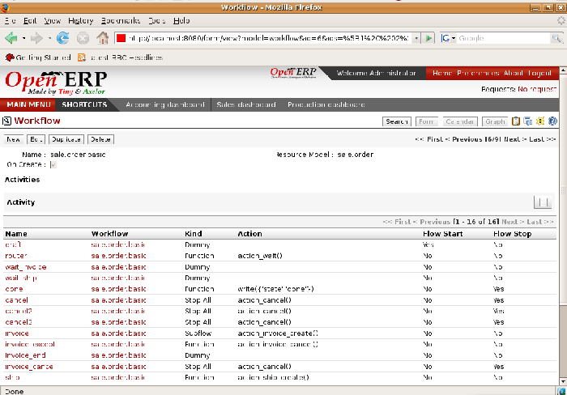
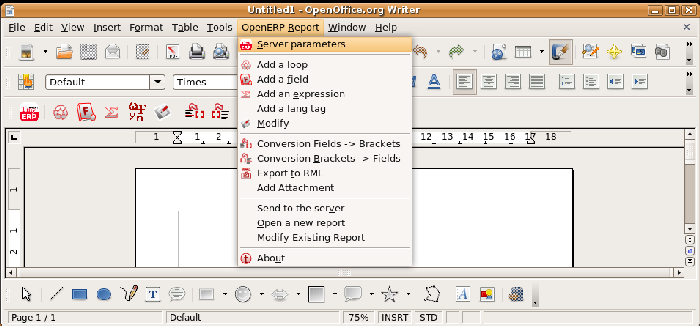
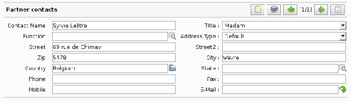

Personalizing and Administering Open ERP
#########################################

Summary

* Creating a configuration module

* Reorganizing the menu

* Changing passwords

* Personalizing the welcome page

* Defining the default behaviors

* Configuring the language and adapting the terminology

* Managing access rights

* Configuring the workflows

* Designing statistical reports

* Importing your data

Keywords

* administration

* rights management

* OpenOffice.org

* Report Designer

* statistics

* workflow

 *This chapter is for the administrators of an Open ERP system. You'll learn to configure and personalize Open ERP to match it to your company's needs and those of each individual user of the system.* 

Open ERP gives you great flexibility in the ways of configuring and using it, which let you modify its appearance, the general way it functions and the different analysis tools chosen to match your company's needs most closely. These configuration changes are carried out through the user interface.

Users can each arrange their own welcome page and their own menu, and you can also personalize Open ERP by assigning each user their own dashboard on their welcome page to provide them with the most up to date information. Then they can immediately see the information most relevant to them each time they sign in.

And Open ERP's main menu can be entirely reorganized. The management of access rights lets you assign certain functions to specific system users. You can also assign roles, which define the part that each system user plays in the workflows that move system documents from state to state (such as the ability to approve employee expense requests).

.. tip::   **Definition**  *Personalization* 

	The word personalization is used in this book where you might expect to find customization. That's because customization refers to something that requires quite a bit of technical effort (such as creating specialized code modules) and creates a non-standard system. 

	The word configuration is more closely related – it's the general process of setting all the parameters of the software to fit the needs of your system. Personalization is just that subset of configuration options that shapes the system to the operational needs of a certain company.

Using the module *OpenOffice.org Report Designer* you can change any part of any of the reports produced by the system. The system administrator can configure each report to modify its layout and style, or even the data that's provided there.

.. tip::   **Advantage**  *The*  *OpenOffice*  *.org Report Editor* 

	The OpenOffice.org plug-in enables you not only to configure the reports of the basic products in Open ERP but also to create new report templates. When the user prints these reports through Open ERP's client interface, OpenOffice.org opens with the report containing all the selected data.

	You can also easily create fax documents, quotations, or any other commercial document. This functionality enables you to considerably extend the productivity of your salespeople who have to send many proposals to customers.

Finally, you'll see how to import your data into Open ERP automatically, to migrate all of your data in one single go.

Creating a Configuration Module
=================================

It's very helpful to be able to backup your specific configuration settings in an Open ERP module dedicated just to that. That enables you to:

* automatically duplicate the configuration settings by installing the module in another database,

* reinstall a clean database with your own configuration in case you have problems with the initial configuration,

* publish your specific configuration to benefit other companies in the same industrial sector,

* simplify migrations, if you have modified some elements of the basic configuration, there's a risk in returning them to their original state after the migration, unless you've saved the modifications in a module.

Start by installing the module \ ``base_module_record``\   in the usual way. Then start recording your actions using the menu  *Administration > Modules Management > Modules Recording > Start Recording* . Manually make all your configuration changes through the user interface as you would normally (such as menu management, dashboard assignments, screen personalization, new reports, and access rights management – details of some of these possibilities are described later in this chapter).

Once you've done all this, go to the menu  *Administration > Modules Management > Modules Recording > Save Recorded Module* . 

.. tip::   **A step further**  *Contributing to the development of Open ERP* 

	Once your personal configuration has been saved into a module, install the module base_module_publish. This gives you a new possible action Publish Module in the menu Administration > Modules Manage > Modules. 

	Use this function to publish your module on the official Open ERP site. It could then be reused by other companies that have the same needs as yours. You could then yourselves benefit from improvements made by these same companies in future. 

	Don't forget to create a user account beforehand on http://openerp.com.

Open ERP then creates a ZIP file for you containing all of the modifications you made while you were carrying out your configuration work. You could reinstall this module on other databases and/or publish it online to help other companies. This could turn out to be useful if you want to install a test server for your company's users and give them the same configuration as the production server.

To install a new module saved in ZIP file form, use the menu  *Administration > Modules Management > Import a new module* .

Personalizing the menu
=======================

Open ERP's menu organization isn't subject to any restriction, so you can modify the whole structure, the terminology and all access rights to it to meet your specific needs in the best possible way. However, before you do all that and just as you would for any other customizable software, you should balance both the benefits you see in such changes and the costs, such as the need to train users, to maintain new documentation and to continue the alterations through subsequent versions of the software.

This section describes how to proceed to change the structure of the menu and the welcome page, to personalize the terminology of the menus and forms in the user interface and for managing users' access rights to the menus and the various underlying business objects.

Letting users change their password themselves
-----------------------------------------------

When you signed onto the \ ``openerp_ch02``\   database as the administrator, two menus gave you access to forms for changing your password:

*  *Administration > Users > Users*  gives a list of all users: click on your own name in that list and a form appears containing a field that with your password (don't click the  *Edit*  button above the form for the moment, and don't click the  *Edit*  icon to the right of the list of users either)

*  *Administration > Users > Users > Change My Password*  shows another list, this time with only you in that list: click on your own name and you'll see a form where only the password and signature can be edited (again, don't edit this at the moment).

These two paints mentioned above are found in the  *Administration*  branch of your menu, which is only visible to users who are members of the \ ``admin``\   group (login again as \ ``demo``\   if you want to check this). You can easily make a menu item accessible to everyone by moving it or duplicating it, so you can make the  *Change My Password*  menu accessible to everybody.

To do this, select the menu item  *Administration > Users > Users > Change My Password* . Then click on the line containing the word Administrator (but not on the name \ ``Administrator``\   itself) and click the  *Switch*  button to bring up the menu item as an editable form (you can do the same using the GTK client – there you select the line and click the  *View*  button instead).

You could now edit this form – change its  *Parent Menu* , which moves the entry to a different part of the menu system; edit its  *Menu*  name to change how it appears in the menu tree, or give it a new  *Icon* . Or you could give it a new  *Action*  entirely (but this would lose the point of this particular exercise).

Instead of editing this form, which is the original menu entry, duplicate it instead. With the web client you must first make the form read-only by clicking the  *Cancel*  button, then you click the  *Duplicate*  button that appears (in the GTK client, click  *Form > Duplicate*  from the top menu). The form that remains is now the duplicate entry, not the original.

.. image::  images/new_menu.png
   :align: center

*Menu enabling you to change your own password, accessible to all users*

To move this duplicate entry, change the  *Parent Menu*  field by deleting what's there and replacing it with another menu that everyone can see, such as  *Tools*  or  *Human Resources* , and make sure that the entry moves to the end of the menu list by replacing the  *Sequence*  with \ ``99``\  . You can experiment with icons if you like. Save the form and then click  *Main Menu*  to see the results.

.. tip::   **Advice**  *Duplicating the menu* 

	You should duplicate a menu before modifying it. In this way you'll always keep a link to the original menu that works if you need it to.

.. tip::   **Attention**  *Managing Passwords* 

	If you let users change their passwords for themselves you'll have no direct control over the password they choose. You should have a written policy about password strength to try to maintain a level of security in your system.

.. tip::   **Note**  *Managing users through LDAP* 

	With the user_ldap module, user accounts can be managed through an LDAP directory common to various different company resources. 

	Connection parameters for the LDAP directory are then registered with the company definition. You can provide a user profile template there from which new users are automatically created during their first connection to Open ERP.

.. tip::   **Definition**  *LDAP* 

	The LDAP protocol (Lightweight Directory Access Protocol) enables you to manage common directories for various different resources through your standard TCP/IP network. 

	This enables users in the company to have the same username and password to access all their applications (such as email and their intranet).

Personalizing the welcome page for each user
---------------------------------------------

When you sign into Open ERP for the first time, a welcome page appears. In a minimal system, such as that created in the original \ ``openerp_ch02``\  database before it was expanded in that chapter, and in the  \ ``openerp_ch03``\  database, you only get the main menu – the same as you get by default when you click the *Main Menu* button. As you add functionality to your database you get more choices for the welcome page, with different dashboards automatically assigned to various company roles as they're created in the demonstration data.

The administrator can change both the welcome page and the main menu page individually for each user of the system, and can adapt Open ERP to each role in the company to best fit the needs of everyone.

To make modifications for a particular user, edit the user configuration again in  *Administration > Users > Users* . Open the form for a particular user, and select different menu entries for the two fields  *Home Action*  and  *Menu Action* . 

.. image::  images/new_home.png
   :align: center

*Selecting a new welcome page*

The  *Home Action*  is the menu item that is automatically opened when you first sign on, and is also reached when you click the  *Home*  link in the top right toolbar of the web client. There you can choose any page that you'd reach through any menu – one of the dashboards could be most useful. The  *Menu Action*  is the one you reach through the  *Main Menu*  button in the web client (the  *Menu*  button in the GTK client). You can choose the main menu and the dashboards there.

.. tip::   **Attention**  *Actions on the administrator's menu* 

	It's very easy to change the welcome page and the menu of the different users. However, you shouldn't change the main administrator's menu because you could make certain menus completely inaccessible by mistake.

Assigning default values to fields
-----------------------------------

You can quite easily configure the system to put default values in various fields as you open new forms. This enables you to pre-complete the fields with default data to simplify your users' work in entering new documents.

 *New*  *Partners > Partners* \ ``New Zealand``\   *Country*  *Partner Contact* 

* If you're using the web client do a Ctrl-Right-Click (that's a mouse right-click while the mouse pointer is in the field and the Control key is held down on the keyboard).

* If you're using the GTK client, you just need to right-click the mouse while the pointer is in the field.

 *Set as default*  *Field Preferences*  *Value applicable for*  \ ``For all``\  or \ ``Only for you``\  

.. image::  images/set_default.png
   :align: center

*Inserting a new default value*

To check this new configuration, open a new partner form: the field  *Country*  should now contain the entry \ ``New Zealand``\  .

This is a very powerful feature! An administrator can use this functionality to redefine the behavior of your whole system. You can test that in database \ ``openerp_ch13``\   by opening up a new  *Purchase Order*  form, clicking the second tab,  *Purchase Shipping* s, selecting \ ``From Picking``\   in the  *Invoicing Control*  field and then making that the default. From that moment on, you'd automatically create draft purchase invoices only when goods are received, so you could very easily restrict your accountants from paying any invoices that turn up until you were sure you had received the goods. It wouldn't stop anyone from selecting another method of invoice control, but they'd start with the default definition.

Changing the terminology
-------------------------

You can use Open ERP's language translation functionality to substitute its standard terminology with terminology that fits your company better. It's quite straightforward to adapt the software with different terms specific to your industry. Moreover, this can strengthen acceptance of your new Open ERP system, because everybody will be able to retain their usual vocabulary.

You can do this one of two ways:

* translate them in a CSV file, which gives you a global overview of all of the system terms so that you can search and replace specific occurrences everywhere,

* translate the phrases directly in the client, which means that you can change them in their context, and that can be helpful to you while you're translating.

.. tip::   **Definition**  *CSV* 

	CSV (Comma-Separated Values) is an open text file format, representing tabular data where values are separated by commas. These files use a file extension of .csv, and the format is a very common one for exporting data from one software system to another.

	Each line of the file corresponds to a record in the table, and the cells of each row are separated by the commas. For example, the following file:

	        LastName, FirstName, Company
	        
	        Robins, Gerald, SOS Plumbers
	        
	        Lacoste, John, Extra-Textiles
	        
	        Schumacher, Helen, Cook Chain

        .. csv-table:: represents the table
            :header: "LastName","FirstName","Company"
            :widths:  8,8,8
               
           "Robins","Gerald","SOS Plumbers"
           "Lacoste","John","Extra-Textiles"
           "Schumacher","Helen","Cook Chain"

The same approach is used to translate terms that haven't been created yet. This can be useful, for example, with modules that haven't yet been translated into English or any other language that you want.

Translation through a CSV file
^^^^^^^^^^^^^^^^^^^^^^^^^^^^^^^

To translate or modify all of the system's phrases you first have to export a translation file in CSV form.

 *Administration > Translation > Export language*  *Français*  *New Language* \ ``.csv``\  

.. tip::   **Attention**  *UTF-8 format* 

	The CSV file is encoded in the UTF-8 format. Make sure that you retain this format when you open the file in a spreadsheet program because if you don't you risk seeing strange character strings in place of accented characters.

---------------------

*CSV translation file with the translation superimposed*

The file contains five columns:  *type* ,  *name* ,  *res_id* ,  *src* , and  *value* . You have to ensure that the first line, which specifies these column names, remains untouched. The  *src*  field contains the base text in English, and the  *value*  field contains a translation into another conventional language or into a specialist technical phrase. If there's nothing at all in the  *value*  field then the English translation will automatically be used on the the form you see.

.. tip::   **Note**  *When should you modify the text?* 

	Most of the time, you will find the text that you want to modify in several lines of the CSV file. Which line should you modify? Refer to the two columns type (column A) and name (column B). Some line have the nameir.ui.menu which shows that this is a menu entry. Others have a type of selection, which indicates you that you'd see this entry in a drop-down menu.

You should then load the new file into your Open ERP system using the menu  *Administration > Translation > Import language* . You've then got two ways forward:

* you can overwrite the previous translation by using the same name as before (so you could have a special 'standard French' translation by reusing the  *Name* \ ``Français``\   and  *Code* \ ``fr_FR``\  ),

* you could create a new translation file which users can select in their  *Preferences* .

If you're not connected to the translated language, click  *Preferences* , select the language in  *Language*  and finally click  *OK*  to load the new language with its new terminology.

.. tip::   **Note**  *Partial translations* 

	You can load only some of the lines in a translation file by deleting most of the lines in the file and then loading back only the changed ones. Open ERP then changes only the uploaded lines and leaves the original ones alone. 

Changes through the client interface
^^^^^^^^^^^^^^^^^^^^^^^^^^^^^^^^^^^^^

 *New Language* 

Then you should open the form that you want to translate. 

 *Translate this resource*  *Search* 

* the data in the system (contained in the  *Fields* ),

* the field titles (the  *Labels* ),

* all of the  *Action*  buttons to the right of the form,

* the terms used in the form  *View* .

You can modify any of these.

The procedure is slightly different using the GTK client. In this you just right-click with the mouse on a label or button. You can choose to translate the item itself or the whole view.

This method is simple and quick when you only have a few entries to modify, but it can become tiresome and you can lose a lot of time if you've got to change some terms across the whole system.

In that case it would be better to use the translation method that employs a CSV file. 

.. tip::   **GTK Client**  *Tacking account of translations* 

	In the GTK client the modified terms aren't updated immediately. To see the effects of the modifications you must close the current window and then reopen the form.

Managing access rights
=======================

One of the most important areas in configuring Open ERP is how to manage access rights to the information in it. 

You're planning to put everything significant to your business into the system, but most of your staff need see only part of it, and may need to change even less of it. Who should have rights to what, and how do you manage that?

Tiny ERP's approach to rights management is highly flexible. Each user can belong to one or more groups, and the group(s) you belong to determine(s):

* the visibility of each menu item and

* the accessibility of each table in the database. 

For example, the group \ ``Stock``\ may only be given access to some of the menus in *Inventory Control*, and may have no access to any of the accounting information. Each system user who works in Stores is given membership of the *Stock* group. If some users also work elsewhere, they'd also be given membership of other groups.

Open ERP users can also belong to various roles. Just as group gives a user access rights, each role determines the user's duties. This is managed at the level of workflows, which form the company's business processes.

Groups and Users
=================

To configure access rights you must start by defining the groups. It's important for the groups to be representative of your company's job functions rather than of its individual employees.

So if your finance director is also your sales director, you should create both a Finance Director group and a Sales Director group, even though they're both the same person, and would both be assigned to this user in practice. This gives you flexibility for the future. 

You should also create groups within a departmental areas that have different levels of access rights. For example, if you create a \ ``Sales Director``\ group and a \ ``Sales``\  group avoid assigning exactly the same rights to each group. The first could see all the of reports, while the second could be restricted to seeing quotations. You could either make the \ ``Sales Director``\ a member of both groups, and give the Sales Director group a limited set of extra rights, or give the \ ``Sales Director``\ group all the rights it needs for a Sales Director to belong only to this one group. You should choose the scheme that gives you most flexibility and then stick with it to maintain consistency.

.. tip::   **Advice**  *Flexibility in managing access* 

	To give yourself flexibility, you can ensure that a trusted staff member (perhaps a director or someone in accounts, or even the system administrator) is given wide rights to use the system, and is authorized by the management to carry out specific tasks for people. 

Access rights for menus
-------------------------

To get a feel for rights management in Tiny ERP you'll create a new \ ``Stock1``\  group, with access to the *Inventory Control* menu items. You'll then create a stores person user who's a member of the \ ``Stock1``\  group.  

To create a new group, use the menu Administration > Users > Groups. Enter the group name Stock1. 

Then to create a new user linked to this, use Administration > Users > Users to enter the following:

*  *Name* : \ ``Stores Person``\  ,

*  *Username* : \ ``stores``\  ,

*  *Password* : \ ``stores``\  ,

*  *Company* : \ ``<your company>``\  ,

*  *Action* : \ ``Menu``\  ,

*  *Menu Action* : \ ``Menu``\  .

In the second tab of the user form,  *Security* , add the \ ``Stock1``\   group that you just created.

*Groups that have access to the Inventory Control menu*

Save the user, then go into the menu  *Administration > Security > Define Access to Menu-Items*  to get a list of menus. Filter this list using the search field  *Menu*  to get the  *Inventory Control*  menu item. In the form describing the menu, add \ ``Stock1``\   into the  *Groups*  field. While you're at it, also add the \ ``admin``\   group there. From now on, only members of the \ ``Stock1``\   group and the \ ``admin``\   group will be able to see this menu item in their main menu list.

.. tip::   **Info**  *Menu hierarchy* 

	Since menus are hierarchical there is no need to hide access to lower menus: once you've configured Inventory Control this way, all lower-level menus become inaccessible to members of other groups.

.. tip::   **Important**  *Security* 

	This method of managing access to menus doesn't guarantee that users are prevented from reaching hidden business objects in the system in other ways. For example, hiding the Invoices menu won't prevent people reaching invoices through purchase and sales orders, or by guessing the URL.

	For effective security management you must use the the methods for managing access rights to objects presented in the following section.

.. tip::   **Further Information**  *Initial access configuration* 

	In the initial configuration, Open ERP's admin user, a member of the admin group, is given access to the Configuration menu in each section of the main menu. For example, Partners > Configuration is visible in the administrator's menu amongst other Partner menu items, but only the other menu entries are visible to other users. Similarly, the main menu entry Administration is visible only to users who are members of the admin group.

Access Rights to Objects
^^^^^^^^^^^^^^^^^^^^^^^^^

The menu access rights determine who can access which menu, but doesn't define what you can do once you're in the menu.

Access controls on the objects give you the possibility of defining what your users have the right to do with your data when they get access to it. Access control of objects is structured the same way as access to menus.

.. tip::   **Definition**  *Object* 

	An object represents a document in the system. Objects are linked to database tables and also have additional concepts, such as the functions of fields, inheritance from other objects, and class methods that give them behavior.

If no group is assigned to an object, all users can access it without any restriction of any sort. Conversely, when an access control is defined for an object, a user must be a member of a group owning appropriate access rights to have any sort of access to that object.

You must always ensure that you don't lock the \ ``admin``\ group out of any objects that control administration and configuration options, such as the \ ``ir.model.access``\   model.

You can manage four access modes on objects independently:

*  *Read access* : members of the group can read the data in the object,

*  *Create access* : members of the group can create a new record in the object, 

*  *Write access* : members of the group can modify the contents of records in the object, 

*  *Delete access* : members of the group can delete records from the object.

(access_control.png)Access control to invoices for the admin group

To configure access rights on a Open ERP objects, use the menu  *Administration > Security > Access Controls* . You give a  *Name*  to the access control, select a  *Group* , and the object ( *Model* ), then check the checkbox corresponding to each of the four  *Access*  modes. 

If you don't specify any group in the access rules, the rule is applied to all groups. So to remove access to an object for all users you could create a rule:

* which is defined for a specific object,

* which is linked to no group,

* for which none of the four access options is checked.

You can then create additional rules on the same object to give specific rights to certain groups.

Modification history
---------------------

*Partner Record history*

Each record in a Tiny ERP database carries a note of its history. You can then find out who it was created by and when that occurred, and who last modified it and when that occurred. Click the *View Log* icon at the top right of any form in the web client (but only when it's read-only, not when it's editable) to display a dialog box showing this information, as shown in the figure below. It can help you identify who to contact if there are any problems with the data in the records.

Configuring workflows
=======================

Workflows represent the company's different business processes. They're completely configurable and define the path that any Open ERP object (such as an order) must follow depending on the conditions (for example an order over a certain value must be approved by a sales director, otherwise by any sales person, before the delivery can be triggered).

The figure below shows the standard workflow for an order. You can show it from the GTK client starting with  *Sales Management > Sales Order > All Sales Order* . Select an order, then go to the top menu  *Plugins > Execute a plugin > Print Workflow*  to show the menu below. They're designed really for administrators, so aren't available through the web client.

*Workflow for order SO005*

Defining workflows
-------------------

Workflows can be created and modified in Open ERP's user interface.

You can look at the specifications of the workflow for the sales order above using the menu Administration * > Configuration > Low level > Base > Workflow* . It's the process named sale.order.basic. All of the nodes appearing in the graph are listed in the field  *Activities* , and all of the arrows are listed in the field  *Transitions* .

*Definition of the workflow for a sales order*

You can also configure the workflows by adding new activities and transitions between activities or by modifying the conditions that control the existing transitions. 

.. tip::   **Technique**  *Defining workflows* 

	Workflows are defined in files named MODULE_workflow.xml which can be found in the addons directory on the server. The definition just consists of a list of activities (nodes) and transitions (arrows).

Assigning roles
-----------------

Users can be linked to several roles specifying their duties in certain phases of different workflows accompanying the various documents. For example, if a user has taken the role of services manager he takes on the task of approving holiday requests from his staff. So his role will be integrated in the holiday request workflow.

Role definition is done in  *Administration > Users > Roles Structure > Define Roles* , the same way you define groups, except that roles can be hierarchical: a parent role has the same influence as all of its child roles (for example, the sales director would be able to do all of the things that have been defined for a sales person, as well as anything defined specifically for the sales director group, if the sales director has been made a parent of the sales group).

Once the roles have been defined, you can add them into the workflow transitions using the Role field. This means that users who have the required role can make the transitions in the workflow, which enable them to pass from one activity to another (for example confirming an order or an invoice).

Configuring reports
=====================

Open ERP has two distinct report types:

* Statistical reports: these are calculated data, often represented in the form of lists or graphs. These reports are dynamics and you can navigate through the data that comprise the figures through the client interface.

* Report documents: they're used to print system documents. The result is usually a PDF generated by a selection made on the screen. Furthermore, Open ERP enables you to open these reports in OpenOffice.org to edit in any changes you want before sending them to your customer.

Because of the power of the Open ERP engine, these two types of report can be created or modified without needing any development and this can be done directly in the client interface of Open ERP or from OpenOffice.org.

Managing statistical reports
-----------------------------

Many reports are configured in advance in Open ERP. You can find them in the  *Reporting*  submenus under each main menu entry.

You can also install more new reports using various different modules whose name usually starts with  *report_* . 

Modeling a new report
^^^^^^^^^^^^^^^^^^^^^^^

Open ERP gives you the possibility of developing your own analyses to meet your specific needs. To define a new analysis of the system's data you should install the module \ ``base_report_creator``\  . This enables you to create complex queries on the database, in a simple and visual way. 

Once the module is installed, create a new report using the menu  *Dashboards > Configuration > Custom Reports* .

Give a  *Report Name*  to your new report and select the objects that you're going to analyze. For example, select the three following objects:  *Partner* ,  *Sale Order* ,  *Sale Order line* .

Then turn to the second tab,  *View parameters* , to select the views that you want in your report. Select \ ``Tree``\   in the  *First View*  and \ ``Graph``\   in the  *Second View* . You can choose the type of graph displayed using the  *Graph View*  fields. You could also select \ ``Calendar``\   as a view if you were going to add the  *Date*  field in your report.

.. tip::   **Advantage**  *The MS Excel plug-in* 

	The Microsoft Excel plug-in enables you to connect to Open ERP and automatically extract the selected data. You can then apply formulas and graphs to make your own dashboards of measures directly in Excel. The .xls file can be saved and, when it is reopened, it reconnects to Open ERP to refresh the different lists and graphs with live data.

	.. image::  images/report_analysis_config.png
	   :align: center

*Fields selected for the analysis of sales by customer and by product(plugin_excel.png)Selection of Open ERP objects from Microsoft Excel*

In the third tab,  *Fields to Display* , you can add filters on all the fields of the selected objects ( *Filters on Fields* ). To do that, use the button  *Add Filter*  at the top of the form. For the moment, don't add a filter.

In the fourth tab you must indicate which of the fields in the list you want to be shown in your report ( *Fields to Display* ). Complete the screen along the lines of the figure below.

	#. The  *Sequence* field gives the order of the fields displayed.

	#.  *Field*  the second column enables you to select a field from any of the three objects you selected in the first tab.

	#.  *Grouping Method*  the third column lets you to determine the grouping operation that is to be applied to this field:

	        - Grouped: enables you to group document entries with the same value in this field.

	        - Sum: gives the sum of values in this field.

	        - Minimum: gives the minimum of all the values that appear in this field.

	        - Maximum: gives the maximum of all the values that appear in this field.

	        - Average: gives the arithmetic average of all the values in this field.

	#.  *Graph Mode*  the fourth column, determines if the field will appear in the graph view and, if so, on which axis (X or Y).

	#.  *Calendar Mode*  the fifth column, enables you to specify if the field can be the basis of a calendar view.

You can now  *Save*  the report you defined. Click on the  *Open Report*  button to the right of the form to get the requested analysis.

.. image::  images/report_sale_tree.png
   :align: center

*Analyzing sales by partner and by product in list view*

.. image::  images/report_sale_graphe.png
   :align: center

*Analyzing sales by partner and by product in graph view*

Personalizing the dashboards
^^^^^^^^^^^^^^^^^^^^^^^^^^^^^

 *Dashboards > Configuration > Dashboard definition* 

A dashboard is a selection of reports previously defined in Open ERP. You can choose from hundreds of predefined reports and, for each report, indicate its position on the dashboard.

Just like fields on reports, the  *Sequence*  field determines the order in which views appear in the dashboard. 

.. image::  images/dashboard_config.png
   :align: center
   :scale: 85

*Definition of a new dashboard*

Once the dashboard has been defined you can use the  *Create Menu*  button to create a menu entry for your dashboard anywhere in the menu system.

Managing document templates with OpenOffice.org
-------------------------------------------------

To personalize your printable documents in Open ERP, use the module \ ``base_report_designer``\  , which the Tiny company published a little after the release of Open ERP version 4.2.0.

.. tip::   **Advantage**  *The OpenOffice.org Writer plug-in* 

	You can create your own reports in just a few minutes using the OpenOffice.org Writer plug-in. This tool can give your team a big productivity improvement. Using it, you can create templates for all of your company's documents, reducing the work of creating and laying out data and customer documents.

The system is both simple and powerful, because it gives you the benefits of all of the layout facilities offered by OpenOffice.org Writer as well as all of the data and calculation provided by Open ERP. You could create or modify reports directly from OpenOffice.org and then use them in Open ERP.

.. tip::   **Techniques**  *Independence from OpenOffice.org* 

	OpenOffice.org is only used to generate new document templates. The system administrator is the only person who has to install it.

	Once the document templates have been defined the users don't need it to carry out their normal work. They can use either Microsoft Office or OpenOffice.org as they choose.

The OpenOffice.org plug-in enables you to search for fields in Open ERP and integrate them into your document templates. You can use data loops in tables or sections, enabling you to attach several lines to an order, for example.

Once the new report has been defined it appears directly in the Open ERP client for the system users. 

There are two modes of using reports:

* make the report produce a PDF document with data in it reflecting the selected record (for example, an invoice).

* make the report open a document for modification in OpenOffice.org, with data in it reflecting the selected record. This enables you to modify the document in OpenOffice.org before sending it to the customer (such as with a Quotation).

The personalized reports are stored in the Open ERP database and are accessible to everyone who has rights to use your database without any need for the installation of OpenOffice.org on their own computers. The document modifications are applied to a single database.

Installing the OpenOffice.org module
^^^^^^^^^^^^^^^^^^^^^^^^^^^^^^^^^^^^^

You should install two components before using the report editor:

* the module \ ``base_report_designer``\   – first in your Open ERP installation if it's not already there, and then in the Open ERP database, you want to use it in.

* the OpenOffice.org Report Designer in the OpenOffice.org installation on your system administrator's computer.

You start by installing the module \ ``base_report_designer``\   just like all the other Open ERP modules.

To install the OpenOffice.org extension, look for the file \ ``openerpreport.zip``\   supplied with the  *Report Designer*  distribution. Check that OpenOffice.org is properly installed on your computer and that you have administration rights for installation.

*Menu TinyReport in OpenOffice.org Writer*

Start OpenOffice.org Writer, select  *Tools > Package Management...*  to open the Package Management dialog box and then search for the \ ``openerpreport.zip``\   file to install it. Then close the application and restart Writer: a new menu appears in the top menu bar –  *Tiny Report*  or  *Open ERP Report* .

Connecting OpenOffice.org to Open ERP
^^^^^^^^^^^^^^^^^^^^^^^^^^^^^^^^^^^^^^^

Select Tiny Report > Server parameters or Open ERP Report > Server parameters in the top menu of OpenOffice.org Writer. You can then enter your connection parameters to the Open ERP server. You must select a database \ ``demo_min``\   in which you've already installed the module \ ``sale``\  . A message appears if you've made a successful connection.

Modifying a report
^^^^^^^^^^^^^^^^^^^

The report editor lets you:

* modify existing reports which will then replace the originals in your Open ERP database,

* create new reports for the selected object.

To modify an existing report, select  *Tiny Report > Modify Existing Report* . Choose the report \ ``Request for Quotation``\   in the  *Modify Existing Report*  dialog box and then click  *Save to Temp Directory* .

.. image::  images/openoffice_quotation.png
   :align: center

*Modifying a document template*

OpenOffice.org then opens the report in edit mode for you. You can modify it using the standard word processing functions of OpenOffice.org Writer.

The document is modified in its English version. It will be translated as usual by Open ERP's translation system when you use it through the client interface, if you've personalized your own setup to translate to another language for you. So you only need to modify the template once, even if your system uses other languages – but you'll need to add translations as described earlier in this chapter if you add fields or change the content of the existing ones.

.. tip::   **Attention**  *Older reports* 

	The older reports haven't all been converted into the new form supported by Open ERP. The data expressions in the old format are shown within double brackets and not in OpenOffice.org fields.

	You can transform an old report format to the new format from the OpenOffice.org menu Tiny Report > Convert Bracket–Fields.

From the Tiny toolbar in OpenOffice.org it's possible to:

* connect to the Open ERP server: by supplying the connection parameters.

* add a loop: select a related field amongst the available fields from the proposed object, for example \ ``Order lines``\  . When it's printed this loop will be run for each line of the order. The loop can be put into a table (the lines will then be repeated) or into an OpenOffice.org section.

* add a field: you can then go through the whole Open ERP database from the selected object and then a particular field.

* add an expression: enter an expression in the Python language to calculate values from any fields in the selected object.

.. tip::   **Technique**  *Python Expressions* 

	Using the Expression button you can enter expressions in the Python language. These expressions can use all of the object's fields for their calculations. 

	For example if you make a report on an order you can use the following expression: 

	'%.2f' % (amount_total * 0.9,) 

	In this example, amount_total is a field from the order object. The result will be 90% of the total of the order, formatted to two decimal places.

 *Tiny Report > Send to server*  *Technical Name*  *Report Name* \ ``Sale Order Mod``\   *Corporate Header*  *Send Report to Server* 

You can check the result in Open ERP using the menu  *Sales Management > Sales Orders > All Orders* .

Creating a new report
^^^^^^^^^^^^^^^^^^^^^^^

 *Tiny Report > Open a new report* \ ``Sale Order``\   *Open New Report*  *Use Model in Report* 

The general template is made up of loops (such as the list of selected orders) and fields from the object, which can also be looped. Format them to your requirements then save the template.

The existing report templates make up a rich source of examples. You can start by adding the loops and several fields to create a minimal template. 

When the report has been created, send it to the server by clicking  *Tiny Report > Send to server* , which brings up the  *Send to server*  dialog box. Enter the  *Technical Name*  of \ ``sale.order``\  , to make it appear beside the other sales order reports. Rename the template as \ ``Sale Order New``\   in  *Report Name* , check the checkbox  *Corporate Header*  and finally click  *Send Report to Server* .

To send it to the server, you can specify if you prefer Open ERP to produce a PDF when the user prints the document, or if Open ERP should open the document for editing in OpenOffice.org Writer before printing. To do that choose \ ``PDF``\   or \ ``SXW``\   (a format of OpenOffice.org documents) in the field  *Select Report Type* .

Creating common headers for reports
-------------------------------------

When saving new reports and reports that you've modified, you're given the option to select a header. This header is a template that creates a standard page header and footer containing data that's defined in each database. 

The header is available to all users of the Open ERP server. Its template can be found on the file system of the server in the directory  \ ``addons/custom``\   and is common to all the users of the server. Although reports attach information about the company that's printing them you can replace various names in the template with values from the database, but the layout of the page will stay common to all databases on the server.

If your company has its own server, or a hosted server, you can customize this template. To add the company's logo you must login to the Open ERP server as a user who's allowed to edit server files. Then go to the \ ``addons/custom``\  directory, copy your logo across (in a standard graphical file format), then edit the file \ ``corporate_rml_header.rml``\   in a text editor. Text in the form \ ``<image file="corporate_logo.png" x="1cm" y="27.4cm" width="6cm"/>``\  should be put after the line \ ``<!--logo-->``\   to pick up and display your logo on each page that uses the corporate header.

Importing and exporting data
=============================

Every form in Open ERP has a standard mechanism for importing data from a CSV file. That's the same format as used in the language translations.

.. tip::   **Note**  *Forms and Lists* 

	You have access to the Import and Export functions in the web client on a single form view in read-only mode – you can't reach Import or Export in any other view or when the form is editable. If you're using the GTK client you can find the functions from the top menu Form > Import... and Form > Export...

The CSV file format is text format compatible with most spreadsheet programs (such as OpenOffice Calc and Microsoft Excel) and is easily editable as a worksheet. The first line contains the name of the field in the form. All the subsequent lines are data, aligned in their respective columns.

The CSV format for complex database structures
-----------------------------------------------

When you import data you have to overcome the problem of representing a database structure in \ ``.csv``\  flat files. 

To do this, two solutions are possible in Open ERP:

* importing a CSV file that's been structured in a particular way to enable you to load several different database tables from a single file (such as partners and partner contacts in one CSV file),

* importing several CSV files, each corresponding to a specific database table, that have explicit links between the tables.

Start by building the header of the CSV file. Open the import tool on the object that you're interested in and select the fields that you want to import into your Open ERP database. You must include every field that's colored in blue because those fields are required, and any other field that's important to you.

.. image::  images/csv_column_select.png
   :align: center

*Selecting fields to import using a CSV file*

Use the field names as the column names in the first line of your CSV file, applying one field per column. If your CSV file has these names in the first line then when you import your CSV file, Open ERP will automatically match the column name to the field name of the table. When you've created your CSV file you'll do that by clicking the  *Nothing*  button to clear the  *Fields to Import* , then select your CSV file by browsing for a  *File to import* , and then clicking the  *Auto Detect*  button.

To import CSV data that matches your database structure, you need to distinguish the following types of field in the Open ERP interface:  *many-to-many*  fields (between multiple sources and destinations),  *many-to-one*  fields (from multiple sources to a single destination), and  *one-to-many*  fields (from a single origin to multiple destinations). 

.. tip::   **Definition**  *Foreground table* 

	Each of these types is described in relation to a foreground table – the table whose entry form you're viewing and whose entries would be updated by a simple CSV file. 

	Just because one of these relation fields appears on the foreground table, does not mean that there is an inverse field on the related table – but there may be. 

	So there is no one-to-many field in the User form to reflect the many-to-one Salesman field in the Partner form, but there is a many-to-one Partner field in the Partner contact form to reflect the one-to-many Partner contact field in the Partner form.

View the screenshots below to note the differences.

.. image::  images/csv_many2one.png
   :align: center

*A many-to-one field: a salesperson linked to a partner*

.. image::  images/csv_many2many.png
   :align: center

*A many-to-many field: partner categories*

*A one-to-many field: partner contacts*

All of the other fields are coded in the CSV file as just one field in each column.

Many-to-one fields
^^^^^^^^^^^^^^^^^^^

Many-to-one fields represent a relationship between the foreground table and another table in the database where the foreground table has a single entry for the other table. Open ERP tries to link the new record in the foreground table with one of the entries in the other table by searching for and matching the *Name* or the *Code* with the value in the CSV file.

You can also work with identifiers rather than the names of resources. To do this you must import a first file (for example, Products) with a column named *id* in your CSV file that contains an identifier for each product. The identifier is a character string that is unique for each of the lines being imported and saved.

When you import other files which link to the first table, you can use the identifier in preference to the names (for example when you're saving inventory the uses the product names).

To do this, the title of the column in your CSV file must end in \ ``:id``\   (for example \ ``Product:id``\  ).

.. tip::   **Advantage**  *Importing with identifiers* 

	The management of free text identifiers enables you to considerably simplify the conversion of another database to Open ERP. You can just create an id column that contains the identifier used in the original database for each table that you're importing.

	For the other tables linked to this one you can just use the identifier relationship to the entry in the original table. You don't need a complex conversion then to create links to the original table.

Many-to-many fields
^^^^^^^^^^^^^^^^^^^^^

Many-to-many fields are handled just like many-to-one fields in trying to recreate the relationship between tables: either by searching for names or by using identifiers.

There are several possible values in a single many-to-many field. Therefore a partner can be given several associated categories. You must separate the different values with a comma.

One-to-many fields
^^^^^^^^^^^^^^^^^^^

One-to-many fields are a bit different. Take as an example the Partner Contacts field in the Partner form, which contains all of the linked contacts.

To import such a field you don't have to link to an existing entry in another table, but can instead create and link to several partner contacts using the same file. You can then specify several values for different fields linked to that object by the one-to-many field. Each field must be put in a column of the table, and the title of that column must be expressed in the form \ ``field_one-to-many/field_linked-object``\  .

For example, to import partners with several contact for which you specify a name and a city, you would create the following CSV file:

.. csv-table::  **Example of importing one-to-many fields**
    :header: "Name","Code","Address/Contact","Address/City"
    :widths: 8,5,10,10
    
    "Tiny sprl","Tiny","Fabien Pinckaers","Grand-Rosière"
    "","","Cécile Debois","Namur"
    "Axelor SARL","Axelor","Laith Jubair","Paris"
    "Open-Net","OpenNet","",""

In this example, the  *Name*  and  *Code*  fields belong to the  *Partner*  table, and the  *Contact*  and  *City*  fields belong to the  *Contact*  linked to this partner.

Importing this file will give you three partners:

* Tiny

* Axelor SARL: with just one contact,

* Open-Net: with no contact..

.. tip::   **Note**  *Symmetry in relation fields* 

	Depending on the structure of your data it can be easier to use the one-to-many form or the many-to-one form in relating two tables, so long as the relevant fields exist on both ends of the relationship.

	For example, you can:

	* import one partner with different contact in a single file (one-to-many),

	* import the partners first, and then contacts with the field linking to the partner in a many-to-one form).

Examples of CSV import files
-----------------------------

To illustrate data importing, you can find two examples below. The first one is to import partner categories, and then to import some partners and their contacts along with links to the categories just created. Although you can create new contacts at the same time as creating partners (because you can do this for *one-to-many* relations), you can't create new categories this way (because they use *many-to-many* relations).

Partner categories
^^^^^^^^^^^^^^^^^^^

Start by creating partner categories in a CSV file:

	#. Create the following table in your spreadsheet program:

                        .. csv-table:: **Partner categories file: categories.csv**
                           :header: "","Column A","Column B"
                           :widths: 5,10,10
                           
                           "Line 1","Category Name","Parent Category"
                           "Line 2","Quality",""
                           "Line 3","Gold","Quality"
                           "Line 4","Silver","Quality"
                           "Line 5","Bronze","Quality"
                   
                   On the first line,  *Category Name* and  *Parent Category* are the column titles that correspond to field names in the  *Partner category* form.
                   
                  *Column A* is for the different partner categories and *Column B* indicates if that category has a parent category. If  *Column B* is blank then the category sits at the top level.

	#. Save spreadsheet file in CSV format – separated by commas – and name the file \ ``categories.csv``\  

	#. In Open ERP, select  *Partners > Configuration > Categories > Edit Categories* 

	#. Click  *Import* (to the bottom left of the list) to bring up the  *Import Data* dialog box, in which you'll find the ist of fields that can be imported.

	#. Click  *Browse...* on the  *File to import* field and select the CSV file you just created, \ ``categories.csv``\   Then click  *Auto Detect* to atch the column names in the CSV file with the field names available in  *Partner Categories*  

	#. Click Import at the bottom-right of the dialog box to load your data. You should get the message \ ``4 objects imported``\  in a new dialog box. Close both this and the  *Import Data* dialog box to return to the original page.

	#. Click  *Partners > Partners by category* to view the tree of categories, including the new \ ``Quality``\  branch that you loaded. 

.. tip::   **GTK Client**  *GTK dialog box for importing CSV files* 

	The dialog box you use in the web client for importing a CSV file is slightly different from that of the GTK client. The GTK client shows you which fields are required and doesn't include those fields that can't be completed (such as calculated fields).

New partners
^^^^^^^^^^^^^

Here's how to create new partners with several contacts, and how to link them to new categories:

	#. Enter the table below into your spreadsheet program.

                .. csv-table::  **Partner data file: partners.csv**
                   :header: "","Column A","Column B","Column C","Column D"
                   :widths: 5,10,10,10,10
                   
                   "Line 1","Name","Categories","Contacts/Name","Salesman"
                   "Line 2","Black Advertising","Silver, Gold","George Black","Administrator"
                   "Line 3","","","Jean Green",""
                   "Line 4","Tiny sprl","","Fabien Pinckaers","Administrator"

	#. The second line corresponds to the creation of a new partner, with two existing categories, that has two contacts and is linked to a salesman.

	#. Save the file using the name \ ``partners.csv``\  

	#. In penERP, select  *Partners > Partners* then import the file that you've just saved. You'll get a message confirming that you've imported and saved the data.

	#. Verify that you've imported the data. A new partner should have appeared (\ ``NoirAdvertising), with a salesman (Administrator), two contacts (George Black and Jean Green) and two categories (Silver and Gold).``\  

Exporting data
---------------

Open ERP's generic export mechanism lets you easily export any of your data to any location on your system. You're not restricted to what you can export, although you can restrict who can export that data using the rights management facilities discussed above.

You can use this to export your data into spreadsheets or into other systems such as specialist accounts packages. The export format is usually in the CSV format but you can also connect directly to Microsoft Excel using Microsoft's COM mechanism.

.. tip::   **Technique**  *Access to the database* 

	Developers can also use other techniques to automatically access the Open ERP database. The two most useful are:

	* using the XML-RPC web service,

	* accessing the PostgreSQL database directly.

To illustrate the export of data, you can follow the steps below to export information on a specific partner using the web client:

	#. In Open ERP, select  *Partners > Partners* to show a list of partners. Search for a specific  *Name* (here, \ ``Black``\   to display only the one line.

	#. Click  *Export* to bring up the  *Export Data* dialog box.

	#. All of the fields available are shown in the All fields section to the left – that corresponds to all of the fields visible on the form, including all of the fields that come from links to other tables in the underlying database.

	#. Select the fields that interest you by adding them to the  *Fields to Export* section using the  *Add* button.

	#. Click Export to export a CSV file or, if your client is on a Windows PC, you have an option of opening the data in a Microsoft Excel spreadsheet. The data is exported in a table similar to the one below.

.. csv-table::  **Partner data in the exported file**
   :header: "","Column A","Column B","Column C","Column D"
   :widths: 5,10,10,10,10
   
   "Line 1","Name","Categories/Category name","Contact","Salesman"
   "Line 2","Black Advertising","Silver","George Black","Administrator"
   "Line 3","","Gold","",""
   "Line 4","","","Jean Green",""

In the table above:

*  *Column A*  contains text data for the  *Name*  field in the  *Partners table* .

*  *Column B*  contains text data for the  *Category name*  field in the  *many-to-many*  related  *Partner Category* table: if there are several categories they're listed in that column with all other lines remaining blank except for any other fields in the Partner Category table that may also have been selected.

*  *Column C*  contains text data for the  *Name*  field in the  *one-to-many*  related  *Partner contact*  table: if there are several partner contacts then they're listed in that column with all other lines remaining blank except for any other fields in the partner contact tables that may also have been selected.

*  *Column D*  contains text data for the Salesman, which is the  *Name*  field in the  *many-to-one*  related  *User*  table. It is listed only on the same line as the Partner itself.

.. tip::   **Advice**  *Module Recorder* 

	If you want to enter data into Open ERP manually, you should use the Module Recorder, described in the first section of this chapter.

	By doing that you'll be generated a module that can easily be reused in different databases. Then if there are problems with a database you'll be able to reinstall the data module you generated with all of the entries and modifications you made for this system.

.. Copyright © Open Object Press. All rights reserved.

.. You may take electronic copy of this publication and distribute it if you don't
.. change the content. You can also print a copy to be read by yourself only.

.. We have contracts with different publishers in different countries to sell and
.. distribute paper or electronic based versions of this book (translated or not)
.. in bookstores. This helps to distribute and promote the Open ERP product. It
.. also helps us to create incentives to pay contributors and authors using author
.. rights of these sales.

.. Due to this, grants to translate, modify or sell this book are strictly
.. forbidden, unless Tiny SPRL (representing Open Object Presses) gives you a
.. written authorisation for this.

.. Many of the designations used by manufacturers and suppliers to distinguish their
.. products are claimed as trademarks. Where those designations appear in this book,
.. and Open ERP Press was aware of a trademark claim, the designations have been
.. printed in initial capitals.

.. While every precaution has been taken in the preparation of this book, the publisher
.. and the authors assume no responsibility for errors or omissions, or for damages
.. resulting from the use of the information contained herein.

.. Published by Open ERP Press, Grand Rosière, Belgium

