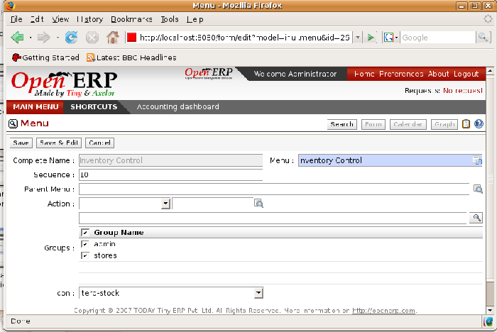
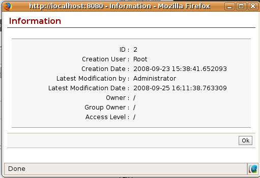

.. index::
   single: Access rights
.. 

Managing access rights
=======================

One of the most important areas in configuring Open ERP is how to manage access rights to the information in it. 

You're planning to put everything significant to your business into the system, but most of your staff need see only part of it, and may need to change even less of it. Who should have rights to what, and how do you manage that?

Tiny ERP's approach to rights management is highly flexible. Each user can belong to one or more groups, and the group(s) you belong to determine(s):

* the visibility of each menu item and

* the accessibility of each table in the database. 

For example, the group \ ``Stock``\ may only be given access to some of the menus in *Inventory Control*, and may have no access to any of the accounting information. Each system user who works in Stores is given membership of the *Stock* group. If some users also work elsewhere, they'd also be given membership of other groups.

Open ERP users can also belong to various roles. Just as group gives a user access rights, each role determines the user's duties. This is managed at the level of workflows, which form the company's business processes.

.. index:: Groups
.. index:: Users

Groups and Users
=================

To configure access rights you must start by defining the groups. It's important for the groups to be representative of your company's job functions rather than of its individual employees.

So if your finance director is also your sales director, you should create both a Finance Director group and a Sales Director group, even though they're both the same person, and would both be assigned to this user in practice. This gives you flexibility for the future. 

You should also create groups within a departmental areas that have different levels of access rights. For example, if you create a \ ``Sales Director``\ group and a \ ``Sales``\  group avoid assigning exactly the same rights to each group. The first could see all the of reports, while the second could be restricted to seeing quotations. You could either make the \ ``Sales Director``\ a member of both groups, and give the Sales Director group a limited set of extra rights, or give the \ ``Sales Director``\ group all the rights it needs for a Sales Director to belong only to this one group. You should choose the scheme that gives you most flexibility and then stick with it to maintain consistency.

.. tip::   **Advice**  *Flexibility in managing access* 

	To give yourself flexibility, you can ensure that a trusted staff member (perhaps a director or someone in accounts, or even the system administrator) is given wide rights to use the system, and is authorized by the management to carry out specific tasks for people. 
	
.. index::
   single: Access rights; Menus
.. 

Access rights for menus
-------------------------

To get a feel for rights management in Tiny ERP you'll create a new \ ``Stock1``\  group, with access to the *Inventory Control* menu items. You'll then create a stores person user who's a member of the \ ``Stock1``\  group.  

To create a new group, use the menu Administration > Users > Groups. Enter the group name Stock1. 

Then to create a new user linked to this, use Administration > Users > Users to enter the following:

*  *Name* : \ ``Stores Person``\  ,

*  *Username* : \ ``stores``\  ,

*  *Password* : \ ``stores``\  ,

*  *Company* : \ ``<your company>``\  ,

*  *Action* : \ ``Menu``\  ,

*  *Menu Action* : \ ``Menu``\  .

In the second tab of the user form,  *Security* , add the \ ``Stock1``\   group that you just created.

*Groups that have access to the Inventory Control menu.*

Save the user, then go into the menu  *Administration > Security > Define Access to Menu-Items*  to get a list of menus. Filter this list using the search field  *Menu*  to get the  *Inventory Control*  menu item. In the form describing the menu, add \ ``Stock1``\   into the  *Groups*  field. While you're at it, also add the \ ``admin``\   group there. From now on, only members of the \ ``Stock1``\   group and the \ ``admin``\   group will be able to see this menu item in their main menu list.

.. tip::   **Info**  *Menu hierarchy* 

	Since menus are hierarchical there is no need to hide access to lower menus: once you've configured Inventory Control this way, all lower-level menus become inaccessible to members of other groups.

.. tip::   **Important**  *Security* 

	This method of managing access to menus doesn't guarantee that users are prevented from reaching hidden business objects in the system in other ways. For example, hiding the Invoices menu won't prevent people reaching invoices through purchase and sales orders, or by guessing the URL.

	For effective security management you must use the the methods for managing access rights to objects presented in the following section.

.. tip::   **Further Information**  *Initial access configuration* 

	In the initial configuration, Open ERP's admin user, a member of the admin group, is given access to the Configuration menu in each section of the main menu. For example, Partners > Configuration is visible in the administrator's menu amongst other Partner menu items, but only the other menu entries are visible to other users. Similarly, the main menu entry Administration is visible only to users who are members of the admin group.

.. index::
   single: Access rights; Objects
.. 

Access Rights to Objects
^^^^^^^^^^^^^^^^^^^^^^^^^

The menu access rights determine who can access which menu, but doesn't define what you can do once you're in the menu.

Access controls on the objects give you the possibility of defining what your users have the right to do with your data when they get access to it. Access control of objects is structured the same way as access to menus.

.. tip::   **Definition**  *Object* 

	An object represents a document in the system. Objects are linked to database tables and also have additional concepts, such as the functions of fields, inheritance from other objects, and class methods that give them behavior.

If no group is assigned to an object, all users can access it without any restriction of any sort. Conversely, when an access control is defined for an object, a user must be a member of a group owning appropriate access rights to have any sort of access to that object.

You must always ensure that you don't lock the \ ``admin``\ group out of any objects that control administration and configuration options, such as the \ ``ir.model.access``\   model.

You can manage four access modes on objects independently:

*  *Read access* : members of the group can read the data in the object,

*  *Create access* : members of the group can create a new record in the object, 

*  *Write access* : members of the group can modify the contents of records in the object, 

*  *Delete access* : members of the group can delete records from the object.

(access_control.png)Access control to invoices for the admin group

To configure access rights on a Open ERP objects, use the menu  *Administration > Security > Access Controls* . You give a  *Name*  to the access control, select a  *Group* , and the object ( *Model* ), then check the checkbox corresponding to each of the four  *Access*  modes. 

If you don't specify any group in the access rules, the rule is applied to all groups. So to remove access to an object for all users you could create a rule:

* which is defined for a specific object,

* which is linked to no group,

* for which none of the four access options is checked.

You can then create additional rules on the same object to give specific rights to certain groups.

Modification history
---------------------

*Partner Record history.*

Each record in a Tiny ERP database carries a note of its history. You can then find out who it was created by and when that occurred, and who last modified it and when that occurred. Click the *View Log* icon at the top right of any form in the web client (but only when it's read-only, not when it's editable) to display a dialog box showing this information, as shown in the figure below. It can help you identify who to contact if there are any problems with the data in the records.

.. Copyright © Open Object Press. All rights reserved.

.. You may take electronic copy of this publication and distribute it if you don't
.. change the content. You can also print a copy to be read by yourself only.

.. We have contracts with different publishers in different countries to sell and
.. distribute paper or electronic based versions of this book (translated or not)
.. in bookstores. This helps to distribute and promote the Open ERP product. It
.. also helps us to create incentives to pay contributors and authors using author
.. rights of these sales.

.. Due to this, grants to translate, modify or sell this book are strictly
.. forbidden, unless Tiny SPRL (representing Open Object Presses) gives you a
.. written authorisation for this.

.. Many of the designations used by manufacturers and suppliers to distinguish their
.. products are claimed as trademarks. Where those designations appear in this book,
.. and Open ERP Press was aware of a trademark claim, the designations have been
.. printed in initial capitals.

.. While every precaution has been taken in the preparation of this book, the publisher
.. and the authors assume no responsibility for errors or omissions, or for damages
.. resulting from the use of the information contained herein.

.. Published by Open ERP Press, Grand Rosière, Belgium

