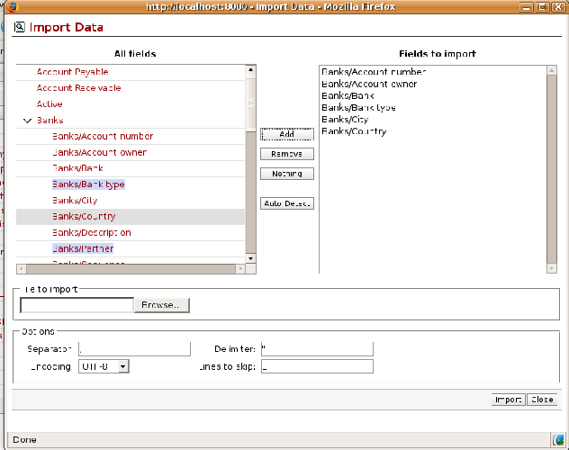
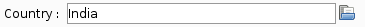
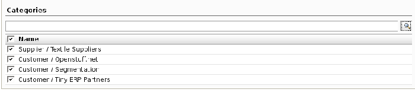

.. index::
   single: Import-Export

Importing and exporting data
=============================

Every form in Open ERP has a standard mechanism for importing data from a CSV file. That's the same format as used in the language translations.

.. tip::   **Note**  *Forms and Lists* 

	You have access to the Import and Export functions in the web client on a single form view in read-only mode – you can't reach Import or Export in any other view or when the form is editable. If you're using the GTK client you can find the functions from the top menu Form > Import... and Form > Export...

The CSV file format is text format compatible with most spreadsheet programs (such as OpenOffice Calc and Microsoft Excel) and is easily editable as a worksheet. The first line contains the name of the field in the form. All the subsequent lines are data, aligned in their respective columns.

.. index::
   single: Import-Export; CSV
.. 

.. index:: CSV

The CSV format for complex database structures
-----------------------------------------------

When you import data you have to overcome the problem of representing a database structure in \ ``.csv``\  flat files. 

To do this, two solutions are possible in Open ERP:

* importing a CSV file that's been structured in a particular way to enable you to load several different database tables from a single file (such as partners and partner contacts in one CSV file),

* importing several CSV files, each corresponding to a specific database table, that have explicit links between the tables.

Start by building the header of the CSV file. Open the import tool on the object that you're interested in and select the fields that you want to import into your Open ERP database. You must include every field that's colored in blue because those fields are required, and any other field that's important to you.

*Selecting fields to import using a CSV file.*

Use the field names as the column names in the first line of your CSV file, applying one field per column. If your CSV file has these names in the first line then when you import your CSV file, Open ERP will automatically match the column name to the field name of the table. When you've created your CSV file you'll do that by clicking the  *Nothing*  button to clear the  *Fields to Import* , then select your CSV file by browsing for a  *File to import* , and then clicking the  *Auto Detect*  button.

To import CSV data that matches your database structure, you need to distinguish the following types of field in the Open ERP interface:  *many-to-many*  fields (between multiple sources and destinations),  *many-to-one*  fields (from multiple sources to a single destination), and  *one-to-many*  fields (from a single origin to multiple destinations). 

.. tip::   **Definition**  *Foreground table* 

	Each of these types is described in relation to a foreground table – the table whose entry form you're viewing and whose entries would be updated by a simple CSV file. 

	Just because one of these relation fields appears on the foreground table, does not mean that there is an inverse field on the related table – but there may be. 

	So there is no one-to-many field in the User form to reflect the many-to-one Salesman field in the Partner form, but there is a many-to-one Partner field in the Partner contact form to reflect the one-to-many Partner contact field in the Partner form.

View the screenshots below to note the differences.

*A many-to-one field: a salesperson linked to a partner.*

*A many-to-many field: partner categories.*

.. image::  images/csv_one2many.png
    :align: center

*A one-to-many field: partner contacts.*

All of the other fields are coded in the CSV file as just one field in each column.

.. index:: Relation Fields

Many-to-one fields
^^^^^^^^^^^^^^^^^^^

Many-to-one fields represent a relationship between the foreground table and another table in the database where the foreground table has a single entry for the other table. Open ERP tries to link the new record in the foreground table with one of the entries in the other table by searching for and matching the *Name* or the *Code* with the value in the CSV file.

You can also work with identifiers rather than the names of resources. To do this you must import a first file (for example, Products) with a column named *id* in your CSV file that contains an identifier for each product. The identifier is a character string that is unique for each of the lines being imported and saved.

When you import other files which link to the first table, you can use the identifier in preference to the names (for example when you're saving inventory the uses the product names).

To do this, the title of the column in your CSV file must end in \ ``:id``\   (for example \ ``Product:id``\  ).

.. tip::   **Advantage**  *Importing with identifiers* 

	The management of free text identifiers enables you to considerably simplify the conversion of another database to Open ERP. You can just create an id column that contains the identifier used in the original database for each table that you're importing.

	For the other tables linked to this one you can just use the identifier relationship to the entry in the original table. You don't need a complex conversion then to create links to the original table.

Many-to-many fields
^^^^^^^^^^^^^^^^^^^^^

Many-to-many fields are handled just like many-to-one fields in trying to recreate the relationship between tables: either by searching for names or by using identifiers.

There are several possible values in a single many-to-many field. Therefore a partner can be given several associated categories. You must separate the different values with a comma.

One-to-many fields
^^^^^^^^^^^^^^^^^^^

One-to-many fields are a bit different. Take as an example the Partner Contacts field in the Partner form, which contains all of the linked contacts.

To import such a field you don't have to link to an existing entry in another table, but can instead create and link to several partner contacts using the same file. You can then specify several values for different fields linked to that object by the one-to-many field. Each field must be put in a column of the table, and the title of that column must be expressed in the form \ ``field_one-to-many/field_linked-object``\  .

For example, to import partners with several contact for which you specify a name and a city, you would create the following CSV file:

.. csv-table::  **Example of importing one-to-many fields**
    :header: "Name","Code","Address/Contact","Address/City"
    :widths: 8,5,10,10
    
    "Tiny sprl","Tiny","Fabien Pinckaers","Grand-Rosière"
    "","","Cécile Debois","Namur"
    "Axelor SARL","Axelor","Laith Jubair","Paris"
    "Open-Net","OpenNet","",""

In this example, the  *Name*  and  *Code*  fields belong to the  *Partner*  table, and the  *Contact*  and  *City*  fields belong to the  *Contact*  linked to this partner.

Importing this file will give you three partners:

* Tiny

* Axelor SARL: with just one contact,

* Open-Net: with no contact..

.. tip::   **Note**  *Symmetry in relation fields* 

	Depending on the structure of your data it can be easier to use the one-to-many form or the many-to-one form in relating two tables, so long as the relevant fields exist on both ends of the relationship.

	For example, you can:

	* import one partner with different contact in a single file (one-to-many),

	* import the partners first, and then contacts with the field linking to the partner in a many-to-one form).

.. index::
   single: Import-Export; Example
.. 

Examples of CSV import files
-----------------------------

To illustrate data importing, you can find two examples below. The first one is to import partner categories, and then to import some partners and their contacts along with links to the categories just created. Although you can create new contacts at the same time as creating partners (because you can do this for *one-to-many* relations), you can't create new categories this way (because they use *many-to-many* relations).

Partner categories
^^^^^^^^^^^^^^^^^^^

Start by creating partner categories in a CSV file:

	#. Create the following table in your spreadsheet program:

                        .. csv-table:: **Partner categories file: categories.csv**
                           :header: "","Column A","Column B"
                           :widths: 5,10,10
                           
                           "Line 1","Category Name","Parent Category"
                           "Line 2","Quality",""
                           "Line 3","Gold","Quality"
                           "Line 4","Silver","Quality"
                           "Line 5","Bronze","Quality"
                   
                   On the first line,  *Category Name* and  *Parent Category* are the column titles that correspond to field names in the  *Partner category* form.
                   
                  *Column A* is for the different partner categories and *Column B* indicates if that category has a parent category. If  *Column B* is blank then the category sits at the top level.

	#. Save spreadsheet file in CSV format – separated by commas – and name the file \ ``categories.csv``\  

	#. In Open ERP, select  *Partners > Configuration > Categories > Edit Categories* 

	#. Click  *Import* (to the bottom left of the list) to bring up the  *Import Data* dialog box, in which you'll find the ist of fields that can be imported.

	#. Click  *Browse...* on the  *File to import* field and select the CSV file you just created, \ ``categories.csv``\   Then click  *Auto Detect* to atch the column names in the CSV file with the field names available in  *Partner Categories*  

	#. Click Import at the bottom-right of the dialog box to load your data. You should get the message \ ``4 objects imported``\  in a new dialog box. Close both this and the  *Import Data* dialog box to return to the original page.

	#. Click  *Partners > Partners by category* to view the tree of categories, including the new \ ``Quality``\  branch that you loaded. 

.. tip::   **GTK Client**  *GTK dialog box for importing CSV files* 

	The dialog box you use in the web client for importing a CSV file is slightly different from that of the GTK client. The GTK client shows you which fields are required and doesn't include those fields that can't be completed (such as calculated fields).

New partners
^^^^^^^^^^^^^

Here's how to create new partners with several contacts, and how to link them to new categories:

	#. Enter the table below into your spreadsheet program.

                .. csv-table::  **Partner data file: partners.csv**
                   :header: "","Column A","Column B","Column C","Column D"
                   :widths: 5,10,10,10,10
                   
                   "Line 1","Name","Categories","Contacts/Name","Salesman"
                   "Line 2","Black Advertising","Silver, Gold","George Black","Administrator"
                   "Line 3","","","Jean Green",""
                   "Line 4","Tiny sprl","","Fabien Pinckaers","Administrator"

	#. The second line corresponds to the creation of a new partner, with two existing categories, that has two contacts and is linked to a salesman.

	#. Save the file using the name \ ``partners.csv``\  

	#. In penERP, select  *Partners > Partners* then import the file that you've just saved. You'll get a message confirming that you've imported and saved the data.

	#. Verify that you've imported the data. A new partner should have appeared (\ ``NoirAdvertising), with a salesman (Administrator), two contacts (George Black and Jean Green) and two categories (Silver and Gold).``\  

Exporting data
---------------

Open ERP's generic export mechanism lets you easily export any of your data to any location on your system. You're not restricted to what you can export, although you can restrict who can export that data using the rights management facilities discussed above.

You can use this to export your data into spreadsheets or into other systems such as specialist accounts packages. The export format is usually in the CSV format but you can also connect directly to Microsoft Excel using Microsoft's COM mechanism.

.. tip::   **Technique**  *Access to the database* 

	Developers can also use other techniques to automatically access the Open ERP database. The two most useful are:

	* using the XML-RPC web service,

	* accessing the PostgreSQL database directly.

To illustrate the export of data, you can follow the steps below to export information on a specific partner using the web client:

	#. In Open ERP, select  *Partners > Partners* to show a list of partners. Search for a specific  *Name* (here, \ ``Black``\   to display only the one line.

	#. Click  *Export* to bring up the  *Export Data* dialog box.

	#. All of the fields available are shown in the All fields section to the left – that corresponds to all of the fields visible on the form, including all of the fields that come from links to other tables in the underlying database.

	#. Select the fields that interest you by adding them to the  *Fields to Export* section using the  *Add* button.

	#. Click Export to export a CSV file or, if your client is on a Windows PC, you have an option of opening the data in a Microsoft Excel spreadsheet. The data is exported in a table similar to the one below.

.. csv-table::  **Partner data in the exported file**
   :header: "","Column A","Column B","Column C","Column D"
   :widths: 5,10,10,10,10
   
   "Line 1","Name","Categories/Category name","Contact","Salesman"
   "Line 2","Black Advertising","Silver","George Black","Administrator"
   "Line 3","","Gold","",""
   "Line 4","","","Jean Green",""

In the table above:

*  *Column A*  contains text data for the  *Name*  field in the  *Partners table* .

*  *Column B*  contains text data for the  *Category name*  field in the  *many-to-many*  related  *Partner Category* table: if there are several categories they're listed in that column with all other lines remaining blank except for any other fields in the Partner Category table that may also have been selected.

*  *Column C*  contains text data for the  *Name*  field in the  *one-to-many*  related  *Partner contact*  table: if there are several partner contacts then they're listed in that column with all other lines remaining blank except for any other fields in the partner contact tables that may also have been selected.

*  *Column D*  contains text data for the Salesman, which is the  *Name*  field in the  *many-to-one*  related  *User*  table. It is listed only on the same line as the Partner itself.

.. tip::   **Advice**  *Module Recorder* 

	If you want to enter data into Open ERP manually, you should use the Module Recorder, described in the first section of this chapter.

	By doing that you'll be generated a module that can easily be reused in different databases. Then if there are problems with a database you'll be able to reinstall the data module you generated with all of the entries and modifications you made for this system.

.. Copyright © Open Object Press. All rights reserved.

.. You may take electronic copy of this publication and distribute it if you don't
.. change the content. You can also print a copy to be read by yourself only.

.. We have contracts with different publishers in different countries to sell and
.. distribute paper or electronic based versions of this book (translated or not)
.. in bookstores. This helps to distribute and promote the Open ERP product. It
.. also helps us to create incentives to pay contributors and authors using author
.. rights of these sales.

.. Due to this, grants to translate, modify or sell this book are strictly
.. forbidden, unless Tiny SPRL (representing Open Object Presses) gives you a
.. written authorisation for this.

.. Many of the designations used by manufacturers and suppliers to distinguish their
.. products are claimed as trademarks. Where those designations appear in this book,
.. and Open ERP Press was aware of a trademark claim, the designations have been
.. printed in initial capitals.

.. While every precaution has been taken in the preparation of this book, the publisher
.. and the authors assume no responsibility for errors or omissions, or for damages
.. resulting from the use of the information contained herein.

.. Published by Open ERP Press, Grand Rosière, Belgium

