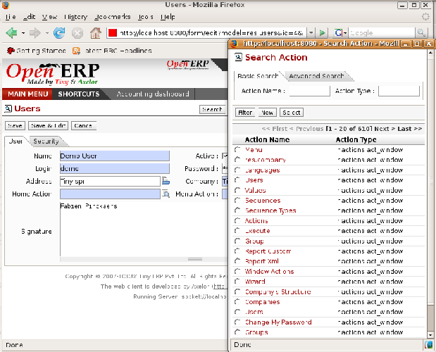

.. index:: Menu

Personalizing the menu
=======================

Open ERP's menu organization isn't subject to any restriction, so you can modify the whole structure, the terminology and all access rights to it to meet your specific needs in the best possible way. However, before you do all that and just as you would for any other customizable software, you should balance both the benefits you see in such changes and the costs, such as the need to train users, to maintain new documentation and to continue the alterations through subsequent versions of the software.

This section describes how to proceed to change the structure of the menu and the welcome page, to personalize the terminology of the menus and forms in the user interface and for managing users' access rights to the menus and the various underlying business objects.

.. index::
   single: Change User Password
.. 

Letting users change their password themselves
-----------------------------------------------

When you signed onto the \ ``openerp_ch02``\   database as the administrator, two menus gave you access to forms for changing your password:

*  *Administration > Users > Users*  gives a list of all users: click on your own name in that list and a form appears containing a field that with your password (don't click the  *Edit*  button above the form for the moment, and don't click the  *Edit*  icon to the right of the list of users either)

*  *Administration > Users > Users > Change My Password*  shows another list, this time with only you in that list: click on your own name and you'll see a form where only the password and signature can be edited (again, don't edit this at the moment).

These two paints mentioned above are found in the  *Administration*  branch of your menu, which is only visible to users who are members of the \ ``admin``\   group (login again as \ ``demo``\   if you want to check this). You can easily make a menu item accessible to everyone by moving it or duplicating it, so you can make the  *Change My Password*  menu accessible to everybody.

To do this, select the menu item  *Administration > Users > Users > Change My Password* . Then click on the line containing the word Administrator (but not on the name \ ``Administrator``\   itself) and click the  *Switch*  button to bring up the menu item as an editable form (you can do the same using the GTK client – there you select the line and click the  *View*  button instead).

You could now edit this form – change its  *Parent Menu* , which moves the entry to a different part of the menu system; edit its  *Menu*  name to change how it appears in the menu tree, or give it a new  *Icon* . Or you could give it a new  *Action*  entirely (but this would lose the point of this particular exercise).

Instead of editing this form, which is the original menu entry, duplicate it instead. With the web client you must first make the form read-only by clicking the  *Cancel*  button, then you click the  *Duplicate*  button that appears (in the GTK client, click  *Form > Duplicate*  from the top menu). The form that remains is now the duplicate entry, not the original.

*Menu enabling you to change your own password, accessible to all users.*

To move this duplicate entry, change the  *Parent Menu*  field by deleting what's there and replacing it with another menu that everyone can see, such as  *Tools*  or  *Human Resources* , and make sure that the entry moves to the end of the menu list by replacing the  *Sequence*  with \ ``99``\  . You can experiment with icons if you like. Save the form and then click  *Main Menu*  to see the results.

.. tip::   **Advice**  *Duplicating the menu* 

	You should duplicate a menu before modifying it. In this way you'll always keep a link to the original menu that works if you need it to.

.. tip::   **Attention**  *Managing Passwords* 

	If you let users change their passwords for themselves you'll have no direct control over the password they choose. You should have a written policy about password strength to try to maintain a level of security in your system.

.. tip::   **Note**  *Managing users through LDAP* 

	With the ``user_ldap`` module, user accounts can be managed through an LDAP directory common to various different company resources. 

	Connection parameters for the LDAP directory are then registered with the company definition. You can provide a user profile template there from which new users are automatically created during their first connection to Open ERP.

.. index::
   single: LDAP
.. 

.. tip::   **Definition**  *LDAP* 

	The LDAP protocol (Lightweight Directory Access Protocol) enables you to manage common directories for various different resources through your standard TCP/IP network. 

	This enables users in the company to have the same username and password to access all their applications (such as email and their intranet).

Personalizing the welcome page for each user
---------------------------------------------

When you sign into Open ERP for the first time, a welcome page appears. In a minimal system, such as that created in the original \ ``openerp_ch02``\  database before it was expanded in that chapter, and in the  \ ``openerp_ch03``\  database, you only get the main menu – the same as you get by default when you click the *Main Menu* button. As you add functionality to your database you get more choices for the welcome page, with different dashboards automatically assigned to various company roles as they're created in the demonstration data.

The administrator can change both the welcome page and the main menu page individually for each user of the system, and can adapt Open ERP to each role in the company to best fit the needs of everyone.

To make modifications for a particular user, edit the user configuration again in  *Administration > Users > Users* . Open the form for a particular user, and select different menu entries for the two fields  *Home Action*  and  *Menu Action* . 

*Selecting a new welcome page.*

The  *Home Action*  is the menu item that is automatically opened when you first sign on, and is also reached when you click the  *Home*  link in the top right toolbar of the web client. There you can choose any page that you'd reach through any menu – one of the dashboards could be most useful. The  *Menu Action*  is the one you reach through the  *Main Menu*  button in the web client (the  *Menu*  button in the GTK client). You can choose the main menu and the dashboards there.

.. tip::   **Attention**  *Actions on the administrator's menu* 

	It's very easy to change the welcome page and the menu of the different users. However, you shouldn't change the main administrator's menu because you could make certain menus completely inaccessible by mistake.

Assigning default values to fields
-----------------------------------

You can quite easily configure the system to put default values in various fields as you open new forms. This enables you to pre-complete the fields with default data to simplify your users' work in entering new documents.

 *New*  *Partners > Partners* \ ``New Zealand``\   *Country*  *Partner Contact* 

* If you're using the web client do a Ctrl-Right-Click (that's a mouse right-click while the mouse pointer is in the field and the Control key is held down on the keyboard).

* If you're using the GTK client, you just need to right-click the mouse while the pointer is in the field.

 *Set as default*  *Field Preferences*  *Value applicable for*  \ ``For all``\  or \ ``Only for you``\  

*Inserting a new default value.*

To check this new configuration, open a new partner form: the field  *Country*  should now contain the entry \ ``New Zealand``\  .

This is a very powerful feature! An administrator can use this functionality to redefine the behavior of your whole system. You can test that in database \ ``openerp_ch13``\   by opening up a new  *Purchase Order*  form, clicking the second tab,  *Purchase Shipping* s, selecting \ ``From Picking``\   in the  *Invoicing Control*  field and then making that the default. From that moment on, you'd automatically create draft purchase invoices only when goods are received, so you could very easily restrict your accountants from paying any invoices that turn up until you were sure you had received the goods. It wouldn't stop anyone from selecting another method of invoice control, but they'd start with the default definition.

Changing the terminology
-------------------------

You can use Open ERP's language translation functionality to substitute its standard terminology with terminology that fits your company better. It's quite straightforward to adapt the software with different terms specific to your industry. Moreover, this can strengthen acceptance of your new Open ERP system, because everybody will be able to retain their usual vocabulary.

You can do this one of two ways:

* translate them in a CSV file, which gives you a global overview of all of the system terms so that you can search and replace specific occurrences everywhere,

* translate the phrases directly in the client, which means that you can change them in their context, and that can be helpful to you while you're translating.

.. tip::   **Definition**  *CSV* 

	CSV (Comma-Separated Values) is an open text file format, representing tabular data where values are separated by commas. These files use a file extension of .csv, and the format is a very common one for exporting data from one software system to another.

	Each line of the file corresponds to a record in the table, and the cells of each row are separated by the commas. For example, the following file:

	        LastName, FirstName, Company
	        
	        Robins, Gerald, SOS Plumbers
	        
	        Lacoste, John, Extra-Textiles
	        
	        Schumacher, Helen, Cook Chain

        .. csv-table:: represents the table
            :header: "LastName","FirstName","Company"
            :widths:  8,8,8
               
           "Robins","Gerald","SOS Plumbers"
           "Lacoste","John","Extra-Textiles"
           "Schumacher","Helen","Cook Chain"

The same approach is used to translate terms that haven't been created yet. This can be useful, for example, with modules that haven't yet been translated into English or any other language that you want.

.. index::
   single: Translation
.. 

Translation through a CSV file
^^^^^^^^^^^^^^^^^^^^^^^^^^^^^^^

To translate or modify all of the system's phrases you first have to export a translation file in CSV form.

 *Administration > Translation > Export language*  *Français*  *New Language* \ ``.csv``\  

.. tip::   **Attention**  *UTF-8 format* 

	The CSV file is encoded in the UTF-8 format. Make sure that you retain this format when you open the file in a spreadsheet program because if you don't you risk seeing strange character strings in place of accented characters.

---------------------

.. image::  images/csv_transl.png
   :align: center

*CSV translation file with the translation superimposed.*

The file contains five columns:  *type* ,  *name* ,  *res_id* ,  *src* , and  *value* . You have to ensure that the first line, which specifies these column names, remains untouched. The  *src*  field contains the base text in English, and the  *value*  field contains a translation into another conventional language or into a specialist technical phrase. If there's nothing at all in the  *value*  field then the English translation will automatically be used on the the form you see.

.. tip::   **Note**  *When should you modify the text?* 

	Most of the time, you will find the text that you want to modify in several lines of the CSV file. Which line should you modify? Refer to the two columns type (column A) and name (column B). Some line have the nameir.ui.menu which shows that this is a menu entry. Others have a type of selection, which indicates you that you'd see this entry in a drop-down menu.

You should then load the new file into your Open ERP system using the menu  *Administration > Translation > Import language* . You've then got two ways forward:

* you can overwrite the previous translation by using the same name as before (so you could have a special 'standard French' translation by reusing the  *Name* \ ``Français``\   and  *Code* \ ``fr_FR``\  ),

* you could create a new translation file which users can select in their  *Preferences* .

If you're not connected to the translated language, click  *Preferences* , select the language in  *Language*  and finally click  *OK*  to load the new language with its new terminology.

.. tip::   **Note**  *Partial translations* 

	You can load only some of the lines in a translation file by deleting most of the lines in the file and then loading back only the changed ones. Open ERP then changes only the uploaded lines and leaves the original ones alone. 

Changes through the client interface
^^^^^^^^^^^^^^^^^^^^^^^^^^^^^^^^^^^^^

 *New Language* 

Then you should open the form that you want to translate. 

 *Translate this resource*  *Search* 

* the data in the system (contained in the  *Fields* ),

* the field titles (the  *Labels* ),

* all of the  *Action*  buttons to the right of the form,

* the terms used in the form  *View* .

You can modify any of these.

The procedure is slightly different using the GTK client. In this you just right-click with the mouse on a label or button. You can choose to translate the item itself or the whole view.

This method is simple and quick when you only have a few entries to modify, but it can become tiresome and you can lose a lot of time if you've got to change some terms across the whole system.

In that case it would be better to use the translation method that employs a CSV file. 

.. tip::   **GTK Client**  *Tacking account of translations* 

	In the GTK client the modified terms aren't updated immediately. To see the effects of the modifications you must close the current window and then reopen the form.

.. Copyright © Open Object Press. All rights reserved.

.. You may take electronic copy of this publication and distribute it if you don't
.. change the content. You can also print a copy to be read by yourself only.

.. We have contracts with different publishers in different countries to sell and
.. distribute paper or electronic based versions of this book (translated or not)
.. in bookstores. This helps to distribute and promote the Open ERP product. It
.. also helps us to create incentives to pay contributors and authors using author
.. rights of these sales.

.. Due to this, grants to translate, modify or sell this book are strictly
.. forbidden, unless Tiny SPRL (representing Open Object Presses) gives you a
.. written authorisation for this.

.. Many of the designations used by manufacturers and suppliers to distinguish their
.. products are claimed as trademarks. Where those designations appear in this book,
.. and Open ERP Press was aware of a trademark claim, the designations have been
.. printed in initial capitals.

.. While every precaution has been taken in the preparation of this book, the publisher
.. and the authors assume no responsibility for errors or omissions, or for damages
.. resulting from the use of the information contained herein.

.. Published by Open ERP Press, Grand Rosière, Belgium

