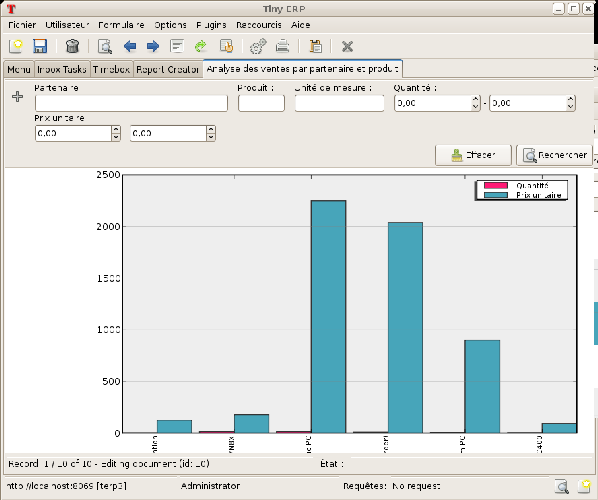
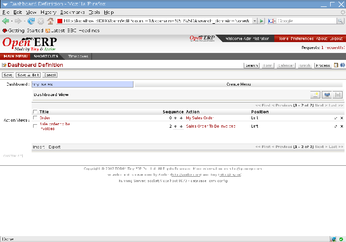

.. index::
   single: Report
.. 

Configuring reports
=====================

Open ERP has two distinct report types:

* Statistical reports: these are calculated data, often represented in the form of lists or graphs. These reports are dynamics and you can navigate through the data that comprise the figures through the client interface.

* Report documents: they're used to print system documents. The result is usually a PDF generated by a selection made on the screen. Furthermore, Open ERP enables you to open these reports in OpenOffice.org to edit in any changes you want before sending them to your customer.

Because of the power of the Open ERP engine, these two types of report can be created or modified without needing any development and this can be done directly in the client interface of Open ERP or from OpenOffice.org.

Managing statistical reports
-----------------------------

Many reports are configured in advance in Open ERP. You can find them in the  *Reporting*  submenus under each main menu entry.

You can also install more new reports using various different modules whose name usually starts with  ``report_`` . 

Modeling a new report
^^^^^^^^^^^^^^^^^^^^^^^

Open ERP gives you the possibility of developing your own analyses to meet your specific needs. To define a new analysis of the system's data you should install the module \ ``base_report_creator``\  . This enables you to create complex queries on the database, in a simple and visual way. 

Once the module is installed, create a new report using the menu  *Dashboards > Configuration > Custom Reports* .

Give a  *Report Name*  to your new report and select the objects that you're going to analyze. For example, select the three following objects:  *Partner* ,  *Sale Order* ,  *Sale Order line* .

Then turn to the second tab,  *View parameters* , to select the views that you want in your report. Select \ ``Tree``\   in the  *First View*  and \ ``Graph``\   in the  *Second View* . You can choose the type of graph displayed using the  *Graph View*  fields. You could also select \ ``Calendar``\   as a view if you were going to add the  *Date*  field in your report.

.. tip::   **Advantage**  *The MS Excel plug-in* 

	The Microsoft Excel plug-in enables you to connect to Open ERP and automatically extract the selected data. You can then apply formulas and graphs to make your own dashboards of measures directly in Excel. The .xls file can be saved and, when it is reopened, it reconnects to Open ERP to refresh the different lists and graphs with live data.

*Fields selected for the analysis of sales by customer and by product (plugin_excel.png).*

In the third tab,  *Fields to Display* , you can add filters on all the fields of the selected objects ( *Filters on Fields* ). To do that, use the button  *Add Filter*  at the top of the form. For the moment, don't add a filter.

In the fourth tab you must indicate which of the fields in the list you want to be shown in your report ( *Fields to Display* ). Complete the screen along the lines of the figure below.

	#. The  *Sequence* field gives the order of the fields displayed.

	#.  *Field*  the second column enables you to select a field from any of the three objects you selected in the first tab.

	#.  *Grouping Method*  the third column lets you to determine the grouping operation that is to be applied to this field:

	        - Grouped: enables you to group document entries with the same value in this field.

	        - Sum: gives the sum of values in this field.

	        - Minimum: gives the minimum of all the values that appear in this field.

	        - Maximum: gives the maximum of all the values that appear in this field.

	        - Average: gives the arithmetic average of all the values in this field.

	#.  *Graph Mode*  the fourth column, determines if the field will appear in the graph view and, if so, on which axis (X or Y).

	#.  *Calendar Mode*  the fifth column, enables you to specify if the field can be the basis of a calendar view.

You can now  *Save*  the report you defined. Click on the  *Open Report*  button to the right of the form to get the requested analysis.

*Analyzing sales by partner and by product in list view.*

*Analyzing sales by partner and by product in graph view.*

.. index::
   single: Personalizing; Dashboards
.. 

Personalizing the dashboards
^^^^^^^^^^^^^^^^^^^^^^^^^^^^^

 *Dashboards > Configuration > Dashboard definition* 

A dashboard is a selection of reports previously defined in Open ERP. You can choose from hundreds of predefined reports and, for each report, indicate its position on the dashboard.

Just like fields on reports, the  *Sequence*  field determines the order in which views appear in the dashboard. 

*Definition of a new dashboard.*

Once the dashboard has been defined you can use the  *Create Menu*  button to create a menu entry for your dashboard anywhere in the menu system.

Managing document templates with OpenOffice.org
-------------------------------------------------

To personalize your printable documents in Open ERP, use the module \ ``base_report_designer``\.

.. tip::   **Advantage**  *The OpenOffice.org Writer plug-in* 

	You can create your own reports in just a few minutes using the OpenOffice.org Writer plug-in. This tool can give your team a big productivity improvement. Using it, you can create templates for all of your company's documents, reducing the work of creating and laying out data and customer documents.

The system is both simple and powerful, because it gives you the benefits of all of the layout facilities offered by OpenOffice.org Writer as well as all of the data and calculation provided by Open ERP. You could create or modify reports directly from OpenOffice.org and then use them in Open ERP.

.. tip::   **Techniques**  *Independence from OpenOffice.org* 

	OpenOffice.org is only used to generate new document templates. The system administrator is the only person who has to install it.

	Once the document templates have been defined the users don't need it to carry out their normal work. They can use either Microsoft Office or OpenOffice.org as they choose.

The OpenOffice.org plug-in enables you to search for fields in Open ERP and integrate them into your document templates. You can use data loops in tables or sections, enabling you to attach several lines to an order, for example.

Once the new report has been defined it appears directly in the Open ERP client for the system users. 

There are two modes of using reports:

* make the report produce a PDF document with data in it reflecting the selected record (for example, an invoice).

* make the report open a document for modification in OpenOffice.org, with data in it reflecting the selected record. This enables you to modify the document in OpenOffice.org before sending it to the customer (such as with a Quotation).

The personalized reports are stored in the Open ERP database and are accessible to everyone who has rights to use your database without any need for the installation of OpenOffice.org on their own computers. The document modifications are applied to a single database.

Installing the OpenOffice.org module
^^^^^^^^^^^^^^^^^^^^^^^^^^^^^^^^^^^^^

You should install two components before using the report editor:

* the module \ ``base_report_designer``\   – first in your Open ERP installation if it's not already there, and then in the Open ERP database, you want to use it in.

* the OpenOffice.org Report Designer in the OpenOffice.org installation on your system administrator's computer.

You start by installing the module \ ``base_report_designer``\   just like all the other Open ERP modules.

To install the OpenOffice.org extension, look for the file \ ``openerpreport.zip``\   supplied with the  *Report Designer*  distribution. Check that OpenOffice.org is properly installed on your computer and that you have administration rights for installation.

.. image::  images/tinyreport.png
   :align: center

*Menu TinyReport in OpenOffice.org Writer.*

Start OpenOffice.org Writer, select  *Tools > Package Management...*  to open the Package Management dialog box and then search for the \ ``openerpreport.zip``\   file to install it. Then close the application and restart Writer: a new menu appears in the top menu bar –  *Tiny Report*  or  *Open ERP Report* .

.. index::
   single: Report; OpenOffice.org
.. 

Connecting OpenOffice.org to Open ERP
^^^^^^^^^^^^^^^^^^^^^^^^^^^^^^^^^^^^^^^

Select Tiny Report > Server parameters or Open ERP Report > Server parameters in the top menu of OpenOffice.org Writer. You can then enter your connection parameters to the Open ERP server. You must select a database \ ``demo_min``\   in which you've already installed the module \ ``sale``\  . A message appears if you've made a successful connection.

.. index::
   single: Report; Modify
.. 

Modifying a report
^^^^^^^^^^^^^^^^^^^

The report editor lets you:

* modify existing reports which will then replace the originals in your Open ERP database,

* create new reports for the selected object.

To modify an existing report, select  *Tiny Report > Modify Existing Report* . Choose the report \ ``Request for Quotation``\   in the  *Modify Existing Report*  dialog box and then click  *Save to Temp Directory* .

.. image::  images/openoffice_quotation.png
   :align: center

*Modifying a document template.*

OpenOffice.org then opens the report in edit mode for you. You can modify it using the standard word processing functions of OpenOffice.org Writer.

The document is modified in its English version. It will be translated as usual by Open ERP's translation system when you use it through the client interface, if you've personalized your own setup to translate to another language for you. So you only need to modify the template once, even if your system uses other languages – but you'll need to add translations as described earlier in this chapter if you add fields or change the content of the existing ones.

.. tip::   **Attention**  *Older reports* 

	The older reports haven't all been converted into the new form supported by Open ERP. The data expressions in the old format are shown within double brackets and not in OpenOffice.org fields.

	You can transform an old report format to the new format from the OpenOffice.org menu Tiny Report > Convert Bracket–Fields.

From the Tiny toolbar in OpenOffice.org it's possible to:

* connect to the Open ERP server: by supplying the connection parameters.

* add a loop: select a related field amongst the available fields from the proposed object, for example \ ``Order lines``\  . When it's printed this loop will be run for each line of the order. The loop can be put into a table (the lines will then be repeated) or into an OpenOffice.org section.

* add a field: you can then go through the whole Open ERP database from the selected object and then a particular field.

* add an expression: enter an expression in the Python language to calculate values from any fields in the selected object.

.. tip::   **Technique**  *Python Expressions* 

	Using the Expression button you can enter expressions in the Python language. These expressions can use all of the object's fields for their calculations. 

	For example if you make a report on an order you can use the following expression: 

	'%.2f' % (amount_total * 0.9,) 

	In this example, amount_total is a field from the order object. The result will be 90% of the total of the order, formatted to two decimal places.

 *Tiny Report > Send to server*  *Technical Name*  *Report Name* \ ``Sale Order Mod``\   *Corporate Header*  *Send Report to Server* 

You can check the result in Open ERP using the menu  *Sales Management > Sales Orders > All Orders* .

.. index::
   single: Report; New
.. 

Creating a new report
^^^^^^^^^^^^^^^^^^^^^^^

 *Tiny Report > Open a new report* \ ``Sale Order``\   *Open New Report*  *Use Model in Report* 

The general template is made up of loops (such as the list of selected orders) and fields from the object, which can also be looped. Format them to your requirements then save the template.

The existing report templates make up a rich source of examples. You can start by adding the loops and several fields to create a minimal template. 

When the report has been created, send it to the server by clicking  *Tiny Report > Send to server* , which brings up the  *Send to server*  dialog box. Enter the  *Technical Name*  of \ ``sale.order``\  , to make it appear beside the other sales order reports. Rename the template as \ ``Sale Order New``\   in  *Report Name* , check the checkbox  *Corporate Header*  and finally click  *Send Report to Server* .

To send it to the server, you can specify if you prefer Open ERP to produce a PDF when the user prints the document, or if Open ERP should open the document for editing in OpenOffice.org Writer before printing. To do that choose \ ``PDF``\   or \ ``SXW``\   (a format of OpenOffice.org documents) in the field  *Select Report Type* .

Creating common headers for reports
-------------------------------------

When saving new reports and reports that you've modified, you're given the option to select a header. This header is a template that creates a standard page header and footer containing data that's defined in each database. 

The header is available to all users of the Open ERP server. Its template can be found on the file system of the server in the directory  \ ``addons/custom``\   and is common to all the users of the server. Although reports attach information about the company that's printing them you can replace various names in the template with values from the database, but the layout of the page will stay common to all databases on the server.

If your company has its own server, or a hosted server, you can customize this template. To add the company's logo you must login to the Open ERP server as a user who's allowed to edit server files. Then go to the \ ``addons/custom``\  directory, copy your logo across (in a standard graphical file format), then edit the file \ ``corporate_rml_header.rml``\   in a text editor. Text in the form \ ``<image file="corporate_logo.png" x="1cm" y="27.4cm" width="6cm"/>``\  should be put after the line \ ``<!--logo-->``\   to pick up and display your logo on each page that uses the corporate header.

.. Copyright © Open Object Press. All rights reserved.

.. You may take electronic copy of this publication and distribute it if you don't
.. change the content. You can also print a copy to be read by yourself only.

.. We have contracts with different publishers in different countries to sell and
.. distribute paper or electronic based versions of this book (translated or not)
.. in bookstores. This helps to distribute and promote the Open ERP product. It
.. also helps us to create incentives to pay contributors and authors using author
.. rights of these sales.

.. Due to this, grants to translate, modify or sell this book are strictly
.. forbidden, unless Tiny SPRL (representing Open Object Presses) gives you a
.. written authorisation for this.

.. Many of the designations used by manufacturers and suppliers to distinguish their
.. products are claimed as trademarks. Where those designations appear in this book,
.. and Open ERP Press was aware of a trademark claim, the designations have been
.. printed in initial capitals.

.. While every precaution has been taken in the preparation of this book, the publisher
.. and the authors assume no responsibility for errors or omissions, or for damages
.. resulting from the use of the information contained herein.

.. Published by Open ERP Press, Grand Rosière, Belgium

